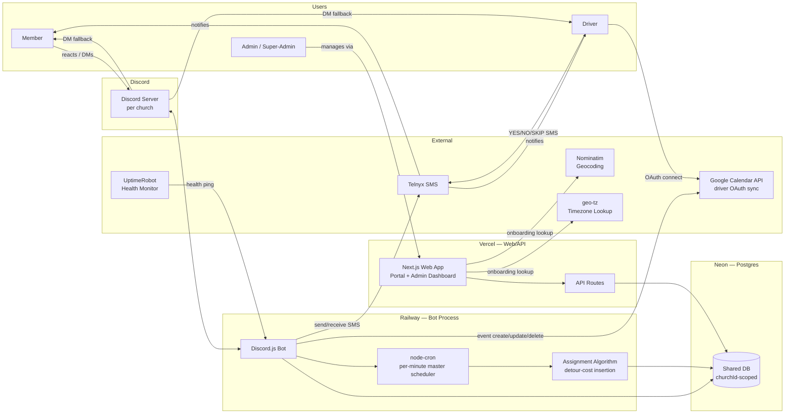
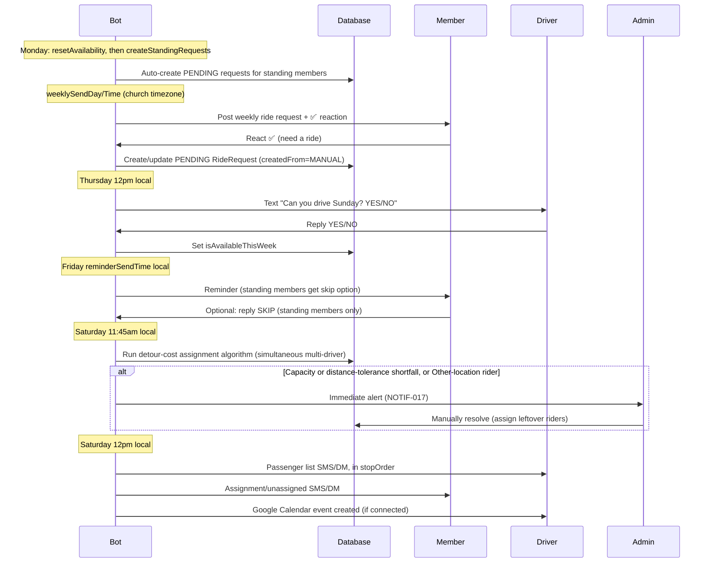
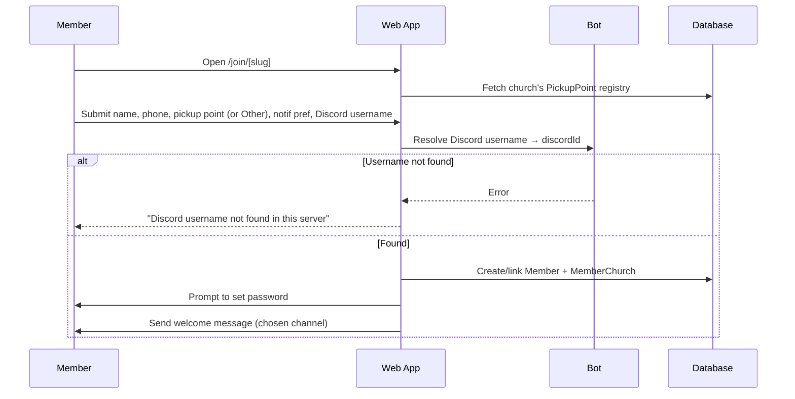

# Chariot — Church Rides Coordination System
## Product Requirements Document

**Version:** 1.3 — Draft  
**Date:** 2026-07-21  
**Owner:** James  
**Audience:** James (sole developer/owner); referenced by future contributors or church admins who need to understand system behavior  
**Status:** Living doc — subject to change  
**Sign-off:** Self-approved by James (sole stakeholder and decision-maker — see Section 1.4). No external approval chain required.

> Add new feature proposals at the bottom under Backlog, then promote them into Section 10 once scoped.

**Status key:**
- `PLANNED` — decided, not yet built
- `TBD` — needs a decision before building

---

## Table of Contents

1. [Executive Summary & Vision](#1-executive-summary--vision)
2. [Technical Architecture](#2-technical-architecture)
3. [Multi-Church Architecture](#3-multi-church-architecture)
4. [Discord Bot Requirements](#4-discord-bot-requirements)
5. [Web Application](#5-web-application)
6. [Database Requirements](#6-database-requirements)
7. [Backend & Algorithm](#7-backend--algorithm)
8. [Notification Requirements](#8-notification-requirements)
9. [Goals for Next Phase](#9-goals-for-next-phase)
10. [Feature Proposals](#10-feature-proposals)
11. [Backlog / Raw Ideas](#11-backlog--raw-ideas)
12. [Testing Requirements](#12-testing-requirements)
13. [Users & Personas](#13-users--personas)
14. [User Stories, Journeys & Acceptance Criteria](#14-user-stories-journeys--acceptance-criteria)
15. [Non-Functional Requirements](#15-non-functional-requirements)
16. [Infrastructure, DevOps & CI/CD](#16-infrastructure-devops--cicd)
17. [Security & Compliance Requirements](#17-security--compliance-requirements)
18. [Build Order, Roadmap & Timeline](#18-build-order-roadmap--timeline)
19. [Risk Register](#19-risk-register)
20. [Competitive Analysis](#20-competitive-analysis)
21. [Migration & Onboarding Plan](#21-migration--onboarding-plan)
22. [Glossary](#22-glossary)
23. [Open Decisions Log](#23-open-decisions-log)
24. [Document Change Log](#24-document-change-log)

---

## 1. Executive Summary & Vision

### 1.1 Vision

Chariot is a ride-coordination system for Sunday church services. Built around a Discord bot and a Next.js web application, running mostly on free-tier infrastructure. The core weekly loop is: bot posts a "who needs a ride" message → members react with ✅ → an assignment algorithm groups riders into available cars along genuinely efficient pickup routes (not just a fixed zone order) → drivers are notified with their ordered passenger list via Telnyx SMS (primary) with Discord DM as fallback.

Chariot is a multi-church platform. Each church runs its own isolated instance with its own riders, drivers, Discord server, schedule, pickup-location registry, and message templates — all backed by a single shared database.

### 1.2 Problem Statement

Today, ride coordination at a typical church runs on a manual spreadsheet plus a group text thread. An admin has to manually read who needs a ride, manually build car groups against whoever confirmed as a driver that week, and manually text or message everyone their assignment — every single week, indefinitely. This is slow, error-prone (easy to double-book a seat or miss a request buried in a group chat), and it doesn't scale past one church without multiplying the admin's manual workload linearly.

The deeper cost isn't just admin time — it's what that time isn't spent on. Every hour an admin spends building car-group spreadsheets is an hour not spent inviting people to church or building relationships with the members and guests who showed up. Chariot's purpose is to make the logistics fully autonomous so that time gets reinvested into ministry rather than manual coordination.

### 1.3 Goals & Success Metrics

**Primary success metric:** Admin time spent on weekly ride coordination drops substantially versus the current spreadsheet-plus-group-text process. Exact numeric target is TBD — the admin at the pilot church should log actual weekly time spent on ride coordination before launch (baseline) and after launch (comparison), since no baseline currently exists to set a precise percentage target against.

**Directional indicators** (useful signals, not committed KPIs — only admin time reduction was chosen as the primary metric):
- Near-zero UNASSIGNED rate most weeks (few or no riders left without a car after the Saturday assignment run)
- High driver response rate to the Thursday YES/NO availability text
- Multiple churches successfully onboard and remain active users past the first month, not just the pilot church

### 1.4 Assumptions & Constraints

| Assumption / Constraint | Detail |
|---|---|
| Solo-built | James is the sole developer and sole stakeholder/approver. No design or QA team — build order (Section 18) and testing plan (Section 12) are scoped accordingly. |
| Budget | Mostly $0 infrastructure at launch. Telnyx SMS (~$10–15/mo) remains the only recurring cost. Google Calendar API (Section 2.2) is a new dependency as of v1.1 — free at this scale, but a real external dependency, not purely free-tier. Google Distance Matrix API was evaluated in v1.1/v1.2 but removed in v1.3 (Section 2.9, decision log) in favor of a locally-computed straight-line distance model seeded from a provided static dataset — this avoids the Google Cloud billing-account requirement entirely, not just the per-call cost. |
| Service day | All churches hold a single Sunday service; the weekly cycle (Thursday ask → Friday reminder → Saturday assign/notify) assumes this and is not designed for non-Sunday or multi-service-per-week churches. |
| Geography | US-only at launch — all phone validation is US E.164 format. |
| User age | All members, drivers, and +1 guests are assumed to be adults (18+). No minor-specific privacy/consent handling is built into v1 (confirmed decision — see Section 17.2). |
| Launch window | Targeting launch before the next school year (~early September 2026, given a 2026-07-21 start date). This was already an aggressive timeline relative to v1.0 scope; the v1.1 expansion (Section 19, Risk #2) makes it more aggressive still. |
| Initial scale | A handful of churches (roughly 2–5) at launch, not a large-scale multi-tenant rollout — see Section 15.2 for what this means for scalability planning. |

### 1.5 Scope Summary

v1.3 ships the entire scope defined throughout this document — there is no reduced MVP subset held back for a later release. The v1.1 revision folded in five features that were previously deferred (Section 9/10/11 of v1.0): geographic/route-optimized pickup clustering (replacing the fixed zone-priority list), recurring ride requests, per-church pickup-point registries, church offboarding, waitlist auto-fill, Google Calendar sync, and a full post-assignment re-assignment flow; v1.2 closed the remaining third-party integration-spec gap (Section 2.9) without changing scope; v1.3 removed the Google Distance Matrix API dependency entirely, replacing it with a locally-computed straight-line distance model (Section 2.9, Section 7.1). See Section 2.5 for what remains genuinely out of scope.

---

## 2. Technical Architecture

### 2.1 Stack & Monorepo Structure

```
/apps
  /web — Next.js admin dashboard + API routes (Vercel)
  /bot — Discord.js bot + node-cron scheduler (Railway)
/packages
  /db — Prisma schema + shared client + assignment algorithm
  /types — Shared TypeScript types (route order, phone validation, dates)
```

### 2.2 Infrastructure

| Piece | Provider | Notes |
|---|---|---|
| Postgres | Neon | Free tier; auto-suspends when idle — Prisma reconnects transparently |
| Web / API | Vercel | root dir `apps/web`; role-based auth via NextAuth |
| Bot | Railway | root dir = repo root; `TZ=UTC` globally. All per-church scheduling computed dynamically using `Church.timezone` + `luxon`. Per-minute master cron checks each church's computed UTC fire time. |
| Chat / Bot | Discord | Free; weekly ride post channel, reaction intake, DM fallback for notifications |
| SMS | Telnyx | ~$0.004/text, no monthly fee; sole *recurring* exception to the $0 rule (~$10–15/mo at scale including phone number). Discord DM is fallback. |
| Geocoding + Timezone Lookup | Nominatim (OpenStreetMap) + `geo-tz` | Free, no API key. Nominatim resolves `Church.location` and `PickupPoint` addresses to lat/long under OSM's fair-use policy; `geo-tz` (npm, bundled offline dataset) resolves those coordinates to an IANA timezone string with no external call needed. If Nominatim proves too imprecise for specific housing-complex-level addresses (its data quality varies by area), fall back to a paid geocoder for pickup points specifically — flagged as an assumption to revisit if geocoding accuracy is poor for the pilot church's locations. |
| Pickup-point distances | Local straight-line (haversine) calculation | **Changed in v1.3 — replaces Google Distance Matrix API entirely.** Distance between any two `PickupPoint`s is computed in-process from their geocoded lat/lng via the haversine formula — plain math, no external call, no API key, no billing account. Removes the Google Cloud billing-account requirement that Google Distance Matrix imposed even at near-zero usage (Section 2.9, decision log). The pilot church's initial 19-point registry is seeded from a provided static dataset (`documentation/seed-data/`) rather than computed fresh. |
| Calendar Sync | Google Calendar API | New in v1.1. OAuth-based, per-driver (drivers connect their own personal calendar — see Section 2.7... see WEB-084). Free; standard Calendar API quotas are far beyond what this app's usage requires. |

> **Note:** Telnyx SMS remains the only ongoing recurring cost by design. Google Calendar API usage is free at this scale, so the "$0 infrastructure" philosophy holds, with the caveat that it's a real third-party dependency rather than a purely free/open tool. As of v1.3, Google Distance Matrix is no longer a dependency at all — pickup-point distances are computed locally, with no Google Cloud billing account required anywhere in the system. Email notifications are not used — SMS and Discord DM only.
>
> **TBD — launch blocker:** Telnyx Toll-Free Verification (4–8 week approval lead time, see Section 8) must be submitted and approved before any church can go live with SMS. This should be kicked off as early as possible in the build timeline, not left until the end.

### 2.3 Data Model (Prisma / Postgres)

Schema lives in `packages/db/prisma/schema.prisma` and is the single source of truth shared across both apps.

#### Church

| Field | Type | Constraints | Notes |
|---|---|---|---|
| `id` | Int | PK, Auto-increment | Numeric ID — used in all internal/admin routes (e.g. `/admin/42/week`) |
| `slug` | String | Unique, Not Null | URL-safe identifier (e.g. `miramar`) — used in all portal/public routes (`/portal/miramar/ride`, `/join/miramar`). Auto-generated from `name`, editable by super-admin |
| `name` | String | Not Null | e.g. 'Miramar Church' |
| `location` | String | Not Null | Physical address of the church |
| `serviceTime` | String | Not Null | Service start time (e.g. '10:00 AM') in the church's local timezone |
| `discordServerId` | String | Unique | Discord guild (server) ID |
| `discordChannelId` | String | Not Null | Single channel for weekly ride posts and `/register` command |
| `weeklyMessageTemplate` | String | Not Null | Custom body for the weekly ride post |
| `weeklySendDay` | String | Not Null | Day of week (e.g. 'Wednesday') |
| `weeklySendTime` | String | Not Null | Local time to post (e.g. '09:00') — interpreted in `Church.timezone` by the scheduler |
| `reminderSendTime` | String | Not Null | Local time for the Friday member reminder (e.g. '18:00') — interpreted in `Church.timezone` by the scheduler. Day is fixed at Friday for all churches; only the time is configurable. |
| `activeMessageId` | String? | Nullable | Discord message ID of current week's post — survives bot restarts |
| `timezone` | String | Not Null | IANA timezone string (e.g. `America/Los_Angeles`) — auto-suggested from `location`, confirmed during setup |
| `isActive` | Boolean | Default true | **New in v1.1.** Soft deactivation flag (WEB-082) — false hides the church from active lists and pauses its scheduled jobs, without deleting any data. Reversible by a super-admin. |
| `detourTolerancePercent` | Int | Default 20 | **New in v1.1.** Assignment-algorithm tuning parameter — max acceptable detour as a percent of direct distance. |
| `detourToleranceFlatMeters` | Int | Default 122 (~400 ft) | **New in v1.1.** Flat-distance floor for detour tolerance; the algorithm uses whichever of the percent or flat value is larger for a given trip. |
| `preClusterRadiusMeters` | Int | Default 230 (~750 ft) | **New in v1.1.** Physical pre-clustering shortcut radius (Section 7.1) — pickup points within this radius of each other are treated as an automatic shared corridor group. |
| `estimatedTravelTimeMinutes` | Int | Not Null | **New in v1.3.** Admin-entered estimate of typical drive time from the church's pickup-point cluster (e.g. a nearby school) to the church itself. Entered once at church onboarding (WEB-068) — not computed, not geocoded, not looked up. Used uniformly for every rider's "be ready" time (Section 8.2, NOTIF-008) and cancels out of the detour-cost formula (Section 7.1, BE-016) since it's the same constant for every pickup point at this church. Replaces the per-`PickupPoint`-to-church distance/time that Google Distance Matrix previously computed (removed in v1.3 — see Section 2.9 decision log). |

#### PickupPoint — **New in v1.1, replaces the global `PickupLocation` enum and the `PickupLocationTime` table**

A per-church registry of named pickup locations, each geocoded to real coordinates so the assignment algorithm can compute genuine distances between them (Section 7.1). One special row is auto-created per church: an "Other / Not Listed" catch-all for members whose location isn't in the registry. **Changed in v1.3:** the church no longer has its own row in this registry — distance/time from the pickup-point cluster to the church is a single admin-provided constant (`Church.estimatedTravelTimeMinutes`), not a per-point computed value, so there is no church-node row or church-node distance to maintain.

| Field | Type | Constraints | Notes |
|---|---|---|---|
| `id` | String / Int | PK | |
| `churchId` | FK > Church | Not Null | |
| `name` | String | Not Null | e.g. "Mesa Court", "Middle Earth", "Other / Not Listed" |
| `lat` | Float? | Nullable | Null for the "Other" catch-all row |
| `lng` | Float? | Nullable | Null for the "Other" catch-all row |
| `isOtherCatchAll` | Boolean | Default false | Exactly one such row auto-created per church at onboarding. Excluded from `PickupPointDistance` and the assignment algorithm entirely — members/drivers who select it are routed to manual admin placement (BE-021). |
| `createdAt` | DateTime | Auto | |

#### PickupPointDistance — **New in v1.1, distance source changed in v1.3**

The cached pairwise distance matrix between every pair of a church's `PickupPoint`s (the church itself is not a point in this matrix — see `Church.estimatedTravelTimeMinutes` above). **Changed in v1.3:** distance is computed locally via the haversine (straight-line) formula from each point's geocoded `lat`/`lng` — no external API call, no Google Distance Matrix dependency, no billing account required. Recomputed only when the registry changes (BE-023) — never on a per-assignment-run basis. The pilot church's initial 19-point registry and its full pairwise distance set are seeded directly from `documentation/seed-data/pickup_points.csv` and `pickup_point_pairs.csv` (sourced from `uci_housing_distances.xlsx`) rather than computed fresh at onboarding.

| Field | Type | Constraints | Notes |
|---|---|---|---|
| `id` | String / Int | PK | |
| `churchId` | FK > Church | Not Null | |
| `fromPointId` | FK > PickupPoint | Not Null | |
| `toPointId` | FK > PickupPoint | Not Null | |
| `distanceMeters` | Int | Not Null | Straight-line (haversine) distance, computed locally — not real routing distance |
| `computedAt` | DateTime | Auto | |
| `[unique]` | — | `@@unique([fromPointId, toPointId])` | |

> **Removed in v1.3:** the `driveSeconds` field. Real routing time no longer exists anywhere in this model — the detour-cost algorithm (Section 7.1) works on straight-line distance directly, and the "be ready" time calculation (Section 8.2, NOTIF-008) uses the flat `Church.estimatedTravelTimeMinutes` instead of a per-point drive time.

#### StandingRideRequest — **New in v1.1**

Supports recurring ("standing") ride requests — a member (or an admin on their behalf) can set up a request that auto-renews every week without needing to react or sign up again.

| Field | Type | Constraints | Notes |
|---|---|---|---|
| `id` | String / Int | PK | |
| `memberId` | FK > Member | Not Null | |
| `churchId` | FK > Church | Not Null | |
| `isActive` | Boolean | Default true | Set false to pause/cancel the standing request entirely |
| `createdBy` | Enum | Not Null | MEMBER or ADMIN — who set it up |
| `createdAt` | DateTime | Auto | |
| `[unique]` | — | `@@unique([memberId, churchId])` | One standing request per member per church |

#### Member

> Members, admins, and super-admins are all `Member` rows — distinguished by the `role` field. A person can be a MEMBER of one church and ADMIN of another simultaneously.

| Field | Type | Constraints | Notes |
|---|---|---|---|
| `id` | String / Int | PK | |
| `discordId` | String? | Nullable, Unique | Discord snowflake ID — optional for web-only signups |
| `discordUsername` | String? | Nullable at the DB level | Display username — editable by member in profile. Required at signup time for web-only registrations (see WEB-A08) so the bot can resolve it to a `discordId` for Discord DM fallback; nullable in the schema to still allow admin-created accounts without one. |
| `name` | String | Not Null | From registration or admin entry — editable by member |
| `phone` | String | Not Null, Unique | Login credential — only editable by admin |
| `passwordHash` | String? | Nullable | Null until set on first login |
| `hasSetPassword` | Boolean | Default false | Flips to true on first-login password setup |
| `pickupLocation` | FK > PickupPoint | Not Null | **Changed in v1.1** — was a global `PickupLocation` enum value, now a foreign key into the member's church's `PickupPoint` registry. Selecting the church's "Other" row is valid and means "not in the registry, needs manual placement." Editable by member, affects current and future weeks |
| `preferences` | String? | Nullable | Free-text: seat preference, accessibility, notes — editable by member |
| `role` | Enum | Default MEMBER | MEMBER, ADMIN, SUPER_ADMIN |
| `notificationPreference` | Enum | Default SMS | SMS or DISCORD_DM — chosen at signup, editable in profile |
| `smsOptedOut` | Boolean | Default false | If true, no outbound SMS. Editable in profile. Telnyx STOP replies set this automatically |
| `passwordResetCode` | String? | Nullable | Hashed 6-digit OTP for password reset; cleared on use or expiry |
| `passwordResetExpiry` | DateTime? | Nullable | 10 minutes from code generation; cleared alongside the code |
| `createdAt` | DateTime | Auto | |

#### MemberChurch (join table — member ↔ church membership)

| Field | Type | Constraints | Notes |
|---|---|---|---|
| `id` | String / Int | PK | |
| `memberId` | FK > Member | Not Null | |
| `churchId` | FK > Church | Not Null | |
| `joinedAt` | DateTime | Auto | |
| `isActive` | Boolean | Default true | False when member removes themselves or admin removes them |
| `[unique]` | — | `@@unique([memberId, churchId])` | One membership record per member per church |

#### AdminChurch (join table — which churches an admin manages)

> Only used for `role = ADMIN`. Super-admins have implicit access to all churches and do not need records here.

| Field | Type | Constraints | Notes |
|---|---|---|---|
| `id` | String / Int | PK | |
| `memberId` | FK > Member | Not Null | Must have `role = ADMIN` |
| `churchId` | FK > Church | Not Null | Church this admin manages |
| `[unique]` | — | `@@unique([memberId, churchId])` | |

#### Driver

> A driver can also be a registered member. If so, `memberId` links the two records. Each week, drivers default to unavailable until they confirm via the Thursday text.

| Field | Type | Constraints | Notes |
|---|---|---|---|
| `id` | String / Int | PK | |
| `churchId` | FK > Church | Not Null | |
| `memberId` | FK > Member | Nullable | Set if this driver is also a registered member. **Required (not nullable in practice) if the driver wants Google Calendar sync (WEB-084/085)**, since that needs an authenticated portal session for OAuth. |
| `name` | String | Not Null | |
| `phone` | String | Not Null | Used for Telnyx SMS |
| `discordId` | String? | Nullable | Used for Discord DM fallback |
| `homePointId` | FK > PickupPoint | Not Null | **Renamed/changed in v1.1** (was `pickupZone`, a global enum value) — the driver's home/starting `PickupPoint`, used as the route's starting reference for detour-cost calculations (Section 7.1). |
| `seatsAvailable` | Int | Not Null | Max passengers (excluding driver) |
| `isAvailableThisWeek` | Boolean | Default false | Defaults to NO each week; flips to true only when driver replies YES to Thursday text |
| `notificationPreference` | Enum | Default SMS | SMS or DISCORD_DM — set when driver is added, editable by admin |
| `smsOptedOut` | Boolean | Default false | If true, no outbound SMS. Telnyx STOP replies set this automatically |
| `googleCalendarConnected` | Boolean | Default false | **New in v1.1.** True once the driver has completed Google Calendar OAuth. |
| `googleCalendarRefreshToken` | String? | Nullable, encrypted at rest | **New in v1.1.** OAuth refresh token; only present if `googleCalendarConnected = true` and `memberId` is set. |
| `currentWeekCalendarEventId` | String? | Nullable | **New in v1.2.** The Google Calendar event ID for this driver's synced route for the current `weekDate`, used to target update/delete calls (Section 2.9.4). Overwritten each week; null if the driver has no synced event this week (not connected, or no assignment). |

#### RideRequest

> A member with a +1 counts as **2 seats** against the assigned driver's capacity. Max 1 +1 per member per week.

| Field | Type | Constraints | Notes |
|---|---|---|---|
| `id` | String / Int | PK | |
| `memberId` | FK > Member | Not Null | |
| `churchId` | FK > Church | Not Null | |
| `weekDate` | DateTime | Not Null | Sunday of the service week |
| `status` | Enum | Default PENDING | PENDING, ASSIGNED, UNASSIGNED, CANCELLED |
| `hasPlusOne` | Boolean | Default false | True when member reacts with 1️⃣ and provides +1 details |
| `unassignedReason` | String? | Nullable | Populated when status = UNASSIGNED — shown to member in portal and included in their SMS. As of v1.1, includes distance-based reasons ("no driver within acceptable route distance") and "Other" pickup-location reasons ("pickup location needs manual placement"), not just capacity shortfalls. |
| `createdFrom` | Enum | Default MANUAL | **New in v1.1.** MANUAL (member reacted/signed up this week) or STANDING (auto-created from a `StandingRideRequest`) — lets the system distinguish a standing member's un-skipped weekly request from a one-off request for notification/reminder purposes. |
| `[unique]` | — | `@@unique([memberId, churchId, weekDate])` | One request per member per church per week — allows a member in two churches to request rides for both |

> **Re-requesting after cancellation:** There is no separate "re-request" flow. Because of the unique constraint above, a member who cancels and then signs up again in the same week (via reaction or portal) updates the existing row's `status` from `CANCELLED` back to `PENDING` rather than creating a new row. They're simply added back into consideration for the next assignment run — no new record, no re-approval step.

#### PlusOne

| Field | Type | Constraints | Notes |
|---|---|---|---|
| `id` | String / Int | PK | |
| `rideRequestId` | FK > RideRequest | Not Null, Unique | One +1 per ride request |
| `memberId` | FK > Member | Not Null | Member bringing the +1 |
| `churchId` | FK > Church | Not Null | |
| `weekDate` | DateTime | Not Null | |
| `name` | String | Not Null | Full name of the +1 — included in driver's notification |
| `phone` | String | Not Null | US E.164 format — included in driver's notification |

#### RideAssignment

| Field | Type | Constraints | Notes |
|---|---|---|---|
| `id` | String / Int | PK | |
| `churchId` | FK > Church | Not Null | |
| `memberId` | FK > Member | Not Null | |
| `driverId` | FK > Driver | Not Null | |
| `weekDate` | DateTime | Not Null | Matches RideRequest.weekDate |
| `stopOrder` | Int | Not Null | **New in v1.1.** This rider's position in the driver's optimized pickup sequence for the week (1 = first stop), computed by the assignment algorithm (BE-022). Used to list passengers in actual route order on the driver's notification (NOTIF-002), not arbitrary order. |

#### SpecialRequest

| Field | Type | Constraints | Notes |
|---|---|---|---|
| `id` | String / Int | PK | |
| `memberId` | FK > Member | Not Null | |
| `churchId` | FK > Church | Not Null | |
| `message` | String | Not Null | Member's request |
| `status` | Enum | Default OPEN | OPEN, RESOLVED |
| `adminNotes` | String? | Nullable | Admin resolution notes — optionally included in member notification |
| `createdAt` | DateTime | Auto | |
| `resolvedAt` | DateTime? | Nullable | Stamped when admin marks resolved |

#### WeeklyStatus

| Field | Type | Constraints | Notes |
|---|---|---|---|
| `id` | String / Int | PK | |
| `churchId` | FK > Church | Not Null | |
| `weekDate` | DateTime | Not Null | |
| `status` | Enum | Default NORMAL | NORMAL, CAPACITY_ISSUE, CANCELLED |
| `issueReason` | String? | Nullable | Displayed as urgent banner to all users when status ≠ NORMAL |
| `resolvedAt` | DateTime? | Nullable | |
| `lastUpdatedBy` | FK > Member | Nullable | Admin who last saved changes to this record |
| `lastUpdatedAt` | DateTime? | Nullable | Shown in the weekly dashboard as "Last updated by [Name] at [time]" |
| `[unique]` | — | `@@unique([churchId, weekDate])` | One status record per church per week |

#### NotificationLog

| Field | Type | Constraints | Notes |
|---|---|---|---|
| `id` | String / Int | PK | |
| `recipientId` | String | Not Null | FK to `Member.id` or `Driver.id` depending on `recipientType` |
| `recipientType` | Enum | Not Null | MEMBER, DRIVER |
| `churchId` | FK > Church | Not Null | |
| `weekDate` | DateTime? | Nullable | Null for non-weekly notifications |
| `channel` | Enum | Not Null | SMS, DISCORD_DM |
| `type` | Enum | Not Null | WELCOME, DRIVER_ASSIGNMENT, MEMBER_ASSIGNMENT, DRIVER_AVAILABILITY_ASK, MEMBER_REMINDER, SPECIAL_REQUEST_SENT, SPECIAL_REQUEST_RESOLVED, CAPACITY_ISSUE, CANCELLATION_NOTICE, PASSWORD_RESET, REASSIGNMENT_NOTICE, STANDING_SKIP_REMINDER |
| `status` | Enum | Not Null | SENT, FAILED, DELIVERED |
| `sentAt` | DateTime | Auto | |
| `failureReason` | String? | Nullable | Error message if status = FAILED |

> `REASSIGNMENT_NOTICE` and `STANDING_SKIP_REMINDER` are new enum values in v1.1, supporting NOTIF-019 and NOTIF-020 respectively.

### 2.4 Planned File Structure

```
apps/bot/src/index.ts — event wiring + cron schedule
apps/bot/src/reactions.ts — ✅ and 1️⃣ reactions → RideRequest / PlusOne
apps/bot/src/jobs/resetAvailability.ts — Monday midnight UTC: sets isAvailableThisWeek = false for all drivers in all churches
apps/bot/src/jobs/createStandingRequests.ts — New in v1.1. Monday, after resetAvailability: auto-creates a PENDING RideRequest (createdFrom = STANDING) for every active StandingRideRequest, per church
apps/bot/src/jobs/weeklyPost.ts — posts weekly ride request message per church (schedule computed via Church.timezone + luxon)
apps/bot/src/jobs/driverAvailabilityAsk.ts — Thursday 12pm local: texts each driver YES/NO (per church timezone)
apps/bot/src/jobs/memberReminder.ts — Friday evening local: ride reminder to pending members (per church timezone); standing-request members get the skip-this-week variant (NOTIF-020)
apps/bot/src/jobs/assignRides.ts — Saturday 11:45am local: runs the detour-cost assignment algorithm (per church timezone)
apps/bot/src/jobs/notifyDrivers.ts — Saturday 12pm local: SMS → Discord DM fan-out to drivers, passengers listed in stopOrder (per church timezone)
apps/bot/src/jobs/notifyMembers.ts — Saturday 12pm local: SMS → Discord DM fan-out to members (per church timezone)
apps/bot/src/lib/assign.ts — assignment algorithm core logic: detour-cost insertion, simultaneous multi-driver placement, corridor-group sequencing
apps/bot/src/lib/distanceMatrix.ts — New in v1.1, source changed in v1.3. Computes/refreshes PickupPointDistance rows locally via the haversine formula when a church's PickupPoint registry changes (no external API)
apps/bot/src/lib/googleCalendar.ts — New in v1.1. Google Calendar API integration: OAuth flow, event create/update/delete on assignment changes
apps/bot/src/lib/sms.ts — Telnyx SMS integration (send + inbound webhook parser, including "SKIP" keyword for standing requests)
packages/db/prisma/schema.prisma — data model (single source of truth)
packages/db/prisma/seed.ts — sample data + first super-admin seed
packages/types/ — shared TS types (route order, phone validation, dates)
apps/web/src/app/(auth)/login — shared login page
apps/web/src/app/(auth)/forgot-password — forgot password flow
apps/web/src/app/join/[slug] — church-specific web signup
apps/web/src/app/join — general signup (lists all active churches)
apps/web/src/app/portal/[churchSlug]/* — member portal (scoped per church slug)
apps/web/src/app/admin/[churchId]/* — admin dashboard (scoped per church numeric ID)
apps/web/src/app/admin — super-admin / multi-church dashboard
apps/web/src/app/api/* — API routes (see Section 5.5)
```

> **Scheduling:** `TZ=UTC` on Railway. All per-church job times computed via `luxon`: `DateTime.fromObject({ hour, minute }, { zone: church.timezone }).toUTC()`. A per-minute master cron fires every minute UTC and checks each church's computed fire time. This pattern extends the existing `weeklyPost.ts` approach to all jobs.

> **Notification fan-out:** `notifyDrivers.ts` and `notifyMembers.ts` are the fan-out seams. Channel selection respects `notificationPreference` and `smsOptedOut`. `sms.ts` handles both outbound sending and inbound webhook parsing for YES/NO replies, SKIP replies, and password reset codes.

### 2.5 Out of Scope for v1.1

| Item | Area | Notes / Path Forward |
|---|---|---|
| No-show tracking | Reporting | History tracks assignments but not whether riders actually showed up. Still out of scope — everything else previously listed here (Google Calendar sync, post-assignment cancellation, multi-week requests, configurable route order, member ride history, church offboarding) is now in scope as of v1.1. |
| Public ICS calendar feed | Notification | Considered (Section 11) but not selected for this build. |
| Bulk CSV import for migration | Onboarding | Considered (Section 11, Section 21) but not selected for this build — admins still enter existing members/drivers one at a time when migrating off a spreadsheet. |

### 2.6 Known Limitations & Bot Offline Mitigation

**Bot offline during the reaction window** is the main known limitation. Discord does not re-deliver events that occurred while the bot was offline.

**Mitigations (in priority order):**

| # | Mitigation | Cost | Notes |
|---|---|---|---|
| 1 | **Startup reconciliation** | Code only | On every bot restart, fetch all reactions on `Church.activeMessageId` via Discord REST and reconcile against DB — create missing RideRequests, cancel removed ones. |
| 2 | **`/rides sync` admin command** | Code only | Admin manually triggers full reaction reconciliation for the current week. |
| 3 | **UptimeRobot health ping** | $0 | Bot exposes `GET /health`. UptimeRobot (free) pings every minute, alerts admin on downtime. |
| 4 | **Railway auto-restart** | Included | Restarts on crash. Combined with reconciliation, gap is typically <30 seconds. |
| 5 | **Web portal fallback** | Already built | Members can sign up for rides via portal if bot is down — no Discord required. |

### 2.7 Tenant Isolation Enforcement

**Decision: app-layer scoping only — no native Postgres Row-Level Security.**

All tenant isolation (`churchId` scoping) is enforced in application code, not by Postgres RLS policies. Rationale: Prisma connects to Neon as a single shared role, and RLS only applies to roles without `BYPASSRLS` — getting real DB-enforced isolation would require a dedicated non-privileged Postgres role plus a `SET LOCAL app.church_id = ...` call scoped per request/transaction. That's real plumbing (role management, transaction-scoped session variables) that doesn't fit well with Vercel's serverless functions and Neon's serverless connection model, and isn't worth the cost for this scale. App-layer scoping is simpler to build and matches how the API routes are already described throughout Section 5.5.

**Mechanism:**
- A shared Prisma client extension / middleware wraps every query and automatically injects `where: { churchId }` (or an equivalent join-path filter) based on the authenticated session's church context — a route handler never issues a raw, unscoped Prisma call.
- `MEMBER` sessions scope to their own `memberId` plus whichever `churchId` the request path specifies (validated against their `MemberChurch` records).
- `ADMIN` sessions scope to their `AdminChurch` churches only.
- `SUPER_ADMIN` sessions bypass church scoping entirely (by design — they're allowed cross-church access).
- There is no database-level backstop: a missed scoping call in application code is a real cross-tenant leak. This is the accepted tradeoff for v1; TEST-008/012/013 exist specifically to catch that class of bug at the test layer instead.
- `PickupPoint` and `PickupPointDistance` rows are also `churchId`-scoped, same as every other table — the distance matrix of one church must never be visible to or reused by another church, even if two churches happen to share a physical area.

| ID | Requirement | Priority | Status |
|---|---|---|---|
| MC-007 | Tenant isolation is enforced via a shared Prisma middleware/client extension that injects `churchId` scoping into every query — not via native Postgres RLS. | HIGH | TBD |
| MC-008 | Every API route handler must go through the scoped Prisma wrapper; no route issues a raw unscoped query. Code review / lint rule should catch direct `prisma.<model>` calls that bypass it. | HIGH | TBD |

### 2.8 System Architecture Diagram



> Both apps read/write the same Neon Postgres instance via Prisma, scoped per church (Section 2.7). The bot and web app do not talk to each other directly — they only share state through the database. Pickup-point distance recomputation (Section 2.9.3) happens in-process on a registry change — it's local computation, not an external service call, so it isn't pictured as an External node above.

### 2.9 Third-Party Integration Specifications — New in v1.2, Distance Matrix removed in v1.3

Full data contracts for every external service Chariot depends on. Each entry specifies: what it's used for, auth, the exact request/response shape for the calls this app actually makes, rate limits/quotas, and behavior on failure or timeout. This section exists so any integration can be built without needing to separately consult the provider's docs for the calls in scope here.

> **v1.3 change:** Google Distance Matrix API (formerly Section 2.9.3) has been removed as a dependency entirely — see the decision log (Section 23) and Section 2.2/2.3/7.1 for the replacement (locally-computed straight-line distance, seeded from `documentation/seed-data/` for the pilot church). This is not a cost-optimization tweak — Google requires an active billing account on the project to call this API at all, regardless of actual usage volume, and removing it avoids that requirement entirely rather than just minimizing spend under it. Chariot now depends on three external services, not four: Telnyx SMS, Nominatim geocoding, and Google Calendar API.

#### 2.9.1 Telnyx SMS

**Role:** Primary notification channel for all outbound messages (Section 8) and inbound driver YES/NO/SKIP replies, password-reset OTP delivery, and STOP opt-out handling.

**Auth:** Bearer API key (`TELNYX_API_KEY` env var) on outbound calls. Inbound webhook requests are authenticated via Telnyx's Ed25519 webhook signature (`telnyx-signature-ed25519` + `telnyx-timestamp` headers), verified against `TELNYX_PUBLIC_KEY` before processing (TEST-027).

**Base URL:** `https://api.telnyx.com/v2`

**Outbound — `POST /messages`**

Request:
```json
{
  "from": "+18005550123",
  "to": "+16195550101",
  "text": "Hi Jane! Your ride to church is confirmed. Driver: Marcus Lee...",
  "messaging_profile_id": "40019dc3-...",
  "webhook_url": "https://chariot.app/api/webhooks/telnyx/status"
}
```

Success response (`200`):
```json
{
  "data": {
    "id": "40019dc3-...",
    "to": [{ "phone_number": "+16195550101", "status": "queued" }],
    "from": { "phone_number": "+18005550123" }
  }
}
```

Error response (`4xx/5xx`):
```json
{
  "errors": [{ "code": "40300", "title": "Invalid 'to' phone number", "detail": "..." }]
}
```

**Our handling:** on any non-`2xx` response or a request timeout (5s), the send is treated as `FAILED` in `NotificationLog` and the channel-selection fallback logic (Section 8) tries Discord DM next. No automatic retry against Telnyx itself — a single attempt per channel per notification, consistent with "fallback to the other channel" rather than "retry the same channel."

**Inbound — `POST /api/webhooks/telnyx` (Telnyx calls us)**

Payload (relevant fields):
```json
{
  "data": {
    "event_type": "message.received",
    "payload": {
      "from": { "phone_number": "+16195550188" },
      "to": [{ "phone_number": "+18005550123" }],
      "text": "YES"
    }
  }
}
```

Our response: `200 { "received": true }` within 5 seconds (Telnyx retries on non-2xx or timeout — up to 3 attempts over ~15 minutes per Telnyx's own retry schedule, which is a possible source of duplicate-event delivery our webhook handler must be idempotent against, keyed on Telnyx's `data.id`).

**Rate limits / quotas:** Telnyx's default outbound throughput is 1 message/second per 10DLC or toll-free number by default (toll-free can request throughput increases after verification); at this app's weekly-batch scale (dozens of messages fired around 12:00 PM Saturday and 12:00 PM Thursday) sends are naturally spread across the fan-out job's execution time and are not expected to hit this ceiling, but `notifyDrivers`/`notifyMembers` (Section 7.2) should send sequentially or lightly rate-limited (e.g. 1/sec) rather than firing all at once, to stay under this ceiling as usage grows.

**Failure/timeout behavior:** 5-second request timeout on outbound send. On failure, fall back to Discord DM per the standard channel-selection logic (Section 8); if both fail, logged as `FAILED` in `NotificationLog` with `failureReason` populated from the Telnyx error `detail` field (or `"timeout"`).

#### 2.9.2 Nominatim (OpenStreetMap Geocoding)

**Role:** Resolves a `Church.location` or `PickupPoint` street address into lat/lng coordinates at onboarding/registry-edit time. One-time lookup per address, not called on any recurring schedule.

**Auth:** None (public API), but OSM's usage policy requires a descriptive `User-Agent` header identifying the application (`User-Agent: Chariot/1.0 (contact: jliuzhishun@gmail.com)`) — required, not optional, or requests may be silently blocked.

**Base URL:** `https://nominatim.openstreetmap.org`

**Request — `GET /search`**
```
GET /search?q=Berkeley+Court,+Irvine,+CA&format=json&limit=1&addressdetails=0
```

Success response (`200`):
```json
[
  {
    "lat": "33.6434",
    "lon": "-117.8419",
    "display_name": "Berkeley Court, Irvine, California, ...",
    "importance": 0.62
  }
]
```
An empty array `[]` means no match — treated as a validation error in the admin UI ("couldn't locate this address, please refine it or enter coordinates manually").

**Rate limits:** OSM's fair-use policy caps requests at **1 per second** from a single application, enforced informally (repeated violations risk an IP block, not a hard per-request rejection). Per the confirmed decision below, Chariot geocodes addresses **sequentially with a minimum 1-second gap** between requests — both for a single new `PickupPoint` and for building out a full registry during church onboarding (roughly 20-30 seconds for a 19-30 point registry, which is acceptable since onboarding is a rare, non-time-sensitive admin action, not something end users wait on).

**Failure/timeout behavior:** 10-second request timeout (Nominatim can be slower than commercial geocoders). On failure or empty result, the admin UI surfaces an inline error and does not save the `PickupPoint`/`Church.location` until geocoding succeeds, since an ungeocoded point has no `lat`/`lng` and can't participate in the local distance calculation (Section 2.9.3) anyway. If Nominatim's data proves too imprecise for a specific housing-complex-level address (a known open risk — Section 2.2), the admin can manually enter lat/lng as a fallback input on the same form, bypassing Nominatim entirely for that one point.

#### 2.9.3 Pickup-point distances (local computation) — **replaces Google Distance Matrix API as of v1.3**

**Role:** Computes distance between every pair of a church's `PickupPoint`s whenever that church's registry changes. Powers the cached `PickupPointDistance` matrix the assignment algorithm reads from (Section 7.1) — never recomputed during the weekly `assignRides` run itself.

**Mechanism:** plain in-process math — the haversine formula, applied to each point's `lat`/`lng` (already on the `PickupPoint` row from geocoding, Section 2.9.1... see Nominatim entry above). No network call, no API key, no rate limit, no billing account. Given two points `(lat1, lng1)` and `(lat2, lng2)`, straight-line distance in meters is:

```
a = sin²(Δlat/2) + cos(lat1)·cos(lat2)·sin²(Δlng/2)
distanceMeters = 2 · R · atan2(√a, √(1−a))   // R = 6,371,000 (Earth radius, meters)
```

**When it runs:** triggered synchronously whenever a `PickupPoint` is added, edited, or removed (BE-023) — recomputes that point's distance to every other point in the church's registry and upserts the affected `PickupPointDistance` rows. Never called during `assignRides`.

**Seed data:** the pilot church's initial 19-point registry is not computed fresh — it's loaded directly from `documentation/seed-data/pickup_points.csv` (name, lat, lng) and `documentation/seed-data/pickup_point_pairs.csv` (precomputed pairwise straight-line distance in feet and miles), both derived from `documentation/seed-data/uci_housing_distances.xlsx`. `packages/db/prisma/seed.ts` should load these directly rather than re-deriving distances from lat/lng for this specific dataset, so the seeded values match the provided source exactly; any *new* point added after initial seeding computes its distances via the haversine formula above.

**Failure behavior:** there is no external call to fail or time out. The only failure mode is upstream — if geocoding (Nominatim) fails for a new point, that point has no `lat`/`lng` and is not saved (BE-030 already covers this); a point with valid coordinates always successfully produces a full distance row via the formula above, with no partial/blocked-save case to handle.

**Cost:** $0, always — this is arithmetic, not a metered API. There is nothing to log for cost-growth purposes (OPS-008, which existed to track Google Distance Matrix usage, is removed — see Section 16.4).

#### 2.9.4 Google Calendar API

**Role:** Once a Driver (linked to a Member account) connects their personal Google Calendar via OAuth, their weekly assigned route is written to that calendar as an event, kept in sync as assignments change, and removed if the assignment is cancelled.

**Auth:** OAuth 2.0 Authorization Code flow, per-driver. Scope requested: `https://www.googleapis.com/auth/calendar.events` (event-level access only — not full calendar read/write). Flow:
1. Driver clicks "Connect Google Calendar" in their portal profile (WEB-084) → redirected to Google's consent screen via `GET /api/portal/calendar/connect`.
2. On consent, Google redirects back with an authorization code.
3. Server exchanges the code for an access token + refresh token at `POST https://oauth2.googleapis.com/token`.
4. The refresh token is encrypted (SEC-011) and stored in `Driver.googleCalendarRefreshToken`; `Driver.googleCalendarConnected` set `true`.
5. Access tokens (short-lived, ~1hr) are minted on demand from the refresh token for each API call — never stored.

**Base URL:** `https://www.googleapis.com/calendar/v3`

**Create event — `POST /calendars/primary/events`** (called when a `RideAssignment` involving this driver is first created for the week)

Request:
```json
{
  "summary": "Chariot: Sunday ride pickups",
  "location": "Mesa Court, Irvine, CA",
  "description": "1. Jane Smith — (619) 555-0101 — Mesa Court\n2. John Doe + guest — (619) 555-0188 — Middle Earth",
  "start": { "dateTime": "2026-07-26T09:20:00-07:00" },
  "end": { "dateTime": "2026-07-26T10:00:00-07:00" }
}
```
Success response (`200`): includes `id` (the Google event ID), which is stored server-side (new field, `RideAssignment`-adjacent — see Section 6 note below) so it can be referenced for later update/delete calls.

**Update event — `PATCH /calendars/primary/events/{eventId}`** — called when the driver's passenger list or stop times change after the initial creation (e.g. reassignment, waitlist auto-fill). Same body shape as create, partial fields only.

**Delete event — `DELETE /calendars/primary/events/{eventId}`** — called when the driver's last assignment for the week is removed (e.g. all their riders cancel, or the week itself is cancelled).

**Rate limits / quotas:** default quota is 1,000,000 queries/day per project and 10 queries/second/user — far beyond what this app's usage (at most a handful of create/update/delete calls per driver per week) will ever approach.

**Failure/timeout behavior:** Calendar sync failures degrade gracefully and never block the core notification flow — a driver's SMS/Discord DM notification (Section 8.1) remains the authoritative source of truth regardless of calendar sync success. On failure (`4xx`/`5xx`, or a 10s timeout), the attempt is logged (reusing `NotificationLog` with a new `type` value, or a lightweight dedicated log — implementation detail left open) and retried on the next scheduled sync trigger rather than immediately, since a missed calendar update is low-severity compared to a missed SMS.

**Token refresh failure:** if the stored refresh token is revoked or expires (e.g. driver revokes access from their Google Account settings), `Driver.googleCalendarConnected` is set back to `false` and the driver sees a "reconnect your calendar" prompt next time they view their profile; no error is surfaced to admins or other users.

| ID | Requirement | Priority | Status |
|---|---|---|---|
| BE-027 | Telnyx outbound sends use a 5-second timeout; on failure, fall back to Discord DM per Section 8's channel-selection logic; no same-channel retry. | HIGH | TBD |
| BE-028 | `/api/webhooks/telnyx` is idempotent, keyed on Telnyx's `data.id`, to tolerate Telnyx's own retry-on-failure behavior. | HIGH | TBD |
| BE-029 | Nominatim geocoding requests are issued sequentially with a minimum 1-second gap between requests, including during bulk registry building at onboarding. | HIGH | TBD |
| BE-030 | A `PickupPoint` (or `Church.location`) is not saved unless geocoding succeeds; on Nominatim failure or empty result, the admin can manually enter lat/lng as a fallback. | HIGH | TBD |
| BE-031 | **Changed in v1.3.** Pickup-point-to-pickup-point distance is computed locally via the haversine formula (Section 2.9.3) from each point's geocoded `lat`/`lng` — no external distance API call, no chunking, no per-request limits, since it's plain in-process math. |  MEDIUM | TBD |
| BE-032 | **Changed in v1.3.** A `PickupPoint` is not saved unless it has valid geocoded `lat`/`lng` (BE-030); once saved, its distance to every other point in the church's registry is computed via BE-031 and persisted synchronously in the same operation — there is no partial-matrix state and no retry-needed failure mode, since local computation cannot time out or rate-limit. | HIGH | TBD |
| BE-033 | **Changed in v1.3.** The pilot church's initial 19-point registry and its full pairwise distance set are seeded directly from `documentation/seed-data/pickup_points.csv` and `pickup_point_pairs.csv`, not computed fresh at onboarding — see Section 2.9.3 and the Section 23 decision log. Any point added to any church's registry after initial seeding computes its distances via BE-031. | MEDIUM | TBD |
| BE-034 | Google Calendar OAuth uses the `calendar.events` scope only (not full calendar access); access tokens are minted on demand from the encrypted refresh token and never stored. | HIGH | TBD |
| BE-035 | Calendar create/update/delete failures never block or delay the driver's SMS/Discord DM notification; failures are logged and retried on the next sync trigger, not immediately. | HIGH | TBD |
| BE-036 | If a driver's Google Calendar refresh token is revoked or expires, `googleCalendarConnected` is set to false and the driver is prompted to reconnect on next profile view. | MEDIUM | TBD |

---

## 3. Multi-Church Architecture

Every table carries a `churchId` FK. The bot resolves which church to act on by matching the Discord guild ID of the incoming event.

| ID | Requirement | Priority | Status |
|---|---|---|---|
| MC-001 | Each Church row holds everything needed to run one church's weekly cycle independently. | HIGH | TBD |
| MC-002 | All tables (Member, Driver, RideRequest, RideAssignment, PickupPoint, PickupPointDistance) are scoped by `churchId`, enforced at the application layer per Section 2.7. No cross-church data access. | HIGH | TBD |
| MC-003 | The bot resolves the correct church from the Discord guild ID on every event. | HIGH | TBD |
| MC-004 | Each church has its own `weeklySendDay`, `weeklySendTime`, `reminderSendTime`, `weeklyMessageTemplate`, `timezone`, `PickupPoint` registry, and Discord channel config. | HIGH | TBD |
| MC-005 | A super-admin can onboard new Church rows, configure all settings, assign/remove admins for a church, and deactivate a church via the admin panel. | HIGH | TBD |
| MC-006 | Per-church pickup-location structure: **resolved in v1.1.** Rather than a simple reorderable list, each church maintains its own geocoded `PickupPoint` registry, and the assignment algorithm computes genuine route-based groupings from it (Section 7.1). This fully supersedes the earlier, simpler "reorder a fixed list of 8 zones" idea. | HIGH | PLANNED |

---

## 4. Discord Bot Requirements

### 4.1 Member Registration

Members register via **`/register` Discord slash command** or via the **web signup form**. The bot does not respond to free-form channel messages — it only manages the weekly post and its reactions.

> **Design:** Discord modals can't be opened from a plain message, and modals don't support dropdowns. The two-step modal/dropdown flow is the correct Discord API workaround.

**Discord `/register` flow:**
1. Member uses `/register` slash command in the church's configured `discordChannelId` (the same single channel used for weekly posts — the command is not available in other channels)
2. Bot opens a modal: name, phone (US E.164 validated), preferences
3. After modal submit, bot sends an ephemeral dropdown for pickup location — **populated dynamically from the church's `PickupPoint` registry (v1.1), not a fixed global list**, always including "Other / Not Listed" as the last option
4. Bot sends an ephemeral follow-up asking notification preference: **SMS** or **Discord DM**
5. Bot checks if a `Member` with that phone number already exists:
   - **New account** → create `Member` row with chosen preference, then create `MemberChurch` record
   - **Existing account** → skip Member creation, just add `MemberChurch` record if not already joined
6. Bot sends a confirmation DM with the web portal link to set a password on first login
7. Welcome message sent immediately via the member's chosen notification channel

**Web signup flow:**
1. Member opens `/join/[slug]` or the general `/join` page
2. On the general page, they see a list of all active churches and **select one**
3. They fill in: name, phone (US E.164 validated), pickup location (dynamic dropdown from that church's `PickupPoint` registry, plus "Other"), preferences, **notification preference**, and a **Discord username** (required — see WEB-A08)
4. Bot attempts to resolve the provided Discord username to a `discordId` via the church's guild member list; signup fails with a clear error if the username can't be found in that Discord server
5. Same phone-number check: create or link account, create `MemberChurch` record
6. Member sets a password immediately on form completion
7. Welcome message sent immediately via their chosen channel

| ID | Requirement | Priority | Status |
|---|---|---|---|
| BOT-001 | Bot registers a `/register` slash command on the church's Discord server. | HIGH | TBD |
| BOT-002 | `/register` opens a modal collecting name, phone (US E.164 validated), and preferences. | HIGH | TBD |
| BOT-003 | After modal submit, bot sends an ephemeral dropdown to collect pickup location, dynamically populated from the church's `PickupPoint` registry plus "Other / Not Listed." | HIGH | TBD |
| BOT-004 | Bot sends an ephemeral follow-up asking notification preference: SMS or Discord DM. | HIGH | TBD |
| BOT-005 | On completion, create `Member` with chosen preference if phone doesn't exist; always create `MemberChurch` if not already joined. | HIGH | TBD |
| BOT-006 | Bot sends a confirmation DM with web portal link and prompts member to set a password. | HIGH | TBD |
| BOT-007 | Welcome message sent immediately via the member's chosen notification channel. | HIGH | TBD |
| BOT-008 | Unregistered members who react to the weekly post get a DM pointing them to `/register` or the web signup link. | HIGH | TBD |
| BOT-009 | Members can use `/register` again to update their name, preferences, pickup location, or notification preference. | MEDIUM | TBD |
| WEB-A01 | Web signup page (`/join/[slug]`) is publicly accessible — no login required. | HIGH | TBD |
| WEB-A02 | General signup page (`/join`) shows a list of all active churches; user selects exactly one. | HIGH | TBD |
| WEB-A03 | Web signup applies the same phone-number check: create or link account, create MemberChurch record. | HIGH | TBD |
| WEB-A04 | All phone number fields across the entire app validate US E.164 format before accepting input. | HIGH | TBD |
| WEB-A05 | Signup form includes a notification preference selector: SMS or Discord DM. Defaults to SMS. | HIGH | TBD |
| WEB-A06 | Web signup prompts the member to set a password immediately on form completion. | HIGH | TBD |
| WEB-A07 | Welcome message sent immediately on account creation via the member's chosen notification channel. | HIGH | TBD |
| WEB-A08 | Web signup requires a Discord username. The bot resolves it to a `discordId` via the church's guild member list at signup time to enable Discord DM fallback. Signup fails with a clear error if the username isn't found in that server. | HIGH | TBD |

### 4.2 Weekly Ride Request Post

Each week the bot posts the church's custom message and attaches a ✅ reaction.

**Sample weekly message:**

```
Hey everyone! Rides to church this Sunday are available. React with the checkmark below if you need a ride! Deadline: Saturday at 10am.
```

> **Note:** "Deadline: Saturday at 10am" is a soft, informational reminder only — an empty threat. The system does not enforce any cutoff at 10am. Reactions and portal sign-ups remain open until the assignment algorithm actually runs at 11:45am Saturday (BE-012).

| ID | Requirement | Priority | Status |
|---|---|---|---|
| BOT-010 | `weeklyPost` job: per-minute master cron checks each church's `weeklySendDay`/`Time` (converted to UTC via `Church.timezone` + `luxon`) and posts when matched. | HIGH | TBD |
| BOT-011 | Bot immediately adds the ✅ reaction to its own post to anchor the reaction UI. | HIGH | TBD |
| BOT-012 | Bot stores the Discord message ID as `Church.activeMessageId` so reaction watching survives bot restarts. | HIGH | TBD |
| BOT-013 | On bot startup, reconcile all current reactions on `activeMessageId` via Discord REST API against the DB. | HIGH | TBD |
| BOT-014 | ✅ reaction creates or updates a PENDING `RideRequest` for that member (`createdFrom = MANUAL`). | HIGH | TBD |
| BOT-015 | Removing the ✅ reaction sets the `RideRequest` status to CANCELLED. If the request was `createdFrom = STANDING`, this cancels only that week's occurrence, not the underlying `StandingRideRequest`. | HIGH | TBD |
| BOT-016 | 1️⃣ reaction triggers a bot DM asking for the +1's full name and phone (US E.164). Member may use their own phone number. | HIGH | TBD |
| BOT-017 | Once name and phone are provided, a `PlusOne` record is created and `RideRequest.hasPlusOne` is set to true. | HIGH | TBD |
| BOT-018 | A member can only have one +1 per week. If they react 1️⃣ and already have a PlusOne, bot DMs them to update it. | HIGH | TBD |
| BOT-019 | Removing the 1️⃣ reaction deletes the `PlusOne` record and sets `hasPlusOne = false`. | HIGH | TBD |
| BOT-020 | Message body is pulled from `Church.weeklyMessageTemplate`, editable via admin settings. | HIGH | TBD |
| BOT-021 | Admin can manually trigger the weekly post from the web panel or a Discord command. | MEDIUM | TBD |

### 4.3 Driver Availability Collection

Every Thursday at 12:00 PM (church timezone), the system texts each active driver asking if they can drive that Sunday. Only **"YES" or "NO"** (case-insensitive) are accepted. Any other reply gets an error message. A confirmation is sent back on valid response. Default is NO — if no response by Saturday 11:45 AM, driver is excluded.

**Sample availability text:**

```
Hi [Driver Name]! Can you drive this Sunday? Reply YES or NO. No reply by Sat 11:45am = we assume NO.
```

**Sample YES confirmation:**

```
Got it — you're confirmed as a driver this Sunday. Thanks!
```

**Sample NO confirmation:**

```
Got it — marked you as unavailable this Sunday. React ✅ in Discord or visit the portal if you need a ride!
```

**Sample invalid reply:**

```
Sorry, I didn't understand that. Please reply YES or NO only.
```

| ID | Requirement | Priority | Status |
|---|---|---|---|
| BOT-022 | Thursday 12:00 PM (church timezone): text each active driver. Channel selection respects `notificationPreference` and `smsOptedOut`. | HIGH | TBD |
| BOT-023 | Inbound SMS matched to a Driver by sender's phone number. | HIGH | TBD |
| BOT-024 | Only "YES" or "NO" (case-insensitive) accepted. Any other reply receives an error SMS. | HIGH | TBD |
| BOT-025 | YES → `isAvailableThisWeek = true` + confirmation. NO → `isAvailableThisWeek = false` + confirmation. | HIGH | TBD |
| BOT-026 | Drivers who do not respond by Saturday 11:45 AM are treated as unavailable (default false). | HIGH | TBD |
| BOT-027 | Late YES (after assignment ran): if there are still UNASSIGNED riders from this week, attempt waitlist auto-fill (WEB-083) against this driver's new capacity; otherwise not added to any car, confirmation notes they were not needed this week. | HIGH | TBD |
| BOT-028 | If a driver is also a member and replies NO or doesn't respond, they remain eligible for a passenger ride. | HIGH | TBD |
| BOT-029 | Admin can override any driver's availability at any time from the weekly dashboard. | HIGH | TBD |
| BOT-030 | Admin can re-send the availability text to non-responding drivers from the dashboard. | MEDIUM | TBD |

---

## 5. Web Application

Next.js app deployed on Vercel. **Portal routes** use the human-readable `Church.slug` (e.g. `/portal/miramar/ride`). **Admin routes** use the numeric `Church.id` (e.g. `/admin/42/week`).

---

### 5.1 Authentication

Everyone logs in with **phone number + password**. Role determined by `Member.role`.

**Forgot password:** SMS OTP (6-digit, hashed in `Member.passwordResetCode`, 10-minute expiry in `Member.passwordResetExpiry`). Cleared on use or expiry. Fallback: Discord DM reset link.

**Session scoping:**
- `MEMBER` → `/portal` only, own data only
- `ADMIN` → `/admin/[churchId]/*` for their `AdminChurch` records + `/portal` as member elsewhere
- `SUPER_ADMIN` → `/admin/*` for all churches; first seeded via `seed.ts` or `.env`; new super-admins assigned only by existing super-admins

**Session behavior:** 5-minute inactivity timeout. Warning shown before expiry. Mid-save expiry fails the save — no partial writes.

| ID | Requirement | Priority | Status |
|---|---|---|---|
| WEB-001 | All `/portal/*` routes require an authenticated session; redirect to login if not. | HIGH | TBD |
| WEB-002 | All `/admin/*` routes require `role = ADMIN` or `SUPER_ADMIN`; redirect if not. | HIGH | TBD |
| WEB-003 | Login uses phone number as identifier + password. | HIGH | TBD |
| WEB-004 | On first login (`hasSetPassword = false`), member must set a password before proceeding. | HIGH | TBD |
| WEB-005 | Forgot password: enter phone → receive SMS OTP (hashed, 10-min expiry) → enter code → set new password. Fallback: Discord DM reset link. | HIGH | TBD |
| WEB-006 | ADMIN session scoped to their `AdminChurch` records. Cannot see or edit other churches' data. | HIGH | TBD |
| WEB-007 | SUPER_ADMIN session has access to all churches. | HIGH | TBD |
| WEB-008 | Super-admins can only be assigned by another super-admin. | HIGH | TBD |
| WEB-009 | An admin who is also a member of another church sees only the `/portal/[slug]` view for that church. | HIGH | TBD |
| WEB-010 | Sessions expire after 5 minutes of inactivity. Warning shown before expiry. | HIGH | TBD |
| WEB-011 | Mid-save session expiry fails the save and shows an error on next login — no partial saves. | HIGH | TBD |

---

### 5.2 Member Portal (`/portal`)

**Church context:** All ride-related pages scoped to a church via URL slug. A **church switcher** is always visible in the portal nav.

#### 5.2.1 Church Groups (`/portal/groups`)

| ID | Requirement | Priority | Status |
|---|---|---|---|
| WEB-012 | Portal home shows one card per church group with name, this week's ride status, and a link to that church's ride page. Deactivated churches (`isActive = false`) do not appear here. | HIGH | TBD |
| WEB-013 | Members can remove themselves from a church group — sets `MemberChurch.isActive = false`. | HIGH | TBD |
| WEB-014 | Removing from a group does not delete the Member account — only that membership is deactivated. | HIGH | TBD |

#### 5.2.2 Ride Status (`/portal/[churchSlug]/ride`)

| ID | Requirement | Priority | Status |
|---|---|---|---|
| WEB-015 | Page shows current ride status: PENDING, ASSIGNED, UNASSIGNED, or CANCELLED. | HIGH | TBD |
| WEB-016 | If ASSIGNED, member sees their driver's name, their own pickup point, and their position in the driver's route (e.g. "2nd stop"). | HIGH | TBD |
| WEB-017 | If UNASSIGNED, member sees the `unassignedReason` (capacity shortfall, distance-tolerance miss, or "Other" location needing manual placement). An SMS with the reason is sent when status is set. Member can tap "Notify Admin" to send a one-tap alert. | HIGH | TBD |
| WEB-018 | Member can see whether they have a +1 for this week and that +1's name. | HIGH | TBD |
| WEB-019 | Member can update their pickup point — takes effect immediately and updates `Member.pickupLocation` for all future weeks. Dropdown is populated from the church's `PickupPoint` registry plus "Other." | HIGH | TBD |
| WEB-020 | Member can cancel their ride at any time up to Saturday, **including after the driver has already been notified (Saturday after 12pm)** — cancellation is always allowed with notice only (no blocking, no admin confirmation required). If a `RideAssignment` exists, it is deleted, the seat is freed, and the driver is notified immediately (NOTIF-011/012). A freed seat after driver notification triggers waitlist auto-fill (WEB-083) if any riders remain UNASSIGNED that week. | HIGH | TBD |
| WEB-021 | Member can sign up for a ride from the portal without Discord. If no `RideRequest` exists for this week, creates a new PENDING row; if a CANCELLED one already exists, updates it back to PENDING (no new row, per the unique constraint). | HIGH | TBD |
| WEB-022 | Member can add a +1 — prompts for name and phone (US E.164; member's own phone pre-filled as an option). Max one +1 per week. | HIGH | TBD |
| WEB-023 | Member can remove their +1 — deletes the `PlusOne` record and sets `hasPlusOne = false`. | HIGH | TBD |
| WEB-079 | **New in v1.1.** Member can enable a standing (recurring) ride request from this page — creates a `StandingRideRequest` (`createdBy = MEMBER`). Once active, a PENDING `RideRequest` (`createdFrom = STANDING`) is auto-created every Monday until the member pauses it. | HIGH | TBD |
| WEB-081 | **New in v1.1.** The Friday reminder to a standing-request member includes an explicit "skip this week" action — a portal button here, and/or an SMS reply of "SKIP" — which cancels only that week's auto-created request without disabling the standing request itself. | HIGH | TBD |
| WEB-086 | **New in v1.1.** Member can view their own past ride history (prior weeks' status, driver, and pickup point) from this page or a linked history view. | MEDIUM | TBD |

#### 5.2.3 Member Profile (`/portal/profile`)

| ID | Requirement | Priority | Status |
|---|---|---|---|
| WEB-024 | Member can view and edit their name, Discord username, preferred pickup point, and preferences. | HIGH | TBD |
| WEB-025 | Phone number is displayed but cannot be changed by the member — admin only. | HIGH | TBD |
| WEB-026 | Member can change their notification preference (SMS or Discord DM). | HIGH | TBD |
| WEB-027 | Member can toggle `smsOptedOut`. When opted out, Discord DM is used if available; no SMS sent. | HIGH | TBD |
| WEB-028 | Member can change their password from their profile page. | HIGH | TBD |
| WEB-029 | Member can request account deletion. Triggers a confirmation prompt. Deletion is processed immediately on confirm. | HIGH | TBD |
| WEB-030 | Account deletion **anonymizes** the `Member` row rather than hard-deleting it: `name` → "Deleted User", `phone` → a unique placeholder, `discordId`/`discordUsername` cleared, `passwordHash` cleared, `smsOptedOut` set true, any `StandingRideRequest` set `isActive = false`, Google Calendar disconnected if applicable. All `MemberChurch` records are set `isActive = false`. `RideRequest`, `RideAssignment`, and `PlusOne` rows are left untouched (still pointing at the anonymized Member row) so historical stats (WEB-064/066) stay accurate. The member can no longer log in. | HIGH | TBD |
| WEB-084 | **New in v1.1.** If this member is also a registered Driver, they can connect their Google Calendar from this page via OAuth. Once connected, their weekly route is automatically created/updated/deleted on that calendar as assignments change. | MEDIUM | TBD |
| WEB-085 | **New in v1.1.** Drivers without a linked Member account (no portal login) cannot connect Google Calendar; if such a driver is later linked to a Member account, the option becomes available. | LOW | TBD |

#### 5.2.4 Special Requests (`/portal/[churchSlug]/contact`)

| ID | Requirement | Priority | Status |
|---|---|---|---|
| WEB-031 | Members can submit a special request to the admin of the church in the current URL scope. | HIGH | TBD |
| WEB-032 | Special request delivered to admin via SMS (Discord DM fallback). | HIGH | TBD |
| WEB-033 | Member sees confirmation it was sent and can view past requests and their status (OPEN / RESOLVED). | MEDIUM | TBD |
| WEB-034 | When admin marks a request RESOLVED, member is notified via SMS (Discord DM fallback) with any admin notes. | HIGH | TBD |

---

### 5.3 Admin Dashboard (`/admin`)

`/admin` is the multi-church overview. All church-specific pages live under `/admin/[churchId]/*`.

#### 5.3.0 Dashboard Overview (`/admin`)

| ID | Requirement | Priority | Status |
|---|---|---|---|
| WEB-035 | Admin landing shows all managed **active** churches as cards: name, this week's status, rider count, driver count. Deactivated churches are hidden here by default, with a toggle to view them. | HIGH | TBD |
| WEB-036 | Super-admin sees all churches. Regular admins see only their `AdminChurch` records. | HIGH | TBD |
| WEB-037 | Clicking a church card navigates to `/admin/[churchId]/week`. | HIGH | TBD |

#### 5.3.1 This Week (`/admin/[churchId]/week`) — centralized weekly management

All week-to-week editable items in one place. Every editable field has a **Save** button and a **save indicator** (Saved / Unsaved changes / Saving...). Last-write-wins for concurrent edits. Dashboard shows "Last updated by [Name] at [timestamp]" from `WeeklyStatus.lastUpdatedBy` / `lastUpdatedAt`.

| ID | Requirement | Priority | Status |
|---|---|---|---|
| WEB-038 | Weekly dashboard shows this week's status (NORMAL / CAPACITY_ISSUE / CANCELLED) as a banner at the top. | HIGH | TBD |
| WEB-039 | When `WeeklyStatus = CAPACITY_ISSUE`, urgent banner with `issueReason` shown to all users — members in portal, admins on dashboard. | HIGH | TBD |
| WEB-040 | Admin can edit driver availability toggles, rider pickup points, rider +1 names/phones, and car group assignments with Save button and save indicator. Manually placing an "Other" pickup-point rider into a car uses this same interface. | HIGH | TBD |
| WEB-041 | Dashboard shows "Last updated by [Name] at [timestamp]" from `WeeklyStatus.lastUpdatedBy` + `lastUpdatedAt`. Updated on every save. | MEDIUM | TBD |
| WEB-042 | Admin can re-run the assignment algorithm at any time before the 12pm send. | HIGH | TBD |
| WEB-043 | Admin can manually trigger Saturday driver + member notifications. | MEDIUM | TBD |
| WEB-044 | Admin can re-send Thursday availability text to non-responding drivers. | MEDIUM | TBD |
| WEB-045 | "Cancel this week" wipe button clears all assignments and sets `WeeklyStatus = CANCELLED`. Requires confirmation. | HIGH | TBD |
| WEB-087 | **New in v1.1.** Before finalizing assignments, the dashboard surfaces an optional "suggested groupings" overlay derived from prior weeks' `RideAssignment` history (recurring rider/driver pairings, driver reliability signals) — purely advisory. Admin can accept individual suggestions or ignore them entirely; it never overrides the detour-cost algorithm's output automatically. | LOW | TBD |
| WEB-088 | **New in v1.1.** When an admin manually reassigns a rider to a different driver (existing move-assignment action), both the old and new driver plus the affected rider are notified of the change (NOTIF-019). | HIGH | TBD |

**Capacity edge cases:**

> **Model:** Any capacity shortfall — total or partial — sets `WeeklyStatus = CAPACITY_ISSUE` and blocks **all** Saturday notifications for the church, for every driver and member, not just the affected ones. There is no partial-send behavior. The moment `CAPACITY_ISSUE` is set, the admin is immediately alerted (SMS, Discord DM fallback — see NOTIF-017) so they can manually assign the leftover unseated members to a driver's car (or add/free up a driver) via the weekly dashboard. Riders whose pickup point is "Other" and riders whose best detour cost exceeded the church's tolerance also route into this same manual-resolution flow. Once the admin resolves it (no members remain UNASSIGNED, or admin explicitly overrides), `WeeklyStatus` returns to NORMAL and all notifications release together.

| # | Scenario | Handling |
|---|---|---|
| 1 | No drivers confirmed | Set `WeeklyStatus = CAPACITY_ISSUE`. Block all notifications. Admin immediately alerted. Urgent banner to all users. Admin must resolve. |
| 2 | Partial shortfall (some riders can't be seated, whether by capacity or by distance-tolerance) | Set `WeeklyStatus = CAPACITY_ISSUE`. Block all notifications for the whole church — no partial sends. Admin immediately alerted to manually place the leftover members into a driver's car. |
| 3 | Resolved after 12pm window | Send all pending notifications immediately on resolution. |
| 4 | Driver confirms late, not needed | If UNASSIGNED riders remain, attempt waitlist auto-fill against the new capacity (WEB-083); otherwise not added to any car, logged as available-but-unused. |
| 5 | Admin cancels week | Wipe button clears assignments, sets CANCELLED. Cancellation banner on member portal. No notifications sent. |
| 6 | Admin never resolves | Notifications never go out. CAPACITY_ISSUE visible to all users indefinitely — admin's responsibility. |
| 7 | Member's pickup point is "Other / Not Listed" | Never enters the automatic algorithm; always flows into the manual-resolution admin workflow. |

| ID | Requirement | Priority | Status |
|---|---|---|---|
| WEB-046 | Insufficient capacity (total or partial) → `WeeklyStatus = CAPACITY_ISSUE` → block all Saturday notifications for the church until resolved. | HIGH | TBD |
| WEB-047 | Partial capacity does not trigger partial sends. All notifications for the church are held together until the admin resolves the shortfall. | HIGH | TBD |
| WEB-048 | As soon as capacity issue resolved, immediately send all pending notifications. | HIGH | TBD |
| WEB-049 | Late-confirming unneeded driver not assigned riders; logged as unused (unless waitlist auto-fill placed them — WEB-083). | HIGH | TBD |
| WEB-050 | Cancel week: sets CANCELLED, wipes assignments, shows cancellation banner on portal. | HIGH | TBD |
| WEB-051 | Capacity issue banner visible to all users until resolved. | HIGH | TBD |
| WEB-083 | **New in v1.1.** When a driver becomes available after the initial assignment run, or a member cancels an ASSIGNED ride, the system automatically attempts to place any still-UNASSIGNED riders from that week into the newly available capacity, respecting the same detour-cost/tolerance rules as the main algorithm (BE-017–BE-019). Affected parties are notified (NOTIF-019). | HIGH | TBD |

#### 5.3.2 Member Management (`/admin/[churchId]/members`)

| ID | Requirement | Priority | Status |
|---|---|---|---|
| WEB-052 | Members page lists all members with name, phone, pickup point, notification preference, standing-request status, and account status. | HIGH | TBD |
| WEB-053 | Admin can edit a member's name, phone, pickup point, and preferences. Phone change validates uniqueness and US E.164 format. | HIGH | TBD |
| WEB-054 | Admin can remove a member from the church group (`MemberChurch.isActive = false`). | HIGH | TBD |
| WEB-055 | Admin can manually create a new member account (name + phone). If phone exists, member added to church group only. | HIGH | TBD |
| WEB-056 | Manually created accounts sent SMS to set password. | HIGH | TBD |
| WEB-080 | **New in v1.1.** Admin can create, view, and pause a standing ride request on behalf of any member (`createdBy = ADMIN`) — useful for members less comfortable managing it themselves. | MEDIUM | TBD |

#### 5.3.3 Driver Management (`/admin/[churchId]/drivers`)

| ID | Requirement | Priority | Status |
|---|---|---|---|
| WEB-057 | Drivers page lists all drivers with name, home pickup point, seats, notification preference, availability, Google Calendar connection status, and linked member account if any. | HIGH | TBD |
| WEB-058 | Admin can add, edit, and deactivate drivers. When adding, optionally link to existing member account by phone, and select a home `PickupPoint` from the church's registry. | HIGH | TBD |
| WEB-059 | When adding a new driver, admin sets their notification preference. System immediately sends welcome message via that channel. | HIGH | TBD |
| WEB-060 | Admin can override `isAvailableThisWeek` for any driver at any time. | HIGH | TBD |

#### 5.3.4 Special Request Inbox (`/admin/[churchId]/requests`)

| ID | Requirement | Priority | Status |
|---|---|---|---|
| WEB-061 | Admin sees inbox of all OPEN and RESOLVED special requests. | HIGH | TBD |
| WEB-062 | Admin can mark a request RESOLVED, optionally adding notes. Stamps `resolvedAt`. | HIGH | TBD |
| WEB-063 | On resolution, member notified via SMS (Discord DM fallback) with resolution and any admin notes. | HIGH | TBD |

#### 5.3.5 Stats & History (`/admin/[churchId]/stats`)

| ID | Requirement | Priority | Status |
|---|---|---|---|
| WEB-064 | History logs each past week: rider count, driver count, assignment breakdown, unassigned count (with reason category: capacity, distance-tolerance, or "Other"-location). Kept indefinitely. | HIGH | TBD |
| WEB-065 | Stats dashboard shows attendance trends, driver reliability rates, and weekly rider volume over time. | HIGH | TBD |
| WEB-066 | Super-admin stats view at `/admin/stats` aggregates data across all churches. | HIGH | TBD |

#### 5.3.6 Church Settings (`/admin/[churchId]/settings`)

| ID | Requirement | Priority | Status |
|---|---|---|---|
| WEB-067 | Settings page exposes church name, location, service time, timezone, `weeklySendDay`, `weeklySendTime`, `reminderSendTime`, `weeklyMessageTemplate`, slug, and the assignment-algorithm tuning parameters (`detourTolerancePercent`, `detourToleranceFlatMeters`, `preClusterRadiusMeters`). | HIGH | TBD |
| WEB-068 | Super-admin can onboard new churches at `/admin/new`. Timezone auto-suggested from location (via Nominatim + `geo-tz`, see Section 2.2). Slug auto-generated from name, editable before saving. Onboarding includes building the initial `PickupPoint` registry (WEB-076) and, **new in v1.3**, entering `Church.estimatedTravelTimeMinutes` (Section 2.3) as a required field — an admin-provided estimate, not computed. | HIGH | TBD |
| WEB-076 | **New in v1.1.** Admin can manage a church's `PickupPoint` registry (add/edit/remove named locations) from this page; each new point is geocoded (Nominatim, or a fallback geocoder if precision is inadequate) and triggers a `PickupPointDistance` recompute for that church (BE-023). | HIGH | TBD |

> **ID numbering note:** WEB-077 and WEB-078 are intentionally unused — reserved during drafting for two settings-page items that were ultimately merged into WEB-076 rather than kept separate. No functionality was dropped; the numbering is left as-is rather than renumbering WEB-079 onward, since those IDs are already cross-referenced elsewhere in this document (Sections 14, 23).
| WEB-082 | **New in v1.1.** Super-admin can deactivate a church (`Church.isActive = false`) from this page; deactivated churches are hidden from active-church lists (join page, admin overview) and all scheduled jobs skip them, but all data is retained and reactivation is available at any time. | MEDIUM | TBD |

#### 5.3.7 Admin Assignment (`/admin/[churchId]/admins`, super-admin only)

| ID | Requirement | Priority | Status |
|---|---|---|---|
| WEB-072 | Super-admin can view the list of admins assigned to a church (its `AdminChurch` records). | HIGH | TBD |
| WEB-073 | Super-admin can assign an existing Member as ADMIN for a church — creates an `AdminChurch` record and sets `role = ADMIN` on the Member if not already set. | HIGH | TBD |
| WEB-074 | Super-admin can remove an admin's access to a church — deletes the `AdminChurch` record. Does not change the Member's `role` if they still administer other churches. | HIGH | TBD |

#### 5.3.8 Key Screens (Wireframe Descriptions)

No visual mockups exist yet — these are layout descriptions to guide the frontend build.

**Admin — `/admin/[churchId]/week` (This Week dashboard):**
Top: status banner (NORMAL/CAPACITY_ISSUE/CANCELLED), colored red/yellow when not NORMAL, showing `issueReason` if present — including distance-tolerance and "Other"-location reasons as of v1.1. Below that: three columns — Drivers (name, home pickup point, seats, availability toggle, notification channel icon, calendar-connected icon), Riders (name, pickup point, +1 indicator, status pill), and Car Groups (each driver's group shown in `stopOrder` sequence, with drag-or-select to manually adjust; seat count vs capacity shown live). An optional "Suggested Groupings" panel (WEB-087) can be toggled on to show history-based hints. Bottom bar: persistent Save button + save indicator, plus action buttons (Re-run Assignment, Send Notifications, Resend Availability Text, Cancel Week).

**Admin — `/admin/[churchId]/settings` → Pickup Points (new in v1.1):**
A simple list/map view of the church's `PickupPoint` registry — each row shows name, geocoded status, and an edit/remove action. An "Add Location" button opens a form (name + address) that geocodes on save and triggers a distance-matrix recompute. The "Other / Not Listed" and church-node rows are shown but not editable/removable.

**Member — `/portal/[churchSlug]/ride` (Ride Status):**
Single-column card: current status pill at top (Pending/Assigned/Unassigned/Cancelled). If Assigned: driver name + be-ready time + pickup point + route position (e.g. "2nd of 3 stops"). If Unassigned: reason text + a prominent "Notify Admin" button. Below: a +1 section (add/remove), a "Make this a standing request" toggle (v1.1), and a Cancel Ride button (destructive style, confirmation required, allowed at any time including after driver notification).

**Admin — `/admin` (Dashboard Overview):**
Grid of active church cards (or a single row if only one church), each showing church name, this week's status pill, rider count, driver count. Clicking navigates to that church's week view. Super-admins additionally see an "Onboard New Church" button, a "Manage Admins" link per card, and a toggle to reveal deactivated churches.

**Web signup — `/join/[slug]`:**
Single form: name, phone, pickup point (dropdown sourced from the church's `PickupPoint` registry, "Other / Not Listed" always last), preferences (textarea), notification preference (radio: SMS/Discord DM), Discord username (text input with inline validation against the guild). Submit button disabled until Discord username resolves successfully.

**Member — `/portal/profile` (Calendar section, new in v1.1):**
If the member is also a linked Driver: a "Connect Google Calendar" button (OAuth flow) with connected/disconnected status shown; once connected, a note explaining their weekly route auto-syncs.

---

### 5.4 Discord Command Reference

**Member commands** (any registered member):

| Command | Description |
|---|---|
| `/rides status` | Shows the calling member's own ride status for the current week. Ephemeral. |

**Admin commands** (caller's Discord ID must match a Member with `role = ADMIN` or `SUPER_ADMIN` for this guild):

| Command | Description |
|---|---|
| `/rides assign` | Re-runs the assignment algorithm |
| `/rides notify-drivers` | Manually triggers Saturday driver notifications |
| `/rides notify-members` | Manually triggers Saturday member notifications |
| `/rides driver-avail @Driver yes\|no` | Overrides a driver's availability |
| `/rides add-member @User` | Adds a Discord user to this week's ride list |
| `/rides remove-member @User` | Removes a Discord user from this week's ride list |
| `/rides resend-avail` | Re-sends availability text to all non-responding drivers |
| `/rides week-status` | Full summary: status, rider count, available drivers, seat totals, unassigned count |
| `/rides cancel-week` | Cancels this week's rides (requires confirmation reply) |
| `/rides sync` | Forces full reaction reconciliation against the current week's Discord message |

| ID | Requirement | Priority | Status |
|---|---|---|---|
| WEB-069 | `/rides status` available to any registered member; looks up caller by Discord ID. If not found, prompts to register. | HIGH | TBD |
| WEB-070 | All other `/rides` commands verify caller matches a Member with `role = ADMIN` or `SUPER_ADMIN` for this guild. Unauthorized callers receive an error. | HIGH | TBD |
| WEB-071 | All command responses are ephemeral. | HIGH | TBD |
| WEB-075 | Commands requiring a mentioned user/driver (`driver-avail`, `add-member`, `remove-member`) return an error message if no mention is provided. | HIGH | TBD |

---

### 5.5 API Routes

`[churchId]` = numeric Church.id (admin routes). `[churchSlug]` = Church.slug (portal routes).

> **Request/response schema convention:** every route below follows the same shape unless noted. Successful responses return `200`/`201` with `{ data: <resource or list> }`. Validation errors return `400` with `{ error: { code, message, fields? } }`. Auth failures return `401` (no session) or `403` (session present, insufficient scope/role). Not-found cross-tenant lookups (e.g. a churchId the caller doesn't have access to) return `404`, not `403`, to avoid leaking existence of other churches' data. Two representative routes are fully specified below; the remaining routes in each table follow the same contract shape.

**Example — `POST /api/portal/[churchId]/ride`** (create a PENDING RideRequest)
- Request body: `{ hasPlusOne?: boolean }`
- Success `201`: `{ data: { id, churchId, memberId, weekDate, status: "PENDING", hasPlusOne, createdFrom: "MANUAL" } }`
- Error `400`: `{ error: { code: "ALREADY_REQUESTED", message: "You already have an active ride request for this week." } }`
- Error `404`: `{ error: { code: "CHURCH_NOT_FOUND", message: "..." } }` — session member has no active `MemberChurch` for this `churchId`

**Example — `PATCH /api/admin/churches/[churchId]/week/status`** (update WeeklyStatus)
- Request body: `{ status: "NORMAL" | "CAPACITY_ISSUE" | "CANCELLED", issueReason?: string }`
- Success `200`: `{ data: { churchId, weekDate, status, issueReason, lastUpdatedBy, lastUpdatedAt } }`
- Error `403`: `{ error: { code: "FORBIDDEN", message: "Not an admin for this church." } }`
- Side effect: setting `CAPACITY_ISSUE` triggers NOTIF-017 (admin alert) synchronously before the response returns.

#### Auth
| Method | Route | Auth | Description |
|---|---|---|---|
| POST | `/api/auth/login` | Public | Phone + password → session |
| POST | `/api/auth/logout` | Session | Clear session |
| POST | `/api/auth/first-login` | Session (no pw yet) | Set password on first login |
| POST | `/api/auth/forgot-password` | Public | Generate hashed OTP, store with expiry, send via SMS |
| POST | `/api/auth/reset-password` | Public | Validate OTP + set new password; clear code fields |
| PATCH | `/api/auth/change-password` | Session | Change password when authenticated |

#### Public — Signup
| Method | Route | Auth | Description |
|---|---|---|---|
| GET | `/api/join` | Public | List all active churches |
| GET | `/api/join/[slug]` | Public | Get church info + PickupPoint registry for signup page |
| POST | `/api/join` | Public | Create account + MemberChurch; send welcome message |

#### Member Portal
| Method | Route | Auth | Description |
|---|---|---|---|
| GET | `/api/portal/churches` | MEMBER+ | List all active MemberChurch records for session member |
| DELETE | `/api/portal/churches/[churchId]` | MEMBER+ | Leave a church group |
| GET | `/api/portal/profile` | MEMBER+ | Get member's own profile |
| PATCH | `/api/portal/profile` | MEMBER+ | Update name, discordUsername, pickupLocation, preferences, notificationPreference, smsOptedOut |
| DELETE | `/api/portal/account` | MEMBER+ | Anonymize account (Member row scrubbed, MemberChurch deactivated, standing requests paused, calendar disconnected); RideRequest/RideAssignment/PlusOne history preserved for stats |
| GET | `/api/portal/[churchId]/ride` | MEMBER+ | Get current week's RideRequest + RideAssignment (including stopOrder) |
| POST | `/api/portal/[churchId]/ride` | MEMBER+ | Create a PENDING RideRequest |
| DELETE | `/api/portal/[churchId]/ride` | MEMBER+ | Cancel ride at any time, including post-notification; delete RideAssignment if exists; free seat; notify driver; trigger waitlist auto-fill if applicable |
| PATCH | `/api/portal/[churchId]/ride/pickup` | MEMBER+ | Update pickup point (current week + Member record) |
| POST | `/api/portal/[churchId]/ride/plusone` | MEMBER+ | Add a +1 (name + US E.164 phone; max 1/week) |
| DELETE | `/api/portal/[churchId]/ride/plusone` | MEMBER+ | Remove +1 |
| GET | `/api/portal/[churchId]/history` | MEMBER+ | **New in v1.1.** Get the member's own past ride history for this church |
| POST | `/api/portal/[churchId]/standing` | MEMBER+ | **New in v1.1.** Enable a standing ride request (`createdBy = MEMBER`) |
| DELETE | `/api/portal/[churchId]/standing` | MEMBER+ | **New in v1.1.** Pause/disable a standing ride request |
| POST | `/api/portal/[churchId]/standing/skip` | MEMBER+ | **New in v1.1.** Skip this week's auto-created standing request only |
| GET | `/api/portal/[churchId]/contact` | MEMBER+ | Get member's special requests for this church |
| POST | `/api/portal/[churchId]/contact` | MEMBER+ | Submit a special request; notify admin |
| POST | `/api/portal/[churchId]/contact/poke` | MEMBER+ | Send one-tap UNASSIGNED alert to admin |
| GET | `/api/portal/calendar/connect` | MEMBER+ | **New in v1.1.** Begin Google Calendar OAuth flow (only meaningful if session member is a linked Driver) |
| POST | `/api/portal/calendar/disconnect` | MEMBER+ | **New in v1.1.** Disconnect Google Calendar |

#### Admin Dashboard
| Method | Route | Auth | Description |
|---|---|---|---|
| GET | `/api/admin/churches` | ADMIN+ | List churches the admin manages (SUPER_ADMIN: all, including inactive with a query flag) |
| POST | `/api/admin/churches` | SUPER_ADMIN | Onboard a new church |
| PATCH | `/api/admin/churches/[churchId]/active` | SUPER_ADMIN | **New in v1.1.** Set `Church.isActive` (deactivate/reactivate) |
| GET | `/api/admin/churches/[churchId]/week` | ADMIN+ | Get this week's full data |
| PATCH | `/api/admin/churches/[churchId]/week/status` | ADMIN+ | Update WeeklyStatus; stamps lastUpdatedBy + lastUpdatedAt |
| POST | `/api/admin/churches/[churchId]/week/assign` | ADMIN+ | Re-run assignment algorithm |
| POST | `/api/admin/churches/[churchId]/week/notify-drivers` | ADMIN+ | Manually trigger driver notifications |
| POST | `/api/admin/churches/[churchId]/week/notify-members` | ADMIN+ | Manually trigger member notifications |
| POST | `/api/admin/churches/[churchId]/week/cancel` | ADMIN+ | Cancel this week (wipe all assignments) |
| POST | `/api/admin/churches/[churchId]/week/resend-avail` | ADMIN+ | Re-send availability text to non-responding drivers |
| POST | `/api/admin/churches/[churchId]/week/sync` | ADMIN+ | Force reaction reconciliation against activeMessageId |
| GET | `/api/admin/churches/[churchId]/members` | ADMIN+ | List all members in the church |
| POST | `/api/admin/churches/[churchId]/members` | ADMIN+ | Manually create account + add to church; send welcome message |
| PATCH | `/api/admin/churches/[churchId]/members/[memberId]` | ADMIN+ | Edit member details (including phone) |
| DELETE | `/api/admin/churches/[churchId]/members/[memberId]` | ADMIN+ | Remove member from church group |
| POST | `/api/admin/churches/[churchId]/members/[memberId]/standing` | ADMIN+ | **New in v1.1.** Create/pause a standing ride request on the member's behalf (`createdBy = ADMIN`) |
| GET | `/api/admin/churches/[churchId]/drivers` | ADMIN+ | List all drivers |
| POST | `/api/admin/churches/[churchId]/drivers` | ADMIN+ | Add driver; send welcome message via chosen channel |
| PATCH | `/api/admin/churches/[churchId]/drivers/[driverId]` | ADMIN+ | Edit driver details, including `homePointId` |
| DELETE | `/api/admin/churches/[churchId]/drivers/[driverId]` | ADMIN+ | Deactivate driver |
| PATCH | `/api/admin/churches/[churchId]/drivers/[driverId]/availability` | ADMIN+ | Override isAvailableThisWeek |
| GET | `/api/admin/churches/[churchId]/assignments` | ADMIN+ | Get current week's car group assignments in stopOrder |
| POST | `/api/admin/churches/[churchId]/assignments` | ADMIN+ | Manually create a RideAssignment (e.g. placing an "Other"-location rider) |
| PATCH | `/api/admin/churches/[churchId]/assignments/[assignmentId]` | ADMIN+ | Move member to a different driver's car; triggers reassignment notifications (NOTIF-019) |
| DELETE | `/api/admin/churches/[churchId]/assignments/[assignmentId]` | ADMIN+ | Remove member from car group |
| GET | `/api/admin/churches/[churchId]/pickup-points` | ADMIN+ | **New in v1.1.** List the church's PickupPoint registry |
| POST | `/api/admin/churches/[churchId]/pickup-points` | ADMIN+ | **New in v1.1.** Add a PickupPoint; geocodes and triggers a distance-matrix recompute |
| PATCH | `/api/admin/churches/[churchId]/pickup-points/[pointId]` | ADMIN+ | **New in v1.1.** Edit a PickupPoint; re-geocodes and recomputes affected distances |
| DELETE | `/api/admin/churches/[churchId]/pickup-points/[pointId]` | ADMIN+ | **New in v1.1.** Remove a PickupPoint (not allowed for the "Other" or church-node rows); cascades matrix cleanup |
| GET | `/api/admin/churches/[churchId]/requests` | ADMIN+ | List special requests (OPEN and RESOLVED) |
| PATCH | `/api/admin/churches/[churchId]/requests/[requestId]` | ADMIN+ | Mark resolved + add notes; notify member |
| GET | `/api/admin/churches/[churchId]/stats` | ADMIN+ | Stats and history for this church |
| GET | `/api/admin/churches/[churchId]/settings` | ADMIN+ | Get church settings, including algorithm tuning parameters |
| PATCH | `/api/admin/churches/[churchId]/settings` | ADMIN+ | Update church settings |
| GET | `/api/admin/stats` | SUPER_ADMIN | Aggregate stats across all churches |
| PATCH | `/api/admin/members/[memberId]/role` | SUPER_ADMIN | Assign or change Member.role |
| GET | `/api/admin/churches/[churchId]/admins` | SUPER_ADMIN | List admins (AdminChurch records) for this church |
| POST | `/api/admin/churches/[churchId]/admins` | SUPER_ADMIN | Assign a Member as ADMIN for this church (creates AdminChurch; sets role=ADMIN if needed) |
| DELETE | `/api/admin/churches/[churchId]/admins/[memberId]` | SUPER_ADMIN | Remove an admin's access to this church (deletes AdminChurch record) |

#### Inbound Webhooks
| Method | Route | Auth | Description |
|---|---|---|---|
| POST | `/api/webhooks/telnyx` | Telnyx signature | Inbound SMS: driver YES/NO replies, standing-request SKIP replies, OTP responses, STOP opt-out handling |
| POST | `/api/webhooks/google-calendar` | Google signature | **New in v1.1.** OAuth token refresh callbacks, if required by the Calendar API flow used |

---

## 6. Database Requirements

| ID | Requirement | Priority | Status |
|---|---|---|---|
| DB-001 | `RideRequest` has a unique constraint on `[memberId, churchId, weekDate]` — one request per member per church per week. | HIGH | TBD |
| DB-002 | All tables are scoped by `churchId` to enforce full tenant isolation, enforced via the Prisma scoping middleware described in Section 2.7 (not native Postgres RLS). | HIGH | TBD |
| DB-003 | `Church.activeMessageId` stores the Discord message ID of the current week's post so the bot resumes reaction watching after restarts. | HIGH | TBD |
| DB-004 | `PickupPoint` and `PickupPointDistance` define the per-church distance graph the assignment algorithm operates on. Registry changes require re-geocoding and a local distance-matrix recompute (BE-023), not a schema migration — this is now data-driven per church rather than a fixed global enum. | HIGH | TBD |
| DB-005 | Per-church configurable pickup structure: **resolved in v1.1** via the `PickupPoint` model — no longer a future item. | MEDIUM | PLANNED |
| DB-006 | `Church.slug` is unique and URL-safe. Used in portal and public-facing routes. `Church.id` (numeric) used in admin and internal routes. | HIGH | TBD |
| DB-007 | Member account deletion is a soft anonymization, not a hard delete — `RideRequest`/`RideAssignment`/`PlusOne` rows are preserved so historical stats (WEB-064/066) remain accurate after a member deletes their account. | HIGH | TBD |
| DB-008 | **Changed in v1.3.** Exactly one `PickupPoint` row per church has `isOtherCatchAll = true`, auto-created at church onboarding (WEB-068) and never deletable. (The `isChurchNode` row this used to also require was removed in v1.3 — the church no longer participates in the `PickupPointDistance` graph; see `Church.estimatedTravelTimeMinutes`.) | HIGH | TBD |
| DB-009 | `Member.pickupLocation` and `Driver.homePointId` are foreign keys into the owning church's own `PickupPoint` registry — never a cross-church reference, enforced alongside the general tenant-isolation rules (Section 2.7). | HIGH | TBD |
| DB-010 | `RideAssignment.stopOrder` records each rider's position in their driver's optimized pickup sequence for that week, computed by the assignment algorithm (BE-022). | HIGH | TBD |
| DB-011 | `Church.isActive` defaults true; supports soft deactivation (WEB-082) without deleting any related data. | MEDIUM | TBD |
| DB-012 | `Church.detourTolerancePercent`, `Church.detourToleranceFlatMeters`, and `Church.preClusterRadiusMeters` are per-church tunable parameters for the assignment algorithm (Section 7.1), with defaults of 20%, ~400 ft, and ~750 ft respectively. | MEDIUM | TBD |
| DB-013 | `StandingRideRequest` has a unique constraint on `[memberId, churchId]` — one standing request per member per church, settable by either the member or an admin (`createdBy`). | HIGH | TBD |
| DB-014 | `PickupPointDistance` has a unique constraint on `[fromPointId, toPointId]` and is only recomputed when the owning church's `PickupPoint` registry changes — never recomputed as part of the weekly assignment run (BE-023). As of v1.3 this recompute is local haversine arithmetic, so there's no external API call to keep off the weekly run's critical path in the first place — the constraint is about *when* it runs, not about isolating it from a network dependency. | HIGH | TBD |
| DB-015 | **New in v1.2.** `Driver.currentWeekCalendarEventId` stores the Google Calendar event ID for the driver's current-week synced route, overwritten weekly, used to target update/delete calls without a separate join table. | MEDIUM | TBD |

---

## 7. Backend & Algorithm

### 7.1 Car Assignment Algorithm — Detour-Cost Insertion (rewritten in v1.1, distance term simplified in v1.3)

`assignRides` job (Saturday 11:45 AM local church time) runs once per church, assigning every PENDING `RideRequest` to an available driver in a single simultaneous pass — not a live, continuously-replanned dispatch system. All riders and all drivers for the week are fully known before the algorithm runs, so the whole assignment is computed as one shot, not built up driver-by-driver in sequence.

> This replaces the earlier fixed Mesa→VDC zone-priority packing entirely. It is adapted from a corridor-based, detour-cost insertion heuristic (the same underlying idea used by ride-pooling systems), reframed for a one-shot weekly batch against a fully-known set of riders and drivers rather than a live, continuously-replanned dispatch.

**Core mechanism — detour cost:** for a candidate rider **B** and a driver's route currently ending at stop **A** (or at the driver's home point, if the car is still empty), the original v1.1 formula was:

```
detour_cost(B, A) = distance(A → B) + distance(B → church) − distance(A → church)
```

**Changed in v1.3:** `distance(X → church)` is no longer computed per pickup point — Google Distance Matrix (the source of that per-point figure) was removed entirely (Section 2.9, decision log), and `distance(→ church)` is now a single flat constant per church (`Church.estimatedTravelTimeMinutes`, admin-entered at onboarding, not distance-based) applied uniformly to every pickup point. Since `distance(B → church)` and `distance(A → church)` are now the *same* constant for any two points at the same church, they cancel algebraically, and the formula reduces to:

```
detour_cost(B, A) = distance(A → B)
```

using the locally-computed `PickupPointDistance` matrix (Section 2.3, Section 2.9.3) — plain straight-line distance between the candidate rider's pickup point and the driver's current route endpoint. This is a real precision tradeoff versus the v1.1/v1.2 design (it no longer distinguishes "B is on the way to church" from "B is a similar distance away but in the opposite direction"), traded deliberately for removing the Google Cloud billing-account dependency — see the Section 23 decision log entry for the full rationale.

**Simultaneous multi-driver placement:** rather than filling one driver's car to capacity before considering the next driver, every unassigned rider is evaluated against **every** driver's current corridor group at once, and placed with whichever driver (with remaining capacity) currently offers the lowest detour cost. This avoids the failure mode of a simple driver-by-driver greedy loop, where an early driver could "grab" a rider who would have been a better fit for a driver considered later.

**Algorithm steps:**
1. Gather all PENDING RideRequests with a real (non-"Other") `PickupPoint`, and all Drivers with `isAvailableThisWeek = true`, for this church.
2. Apply physical pre-clustering (BE-020) as a fast-path shortcut: PickupPoints within `preClusterRadiusMeters` of each other are treated as an automatic shared corridor group without running the full detour-cost calculation between them.
3. For every remaining unplaced rider, compute detour cost against every driver's current corridor group (using the driver's `homePointId` as the starting reference if their car is still empty, or their most recently inserted stop otherwise); place the rider with whichever driver (that still has capacity) yields the lowest detour cost.
4. A placement only happens if the resulting detour cost is within the church's configured tolerance (`detourTolerancePercent` / `detourToleranceFlatMeters`, whichever is larger for that trip). If no driver with remaining capacity is within tolerance, the rider is marked UNASSIGNED with reason "no driver within acceptable route distance," contributing to `CAPACITY_ISSUE` the same way a hard capacity shortfall does.
5. As each driver's corridor group grows, re-check the tolerance chain: recompute detour cost for the group's existing members using the new, longer path, rather than only checking each rider once against the original starting point — this prevents a chain of "barely acceptable" detours from silently compounding into a long, winding route.
6. Once every rider is placed or no further placement is possible, sequence each driver's final corridor group (nearest-neighbor or brute-force ordering for the typically small group size of 2–4 stops), starting from the driver's `homePointId`, to minimize total pairwise path length across the group's `PickupPoint`s. **Changed in v1.3:** since there's no per-point distance-to-church figure to optimize the final leg against, this orders stops purely by pairwise proximity to each other and to the driver's start point — it does not additionally reason about which stop is "closest to church" for the last leg. Store the result as `RideAssignment.stopOrder`; the driver still physically ends at the church regardless of how the stops are ordered.
7. RideRequests whose member selected "Other / Not Listed" never enter this algorithm — they're set aside for manual admin placement from the start (BE-021).

| ID | Requirement | Priority | Status |
|---|---|---|---|
| BE-001 | Algorithm reads all PENDING RideRequests (with a real PickupPoint) and drivers where `isAvailableThisWeek = true`, for one church at a time, once per weekly run. | HIGH | TBD |
| BE-002 | Riders are placed into driver corridor groups via simultaneous multi-driver detour-cost evaluation (not fixed zone-priority packing, and not a driver-by-driver sequential fill). | HIGH | TBD |
| BE-003 | A member with `hasPlusOne = true` occupies **2 seats** in the driver's car and shares their inviting member's `PickupPoint` — no separate distance calculation for the +1. | HIGH | TBD |
| BE-004 | No driver assigned more total seats than `seatsAvailable` (counting +1s as 2 seats); capacity is a hard constraint, never a scoring factor. | HIGH | TBD |
| BE-005 | Members who can't be seated are marked UNASSIGNED with a specific `unassignedReason` (capacity shortfall, distance-tolerance miss, or "Other"-location needing manual placement); `WeeklyStatus = CAPACITY_ISSUE` if any remain after the algorithm and physical pre-clustering shortcuts are exhausted. | HIGH | TBD |
| BE-006 | Algorithm can be re-run on demand before the 12pm notify step. | HIGH | TBD |
| BE-007 | Algorithm fully isolated per church — one church's PickupPoint registry, distance matrix, riders, and drivers never mix with another's. | HIGH | TBD |
| BE-016 | **Changed in v1.3.** Detour cost for inserting rider B is computed as `distance(A → B)` (straight-line, via the locally-computed `PickupPointDistance` matrix), where A is the driver's home point or most recent stop. The `distance(→ church)` terms from the original v1.1 formula cancel out since church-distance is now a flat per-church constant (`Church.estimatedTravelTimeMinutes`), not a per-point value. | HIGH | TBD |
| BE-017 | Every unassigned rider is evaluated against every driver's current corridor group simultaneously each placement step; the rider is placed with whichever driver (with remaining capacity) currently offers the lowest detour cost. | HIGH | TBD |
| BE-018 | A placement only occurs if detour cost is within the church's configured tolerance (`detourTolerancePercent` / `detourToleranceFlatMeters`, whichever is larger). | HIGH | TBD |
| BE-019 | If no driver with remaining capacity is within tolerance for a given rider, that rider is marked UNASSIGNED with reason "no driver within acceptable route distance." | HIGH | TBD |
| BE-020 | PickupPoints within the church's `preClusterRadiusMeters` of each other are treated as an automatic shared corridor group without running the full detour-cost calculation between them. | MEDIUM | TBD |
| BE-021 | RideRequests whose member selected "Other / Not Listed" are excluded from automatic placement from the start and flagged for manual admin assignment (WEB-040). | HIGH | TBD |
| BE-022 | **Changed in v1.3.** Within each driver's final corridor group, stops are sequenced to minimize total pairwise path length starting from the driver's home point (no per-point distance-to-church term to optimize the final leg against — see Section 7.1); the result is stored on `RideAssignment.stopOrder` and used to order the driver's passenger notification (NOTIF-002). | HIGH | TBD |
| BE-023 | **Changed in v1.3.** The `PickupPointDistance` matrix for a church is computed locally via the haversine formula (Section 2.9.3) only when that church's `PickupPoint` registry changes (a point added, edited, or removed) — never recomputed as part of the weekly `assignRides` run, and never via any external API call. | HIGH | TBD |
| BE-024 | As a driver's corridor group grows, detour cost for existing stops is re-checked against the new, longer path (not just checked once against the original starting point), to prevent a chain of barely-acceptable detours from compounding into an inefficient route. | MEDIUM | TBD |

### 7.2 Scheduled Jobs

All jobs run via `node-cron` inside the single Railway bot process. `TZ=UTC` globally. All per-church times computed dynamically via `luxon`.

| ID | Requirement | Priority | Status |
|---|---|---|---|
| BE-008 | `resetAvailability`: Monday midnight UTC — sets `isAvailableThisWeek = false` for every driver across all **active** churches. Runs before any new-week scheduling. | HIGH | TBD |
| BE-025 | **New in v1.1.** `createStandingRequests`: Monday, immediately after `resetAvailability` — for every active `StandingRideRequest`, auto-creates a PENDING `RideRequest` (`createdFrom = STANDING`) for that week, unless the member already has one. | HIGH | TBD |
| BE-009 | `weeklyPost`: per-minute master cron checks each **active** church's `weeklySendDay`/`Time` (UTC via `Church.timezone` + `luxon`) and posts when matched. | HIGH | TBD |
| BE-010 | `driverAvailabilityAsk`: Thursday 12:00 PM local church time — texts each active driver YES/NO. | HIGH | TBD |
| BE-011 | `memberReminder`: Friday at `Church.reminderSendTime` (local church time via `Church.timezone` + `luxon`) — notifications to all members with a PENDING ride request; standing-request members get the skip-this-week variant (NOTIF-020). | HIGH | TBD |
| BE-012 | `assignRides`: Saturday 11:45 AM local church time — runs the detour-cost assignment algorithm (Section 7.1) for all active churches. | HIGH | TBD |
| BE-013 | `notifyDrivers`: Saturday 12:00 PM local church time — fan-out to each assigned driver, passengers listed in `stopOrder`. Blocked if `WeeklyStatus = CAPACITY_ISSUE`. | HIGH | TBD |
| BE-014 | `notifyMembers`: Saturday 12:00 PM local church time — fan-out to each assigned and unassigned member. Blocked if `WeeklyStatus = CAPACITY_ISSUE`. | HIGH | TBD |
| BE-015 | All scheduled jobs log their outcome to `NotificationLog` and for admin visibility on the stats page. | MEDIUM | TBD |
| BE-026 | **New in v1.1.** Scheduled jobs skip churches where `isActive = false`. | HIGH | TBD |

---

## 8. Notification Requirements

Primary channel: **Telnyx SMS**. Fallback: **Discord DM**. Email not used. Every attempt logged in `NotificationLog`.

**Channel selection logic (applies to all notifications):**
1. If `smsOptedOut = true` → skip SMS, go directly to Discord DM
2. If `notificationPreference = SMS` → try SMS first; if fails, try Discord DM
3. If `notificationPreference = DISCORD_DM` → try Discord DM first; if fails, try SMS
4. If both fail → log as FAILED in `NotificationLog`

> **Note:** Toll-free number recommended for Telnyx — no monthly campaign fee, ~$12–15/mo total. Allow 4–8 weeks for Toll-Free Verification approval before launch.

---

### 8.0 Welcome Messages

Sent once on account creation. Channel = `notificationPreference`.

**Member welcome SMS:**

```
Welcome to Chariot! You've been added to [Church Name]. Visit chariot.app/portal/[slug] to view your rides. Reply STOP to opt out of texts at any time.
```

**Driver welcome SMS:**

```
Hi [Name]! You've been added as a driver for [Church Name]. You'll get a text each Thursday asking if you can drive that Sunday. Reply YES or NO. Visit chariot.app/portal/[slug] to manage your account. Reply STOP to opt out of texts.
```

| ID | Requirement | Priority | Status |
|---|---|---|---|
| NOTIF-000a | When a member account is created (Discord or web), send a welcome message via their chosen channel. | HIGH | TBD |
| NOTIF-000b | When a driver is added by admin, send a welcome message via their `notificationPreference` channel immediately. | HIGH | TBD |
| NOTIF-000c | Welcome message includes the portal link and a STOP opt-out notice for SMS recipients. | HIGH | TBD |
| NOTIF-000d | If a member already exists and joins a new church, send "you've been added to [Church Name]" instead of a full welcome. | MEDIUM | TBD |

---

### 8.1 Driver Notifications (Saturday 12:00 PM)

**Sample driver SMS:**

```
Hi [Driver Name]! Here are your riders for this Sunday, in pickup order:
1. Jane Smith — (619) 555-0101 — Mesa Court
2. John Doe + guest [Mike Doe, (619) 555-0199] — (619) 555-0188 — Middle Earth
Thanks for driving!
```

| ID | Requirement | Priority | Status |
|---|---|---|---|
| NOTIF-001 | Saturday 12:00 PM (church timezone): notification sent to each assigned driver with their sorted passenger list. | HIGH | TBD |
| NOTIF-002 | Message lists each passenger's name, phone, and pickup point **in the algorithm's optimized route order (`RideAssignment.stopOrder`)**, not zone-priority order. | HIGH | TBD |
| NOTIF-003 | If a passenger has a +1, driver message includes the +1's name and phone on the same line. | HIGH | TBD |
| NOTIF-004 | Channel selection per the logic above: respects `notificationPreference` and `smsOptedOut`. | HIGH | TBD |
| NOTIF-005 | All driver notifications blocked if `WeeklyStatus = CAPACITY_ISSUE` until resolved. | HIGH | TBD |

### 8.2 Member Notifications (Saturday 12:00 PM)

"Be ready" time: `church.serviceTime − Church.estimatedTravelTimeMinutes − 15 minutes`. **Changed in v1.3** — previously used a per-`PickupPoint` drive time from `PickupPointDistance` (sourced from Google Distance Matrix); now uses the single admin-provided `Church.estimatedTravelTimeMinutes` (Section 2.3) uniformly for every rider at that church, regardless of which pickup point or stop position they're in. This is a coarser approximation than the v1.1/v1.2 design (a rider who is stop 1 of 3 and a rider who is stop 3 of 3 get the same be-ready time, even though the driver's route takes longer to reach the later stop) — an accepted tradeoff for removing the Google Cloud billing dependency (Section 23 decision log).

**Sample assigned member SMS:**

```
Hi Jane! Your ride to church is confirmed. Driver: Marcus Lee
Please be ready at 9:20 AM at your pickup spot (Mesa Court) — you're stop 1 of 2. See you Sunday!
```

**Sample UNASSIGNED member SMS:**

```
Hi Jane! Unfortunately we couldn't assign you a ride this Sunday. Reason: No driver available within an efficient route of your pickup spot (Mesa Court). Contact your church admin for help.
```

| ID | Requirement | Priority | Status |
|---|---|---|---|
| NOTIF-006 | Saturday 12:00 PM (church timezone): notification to each ASSIGNED member with driver name, be-ready time, and their stop position. | HIGH | TBD |
| NOTIF-007 | Saturday 12:00 PM: notification to each UNASSIGNED member with reason from `RideRequest.unassignedReason`. | HIGH | TBD |
| NOTIF-008 | **Changed in v1.3.** Be-ready time calculated from church service time, the flat `Church.estimatedTravelTimeMinutes` (not a per-`PickupPoint` value), and a 15-minute buffer. | HIGH | TBD |
| NOTIF-009 | Channel selection per the logic above. | HIGH | TBD |
| NOTIF-010 | Member notifications blocked if `WeeklyStatus = CAPACITY_ISSUE` until resolved. | HIGH | TBD |

### 8.3 Ride Cancellation Notice to Driver

**Sample cancellation SMS:**

```
Heads up: Jane Smith has cancelled their ride for this Sunday. Their seat has been freed. Check the portal for updates.
```

| ID | Requirement | Priority | Status |
|---|---|---|---|
| NOTIF-011 | When a member cancels an ASSIGNED ride — at any time, including after the driver has already been notified — the driver is immediately notified. This is always allowed with notice only; cancellation is never blocked and never requires admin confirmation. | HIGH | TBD |
| NOTIF-012 | Message includes the member's name and confirms the seat is freed. | HIGH | TBD |

### 8.4 Friday Member Reminder

**Sample Friday reminder SMS (one-off request):**

```
Reminder: rides for Sunday are locking in tonight. React ✅ in Discord or visit the portal if you still need a ride!
```

**Sample Friday reminder SMS (standing request — new in v1.1):**

```
Reminder: you're set up for a ride this Sunday as usual. Still need it? No action needed. If not, reply SKIP or use the portal to skip this week only.
```

| ID | Requirement | Priority | Status |
|---|---|---|---|
| NOTIF-013 | Friday at `Church.reminderSendTime` (local church time): notification to all members with a PENDING ride request. | HIGH | TBD |
| NOTIF-014 | Channel selection per the logic above. | HIGH | TBD |
| NOTIF-020 | **New in v1.1.** Standing-request members (`RideRequest.createdFrom = STANDING`) receive the skip-variant reminder (WEB-081), which includes an explicit "SKIP" action via SMS reply or portal button, rather than the generic reminder. | HIGH | TBD |

### 8.5 Thursday Driver Availability Text

Covered under BOT-022 – BOT-030. Thursday 12:00 PM local church time. YES/NO only; confirmation sent back; STOP opt-out respected.

### 8.6 Special Request Notifications

| ID | Requirement | Priority | Status |
|---|---|---|---|
| NOTIF-015 | When a member submits a special request, admin is immediately notified via SMS (Discord DM fallback). | HIGH | TBD |
| NOTIF-016 | When admin resolves a special request, member is notified via SMS (Discord DM fallback) with resolution and any admin notes. | HIGH | TBD |

### 8.7 Capacity Issue Alert to Admin

**Sample admin alert SMS:**

```
Capacity issue this week at [Church Name]: [issueReason]. [N] member(s) can't be seated. All Saturday notifications are on hold until you resolve this in the dashboard.
```

| ID | Requirement | Priority | Status |
|---|---|---|---|
| NOTIF-017 | The moment `WeeklyStatus` is set to `CAPACITY_ISSUE` (whether by the assignment algorithm or manually), every admin for that church is immediately notified via SMS (Discord DM fallback) with the `issueReason` and a count of unseated members. | HIGH | TBD |
| NOTIF-018 | Capacity alerts are sent to all `AdminChurch`-linked admins for the church, plus all super-admins. | MEDIUM | TBD |

### 8.8 Reassignment Notice — New in v1.1

**Sample reassignment SMS (to rider):**

```
Update: your ride is now with a different driver, [New Driver Name]. Please be ready at [new time] at [pickup point]. Sorry for the change!
```

| ID | Requirement | Priority | Status |
|---|---|---|---|
| NOTIF-019 | When a rider's assignment changes after the initial Saturday notification — whether via manual admin reassignment or waitlist auto-fill (WEB-083/088) — the old driver, new driver, and the affected rider are all notified of the change via the standard channel-selection logic. | HIGH | TBD |

---

## 9. Goals for Next Phase

| Priority | Goal | Why |
|---|---|---|
| 0 | Submit Telnyx Toll-Free Verification (TBD) | 4–8 week approval lead time — blocks launch of the entire SMS notification system if not started early. See Section 2.2. |
| 1 | No-show tracking | Only remaining deferred item from the original v1.0 list — feed attendance data into stats and refine the history-based suggestion feature (WEB-087) beyond proxy signals. |
| 2 | Public ICS calendar feed | Considered in Section 11 but not selected for this build. |
| 3 | Bulk CSV import for migration | Considered in Section 21 but not selected for this build — would speed up onboarding churches with existing spreadsheets. |
| 4 | Tune the detour-cost algorithm's default tolerance/pre-cluster parameters against real pilot-church usage | The defaults (Section 2.3) are reasonable starting points from the source design, not values validated against this specific app's actual usage patterns. |

---

## 10. Feature Proposals

No open feature proposals at this time. Google Calendar sync and the full post-assignment re-assignment flow — both previously staged here as open proposals in v1.0 — have been fully specified and promoted into the main requirements (Sections 7.1, 8.8, WEB-084/085/088) as of v1.1.

---

## 11. Backlog / Raw Ideas

- No-show tracking — record whether assigned riders showed up; feed into stats and the history-based suggestion feature
- Public ICS calendar feed for members to subscribe to service times and ride availability
- Bulk CSV import of existing members/drivers for churches migrating off a spreadsheet (see Section 21)
- Deeper deterministic assignment from history — the v1.1 "suggested groupings" feature (WEB-087) is advisory-only using simple proxy signals; a more sophisticated model that actually incorporates no-show data (once tracked) is a future refinement

---

## 12. Testing Requirements

Testing is a dedicated phase before any major feature ships. Every feature must have test coverage before considered complete.

### 12.1 Unit & Integration Testing — Jest

| ID | Requirement | Priority | Status |
|---|---|---|---|
| TEST-001 | Assignment algorithm: detour-cost calculation correctness, seat counting, +1 double-seat logic, UNASSIGNED overflow (capacity and distance-tolerance reasons), per-church isolation. | HIGH | TBD |
| TEST-002 | Auth flows: first login, password reset OTP (creation, validation, expiry, clearance), role scoping. | HIGH | TBD |
| TEST-003 | Registration: US E.164 validation, account create vs. link, MemberChurch creation, welcome message send. | HIGH | TBD |
| TEST-004 | Notification channel selection: SMS primary, Discord DM fallback, smsOptedOut respected, graceful failure. | HIGH | TBD |
| TEST-005 | Capacity edge cases: all 7 scenarios from Section 5.3.1. | HIGH | TBD |
| TEST-006 | Scheduler: correct UTC fire times for each church given varying timezones and DST transitions. | HIGH | TBD |
| TEST-007 | +1 flow: creation, update, removal, seat count impact on algorithm. | HIGH | TBD |
| TEST-008 | Multi-church isolation: no data leaks between churches at the query level, verified against the Prisma scoping middleware (Section 2.7), not native RLS — including PickupPoint/PickupPointDistance isolation. | HIGH | TBD |
| TEST-009 | Driver YES/NO reply parsing: exact match only, error on other input, confirmation sent back. | HIGH | TBD |
| TEST-010 | Monday availability reset: all drivers set to `isAvailableThisWeek = false` across all active churches. | HIGH | TBD |
| TEST-011 | Startup reconciliation: reactions added while bot offline are correctly reconciled on restart. | HIGH | TBD |
| TEST-030 | **New in v1.1.** Detour-cost algorithm correctness against known worked-example scenarios (Berkeley/Columbia/Puerta del Sol style cases): verify detour-cost placement differs from what naive raw-distance clustering would produce, in the documented direction. | HIGH | TBD |
| TEST-031 | **New in v1.1.** Simultaneous multi-driver placement: verify no early-driver-grabs-all-riders greedy bias — a rider is always placed with the driver offering the lowest detour cost among those with capacity, not just the first driver considered. | HIGH | TBD |
| TEST-032 | **New in v1.1.** "Other / Not Listed" pickup points are always excluded from automatic placement and correctly surfaced for manual admin assignment. | HIGH | TBD |
| TEST-033 | **New in v1.1, updated in v1.3.** `PickupPointDistance` matrix recompute triggers only on registry changes (add/edit/remove a PickupPoint), never on a weekly assignment run — verifies the haversine computation (Section 2.9.3) does not run during `assignRides`, and that it produces no external network call at all (there is none to make). | HIGH | TBD |
| TEST-034 | **New in v1.1.** Standing request auto-renewal (Monday job) and skip-this-week flow, via both SMS "SKIP" reply and portal button; verify the underlying `StandingRideRequest` stays active after a single skip. | HIGH | TBD |
| TEST-035 | **New in v1.1.** Church deactivation hides the church from active lists and pauses all its scheduled jobs, without deleting any data; reactivation restores normal behavior. | MEDIUM | TBD |
| TEST-036 | **New in v1.1.** Waitlist auto-fill correctly re-attempts placement of UNASSIGNED riders when a driver becomes available late or a seat frees up post-assignment, respecting the same detour-cost/tolerance rules as the main run. | HIGH | TBD |
| TEST-037 | **New in v1.1.** Google Calendar OAuth token storage/refresh and calendar event lifecycle (create on assign, update on reassign, delete on cancel); verify drivers without a linked Member account cannot initiate the OAuth flow. | MEDIUM | TBD |

### 12.2 Tenant Isolation Testing — Prisma Middleware

Tenant isolation is enforced at the application layer (Section 2.7), not via native Postgres RLS. These tests target the Prisma scoping middleware/client extension directly, since there is no database-level backstop if it's bypassed.

| ID | Requirement | Priority | Status |
|---|---|---|---|
| TEST-012 | Scoping middleware: members read only own rows; admins scoped to their `AdminChurch` churches; super-admins unrestricted. Test at the Prisma-wrapper level, not just via API responses. | HIGH | TBD |
| TEST-013 | Isolation bypass attempts (mismatched `churchId` in request path/body, direct model access that skips the scoping wrapper) must fail and be tested. | HIGH | TBD |
| TEST-013a | Lint/code-review check: no API route calls a raw `prisma.<model>` method directly — every query goes through the scoped wrapper (MC-008). | MEDIUM | TBD |

### 12.3 End-to-End Testing — Playwright

| ID | Requirement | Priority | Status |
|---|---|---|---|
| TEST-014 | Full member journey: web signup → notification preference selection → set password → view ride → add +1 → cancel ride. | HIGH | TBD |
| TEST-015 | Full admin journey: create member → manage driver availability → run assignment → trigger notifications → resolve special request. | HIGH | TBD |
| TEST-016 | Forgot password: enter phone → receive OTP → enter code → set new password → login. | HIGH | TBD |
| TEST-017 | Capacity issue flow: insufficient drivers → urgent banner → admin resolves → notifications release. | HIGH | TBD |
| TEST-018 | Super-admin flow: assign new admin, view all churches, onboard new church (including building a PickupPoint registry), verify slug generation. | HIGH | TBD |
| TEST-019 | Bot offline reconciliation: simulate bot restart, verify missed reactions reconciled correctly. | HIGH | TBD |
| TEST-038 | **New in v1.1.** Standing request end-to-end: member enables it → auto-renews the following Monday → skip-this-week works → resumes automatically the week after. | MEDIUM | TBD |
| TEST-039 | **New in v1.1, updated in v1.3.** Admin builds a PickupPoint registry end-to-end: add locations → geocode → distance matrix populates via local haversine computation (no external call) → new members can select them at signup. Also verifies the pilot church's registry seeds correctly from `documentation/seed-data/`. | HIGH | TBD |

### 12.4 Load Testing — Artillery

| ID | Requirement | Priority | Status |
|---|---|---|---|
| TEST-020 | Peak Saturday 12pm load: concurrent notification sends for all drivers and members across all churches. | HIGH | TBD |
| TEST-021 | Concurrent member portal logins and ride status updates. | MEDIUM | TBD |
| TEST-022 | Assignment algorithm under max load: largest expected rider + driver count and PickupPoint registry size across all churches simultaneously. | HIGH | TBD |

### 12.5 Security Testing

| ID | Requirement | Priority | Status |
|---|---|---|---|
| TEST-023 | Auth bypass: access `/admin` as MEMBER, access another church's `/admin` as ADMIN, etc. | HIGH | TBD |
| TEST-024 | OWASP Top 10 checklist applied to all API routes. | HIGH | TBD |
| TEST-025 | SMS spoofing: verify bot only sends to numbers in the database. | HIGH | TBD |
| TEST-026 | Rate limiting on login, password reset, and signup endpoints. | HIGH | TBD |
| TEST-027 | Telnyx webhook signature validation — reject unsigned or incorrectly signed inbound requests. | HIGH | TBD |
| TEST-040 | **New in v1.1.** Google Calendar OAuth tokens are encrypted at rest and never exposed in API responses or logs. | HIGH | TBD |

### 12.6 Assignment Algorithm Regression Testing

The assignment algorithm's output quality can silently drift as the codebase changes (e.g. a refactor that subtly changes detour-cost calculation or corridor-group sequencing). Since there's no ML model here, "accuracy" means behavioral consistency against known scenarios, not a trained-model metric.

| ID | Requirement | Priority | Status |
|---|---|---|---|
| TEST-028 | Maintain a fixed set of snapshot scenarios (rider/driver counts, PickupPoints, and known-good detour-cost placements) with known-correct expected assignments. Any change to `assign.ts` must be run against all snapshots before merge. | MEDIUM | TBD |
| TEST-029 | Merge gate: a PR touching `assign.ts` or `distanceMatrix.ts` fails CI if any snapshot scenario's output changes without the PR explicitly updating the expected snapshot (forces a human to notice and approve behavior changes). | MEDIUM | TBD |

---

## 13. Users & Personas

### 13.1 The Rider (Member)

**Who:** A church attendee without reliable transportation to Sunday service — a student, someone between cars, or a family member who doesn't drive.

**Goals:** Get a ride reliably, know who's picking them up and when, avoid awkwardness of asking around in person or texting the group chat every week.

**Frustrations today:** Requests get lost in a group text; unclear whether anyone saw the request; last-minute uncertainty about whether a ride is actually confirmed.

### 13.2 The Driver

**Who:** A member with a car and available seats who volunteers most (but not every) Sunday.

**Goals:** Know exactly who they're picking up, in what order, and where, with enough lead time to plan their morning; an easy way to say "not this week" without guilt or a phone call; ideally, their route just shows up on their calendar without extra effort.

**Frustrations today:** Manually being asked or expected to just "know" whether they're driving; no clear passenger list until the admin texts it manually, sometimes late; routes that don't actually make sense given the road layout.

### 13.3 The Church Admin

**Who:** The person (often the pastor or a volunteer) who currently runs the spreadsheet-plus-group-text process every week.

**Goals:** Spend less time on ride logistics so that time can go toward actual ministry — inviting people, building relationships, preparing for service. Wants confidence that nobody falls through the cracks without having to personally track every rider and driver.

**Frustrations today:** The spreadsheet has to be rebuilt every week; texting confirmations to everyone individually is tedious; no visibility into who hasn't responded until it's too late.

### 13.4 The Super-Admin (Platform Owner)

**Who:** James — the person onboarding new churches onto the platform and maintaining the system across all of them.

**Goals:** Onboard a new church with minimal manual setup, including its pickup-location registry; be confident that one church's data/configuration can never leak into another's; have visibility across all churches from one dashboard.

---

## 14. User Stories, Journeys & Acceptance Criteria

### 14.1 Representative User Stories

- As a **rider**, I want to react with a single emoji to request a ride, so that I don't have to fill out a form or text anyone individually.
- As a **rider**, I want to set up a standing ride request once, so that I don't have to react every single week if I need a ride every Sunday.
- As a **rider**, I want to know my driver's name, my pickup point, and exactly when to be ready, so that I'm not left guessing on Sunday morning.
- As a **driver**, I want a single yes/no text on Thursday, so that I can commit or decline without a back-and-forth conversation.
- As a **driver**, I want my full passenger list, in the actual order I'll pick them up, by Saturday noon, so that I can plan my route the night before.
- As a **driver**, I want my Sunday route to show up on my own Google Calendar automatically, so that I don't have to manually remember or re-enter it.
- As an **admin**, I want the car groups built automatically using real route efficiency, not just a fixed zone list, so that drivers aren't sent on inefficient, backtracking routes.
- As an **admin**, I want to be alerted immediately if there aren't enough drivers or if someone's pickup location needs manual placement, so that I can act before anyone finds out too late that they don't have a ride.
- As a **super-admin**, I want to onboard a new church, including its pickup-location registry, in a few settings screens, so that adding a second or third church doesn't require custom engineering work each time.

### 14.2 Acceptance Criteria (Given/When/Then) — Key Flows

**Ride request via Discord reaction:**
- Given a member is registered and the weekly post is active, when they react with ✅, then a PENDING `RideRequest` is created (or an existing CANCELLED one for this week is updated back to PENDING) with `createdFrom = MANUAL`.
- Given a member removes their ✅ reaction, when the removal event fires, then their `RideRequest.status` is set to CANCELLED.

**Standing requests:**
- Given a member enables a standing request, when the following Monday's `createStandingRequests` job runs, then a PENDING `RideRequest` (`createdFrom = STANDING`) is automatically created for them.
- Given a standing-request member replies "SKIP" to their Friday reminder, when the reply is processed, then only that week's `RideRequest` is cancelled — the underlying `StandingRideRequest` remains active for the following week.

**Assignment (detour-cost algorithm):**
- Given a rider's PickupPoint and a driver's route both known, when the algorithm evaluates placement, then the rider is placed with whichever eligible driver (within capacity and detour tolerance) offers the lowest detour cost, evaluated against all drivers simultaneously — not just the first driver considered.
- Given a rider selected "Other / Not Listed" as their pickup point, when the algorithm runs, then that rider is never automatically placed and is instead flagged for manual admin assignment.

**Capacity issue:**
- Given the Saturday 11:45am assignment run completes with unseated members (whether from a hard capacity shortfall, a distance-tolerance miss, or an "Other"-location rider), when `WeeklyStatus` is set to `CAPACITY_ISSUE`, then every admin for that church receives an immediate alert (NOTIF-017) and all Saturday notifications are held.
- Given an admin resolves the shortfall (all members seated or admin override), when `WeeklyStatus` returns to `NORMAL`, then all pending driver and member notifications send immediately.

**Late cancellation & waitlist:**
- Given a member cancels an ASSIGNED ride after the driver has already been notified, when the cancellation is processed, then it is allowed unconditionally (no blocking, no admin confirmation), the driver is notified immediately, and the system attempts to place any still-UNASSIGNED rider from that week into the freed seat (waitlist auto-fill).

**Account deletion:**
- Given a member requests account deletion and confirms, when the deletion is processed, then their `Member` row is anonymized (not hard-deleted), any standing request is paused, Google Calendar is disconnected if applicable, and all `MemberChurch` records are deactivated, while `RideRequest`/`RideAssignment`/`PlusOne` history remains intact for stats.

### 14.3 Key Journey Diagrams

**Weekly cycle (per church):**



**Member registration (web path):**



---

## 15. Non-Functional Requirements

### 15.1 Performance

| ID | Requirement | Priority | Status |
|---|---|---|---|
| NFR-001 | The Saturday 12:00 PM notification fan-out (drivers + members, all assigned/unassigned) completes within 5 minutes of the scheduled trigger time, per church. | MEDIUM | TBD |
| NFR-002 | The assignment algorithm itself completes in well under 1 minute for realistic rider/driver/PickupPoint counts at this scale (dozens of riders, up to ~30 PickupPoints, not thousands, per church). | LOW | TBD |
| NFR-004 | **New in v1.1, target tightened in v1.3.** A `PickupPointDistance` matrix recompute (triggered by a registry change, not a weekly run) completes near-instantly (well under a second) for a ~20-30 point registry, since it's local haversine arithmetic rather than an external API call — no longer the "couple of minutes" tolerance the old Google Distance Matrix-based design allowed for. | LOW | TBD |

### 15.2 Scalability Plan

Designed for a handful of churches (roughly 2–5) at launch, not large-scale multi-tenancy. Upgrade triggers, should usage grow:

| Trigger | Response |
|---|---|
| Neon free-tier row/storage limits approached | Upgrade to Neon's paid tier (still low-cost at this scale) |
| Vercel/Railway free-tier compute/bandwidth limits approached | Upgrade to paid tier on whichever service is constrained |
| More than ~10-15 churches | Revisit the per-minute master cron pattern (Section 2.4) — may need to shard scheduling rather than scanning every church every minute |
| Telnyx SMS volume growth | Already usage-based pricing (~$0.004/text); no action needed beyond monitoring cost |
| A church's PickupPoint registry grows well beyond ~30-40 points | The pairwise distance matrix is O(n²) — still cheap at this scale, but worth revisiting the recompute strategy (partial vs. full recompute) if any single church's registry gets unusually large |
| Google Calendar API usage grows unexpectedly | Currently free at this scale given infrequent, low-volume usage (Section 2.2); monitor if that assumption stops holding. (Google Distance Matrix, the other item previously tracked here, was removed entirely in v1.3 — no usage to monitor.) |

### 15.3 Availability / SLA

| ID | Requirement | Priority | Status |
|---|---|---|---|
| NFR-003 | Target 99% uptime for the bot and web app (roughly 7 hours/month downtime budget) — consistent with free-tier infrastructure and the mitigations already in Section 2.6. No formal SLA is offered to churches; this is an internal target, not a contractual commitment. | MEDIUM | TBD |

### 15.4 Accessibility (WCAG)

**Decision: out of scope for v1.** Formal WCAG compliance is not a requirement for this launch, given the small scale and solo-build constraint. Standard semantic HTML and reasonable contrast are a baseline expectation, but no formal audit or compliance level (A/AA/AAA) is targeted. Revisit if the platform grows beyond a handful of churches.

### 15.5 Internationalization / Localization

**Decision: English/US-only for v1.** All phone validation is US E.164 format; all copy is written in English; no multi-language or non-US phone number support is planned. This is a hard constraint, not just a default — supporting other countries would require rethinking the phone-based auth and SMS provider setup.

### 15.6 Browser & Device Support

**Decision: no formal support matrix for v1.** The web app should be responsive and usable on both mobile and desktop browsers (members are expected to primarily use phones; admins may use either), built with standard modern web practices, but no specific browser version list or legacy-browser support commitment is made.

---

## 16. Infrastructure, DevOps & CI/CD

### 16.1 Environments

| Environment | Purpose |
|---|---|
| Production | Live churches — Vercel production deployment + Railway production bot process + Neon production branch |
| Preview/Staging | Vercel automatically deploys a preview environment per pull request; Neon's branching feature can provide an isolated DB branch per PR for safe schema testing without touching production data |

### 16.2 CI/CD Pipeline

| ID | Requirement | Priority | Status |
|---|---|---|---|
| OPS-001 | GitHub Actions runs the Jest unit/integration suite (Section 12.1) on every pull request. PRs cannot merge if it fails. | HIGH | TBD |
| OPS-002 | GitHub Actions runs Playwright E2E tests (Section 12.3) against the Vercel preview deployment before merge to `main`. | MEDIUM | TBD |
| OPS-003 | Merging to `main` auto-deploys the web app to Vercel production and the bot to Railway production. | HIGH | TBD |
| OPS-004 | Rollback plan: Vercel keeps prior deployments one click away; Railway supports redeploying a previous build. No automated rollback — manual trigger only, acceptable at this scale. | MEDIUM | TBD |

### 16.3 Concurrency & Resource Design

- The per-minute master cron (Section 2.4) scans every active church's computed fire time on a single Railway process — acceptable at the "handful of churches" scale (Section 15.2), revisit if that grows significantly.
- Neon connection pooling is handled via Prisma's connection management; Neon's auto-suspend-on-idle behavior is expected and Prisma reconnects transparently.
- Concurrent admin edits use last-write-wins (already decided — Section 23 decision log), acceptable given the small number of admins per church.
- `PickupPointDistance` recomputes are synchronous, in-process haversine calculations (Section 2.9.3) triggered by a registry change — fast enough (plain arithmetic over at most a few dozen points) to run inline in the request/response cycle rather than needing background/async handling, unlike the external-API-call pattern this used before v1.3.

### 16.4 Monitoring & Observability

| ID | Requirement | Priority | Status |
|---|---|---|---|
| OPS-005 | UptimeRobot (free tier) pings the bot's `GET /health` endpoint every minute and alerts the admin on downtime (already specified — Section 2.6). | HIGH | TBD |
| OPS-006 | Add a free-tier error tracking service (e.g. Sentry's free tier) to both the web app and bot process, so unhandled exceptions are surfaced instead of silently failing. | MEDIUM | TBD |
| OPS-007 | `NotificationLog` (Section 2.3) serves as the operational audit trail for message delivery — every send attempt, success or failure, is queryable from the admin stats page. | HIGH | TBD |
| OPS-008 | **Removed in v1.3.** Existed to track Google Distance Matrix API call volume against cost growth; no longer applicable since pickup-point distances are computed locally (Section 2.9.3) with no metered calls to monitor. |  N/A | REMOVED |

---

## 17. Security & Compliance Requirements

### 17.1 Data Security

| ID | Requirement | Priority | Status |
|---|---|---|---|
| SEC-001 | All data in transit is encrypted via TLS by default across Vercel, Railway, and Neon — no custom encryption work needed, but this should be verified as the default rather than assumed. | HIGH | TBD |
| SEC-002 | Data at rest is encrypted at the provider level (Neon's standard encryption-at-rest) — no application-level encryption of individual fields is planned for v1, **except Google Calendar OAuth refresh tokens, which are encrypted at the application layer given their sensitivity (SEC-011).** | MEDIUM | TBD |
| SEC-003 | Secrets (Telnyx API key, Discord bot token, database URL, session secret, Google API credentials) are stored as environment variables in Vercel/Railway's secret management, never committed to the repository. | HIGH | TBD |
| SEC-011 | **New in v1.1.** `Driver.googleCalendarRefreshToken` is encrypted at the application layer before storage (not just relying on provider-level encryption-at-rest), given it's a credential that grants ongoing write access to a user's personal calendar. | HIGH | TBD |

### 17.2 Compliance & Privacy

Confirmed assumption: all users (members, drivers, +1 guests) are adults (18+) — see Section 1.4. No child-specific privacy/consent handling (e.g. COPPA) is built into v1.

| ID | Requirement | Priority | Status |
|---|---|---|---|
| SEC-004 | Data retention: ride history (`RideRequest`/`RideAssignment`/`PlusOne`) and `NotificationLog` are kept indefinitely for stats and audit purposes (already decided). | HIGH | TBD |
| SEC-005 | Data erasure: account deletion anonymizes the Member row (DB-007) rather than hard-deleting, serving as the erasure mechanism while preserving aggregate history; standing requests are paused and Google Calendar access is revoked as part of this flow. | HIGH | TBD |
| SEC-006 | No additional consent flow beyond the standard signup process is required, consistent with the adults-only assumption. Google Calendar OAuth's own consent screen (Google-provided) covers calendar-access consent specifically. | LOW | TBD |

### 17.3 Vulnerability Management

| ID | Requirement | Priority | Status |
|---|---|---|---|
| SEC-007 | Dependabot (free, built into GitHub) is enabled for automated dependency vulnerability scanning and update PRs. | MEDIUM | TBD |
| SEC-008 | OWASP Top 10 checklist applied to all API routes (already specified — TEST-024). | HIGH | TBD |
| SEC-009 | Rate limiting on login, password reset, and signup endpoints (already specified — TEST-026). | HIGH | TBD |
| SEC-010 | Telnyx webhook signature validation (already specified — TEST-027). | HIGH | TBD |

---

## 18. Build Order, Roadmap & Timeline

> **Flag:** The target launch window (before the next school year, roughly 6-8 weeks from this document's date of 2026-07-21) was already aggressive relative to v1.0 scope. The v1.1 expansion — a genuinely novel routing algorithm, a new geocoding/distance-matrix pipeline, standing requests, church offboarding, waitlist auto-fill, and Google Calendar OAuth — adds meaningfully more build surface on top of that same timeline. See Risk Register (Section 19) for how this is being tracked. Submitting Telnyx Toll-Free Verification on day one remains the single highest-leverage action to protect the SMS side of the timeline; the detour-cost algorithm is now the other major schedule risk.

| Phase | Target Duration | Deliverables | Dependencies |
|---|---|---|---|
| 0 — Kickoff | Day 1 | Submit Telnyx Toll-Free Verification immediately. Set up repo, Prisma schema, Neon DB, base NextAuth login. | None — must start immediately given the 4-8 week lead time |
| 1 — Core Data + Algorithm | Weeks 1-3 | Full Prisma schema (Section 2.3) including the new PickupPoint/PickupPointDistance/StandingRideRequest models; the detour-cost assignment algorithm (Section 7.1, straight-line distance per v1.3) with Jest unit tests (TEST-001, TEST-030/031, TEST-028/029); local haversine distance computation (Section 2.9.3), seeded from the provided pilot-church dataset | Phase 0 |
| 2 — Discord Bot | Weeks 2-4 | Registration flow (with dynamic PickupPoint dropdown), weekly post, reactions, driver availability ask, standing-request auto-renewal, notification fan-out to SMS/Discord DM | Phase 1; Telnyx account active (may lag if verification isn't done — see risk) |
| 3 — Web Application | Weeks 3-6 (parallel with Phase 2) | Member portal (incl. standing requests, ride history, calendar connect), admin dashboard (incl. PickupPoint registry management, church offboarding, waitlist auto-fill), auth, church onboarding | Phase 1 |
| 4 — Google Calendar Sync | Weeks 4-6 | OAuth flow, event create/update/delete lifecycle, token encryption (SEC-011) | Phase 3 |
| 5 — Integration & Testing | Weeks 6-7 | Full Jest/Playwright suite, tenant isolation tests (Section 12.2), security pass (Section 12.5), algorithm regression baseline (Section 12.6) | Phases 2, 3 & 4 |
| 6 — Pilot Launch | Weeks 7-8 | Launch with one pilot church, monitor closely, run in parallel with their existing spreadsheet for one week (Section 21) | Phase 5; Telnyx verification approved |
| 7 — Multi-Church Rollout | Weeks 8-9 | Onboard the remaining handful of churches once the pilot runs clean for at least one full week | Phase 6 |

---

## 19. Risk Register

| # | Risk | Probability | Impact | Mitigation |
|---|---|---|---|---|
| 1 | Telnyx Toll-Free Verification delay (4-8 weeks) consumes most or all of the runway to a "before next school year" launch | High | High — blocks SMS entirely, the primary notification channel | Submit on day one (Phase 0). If verification isn't done by pilot launch, consider a local/non-toll-free Telnyx number as a temporary stopgap (higher per-message cost, but avoids blocking launch). |
| 2 | Full v1.1 scope (now including a genuinely novel routing algorithm) is large relative to the already-aggressive timeline | High | High — the detour-cost algorithm, geocoding pipeline, and Calendar OAuth are new, non-trivial build surface added after the original estimate; timeline pressure is now more acute than in v1.0 | Track build progress against the Section 18 roadmap weekly; treat Phase 1 (the algorithm) as the schedule's critical path and protect it first. **Resolved in v1.3:** the algorithm already ships on straight-line distance only, with no Google Distance Matrix dependency (Section 7.1, Section 2.9) — this was previously listed here as a fallback to consider if behind schedule; it's now the actual v1 design, which reduces this risk's remaining severity to just the algorithm's own correctness (see Risk #8), not an added routing-integration burden. |
| 3 | Solo-developer bus factor — James is the only person who understands the system | Medium | High — no one else can maintain or debug it if unavailable | Keep this PRD current as the source of truth (already the working pattern via the changelog); avoid undocumented tribal knowledge. |
| 4 | Free-tier service limits (Neon storage/compute, Vercel/Railway quotas) are hit as churches onboard | Medium | Medium | Monitor usage from day one; budget for paid tiers if the "handful of churches" target is exceeded (Section 15.2). |
| 5 | Discord API or policy changes break bot functionality | Low | Medium | Discord-specific logic is isolated in `apps/bot`, not spread across the codebase, limiting blast radius. |
| 6 | Bot offline during the Sunday-post reaction window | Medium | Medium | Already mitigated — Section 2.6 (startup reconciliation, `/rides sync`, UptimeRobot, web portal fallback). |
| 7 | No DB-level tenant isolation backstop (app-layer scoping only) | Low | High | Already an accepted tradeoff — Section 2.7, covered by TEST-008/012/013. |
| 8 | **New in v1.1.** Detour-cost algorithm has a subtle correctness bug (e.g. in re-checking the tolerance chain as a corridor group grows) that produces inefficient or wrong groupings, and it's not immediately obvious because the output still "looks like" a plausible car group | Medium | Medium | TEST-030/031 test against known worked-example scenarios specifically designed to expose this failure mode; TEST-028/029 regression-gate any future change to the algorithm. |
| 9 | **New in v1.1, scope reduced in v1.3.** Google Calendar API has an outage, rate-limits, or changes pricing/terms | Low | Medium | Calendar sync failures degrade gracefully — a driver without a synced calendar still gets their SMS/Discord notification as the source of truth. (Google Distance Matrix, previously covered by this same risk row, was removed entirely in v1.3 — there is no external distance API left to have an outage.) |
| 10 | **New in v1.1.** A driver connects Google Calendar, then later the linked Member account is deleted/anonymized — stale OAuth token or orphaned calendar events | Low | Low | Account deletion flow explicitly revokes Calendar access and deletes the refresh token (SEC-005). |

---

## 20. Competitive Analysis

| Dimension | Group text / GroupMe | Manual spreadsheet | Church management software (e.g. Planning Center) | Chariot |
|---|---|---|---|---|
| Automated car assignment | No | No (manual) | No — not a ride-coordination feature | Yes |
| Route-optimized grouping | No | No | No | Yes — detour-cost based, not just fixed zones |
| SMS + Discord notifications | Manual only | Manual only | Email/app notifications, no SMS-first design | Automated, SMS-first with Discord DM fallback |
| Multi-church support | N/A (one group per church) | N/A (one sheet per church) | Yes, but not ride-specific | Yes, purpose-built multi-tenant |
| Cost | Free | Free | Often a paid subscription | ~$10-15/mo (Telnyx) + negligible Google API usage |
| Admin time required per week | High — must read, track, and text manually | High — must rebuild groups manually every week | Low for its own features, but doesn't solve rides at all | Low — automated end to end |
| Purpose-built for ride coordination | No | No | No | Yes |

**Takeaway:** nothing on the market (free or paid) actually automates the specific weekly ride-matching workflow this church needs — general church management software solves attendance/giving/scheduling but not carpool logistics, and the free options (texts, spreadsheets) require the same manual admin effort every week that Chariot exists to eliminate. The v1.1 route-optimization work pushes Chariot further ahead of even a hypothetical competitor that only did simple zone-based grouping.

---

## 21. Migration & Onboarding Plan

Reflects the confirmed current process at the pilot church: **a spreadsheet plus group text combo**, where the spreadsheet tracks who's riding with whom and the group text handles last-minute coordination.

| Step | Action |
|---|---|
| 1 | Super-admin onboards the church via `/admin/new` (WEB-068) — sets timezone, service time, weekly send day/time, reminder time, algorithm tuning parameters, and (**new in v1.3**) `estimatedTravelTimeMinutes`, an estimate of drive time from the pickup-point cluster to the church. |
| 2 | Admin builds the church's `PickupPoint` registry (WEB-076). For the pilot church, this is seeded directly from the provided dataset (`documentation/seed-data/pickup_points.csv` + `pickup_point_pairs.csv`, 19 UCI housing locations) rather than added and geocoded one at a time; each point's distance to every other point is available immediately from the seed data. Future churches, or any new point added later, are geocoded via Nominatim and get their distances computed locally (Section 2.9.3). |
| 3 | Admin manually re-enters existing members and drivers from the current spreadsheet into Chariot (WEB-055/WEB-058), selecting each person's pickup point / home point from the new registry — v1.1 has no automated spreadsheet import; a bulk CSV import is noted as a backlog item (Section 11) if this becomes painful across multiple churches. |
| 4 | Admin announces the switch via the existing group text/Discord channel, directing everyone to `/register` (Discord) or the `/join/[slug]` web link. |
| 5 | Run the first week in parallel with the old spreadsheet process as a safety net — don't retire the spreadsheet yet. Compare Chariot's output against what the admin would have manually produced, paying particular attention to whether the route-optimized groupings actually make sense to someone who knows the campus/roads. |
| 6 | Once one full week runs cleanly (no missed riders, no assignment errors, routes that make sense), retire the spreadsheet and group-text-based coordination for that church. The group text itself can remain for general church communication — only the ride-coordination workflow moves to Chariot. |

---

## 22. Glossary

| Term | Definition |
|---|---|
| Church | A tenant of the platform — one congregation with its own Discord server, schedule, members, drivers, and pickup-location registry. |
| Member | Any registered person — riders, admins, and super-admins are all `Member` rows, distinguished by `role`. |
| Driver | A person who drives for a church; may or may not also be a registered Member. |
| RideRequest | A member's request for a ride in a given week; one per member per church per week. `createdFrom` distinguishes a one-off manual request from an auto-renewed standing request. |
| RideAssignment | The record linking a rider to the driver they've been assigned to for a given week, including their `stopOrder` in that driver's route. |
| PlusOne | A guest a member is bringing, counted as 2 seats total against the driver's capacity. |
| WeeklyStatus | The per-church, per-week status flag: NORMAL, CAPACITY_ISSUE, or CANCELLED. |
| CAPACITY_ISSUE | The state when there aren't enough driver seats (or no driver is within an efficient route) to seat every rider that week; blocks all Saturday notifications until an admin resolves it. |
| PickupPoint | A per-church, geocoded named pickup location (e.g. "Mesa Court"); replaces the old fixed 8-zone enum. Each church also has an auto-created "Other / Not Listed" catch-all and a church-node row representing its own address. |
| PickupPointDistance | The cached straight-line (haversine) distance matrix between every pair of a church's PickupPoints (not including the church itself — see `Church.estimatedTravelTimeMinutes`), computed locally only when the registry changes. Real-routing distance via Google Distance Matrix API was used in v1.1/v1.2 and removed in v1.3. |
| Church.estimatedTravelTimeMinutes | **New in v1.3.** A single admin-entered estimate of drive time from a church's pickup-point cluster (e.g. a nearby school) to the church, provided at onboarding. Used uniformly for every rider's "be ready" time and in the detour-cost formula's church-distance cancellation (Section 7.1) — not computed, not per-pickup-point. |
| Detour cost | The extra driving distance a candidate rider adds to a driver's route, compared to going straight to the next stop — the core scoring metric of the assignment algorithm, as opposed to raw physical distance. |
| Corridor group | The set of riders assigned to one driver whose stops all fall within acceptable detour cost of each other, en route to the church. |
| Detour tolerance | The per-church configurable maximum acceptable detour cost (`detourTolerancePercent` / `detourToleranceFlatMeters`) before a rider is considered "not on the way" for a given driver. |
| StandingRideRequest | A member's (or admin-created) recurring ride request that auto-renews every week until paused. |
| stopOrder | The sequence position of a rider within their driver's optimized route for the week. |
| AdminChurch | The join table recording which churches a given ADMIN (not super-admin) manages. |
| MemberChurch | The join table recording which churches a given Member belongs to, and whether that membership is active. |
| weekDate | The Sunday date a given week's ride cycle refers to. |
| Toll-Free Verification | Telnyx's carrier-required approval process for a toll-free SMS number, taking 4-8 weeks. |

---

## 23. Open Decisions Log

| Date | Decision | Rationale |
|---|---|---|
| 2026-06 | Multi-church / multi-tenant | Each church is a fully isolated tenant. Every table scoped by `churchId`. |
| 2026-06 | Admin interface: web panel AND Discord commands | All admin actions available via both surfaces. |
| 2026-07-16 | Tech stack: Next.js, Discord.js, Prisma, Neon, Vercel, Railway | Entirely free-tier for current scale. |
| 2026-07-16 | Route order: Mesa, UTC, Midway, PV1, PV2, Vdcn, Camino, VDC | Fixed as a Prisma enum to start. **Superseded in v1.1** by the per-church PickupPoint model. |
| 2026-07-21 | SMS provider: Telnyx. Toll-free number recommended. | ~$0.004/text, no monthly fee. Toll-free avoids 10DLC campaign fees. Discord DM is fallback. Email removed entirely. |
| 2026-07-21 | All users share one auth system (phone + password) | Role field on Member determines permissions. No separate admin password or env var. |
| 2026-07-21 | Driver availability defaults to NO each week | `isAvailableThisWeek = false` by default. Flips to true only on explicit YES. YES/NO only — error on any other reply. Confirmation sent back. |
| 2026-07-21 | Driver can also be a Member | `Driver.memberId` links the two records. Driver who says NO or doesn't respond can still request a passenger ride. |
| 2026-07-21 | +1 max one per member, costs 2 seats, requires name + phone (US E.164) | 1️⃣ emoji triggers DM. Member may use their own phone. Also manageable via portal. |
| 2026-07-21 | First super-admin seeded via seed.ts or .env | Subsequent super-admins assigned only by existing super-admins. |
| 2026-07-21 | Testing stack: Jest, Playwright, Artillery | Full test phase required before any major feature ships. Tenant isolation tested at the Prisma middleware level (Section 12.2), not via Postgres RLS. |
| 2026-07-21 | Session expiry: 5 minutes of inactivity | Warn before expiry. Mid-save expiry fails the save — no partial writes. |
| 2026-07-21 | Ride history kept indefinitely | Data used for the history-based suggestion feature (WEB-087). |
| 2026-07-21 | Bot only manages weekly posts | Registration via `/register` slash command or web form. Bot ignores free-form channel messages. |
| 2026-07-21 | Church.id (numeric) for admin routes; Church.slug (human-readable) for portal/public routes | `id` for internal reliability; `slug` for shareable readable URLs. |
| 2026-07-21 | TZ=UTC on Railway; per-church scheduling via luxon | Single global `TZ=UTC`. All per-church job times computed dynamically. Extends existing weeklyPost per-minute pattern to all jobs. |
| 2026-07-21 | Monday midnight UTC: reset all driver availability | `resetAvailability.ts` sets `isAvailableThisWeek = false` for all drivers before the new week begins. |
| 2026-07-21 | Password reset OTP stored on Member row | `passwordResetCode` (hashed) + `passwordResetExpiry` (10 min) on Member. No Redis needed. Cleared on use or expiry. |
| 2026-07-21 | notificationPreference + smsOptedOut on Member and Driver | SMS or DISCORD_DM chosen at signup, editable in profile. `smsOptedOut` toggle in profile. Telnyx STOP replies update this automatically. |
| 2026-07-21 | Welcome message on every new account and driver | Sent immediately on creation via chosen channel. Includes portal link and STOP notice for SMS. |
| 2026-07-21 | Startup reconciliation + /rides sync for bot offline gaps | On every restart, reconcile reactions via Discord REST. Admin can trigger manually via `/rides sync`. UptimeRobot monitors health endpoint. |
| 2026-07-21 | Concurrent admin edits: last-write-wins | Acceptable for this scale. `WeeklyStatus.lastUpdatedBy` + `lastUpdatedAt` show who last saved and when. |
| 2026-07-21 | Capacity shortfalls (total or partial) fully block Saturday notifications and immediately alert the admin | No partial-send behavior. Admin must manually place leftover members into a driver's car before any notifications release. |
| 2026-07-21 | Friday reminder time is a dedicated `Church.reminderSendTime` field | Day fixed at Friday for all churches; only the local time is configurable, consistent with `weeklySendTime` for the weekly post. |
| 2026-07-21 | Account deletion anonymizes rather than hard-deletes the Member row | Preserves `RideRequest`/`RideAssignment`/`PlusOne` history so stats (WEB-064/066) stay accurate after a member deletes their account. |
| 2026-07-21 | Re-requesting a ride after cancellation updates the existing row, not a new one | Enforced by the `[memberId, churchId, weekDate]` unique constraint on `RideRequest`. No separate re-request flow. |
| 2026-07-21 | "Saturday at 10am" in the weekly message is a soft deadline only | No system-enforced cutoff before the 11:45am assignment run — it's informational copy, not a hard gate. |
| 2026-07-21 | `/register` and the weekly post share the same single Discord channel | Corrected earlier flow text that implied `/register` worked in any channel. |
| 2026-07-21 | Web signup requires a Discord username | Bot resolves it to a `discordId` at signup time via the guild member list, so Discord DM fallback works even for web-only signups. |
| 2026-07-21 | Timezone auto-suggestion uses Nominatim (geocoding) + `geo-tz` (offline timezone lookup) | Both free, no API key, consistent with the $0-infra philosophy. |
| 2026-07-21 | Telnyx Toll-Free Verification tracked as an explicit TBD launch blocker | 4–8 week approval lead time; needs to start early in the build timeline, not at the end. |
| 2026-07-21 | Tenant isolation enforced at the application layer only (Prisma middleware/client extension) — no native Postgres RLS | Simpler to build than a non-privileged Postgres role + per-request `SET LOCAL`, and avoids friction with Neon's serverless connection model on Vercel. Accepted tradeoff: no DB-level backstop if application code has a scoping bug — covered instead by TEST-008/012/013. See Section 2.7. |
| 2026-07-21 | Primary success metric is reduced admin time burden; other indicators (unassigned rate, driver response rate, multi-church adoption) are directional, not committed KPIs | Only admin-time reduction was selected as the definition of success; no baseline exists yet, so the admin should log time spent before/after launch. |
| 2026-07-21 | v1 ships the full scope of this PRD — no reduced MVP | Confirmed decision; scope is not being cut for a faster first release, including the v1.1 expansion. |
| 2026-07-21 | Target scale: a handful of churches (~2-5) at launch, not large-scale multi-tenancy | Informs the scalability plan (Section 15.2) and infra choices — free-tier services are adequate at this scale. |
| 2026-07-21 | All users are adults (18+) — no minor-specific privacy/consent handling | Confirmed decision; simplifies compliance scope (Section 17.2). |
| 2026-07-21 | Target launch: before the next school year | Aggressive relative to full scope and the Telnyx verification lead time — tracked as Risk #1/#2 (Section 19), more acute after the v1.1 expansion. |
| 2026-07-21 | Performance/uptime targets: 5-minute Saturday fan-out window, 99% uptime | Reasonable defaults for free-tier infra at this scale; not a formal SLA. |
| 2026-07-21 | Accessibility (WCAG), formal browser/device matrix: out of scope for v1 | Small scale and solo-build constraint don't justify the overhead now; revisit if the platform grows. |
| 2026-07-21 | Internationalization: English/US-only, hard constraint | Phone auth and SMS provider setup are US-specific; not just a default. |
| 2026-07-21 | Stakeholder sign-off: James is the sole approver | Solo project, no external approval chain needed. |
| 2026-07-21 | Current process being replaced: spreadsheet + group text combo | Confirmed at the pilot church; informs the migration plan (Section 21). |
| 2026-07-21 | Multi-week recurring requests, member past ride history, church offboarding, per-church pickup structure, waitlist auto-fill, Google Calendar sync, and full post-assignment re-assignment brought into v1.1 scope | Previously deferred/backlogged items; confirmed in scope for this build so everything ships together. No-show tracking, public ICS feed, and bulk CSV import remain out of scope. |
| 2026-07-21 | Deterministic assignment-from-history feature scoped as an advisory-only "suggested groupings" overlay (WEB-087), not an automatic override | No-show tracking wasn't brought into scope, so the suggestion feature uses proxy signals (assignment history, driver reliability) rather than true attendance data; admin can accept or ignore suggestions. |
| 2026-07-21 | Standing (recurring) ride requests support both self-service (member-enabled, with a Friday skip reminder) and admin-controlled paths | Member self-service reduces admin burden (the core goal); admin-controlled path remains available for members less comfortable managing it themselves. |
| 2026-07-21 | Late cancellations (after driver notified) are always allowed with notice only — no blocking, no admin confirmation | Simplest policy; driver is notified immediately and waitlist auto-fill attempts to backfill the seat. |
| 2026-07-21 | Church offboarding is soft-deactivation only, not hard delete | Reversible, all data retained; matches the low-risk default appropriate for a small number of churches. |
| 2026-07-21 | Per-church route order and geographic clustering are unified into a single system: a per-church geocoded `PickupPoint` registry plus a detour-cost insertion algorithm | Supersedes the earlier, simpler idea of just reordering a fixed 8-zone list; adapted from a detailed routing-algorithm design provided by James (originally written for a live dispatch context, reframed here for a one-shot weekly batch). |
| 2026-07-21 | Distance data source: Google Distance Matrix API, called only when a church's PickupPoint registry changes, with results cached in `PickupPointDistance` and reused every week | Avoids the cost/complexity of a live routing dependency or self-hosted OSRM — since assignment is a one-shot weekly batch against a largely-static set of locations, the matrix only needs to be computed once per registry change, not per assignment run. |
| 2026-07-21 | Pilot church's PickupPoint registry: the 19 UCI housing locations from James's uploaded routing-algorithm doc, plus an "Other / Not Listed" option at signup and account creation | Confirmed default for the pilot church; other churches configure their own registries independently. |
| 2026-07-21 | "Other / Not Listed" pickup points are excluded from the automatic algorithm and routed to manual admin placement | No distance/coordinate data exists for them, so detour cost can't be computed; consistent with the existing manual-assignment override tools. |
| 2026-07-21 | Assignment algorithm placement is simultaneous across all drivers, not filled one driver at a time in sequence | Avoids the greedy failure mode where an early driver "grabs" a rider who would have been a better fit for a driver considered later; every unassigned rider is evaluated against every driver's current corridor group each placement step. |
| 2026-07-21 | No wait-time-style priority override for anchor/insertion selection | The live algorithm's "long-waiting rider" override doesn't apply to a one-shot weekly batch where every rider is already known up front; plain lowest-detour-cost placement is used instead. |
| 2026-07-21 | Google Calendar sync uses each driver's personal calendar via OAuth, not a church-owned service account | Confirmed choice; requires the driver to also be a registered Member with portal login, since OAuth needs an authenticated session (WEB-084/085). |
| 2026-07-21 | Third-party integration specs (item 28 of the completeness standard) written as full request/response schemas, not prose-only data contracts | User explicitly wants enough detail "so it can build on its own fully" — matches the precision level of the two worked API examples already in Section 5.5. |
| 2026-07-21 | Google Distance Matrix failure during a PickupPoint save blocks the save (no partial/pending-distance persistence) | Keeps the invariant that every PickupPoint in a church's registry always has a complete, current distance matrix row before being usable by the algorithm. |
| 2026-07-21 | No hard per-church budget ceiling on Google Distance Matrix usage | Usage is low-frequency and small-volume at this scale; OPS-008 logging (already specified) is sufficient to catch anomalies without adding a hard cutoff that could block legitimate registry edits. |
| 2026-07-21 | Nominatim geocoding stays sequential at ~1 request/second, including for bulk registry building at church onboarding | Onboarding is rare and not time-sensitive; a 20-30 second registry build is a non-issue, so no paid bulk-geocoding fallback was added. |
| 2026-07-21 | **v1.3.** Google Distance Matrix API removed entirely as a dependency; pickup-point-to-pickup-point distance is now computed locally via the haversine (straight-line) formula from each point's geocoded `lat`/`lng` | Google requires an active billing account on the project to call this API at all, regardless of actual usage volume — that requirement, not the (negligible) per-call cost, was the reason for removing it. Local computation is free, has no rate limit, and cannot time out or return a non-OK status. |
| 2026-07-21 | **v1.3.** The pilot church's 19-point `PickupPoint` registry and its full pairwise distance set are seeded from a provided static dataset (`documentation/seed-data/pickup_points.csv`, `pickup_point_pairs.csv`, sourced from `uci_housing_distances.xlsx`) rather than computed fresh via any API at onboarding | The data was already available as a precomputed straight-line distance set; loading it directly avoids redundant computation for the initial registry. Any point added after initial seeding still computes its distances via the v1.3 local haversine method. |
| 2026-07-21 | **v1.3.** Distance/time from a pickup point to the church itself is no longer computed per point — a single admin-entered `Church.estimatedTravelTimeMinutes`, provided at onboarding, is used uniformly for every pickup point at that church | Explicit product decision to simplify: the detour-cost formula's two church-distance terms cancel algebraically when they're the same constant, so the algorithm reduces to plain pairwise distance between pickup points (Section 7.1); the "be ready" time calculation (NOTIF-008) uses this same flat constant instead of a per-point drive time. This is a known precision tradeoff (no longer distinguishes stop position when computing be-ready time, and the algorithm no longer reasons about which point is more "on the way" to church specifically), accepted in exchange for removing the Google Cloud billing dependency entirely. |
| 2026-07-21 | **v1.3.** `PickupPoint.isChurchNode` and the auto-created church-node row are removed from the schema | No longer needed — the church does not participate in the `PickupPointDistance` graph now that its distance/time is a flat per-church constant rather than a computed per-point value. |

---

## 24. Document Change Log

| Version | Date | Changes |
|---|---|---|
| 0.1 | Jun 2026 | Initial draft from project brief. |
| 0.2 | Jun 2026 | Multi-church architecture; driver availability via bot message; web + Discord admin. Added Churches table. |
| 0.3 | 2026-07-15 | Synced with reference repo: tech stack, data model, infra, file map, feature proposals. Corrected zone name (Midway), notification channels, auth approach. |
| 0.4 | 2026-07-16 | Removed all "shipped" status indicators. Converted from .docx to .md. |
| 0.5 | 2026-07-20 | Member web accounts, MemberChurch join table, member portal skeleton, admin account creation, car group management. |
| 0.6 | 2026-07-21 | +1 system, web signup, SMS core (Telnyx), member portal ride status, profile, forgot password, member notifications, Friday reminder, Thursday driver text, driver-as-member, role-based auth, AdminChurch, capacity edge cases, weekly admin dashboard, special request inbox, stats/history, new DB tables, testing section. |
| 0.7 | 2026-07-21 | Stale content purge. Bot now only manages weekly posts (/register slash command). YES/NO only for driver replies. Church timezone field. NotificationLog. unassignedReason. UNASSIGNED member experience. Member cancellation handling. Portal routing (/portal/[churchSlug]/*). Admin routing (/admin/[churchId]/*). Full API surface. Discord command permissions. Session expiry. Account deletion. |
| 0.8 | 2026-07-21 | Fixed RideRequest unique constraint (added churchId). Fixed Railway TZ: TZ=UTC globally, per-church scheduling via luxon. Added Monday resetAvailability job (BE-008). Added passwordResetCode/passwordResetExpiry to Member. Replaced signupUrl with Church.slug; Church.id for admin routes, Church.slug for portal/public routes. Added smsOptedOut + notificationPreference to Member and Driver. Added welcome messages (Section 8.0, NOTIF-000a–d). Added notification preference capture to both registration flows (BOT-004, WEB-A05). Added startup reconciliation (BOT-013) + /rides sync command. Added Section 2.6 bot offline mitigations. Added lastUpdatedBy/lastUpdatedAt to WeeklyStatus (WEB-041). Added driver welcome on add (WEB-059). Updated notification channel selection logic. Added WELCOME to NotificationLog type enum. Added TEST-009–011, TEST-019, TEST-027. |
| 0.9 | 2026-07-21 | Resolved gaps found in doc review. Capacity handling: dropped the conflicting "send complete groups, hold incomplete" behavior — CAPACITY_ISSUE now always blocks all Saturday notifications and immediately alerts the admin (new Section 8.7, NOTIF-017/018) to manually resolve by assigning leftover members to a car. Added `Church.reminderSendTime` field. Added AdminChurch management (WEB-072–074). Changed account deletion from hard-delete to anonymization (WEB-030, new DB-007). Clarified re-request-after-cancellation behavior. Clarified the "10am deadline" is a soft reminder. Added Nominatim + geo-tz to Section 2.2. Flagged Telnyx Toll-Free Verification as a TBD launch blocker. Added church offboarding to Out of Scope. Corrected `/register` flow text. Added required Discord username for web signup (WEB-A08). Added WEB-075. Left RLS enforcement architecture as an open decision. |
| 0.10 | 2026-07-21 | Resolved the RLS decision: tenant isolation enforced entirely at the application layer via a Prisma scoping middleware/client extension, not native Postgres RLS (new Section 2.7, new MC-007/MC-008). Renamed Section 12.2 to "Tenant Isolation Testing — Prisma Middleware" and rewrote TEST-012/013 (plus new TEST-013a). Updated MC-002, DB-002, and TEST-008. Removed the stale "Neon RLS" reference. |
| 1.0 | 2026-07-21 | Major expansion to match the PRD Completeness Standard (50-component checklist). Added Table of Contents, Audience field, sign-off note. Expanded Section 1 into a full Executive Summary (Vision, Problem Statement, Goals & Success Metrics, Assumptions & Constraints, Scope Summary). Added system architecture diagram (2.8), wireframe descriptions (5.3.8), API schema conventions (5.5). Added new Section 13 (Users & Personas), 14 (User Stories/Journeys/Acceptance Criteria with Mermaid diagrams), 15 (Non-Functional Requirements), 16 (Infrastructure/DevOps/CI-CD), 17 (Security & Compliance), 18 (Build Order/Roadmap/Timeline), 19 (Risk Register), 20 (Competitive Analysis), 21 (Migration & Onboarding Plan), 22 (Glossary). Added TEST-028/029. Renumbered old Section 13→23 (Decisions Log) and 14→24 (Changelog). |
| 1.1 | 2026-07-21 | Major feature expansion, folding five previously-deferred items into scope and replacing the fixed zone system entirely. **Assignment algorithm rewritten** (Section 7.1) as a detour-cost insertion heuristic adapted from a design James provided — reframed from a live-dispatch context into a one-shot weekly batch with simultaneous multi-driver placement (not sequential per-driver filling), evaluated against a cached, church-scoped pairwise distance matrix. **New schema:** `PickupPoint` and `PickupPointDistance` (replacing the global `PickupLocation` enum and `PickupLocationTime`), `StandingRideRequest`, `RideAssignment.stopOrder`, `Church.isActive`/`detourTolerancePercent`/`detourToleranceFlatMeters`/`preClusterRadiusMeters`, `Driver.homePointId`/`googleCalendarConnected`/`googleCalendarRefreshToken`, `RideRequest.createdFrom`. **New features:** recurring/standing ride requests (self-service with Friday skip reminder, plus admin-controlled — WEB-079/080/081, NOTIF-020), member past ride history (WEB-086), church soft-deactivation (WEB-082), waitlist auto-fill on late driver confirmation or post-notification cancellation (WEB-083, BOT-027), Google Calendar sync via per-driver OAuth (WEB-084/085, SEC-011), full post-assignment reassignment notifications (WEB-088, NOTIF-019), late cancellations always allowed with notice only (WEB-020). **New infra:** Google Distance Matrix API (registry-change-triggered only, cached, not a live per-run dependency) and Google Calendar API added to Section 2.2. Pilot church's PickupPoint registry confirmed as the 19 UCI housing locations from James's uploaded algorithm doc, plus "Other / Not Listed." Updated Out of Scope (Section 2.5, now just no-show tracking, ICS feed, CSV import), Goals for Next Phase, Feature Proposals (now empty — both prior proposals promoted into the main spec), Backlog, Risk Register (new algorithm-correctness and third-party-API risks), Testing (TEST-030 through TEST-040), Roadmap (extended to 9 weeks to reflect the added scope), Glossary, and Decision Log. |
| 1.2 | 2026-07-21 | Filled the "third-party integration specifications" gap flagged against completeness-standard item 28. Added new Section 2.9 with full request/response-schema-level data contracts for all four external services: Telnyx SMS (outbound send + inbound webhook, idempotency, timeout/fallback), Nominatim geocoding (sequential 1 req/sec, block-and-retry on failure, manual lat/lng fallback), Google Distance Matrix API (batched requests for registries over 25 points, block-the-save-on-failure policy, no hard cost ceiling), and Google Calendar API (OAuth scope, create/update/delete event lifecycle, graceful-degradation failure handling). Added BE-027 through BE-036 and DB-015 (`Driver.currentWeekCalendarEventId`). Updated Decision Log. |
| 1.3 | 2026-07-21 | **Removed Google Distance Matrix API entirely** — it required an active Google Cloud billing account to call at all, regardless of usage volume, which was undesirable independent of actual cost. Replaced with local haversine (straight-line) distance computation from geocoded `lat`/`lng` (Section 2.9.3, formerly the Distance Matrix section). Chariot now depends on three external services, not four. **Schema:** added `Church.estimatedTravelTimeMinutes` (admin-entered at onboarding, WEB-068); removed `PickupPoint.isChurchNode` and the auto-created church-node row; removed `PickupPointDistance.driveSeconds`. **Algorithm (Section 7.1):** the detour-cost formula's two `distance(→ church)` terms now cancel (church-distance is a flat per-church constant, not per-point), reducing detour cost to plain pairwise distance between pickup points; stop-order sequencing (BE-022) no longer optimizes a final leg into the church. **Notifications:** the "be ready" time (NOTIF-008) now uses the flat `Church.estimatedTravelTimeMinutes` instead of a per-pickup-point drive time. **Seed data:** the pilot church's 19-point registry and full pairwise distance set are provided directly (`documentation/seed-data/`), not computed via any API at onboarding. Removed OPS-008 (Distance Matrix call-volume logging — nothing left to log). Updated BE-031/032/033 to describe the local-computation behavior instead of Google's chunking/blocking/zero-results handling. Updated Sections 1.4, 1.5, 2.2, 2.3, 2.7 (concurrency note), 2.8 (architecture diagram), 15.2, 16.3, 18, 19 (Risks #2, #9), 21, 22 (Glossary), and Decision Log accordingly. |
