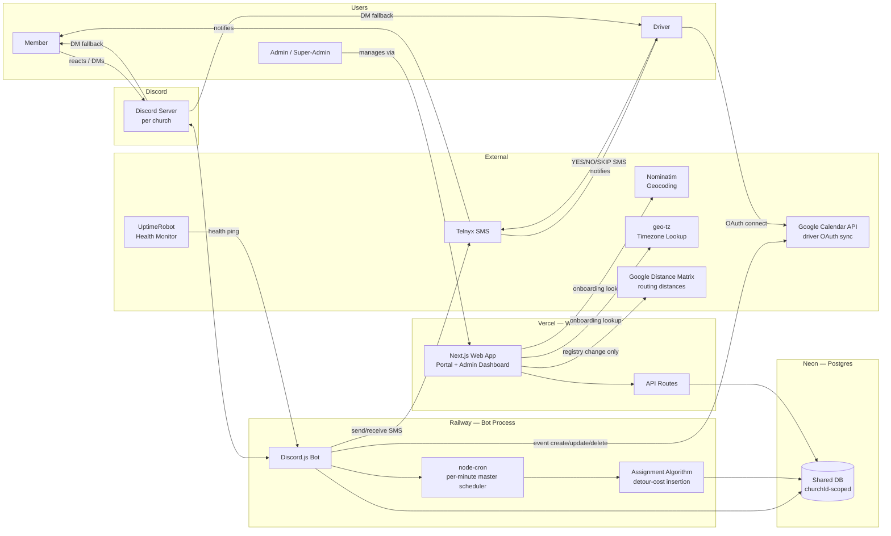
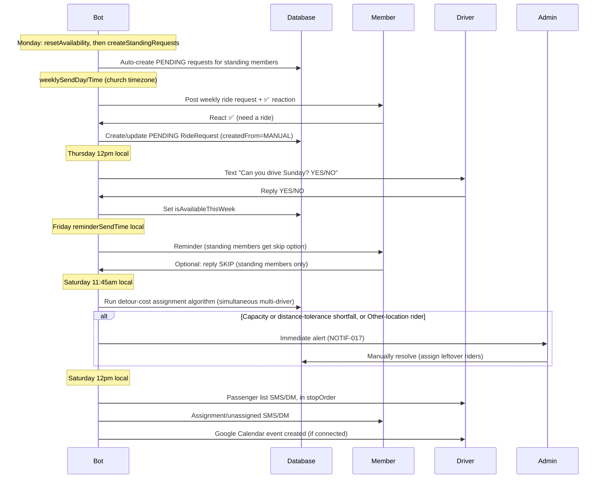
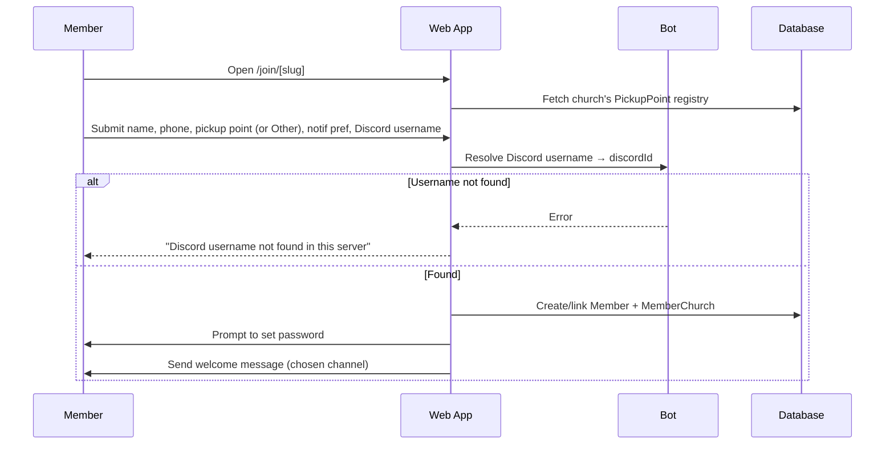

# Chariot — Church Rides Coordination System
## Product Requirements Document

**Version:** 2.3 — Draft  
**Date:** 2026-09-15  
**Owner:** James  
**Audience:** James (sole developer/owner); referenced by future contributors or church admins who need to understand system behavior  
**Status:** Living doc — subject to change  
**Sign-off:** Self-approved by James (sole stakeholder and decision-maker — see Section 1.4). No external approval chain required.

> Add new feature proposals at the bottom under Backlog, then promote them into Section 10 once scoped.

**Status key:**
- `PLANNED` — decided, not yet built
- `TBD` — needs a decision before building

---

## Table of Contents

1. [Executive Summary & Vision](#1-executive-summary--vision)
2. [Technical Architecture](#2-technical-architecture)
3. [Multi-Church Architecture](#3-multi-church-architecture)
4. [Discord Bot Requirements](#4-discord-bot-requirements)
5. [Web Application](#5-web-application)
6. [Database Requirements](#6-database-requirements)
7. [Backend & Algorithm](#7-backend--algorithm)
8. [Notification Requirements](#8-notification-requirements)
9. [Goals for Next Phase](#9-goals-for-next-phase)
10. [Feature Proposals](#10-feature-proposals)
11. [Backlog / Raw Ideas](#11-backlog--raw-ideas)
12. [Testing Requirements](#12-testing-requirements)
13. [Users & Personas](#13-users--personas)
14. [User Stories, Journeys & Acceptance Criteria](#14-user-stories-journeys--acceptance-criteria)
15. [Non-Functional Requirements](#15-non-functional-requirements)
16. [Infrastructure, DevOps & CI/CD](#16-infrastructure-devops--cicd)
17. [Security & Compliance Requirements](#17-security--compliance-requirements)
18. [Build Order, Roadmap & Timeline](#18-build-order-roadmap--timeline)
19. [Risk Register](#19-risk-register)
20. [Competitive Analysis](#20-competitive-analysis)
21. [Migration & Onboarding Plan](#21-migration--onboarding-plan)
22. [Glossary](#22-glossary)
23. [Implementation Specifications](#23-implementation-specifications)
24. [Phased Build Plan](#24-phased-build-plan)
25. [Open Decisions Log](#25-open-decisions-log)
26. [Document Change Log](#26-document-change-log)
27. [Business Rules Index](#27-business-rules-index)
28. [Error States Index](#28-error-states-index)
29. [MVP — Lightweight Discord + Google Sheets Build](#29-mvp--lightweight-discord--google-sheets-build)

---

## 1. Executive Summary & Vision

### 1.1 Vision

Chariot is a ride-coordination system for Sunday church services. Built around a Discord bot and a Next.js web application, running mostly on free-tier infrastructure. The core weekly loop is: bot posts a "who needs a ride" message → members react with ✅ → an assignment algorithm groups riders into available cars along genuinely efficient pickup routes (not just a fixed zone order) → drivers are notified with their ordered passenger list via Telnyx SMS (primary) with Discord DM as fallback.

Chariot is a multi-church platform. Each church runs its own isolated instance with its own riders, drivers, Discord server, schedule, pickup-location registry, and message templates — all backed by a single shared database.

### 1.2 Problem Statement

Today, ride coordination at a typical church runs on a manual spreadsheet plus a group text thread. An admin has to manually read who needs a ride, manually build car groups against whoever confirmed as a driver that week, and manually text or message everyone their assignment — every single week, indefinitely. This is slow, error-prone (easy to double-book a seat or miss a request buried in a group chat), and it doesn't scale past one church without multiplying the admin's manual workload linearly.

The deeper cost isn't just admin time — it's what that time isn't spent on. Every hour an admin spends building car-group spreadsheets is an hour not spent inviting people to church or building relationships with the members and guests who showed up. Chariot's purpose is to make the logistics fully autonomous so that time gets reinvested into ministry rather than manual coordination.

### 1.3 Goals & Success Metrics

**Primary success metric:** Admin time spent on weekly ride coordination drops substantially versus the current spreadsheet-plus-group-text process. Exact numeric target is TBD — the admin at the pilot church should log actual weekly time spent on ride coordination before launch (baseline) and after launch (comparison), since no baseline currently exists to set a precise percentage target against.

**Directional indicators** (useful signals, not committed KPIs — only admin time reduction was chosen as the primary metric):
- Near-zero UNASSIGNED rate most weeks (few or no riders left without a car after the Saturday assignment run)
- High driver response rate to the Thursday YES/NO availability text
- Multiple churches successfully onboard and remain active users past the first month, not just the pilot church

### 1.4 Assumptions & Constraints

| Assumption / Constraint | Detail |
|---|---|
| Solo-built | James is the sole developer and sole stakeholder/approver. No design or QA team — build order (Section 18) and testing plan (Section 12) are scoped accordingly. |
| Budget | Mostly $0 infrastructure at launch. Telnyx SMS (~$10–15/mo) remains the primary recurring cost. Google Distance Matrix API and Google Calendar API are new dependencies as of v1.1 (Section 2.2) — both are low/near-zero cost at this scale, but they are real external dependencies, not purely free-tier services. |
| Service day | All churches hold a single Sunday service; the weekly cycle (Thursday ask → Friday reminder → Saturday assign/notify) assumes this and is not designed for non-Sunday or multi-service-per-week churches. |
| Geography | US-only at launch — all phone validation is US E.164 format. |
| User age | All members, drivers, and +1 guests are assumed to be adults (18+). No minor-specific privacy/consent handling is built into v1 (confirmed decision — see Section 17.2). |
| Launch window | Targeting launch before the next school year (~early September 2026, given a 2026-07-21 start date). This was already an aggressive timeline relative to v1.0 scope; the v1.1 expansion (Section 19, Risk #2) makes it more aggressive still. |
| Initial scale | A handful of churches (roughly 2–5) at launch, not a large-scale multi-tenant rollout — see Section 15.2 for what this means for scalability planning. |

### 1.5 Scope Summary

**As of v2.2:** build sequencing is now staged. A lightweight MVP (Section 29) — Discord bot + Google Sheets + Google Apps Script, single church, no web app, no Postgres — comes first, to validate the core weekly ride-coordination loop cheaply before the full platform is built. The full platform described throughout Sections 1–28 remains the target end-state; nothing below is invalidated, only resequenced behind the MVP. The v1.1 revision folded in five features that were previously deferred (Section 9/10/11 of v1.0): geographic/route-optimized pickup clustering (replacing the fixed zone-priority list), recurring ride requests, per-church pickup-point registries, church offboarding, waitlist auto-fill, Google Calendar sync, and a full post-assignment re-assignment flow; v1.2 closed the remaining third-party integration-spec gap (Section 2.9) without changing scope. See Section 2.5 for what remains genuinely out of scope for the full platform, and Section 29.4 for what's deferred specifically from the MVP.

---

## 2. Technical Architecture

### 2.1 Stack & Monorepo Structure

```
/apps
  /web — Next.js admin dashboard + API routes (Vercel)
  /bot — Discord.js bot + node-cron scheduler (Railway)
/packages
  /db — Prisma schema + shared client + assignment algorithm
  /types — Shared TypeScript types (route order, phone validation, dates)
```

### 2.2 Infrastructure

| Piece | Provider | Notes |
|---|---|---|
| Postgres | Neon | Free tier; auto-suspends when idle — Prisma reconnects transparently |
| Web / API | Vercel | root dir `apps/web`; role-based auth via NextAuth |
| Bot | Railway | root dir = repo root; `TZ=UTC` globally. All per-church scheduling computed dynamically using `Church.timezone` + `luxon`. Per-minute master cron checks each church's computed UTC fire time. |
| Chat / Bot | Discord | Free; weekly ride post channel, reaction intake, DM fallback for notifications |
| SMS | Telnyx | ~$0.004/text, no monthly fee; sole *recurring* exception to the $0 rule (~$10–15/mo at scale including phone number). Discord DM is fallback. |
| Geocoding + Timezone Lookup | Nominatim (OpenStreetMap) + `geo-tz` | Free, no API key. Nominatim resolves `Church.location` and `PickupPoint` addresses to lat/long under OSM's fair-use policy; `geo-tz` (npm, bundled offline dataset) resolves those coordinates to an IANA timezone string with no external call needed. If Nominatim proves too imprecise for specific housing-complex-level addresses (its data quality varies by area), fall back to a paid geocoder for pickup points specifically — flagged as an assumption to revisit if geocoding accuracy is poor for the pilot church's locations. |
| Route Distance Matrix | Google Distance Matrix API | New in v1.1. Computes real routing distance/time between a church's `PickupPoint`s (Section 2.3). Called only when a church's pickup-point registry changes (a point is added/edited/removed), not on every weekly assignment run — the resulting matrix is cached in `PickupPointDistance` and reused every week. At ~19–30 points per church this is a few hundred API calls per registry change at most, which is negligible cost even outside any free quota. |
| Calendar Sync | Google Calendar API | New in v1.1. OAuth-based, per-driver (drivers connect their own personal calendar — see Section 2.7... see WEB-084). Free; standard Calendar API quotas are far beyond what this app's usage requires. |

> **Note:** Telnyx SMS remains the only ongoing recurring cost by design. Google Distance Matrix and Google Calendar API usage is either infrequent (distance matrix, only on registry changes) or free at this scale (Calendar API), so the "$0 infrastructure" philosophy mostly holds, with the caveat that these are now real third-party dependencies rather than purely free/open tools. Email notifications are not used — SMS and Discord DM only.
>
> **TBD — launch blocker:** Telnyx Toll-Free Verification (4–8 week approval lead time, see Section 8) must be submitted and approved before any church can go live with SMS. This should be kicked off as early as possible in the build timeline, not left until the end.

### 2.3 Data Model (Prisma / Postgres)

Schema lives in `packages/db/prisma/schema.prisma` and is the single source of truth shared across both apps.

#### Church

| Field | Type | Constraints | Notes |
|---|---|---|---|
| `id` | Int | PK, Auto-increment | Numeric ID — used in all internal/admin routes (e.g. `/admin/42/week`) |
| `slug` | String | Unique, Not Null | URL-safe identifier (e.g. `miramar`) — used in all portal/public routes (`/portal/miramar/ride`, `/join/miramar`). Auto-generated from `name`, editable by super-admin |
| `name` | String | Not Null | e.g. 'Miramar Church' |
| `location` | String | Not Null | Physical address of the church |
| `serviceTime` | String | Not Null | Service start time (e.g. '10:00 AM') in the church's local timezone |
| `discordServerId` | String | Unique | Discord guild (server) ID |
| `discordChannelId` | String | Not Null | Single channel for weekly ride posts and `/register` command |
| `weeklyMessageTemplate` | String | Not Null | Custom body for the weekly ride post |
| `weeklySendDay` | String | Not Null | Day of week (e.g. 'Wednesday') |
| `weeklySendTime` | String | Not Null | Local time to post (e.g. '09:00') — interpreted in `Church.timezone` by the scheduler |
| `reminderSendTime` | String | Not Null | Local time for the Friday member reminder (e.g. '18:00') — interpreted in `Church.timezone` by the scheduler. Day is fixed at Friday for all churches; only the time is configurable. |
| `activeMessageId` | String? | Nullable | Discord message ID of current week's post — survives bot restarts |
| `timezone` | String | Not Null | IANA timezone string (e.g. `America/Los_Angeles`) — auto-suggested from `location`, confirmed during setup |
| `isActive` | Boolean | Default true | **New in v1.1.** Soft deactivation flag (WEB-082) — false hides the church from active lists and pauses its scheduled jobs, without deleting any data. Reversible by a super-admin. |
| `detourTolerancePercent` | Int | Default 20 | **New in v1.1.** Assignment-algorithm tuning parameter — max acceptable detour as a percent of direct distance. |
| `detourToleranceFlatMeters` | Int | Default 122 (~400 ft) | **New in v1.1.** Flat-distance floor for detour tolerance; the algorithm uses whichever of the percent or flat value is larger for a given trip. |
| `preClusterRadiusMeters` | Int | Default 230 (~750 ft) | **New in v1.1.** Physical pre-clustering shortcut radius (Section 7.1) — pickup points within this radius of each other are treated as an automatic shared corridor group. |

#### PickupPoint — **New in v1.1, replaces the global `PickupLocation` enum and the `PickupLocationTime` table**

A per-church registry of named pickup locations, each geocoded to real coordinates so the assignment algorithm can compute genuine route distances between them (Section 7.1). Two special rows are auto-created per church: one representing the church's own address (the fixed endpoint every route ends at) and one "Other / Not Listed" catch-all for members whose location isn't in the registry.

| Field | Type | Constraints | Notes |
|---|---|---|---|
| `id` | String / Int | PK | |
| `churchId` | FK > Church | Not Null | |
| `name` | String | Not Null | e.g. "Mesa Court", "Middle Earth", "Other / Not Listed" |
| `lat` | Float? | Nullable | Null for the "Other" catch-all row |
| `lng` | Float? | Nullable | Null for the "Other" catch-all row |
| `isOtherCatchAll` | Boolean | Default false | Exactly one such row auto-created per church at onboarding. Excluded from `PickupPointDistance` and the assignment algorithm entirely — members/drivers who select it are routed to manual admin placement (BE-021). |
| `isChurchNode` | Boolean | Default false | Exactly one such row auto-created per church at onboarding, geocoded from `Church.location`. Represents the fixed destination every driver's route ends at. |
| `createdAt` | DateTime | Auto | |

#### PickupPointDistance — **New in v1.1**

The cached pairwise distance matrix for a church's `PickupPoint` registry (including the church node), computed via Google Distance Matrix API. Recomputed only when the registry changes (BE-023) — never on a per-assignment-run basis.

| Field | Type | Constraints | Notes |
|---|---|---|---|
| `id` | String / Int | PK | |
| `churchId` | FK > Church | Not Null | |
| `fromPointId` | FK > PickupPoint | Not Null | |
| `toPointId` | FK > PickupPoint | Not Null | |
| `distanceMeters` | Int | Not Null | Real routing distance, not straight-line |
| `driveSeconds` | Int | Not Null | Real routing time — used for the "be ready" time calculation (replaces the old `PickupLocationTime.driveTimeMinutes`) |
| `computedAt` | DateTime | Auto | |
| `[unique]` | — | `@@unique([fromPointId, toPointId])` | |

#### StandingRideRequest — **New in v1.1**

Supports recurring ("standing") ride requests — a member (or an admin on their behalf) can set up a request that auto-renews every week without needing to react or sign up again.

| Field | Type | Constraints | Notes |
|---|---|---|---|
| `id` | String / Int | PK | |
| `memberId` | FK > Member | Not Null | |
| `churchId` | FK > Church | Not Null | |
| `isActive` | Boolean | Default true | Set false to pause/cancel the standing request entirely |
| `createdBy` | Enum | Not Null | MEMBER or ADMIN — who set it up |
| `createdAt` | DateTime | Auto | |
| `[unique]` | — | `@@unique([memberId, churchId])` | One standing request per member per church |

#### Member

> Members, admins, and super-admins are all `Member` rows — distinguished by the `role` field. A person can be a MEMBER of one church and ADMIN of another simultaneously.

| Field | Type | Constraints | Notes |
|---|---|---|---|
| `id` | String / Int | PK | |
| `discordId` | String? | Nullable, Unique | Discord snowflake ID — optional for web-only signups |
| `discordUsername` | String? | Nullable at the DB level | Display username — editable by member in profile. Required at signup time for web-only registrations (see WEB-A08) so the bot can resolve it to a `discordId` for Discord DM fallback; nullable in the schema to still allow admin-created accounts without one. |
| `name` | String | Not Null | From registration or admin entry — editable by member |
| `phone` | String | Not Null, Unique | Login credential — only editable by admin |
| `passwordHash` | String? | Nullable | Null until set on first login |
| `hasSetPassword` | Boolean | Default false | Flips to true on first-login password setup |
| `pickupLocation` | FK > PickupPoint | Not Null | **Changed in v1.1** — was a global `PickupLocation` enum value, now a foreign key into the member's church's `PickupPoint` registry. Selecting the church's "Other" row is valid and means "not in the registry, needs manual placement." Editable by member, affects current and future weeks |
| `preferences` | String? | Nullable | Free-text: seat preference, accessibility, notes — editable by member |
| `role` | Enum | Default MEMBER | MEMBER, ADMIN, SUPER_ADMIN |
| `notificationPreference` | Enum | Default SMS | SMS or DISCORD_DM — chosen at signup, editable in profile |
| `smsOptedOut` | Boolean | Default false | If true, no outbound SMS. Editable in profile. Telnyx STOP replies set this automatically |
| `passwordResetCode` | String? | Nullable | Hashed 6-digit OTP for password reset; cleared on use or expiry |
| `passwordResetExpiry` | DateTime? | Nullable | 10 minutes from code generation; cleared alongside the code |
| `createdAt` | DateTime | Auto | |

#### MemberChurch (join table — member ↔ church membership)

| Field | Type | Constraints | Notes |
|---|---|---|---|
| `id` | String / Int | PK | |
| `memberId` | FK > Member | Not Null | |
| `churchId` | FK > Church | Not Null | |
| `joinedAt` | DateTime | Auto | |
| `isActive` | Boolean | Default true | False when member removes themselves or admin removes them |
| `[unique]` | — | `@@unique([memberId, churchId])` | One membership record per member per church |

#### AdminChurch (join table — which churches an admin manages)

> Only used for `role = ADMIN`. Super-admins have implicit access to all churches and do not need records here.

| Field | Type | Constraints | Notes |
|---|---|---|---|
| `id` | String / Int | PK | |
| `memberId` | FK > Member | Not Null | Must have `role = ADMIN` |
| `churchId` | FK > Church | Not Null | Church this admin manages |
| `[unique]` | — | `@@unique([memberId, churchId])` | |

#### Driver

> A driver can also be a registered member. If so, `memberId` links the two records. Each week, drivers default to unavailable until they confirm via the Thursday text.

| Field | Type | Constraints | Notes |
|---|---|---|---|
| `id` | String / Int | PK | |
| `churchId` | FK > Church | Not Null | |
| `memberId` | FK > Member | Nullable | Set if this driver is also a registered member. **Required (not nullable in practice) if the driver wants Google Calendar sync (WEB-084/085)**, since that needs an authenticated portal session for OAuth. |
| `name` | String | Not Null | |
| `phone` | String | Not Null | Used for Telnyx SMS |
| `discordId` | String? | Nullable | Used for Discord DM fallback |
| `homePointId` | FK > PickupPoint | Not Null | **Renamed/changed in v1.1** (was `pickupZone`, a global enum value) — the driver's home/starting `PickupPoint`, used as the route's starting reference for detour-cost calculations (Section 7.1). |
| `seatsAvailable` | Int | Not Null | Max passengers (excluding driver) |
| `isAvailableThisWeek` | Boolean | Default false | Defaults to NO each week; flips to true only when driver replies YES to Thursday text |
| `notificationPreference` | Enum | Default SMS | SMS or DISCORD_DM — set when driver is added, editable by admin |
| `smsOptedOut` | Boolean | Default false | If true, no outbound SMS. Telnyx STOP replies set this automatically |
| `googleCalendarConnected` | Boolean | Default false | **New in v1.1.** True once the driver has completed Google Calendar OAuth. |
| `googleCalendarRefreshToken` | String? | Nullable, encrypted at rest | **New in v1.1.** OAuth refresh token; only present if `googleCalendarConnected = true` and `memberId` is set. |
| `currentWeekCalendarEventId` | String? | Nullable | **New in v1.2.** The Google Calendar event ID for this driver's synced route for the current `weekDate`, used to target update/delete calls (Section 2.9.4). Overwritten each week; null if the driver has no synced event this week (not connected, or no assignment). |

#### RideRequest

> A member with a +1 counts as **2 seats** against the assigned driver's capacity. Max 1 +1 per member per week.

| Field | Type | Constraints | Notes |
|---|---|---|---|
| `id` | String / Int | PK | |
| `memberId` | FK > Member | Not Null | |
| `churchId` | FK > Church | Not Null | |
| `weekDate` | DateTime | Not Null | Sunday of the service week |
| `status` | Enum | Default PENDING | PENDING, ASSIGNED, UNASSIGNED, CANCELLED |
| `hasPlusOne` | Boolean | Default false | True when member reacts with 1️⃣ and provides +1 details |
| `unassignedReason` | String? | Nullable | Populated when status = UNASSIGNED — shown to member in portal and included in their SMS. As of v1.1, includes distance-based reasons ("no driver within acceptable route distance") and "Other" pickup-location reasons ("pickup location needs manual placement"), not just capacity shortfalls. |
| `createdFrom` | Enum | Default MANUAL | **New in v1.1.** MANUAL (member reacted/signed up this week) or STANDING (auto-created from a `StandingRideRequest`) — lets the system distinguish a standing member's un-skipped weekly request from a one-off request for notification/reminder purposes. |
| `[unique]` | — | `@@unique([memberId, churchId, weekDate])` | One request per member per church per week — allows a member in two churches to request rides for both |

> **Re-requesting after cancellation:** There is no separate "re-request" flow. Because of the unique constraint above, a member who cancels and then signs up again in the same week (via reaction or portal) updates the existing row's `status` from `CANCELLED` back to `PENDING` rather than creating a new row. They're simply added back into consideration for the next assignment run — no new record, no re-approval step.

#### PlusOne

| Field | Type | Constraints | Notes |
|---|---|---|---|
| `id` | String / Int | PK | |
| `rideRequestId` | FK > RideRequest | Not Null, Unique | One +1 per ride request |
| `memberId` | FK > Member | Not Null | Member bringing the +1 |
| `churchId` | FK > Church | Not Null | |
| `weekDate` | DateTime | Not Null | |
| `name` | String | Not Null | Full name of the +1 — included in driver's notification |
| `phone` | String | Not Null | US E.164 format — included in driver's notification |

#### RideAssignment

| Field | Type | Constraints | Notes |
|---|---|---|---|
| `id` | String / Int | PK | |
| `churchId` | FK > Church | Not Null | |
| `memberId` | FK > Member | Not Null | |
| `driverId` | FK > Driver | Not Null | |
| `weekDate` | DateTime | Not Null | Matches RideRequest.weekDate |
| `stopOrder` | Int | Not Null | **New in v1.1.** This rider's position in the driver's optimized pickup sequence for the week (1 = first stop), computed by the assignment algorithm (BE-022). Used to list passengers in actual route order on the driver's notification (NOTIF-002), not arbitrary order. |

#### SpecialRequest

| Field | Type | Constraints | Notes |
|---|---|---|---|
| `id` | String / Int | PK | |
| `memberId` | FK > Member | Not Null | |
| `churchId` | FK > Church | Not Null | |
| `message` | String | Not Null | Member's request |
| `status` | Enum | Default OPEN | OPEN, RESOLVED |
| `adminNotes` | String? | Nullable | Admin resolution notes — optionally included in member notification |
| `createdAt` | DateTime | Auto | |
| `resolvedAt` | DateTime? | Nullable | Stamped when admin marks resolved |

#### WeeklyStatus

| Field | Type | Constraints | Notes |
|---|---|---|---|
| `id` | String / Int | PK | |
| `churchId` | FK > Church | Not Null | |
| `weekDate` | DateTime | Not Null | |
| `status` | Enum | Default NORMAL | NORMAL, CAPACITY_ISSUE, CANCELLED |
| `issueReason` | String? | Nullable | Displayed as urgent banner to all users when status ≠ NORMAL |
| `resolvedAt` | DateTime? | Nullable | |
| `lastUpdatedBy` | FK > Member | Nullable | Admin who last saved changes to this record |
| `lastUpdatedAt` | DateTime? | Nullable | Shown in the weekly dashboard as "Last updated by [Name] at [time]" |
| `[unique]` | — | `@@unique([churchId, weekDate])` | One status record per church per week |

#### NotificationLog

| Field | Type | Constraints | Notes |
|---|---|---|---|
| `id` | String / Int | PK | |
| `recipientId` | String | Not Null | FK to `Member.id` or `Driver.id` depending on `recipientType` |
| `recipientType` | Enum | Not Null | MEMBER, DRIVER |
| `churchId` | FK > Church | Not Null | |
| `weekDate` | DateTime? | Nullable | Null for non-weekly notifications |
| `channel` | Enum | Not Null | SMS, DISCORD_DM |
| `type` | Enum | Not Null | WELCOME, DRIVER_ASSIGNMENT, MEMBER_ASSIGNMENT, DRIVER_AVAILABILITY_ASK, MEMBER_REMINDER, SPECIAL_REQUEST_SENT, SPECIAL_REQUEST_RESOLVED, CAPACITY_ISSUE, CANCELLATION_NOTICE, PASSWORD_RESET, REASSIGNMENT_NOTICE, STANDING_SKIP_REMINDER |
| `status` | Enum | Not Null | SENT, FAILED, DELIVERED |
| `sentAt` | DateTime | Auto | |
| `failureReason` | String? | Nullable | Error message if status = FAILED |

> `REASSIGNMENT_NOTICE` and `STANDING_SKIP_REMINDER` are new enum values in v1.1, supporting NOTIF-019 and NOTIF-020 respectively.

### 2.4 Planned File Structure

```
apps/bot/src/index.ts — event wiring + cron schedule
apps/bot/src/reactions.ts — ✅ and 1️⃣ reactions → RideRequest / PlusOne
apps/bot/src/jobs/resetAvailability.ts — Monday midnight UTC: sets isAvailableThisWeek = false for all drivers in all churches
apps/bot/src/jobs/createStandingRequests.ts — New in v1.1. Monday, after resetAvailability: auto-creates a PENDING RideRequest (createdFrom = STANDING) for every active StandingRideRequest, per church
apps/bot/src/jobs/weeklyPost.ts — posts weekly ride request message per church (schedule computed via Church.timezone + luxon)
apps/bot/src/jobs/driverAvailabilityAsk.ts — Thursday 12pm local: texts each driver YES/NO (per church timezone)
apps/bot/src/jobs/memberReminder.ts — Friday evening local: ride reminder to pending members (per church timezone); standing-request members get the skip-this-week variant (NOTIF-020)
apps/bot/src/jobs/assignRides.ts — Saturday 11:45am local: runs the detour-cost assignment algorithm (per church timezone)
apps/bot/src/jobs/notifyDrivers.ts — Saturday 12pm local: SMS → Discord DM fan-out to drivers, passengers listed in stopOrder (per church timezone)
apps/bot/src/jobs/notifyMembers.ts — Saturday 12pm local: SMS → Discord DM fan-out to members (per church timezone)
apps/bot/src/lib/assign.ts — assignment algorithm core logic: detour-cost insertion, simultaneous multi-driver placement, corridor-group sequencing
apps/bot/src/lib/distanceMatrix.ts — New in v1.1. Google Distance Matrix API integration; computes/refreshes PickupPointDistance rows when a church's PickupPoint registry changes
apps/bot/src/lib/googleCalendar.ts — New in v1.1. Google Calendar API integration: OAuth flow, event create/update/delete on assignment changes
apps/bot/src/lib/sms.ts — Telnyx SMS integration (send + inbound webhook parser, including "SKIP" keyword for standing requests)
packages/db/prisma/schema.prisma — data model (single source of truth)
packages/db/prisma/seed.ts — sample data + first super-admin seed
packages/types/ — shared TS types (route order, phone validation, dates)
apps/web/src/app/(auth)/login — shared login page
apps/web/src/app/(auth)/forgot-password — forgot password flow
apps/web/src/app/join/[slug] — church-specific web signup
apps/web/src/app/join — general signup (lists all active churches)
apps/web/src/app/portal/[churchSlug]/* — member portal (scoped per church slug)
apps/web/src/app/admin/[churchId]/* — admin dashboard (scoped per church numeric ID)
apps/web/src/app/admin — super-admin / multi-church dashboard
apps/web/src/app/api/* — API routes (see Section 5.5)
```

> **Scheduling:** `TZ=UTC` on Railway. All per-church job times computed via `luxon`: `DateTime.fromObject({ hour, minute }, { zone: church.timezone }).toUTC()`. A per-minute master cron fires every minute UTC and checks each church's computed fire time. This pattern extends the existing `weeklyPost.ts` approach to all jobs.

> **Notification fan-out:** `notifyDrivers.ts` and `notifyMembers.ts` are the fan-out seams. Channel selection respects `notificationPreference` and `smsOptedOut`. `sms.ts` handles both outbound sending and inbound webhook parsing for YES/NO replies, SKIP replies, and password reset codes.

### 2.5 Out of Scope for v1.1

| Item | Area | Notes / Path Forward |
|---|---|---|
| No-show tracking | Reporting | History tracks assignments but not whether riders actually showed up. Still out of scope — everything else previously listed here (Google Calendar sync, post-assignment cancellation, multi-week requests, configurable route order, member ride history, church offboarding) is now in scope as of v1.1. |
| Public ICS calendar feed | Notification | Considered (Section 11) but not selected for this build. |
| Bulk CSV import for migration | Onboarding | Considered (Section 11, Section 21) but not selected for this build — admins still enter existing members/drivers one at a time when migrating off a spreadsheet. |

### 2.6 Known Limitations & Bot Offline Mitigation

**Bot offline during the reaction window** is the main known limitation. Discord does not re-deliver events that occurred while the bot was offline.

**Mitigations (in priority order):**

| # | Mitigation | Cost | Notes |
|---|---|---|---|
| 1 | **Startup reconciliation** | Code only | On every bot restart, fetch all reactions on `Church.activeMessageId` via Discord REST and reconcile against DB — create missing RideRequests, cancel removed ones. |
| 2 | **`/rides sync` admin command** | Code only | Admin manually triggers full reaction reconciliation for the current week. |
| 3 | **UptimeRobot health ping** | $0 | Bot exposes `GET /health`. UptimeRobot (free) pings every minute, alerts admin on downtime. |
| 4 | **Railway auto-restart** | Included | Restarts on crash. Combined with reconciliation, gap is typically <30 seconds. |
| 5 | **Web portal fallback** | Already built | Members can sign up for rides via portal if bot is down — no Discord required. |

### 2.7 Tenant Isolation Enforcement

**Decision: app-layer scoping only — no native Postgres Row-Level Security.**

All tenant isolation (`churchId` scoping) is enforced in application code, not by Postgres RLS policies. Rationale: Prisma connects to Neon as a single shared role, and RLS only applies to roles without `BYPASSRLS` — getting real DB-enforced isolation would require a dedicated non-privileged Postgres role plus a `SET LOCAL app.church_id = ...` call scoped per request/transaction. That's real plumbing (role management, transaction-scoped session variables) that doesn't fit well with Vercel's serverless functions and Neon's serverless connection model, and isn't worth the cost for this scale. App-layer scoping is simpler to build and matches how the API routes are already described throughout Section 5.5.

**Mechanism:**
- A shared Prisma client extension / middleware wraps every query and automatically injects `where: { churchId }` (or an equivalent join-path filter) based on the authenticated session's church context — a route handler never issues a raw, unscoped Prisma call.
- `MEMBER` sessions scope to their own `memberId` plus whichever `churchId` the request path specifies (validated against their `MemberChurch` records).
- `ADMIN` sessions scope to their `AdminChurch` churches only.
- `SUPER_ADMIN` sessions bypass church scoping entirely (by design — they're allowed cross-church access).
- There is no database-level backstop: a missed scoping call in application code is a real cross-tenant leak. This is the accepted tradeoff for v1; TEST-008/012/013 exist specifically to catch that class of bug at the test layer instead.
- `PickupPoint` and `PickupPointDistance` rows are also `churchId`-scoped, same as every other table — the distance matrix of one church must never be visible to or reused by another church, even if two churches happen to share a physical area.

| ID | Requirement | Priority | Status |
|---|---|---|---|
| MC-007 | Tenant isolation is enforced via a shared Prisma middleware/client extension that injects `churchId` scoping into every query — not via native Postgres RLS. | HIGH | PLANNED |
| MC-008 | Every API route handler must go through the scoped Prisma wrapper; no route issues a raw unscoped query. Code review / lint rule should catch direct `prisma.<model>` calls that bypass it. | HIGH | PLANNED |

### 2.8 System Architecture Diagram



> Both apps read/write the same Neon Postgres instance via Prisma, scoped per church (Section 2.7). The bot and web app do not talk to each other directly — they only share state through the database. Google Distance Matrix is only called from the web app's church-settings flow when a `PickupPoint` registry changes, never from the weekly assignment job itself.

### 2.9 Third-Party Integration Specifications — New in v1.2

Full data contracts for every external service Chariot depends on. Each entry specifies: what it's used for, auth, the exact request/response shape for the calls this app actually makes, rate limits/quotas, and behavior on failure or timeout. This section exists so any integration can be built without needing to separately consult the provider's docs for the calls in scope here.

#### 2.9.1 Telnyx SMS

**Role:** Primary notification channel for all outbound messages (Section 8) and inbound driver YES/NO/SKIP replies, password-reset OTP delivery, and STOP opt-out handling.

**Auth:** Bearer API key (`TELNYX_API_KEY` env var) on outbound calls. Inbound webhook requests are authenticated via Telnyx's Ed25519 webhook signature (`telnyx-signature-ed25519` + `telnyx-timestamp` headers), verified against `TELNYX_PUBLIC_KEY` before processing (TEST-027).

**Base URL:** `https://api.telnyx.com/v2`

**Outbound — `POST /messages`**

Request:
```json
{
  "from": "+18005550123",
  "to": "+16195550101",
  "text": "Hi Jane! Your ride to church is confirmed. Driver: Marcus Lee...",
  "messaging_profile_id": "40019dc3-...",
  "webhook_url": "https://chariot.app/api/webhooks/telnyx/status"
}
```

Success response (`200`):
```json
{
  "data": {
    "id": "40019dc3-...",
    "to": [{ "phone_number": "+16195550101", "status": "queued" }],
    "from": { "phone_number": "+18005550123" }
  }
}
```

Error response (`4xx/5xx`):
```json
{
  "errors": [{ "code": "40300", "title": "Invalid 'to' phone number", "detail": "..." }]
}
```

**Our handling:** on any non-`2xx` response or a request timeout (5s), the send is treated as `FAILED` in `NotificationLog` and the channel-selection fallback logic (Section 8) tries Discord DM next. No automatic retry against Telnyx itself — a single attempt per channel per notification, consistent with "fallback to the other channel" rather than "retry the same channel."

**Inbound — `POST /api/webhooks/telnyx` (Telnyx calls us)**

Payload (relevant fields):
```json
{
  "data": {
    "event_type": "message.received",
    "payload": {
      "from": { "phone_number": "+16195550188" },
      "to": [{ "phone_number": "+18005550123" }],
      "text": "YES"
    }
  }
}
```

Our response: `200 { "received": true }` within 5 seconds (Telnyx retries on non-2xx or timeout — up to 3 attempts over ~15 minutes per Telnyx's own retry schedule, which is a possible source of duplicate-event delivery our webhook handler must be idempotent against, keyed on Telnyx's `data.id`).

**Rate limits / quotas:** Telnyx's default outbound throughput is 1 message/second per 10DLC or toll-free number by default (toll-free can request throughput increases after verification); at this app's weekly-batch scale (dozens of messages fired around 12:00 PM Saturday and 12:00 PM Thursday) sends are naturally spread across the fan-out job's execution time and are not expected to hit this ceiling, but `notifyDrivers`/`notifyMembers` (Section 7.2) should send sequentially or lightly rate-limited (e.g. 1/sec) rather than firing all at once, to stay under this ceiling as usage grows.

**Failure/timeout behavior:** 5-second request timeout on outbound send. On failure, fall back to Discord DM per the standard channel-selection logic (Section 8); if both fail, logged as `FAILED` in `NotificationLog` with `failureReason` populated from the Telnyx error `detail` field (or `"timeout"`).

#### 2.9.2 Nominatim (OpenStreetMap Geocoding)

**Role:** Resolves a `Church.location` or `PickupPoint` street address into lat/lng coordinates at onboarding/registry-edit time. One-time lookup per address, not called on any recurring schedule.

**Auth:** None (public API), but OSM's usage policy requires a descriptive `User-Agent` header identifying the application (`User-Agent: Chariot/1.0 (contact: jliuzhishun@gmail.com)`) — required, not optional, or requests may be silently blocked.

**Base URL:** `https://nominatim.openstreetmap.org`

**Request — `GET /search`**
```
GET /search?q=Berkeley+Court,+Irvine,+CA&format=json&limit=1&addressdetails=0
```

Success response (`200`):
```json
[
  {
    "lat": "33.6434",
    "lon": "-117.8419",
    "display_name": "Berkeley Court, Irvine, California, ...",
    "importance": 0.62
  }
]
```
An empty array `[]` means no match — treated as a validation error in the admin UI ("couldn't locate this address, please refine it or enter coordinates manually").

**Rate limits:** OSM's fair-use policy caps requests at **1 per second** from a single application, enforced informally (repeated violations risk an IP block, not a hard per-request rejection). Per the confirmed decision below, Chariot geocodes addresses **sequentially with a minimum 1-second gap** between requests — both for a single new `PickupPoint` and for building out a full registry during church onboarding (roughly 20-30 seconds for a 19-30 point registry, which is acceptable since onboarding is a rare, non-time-sensitive admin action, not something end users wait on).

**Failure/timeout behavior:** 10-second request timeout (Nominatim can be slower than commercial geocoders). On failure or empty result, the admin UI surfaces an inline error and does not save the `PickupPoint`/`Church.location` until geocoding succeeds — consistent with the same "block and ask to retry" pattern used for Google Distance Matrix (Section 2.9.3), since an ungeocoded point can't participate in the routing algorithm anyway. If Nominatim's data proves too imprecise for a specific housing-complex-level address (a known open risk — Section 2.2), the admin can manually enter lat/lng as a fallback input on the same form, bypassing Nominatim entirely for that one point.

#### 2.9.3 Google Distance Matrix API

**Role:** Computes real routing distance and drive time between every pair of a church's `PickupPoint`s (including the church node) whenever that church's registry changes. Powers the cached `PickupPointDistance` matrix the assignment algorithm reads from (Section 7.1) — never called during the weekly `assignRides` run itself.

**Auth:** API key (`GOOGLE_MAPS_API_KEY` env var) as a query parameter, restricted at the Google Cloud Console level to the Distance Matrix API and to Chariot's server IP/referrer.

**Base URL:** `https://maps.googleapis.com/maps/api/distancematrix/json`

**Request — `GET /json`**

Called once per registry-change event, batching all current points as both origins and destinations in a single request (or chunked requests if the point count exceeds Google's per-request element limit — see Rate limits below):
```
GET /json
  ?origins=33.6434,-117.8419|33.6456,-117.8401|...
  &destinations=33.6434,-117.8419|33.6456,-117.8401|...
  &units=imperial
  &key=AIzaSy...
```

Success response (`200`):
```json
{
  "status": "OK",
  "origin_addresses": ["33.6434,-117.8419", "..."],
  "destination_addresses": ["33.6434,-117.8419", "..."],
  "rows": [
    {
      "elements": [
        { "status": "OK", "distance": { "value": 0, "text": "0 ft" }, "duration": { "value": 0, "text": "1 min" } },
        { "status": "OK", "distance": { "value": 482, "text": "0.3 mi" }, "duration": { "value": 90, "text": "2 mins" } }
      ]
    }
  ]
}
```
`distance.value` (meters) and `duration.value` (seconds) map directly onto `PickupPointDistance.distanceMeters` and `.driveSeconds`. A per-element `status` other than `"OK"` (e.g. `"ZERO_RESULTS"` for two points with no drivable path) is logged and that specific pair is excluded from the matrix — the algorithm treats a missing pair as "infinite detour cost," effectively never routing through it.

**Rate limits / quotas:** billed per element (one origin-destination pair = one element), with a documented cap of **25 origins × 25 destinations (625 elements) per request**, and a **100-elements-per-second** default query-per-second quota per project (raisable via the Cloud Console). A 30-point registry produces 900 elements (30×30) — over the single-request cap — so requests are chunked into origin/destination batches of ≤25 and issued sequentially, well within the per-second quota given how infrequently this runs.

**Failure/timeout behavior — per the confirmed decision:** if the API call fails, times out (10s), or returns a non-`OK` top-level `status` (e.g. `"OVER_QUERY_LIMIT"`, `"REQUEST_DENIED"`), **the PickupPoint save is blocked** — the admin sees an error ("couldn't compute routes for this location, please try again") and the point is not persisted with a partial/missing distance matrix. This keeps the invariant that every `PickupPoint` in a church's registry always has a complete, current row in `PickupPointDistance` before it's usable by the algorithm, rather than silently falling back to manual placement for a point that should have real coordinates.

**Cost:** no hard per-church budget ceiling is set (confirmed decision) — usage is low-frequency (registry-change-triggered only) and small-volume (a few hundred elements per change at most), so actual cost is expected to be negligible relative to Google's free monthly credit. OPS-008 (Section 16.4) logs every call so any unexpected growth in call volume is visible before it becomes a real cost concern.

#### 2.9.4 Google Calendar API

**Role:** Once a Driver (linked to a Member account) connects their personal Google Calendar via OAuth, their weekly assigned route is written to that calendar as an event, kept in sync as assignments change, and removed if the assignment is cancelled.

**Auth:** OAuth 2.0 Authorization Code flow, per-driver. Scope requested: `https://www.googleapis.com/auth/calendar.events` (event-level access only — not full calendar read/write). Flow:
1. Driver clicks "Connect Google Calendar" in their portal profile (WEB-084) → redirected to Google's consent screen via `GET /api/portal/calendar/connect`.
2. On consent, Google redirects back with an authorization code.
3. Server exchanges the code for an access token + refresh token at `POST https://oauth2.googleapis.com/token`.
4. The refresh token is encrypted (SEC-011) and stored in `Driver.googleCalendarRefreshToken`; `Driver.googleCalendarConnected` set `true`.
5. Access tokens (short-lived, ~1hr) are minted on demand from the refresh token for each API call — never stored.

**Base URL:** `https://www.googleapis.com/calendar/v3`

**Create event — `POST /calendars/primary/events`** (called when a `RideAssignment` involving this driver is first created for the week)

Request:
```json
{
  "summary": "Chariot: Sunday ride pickups",
  "location": "Mesa Court, Irvine, CA",
  "description": "1. Jane Smith — (619) 555-0101 — Mesa Court\n2. John Doe + guest — (619) 555-0188 — Middle Earth",
  "start": { "dateTime": "2026-07-26T09:20:00-07:00" },
  "end": { "dateTime": "2026-07-26T10:00:00-07:00" }
}
```
Success response (`200`): includes `id` (the Google event ID), which is stored server-side (new field, `RideAssignment`-adjacent — see Section 6 note below) so it can be referenced for later update/delete calls.

**Update event — `PATCH /calendars/primary/events/{eventId}`** — called when the driver's passenger list or stop times change after the initial creation (e.g. reassignment, waitlist auto-fill). Same body shape as create, partial fields only.

**Delete event — `DELETE /calendars/primary/events/{eventId}`** — called when the driver's last assignment for the week is removed (e.g. all their riders cancel, or the week itself is cancelled).

**Rate limits / quotas:** default quota is 1,000,000 queries/day per project and 10 queries/second/user — far beyond what this app's usage (at most a handful of create/update/delete calls per driver per week) will ever approach.

**Failure/timeout behavior:** Calendar sync failures degrade gracefully and never block the core notification flow — a driver's SMS/Discord DM notification (Section 8.1) remains the authoritative source of truth regardless of calendar sync success. On failure (`4xx`/`5xx`, or a 10s timeout), the attempt is logged (reusing `NotificationLog` with a new `type` value, or a lightweight dedicated log — implementation detail left open) and retried on the next scheduled sync trigger rather than immediately, since a missed calendar update is low-severity compared to a missed SMS.

**Token refresh failure:** if the stored refresh token is revoked or expires (e.g. driver revokes access from their Google Account settings), `Driver.googleCalendarConnected` is set back to `false` and the driver sees a "reconnect your calendar" prompt next time they view their profile; no error is surfaced to admins or other users.

| ID | Requirement | Priority | Status |
|---|---|---|---|
| BE-027 | Telnyx outbound sends use a 5-second timeout; on failure, fall back to Discord DM per Section 8's channel-selection logic; no same-channel retry. | HIGH | PLANNED |
| BE-028 | `/api/webhooks/telnyx` is idempotent, keyed on Telnyx's `data.id`, to tolerate Telnyx's own retry-on-failure behavior. | HIGH | PLANNED |
| BE-029 | Nominatim geocoding requests are issued sequentially with a minimum 1-second gap between requests, including during bulk registry building at onboarding. | HIGH | PLANNED |
| BE-030 | A `PickupPoint` (or `Church.location`) is not saved unless geocoding succeeds; on Nominatim failure or empty result, the admin can manually enter lat/lng as a fallback. | HIGH | PLANNED |
| BE-031 | Google Distance Matrix requests are chunked into ≤25×25-element batches per call when a church's registry exceeds 25 points. | MEDIUM | PLANNED |
| BE-032 | A `PickupPoint` save is blocked (not partially persisted) if the Google Distance Matrix call fails, times out, or returns a non-OK status; admin sees an error and can retry. | HIGH | PLANNED |
| BE-033 | A distance-matrix element pair with a non-OK per-element status (e.g. `ZERO_RESULTS`) is treated as infinite detour cost by the assignment algorithm, never routed through. | MEDIUM | PLANNED |
| BE-034 | Google Calendar OAuth uses the `calendar.events` scope only (not full calendar access); access tokens are minted on demand from the encrypted refresh token and never stored. | HIGH | PLANNED |
| BE-035 | Calendar create/update/delete failures never block or delay the driver's SMS/Discord DM notification; failures are logged and retried on the next sync trigger, not immediately. | HIGH | PLANNED |
| BE-036 | If a driver's Google Calendar refresh token is revoked or expires, `googleCalendarConnected` is set to false and the driver is prompted to reconnect on next profile view. | MEDIUM | PLANNED |

---

## 3. Multi-Church Architecture

Every table carries a `churchId` FK. The bot resolves which church to act on by matching the Discord guild ID of the incoming event.

| ID | Requirement | Priority | Status |
|---|---|---|---|
| MC-001 | Each Church row holds everything needed to run one church's weekly cycle independently. | HIGH | PLANNED |
| MC-002 | All tables (Member, Driver, RideRequest, RideAssignment, PickupPoint, PickupPointDistance) are scoped by `churchId`, enforced at the application layer per Section 2.7. No cross-church data access. | HIGH | PLANNED |
| MC-003 | The bot resolves the correct church from the Discord guild ID on every event. | HIGH | PLANNED |
| MC-004 | Each church has its own `weeklySendDay`, `weeklySendTime`, `reminderSendTime`, `weeklyMessageTemplate`, `timezone`, `PickupPoint` registry, and Discord channel config. | HIGH | PLANNED |
| MC-005 | A super-admin can onboard new Church rows, configure all settings, assign/remove admins for a church, and deactivate a church via the admin panel. | HIGH | PLANNED |
| MC-006 | Per-church pickup-location structure: **resolved in v1.1.** Rather than a simple reorderable list, each church maintains its own geocoded `PickupPoint` registry, and the assignment algorithm computes genuine route-based groupings from it (Section 7.1). This fully supersedes the earlier, simpler "reorder a fixed list of 8 zones" idea. | HIGH | PLANNED |

---

## 4. Discord Bot Requirements

### 4.1 Member Registration

Members register via **`/register` Discord slash command** or via the **web signup form**. The bot does not respond to free-form channel messages — it only manages the weekly post and its reactions.

> **Design:** Discord modals can't be opened from a plain message, and modals don't support dropdowns. The two-step modal/dropdown flow is the correct Discord API workaround.

**Discord `/register` flow:**
1. Member uses `/register` slash command in the church's configured `discordChannelId` (the same single channel used for weekly posts — the command is not available in other channels)
2. Bot opens a modal: name, phone (US E.164 validated), preferences
3. After modal submit, bot sends an ephemeral dropdown for pickup location — **populated dynamically from the church's `PickupPoint` registry (v1.1), not a fixed global list**, always including "Other / Not Listed" as the last option
4. Bot sends an ephemeral follow-up asking notification preference: **SMS** or **Discord DM**
5. Bot checks if a `Member` with that phone number already exists:
   - **New account** → create `Member` row with chosen preference, then create `MemberChurch` record
   - **Existing account** → skip Member creation, just add `MemberChurch` record if not already joined
6. Bot sends a confirmation DM with the web portal link to set a password on first login
7. Welcome message sent immediately via the member's chosen notification channel

**Web signup flow:**
1. Member opens `/join/[slug]` or the general `/join` page
2. On the general page, they see a list of all active churches and **select one**
3. They fill in: name, phone (US E.164 validated), pickup location (dynamic dropdown from that church's `PickupPoint` registry, plus "Other"), preferences, **notification preference**, and a **Discord username** (required — see WEB-A08)
4. Bot attempts to resolve the provided Discord username to a `discordId` via the church's guild member list; signup fails with a clear error if the username can't be found in that Discord server
5. Same phone-number check: create or link account, create `MemberChurch` record
6. Member sets a password immediately on form completion
7. Welcome message sent immediately via their chosen channel

| ID | Requirement | Priority | Status |
|---|---|---|---|
| BOT-001 | Bot registers a `/register` slash command on the church's Discord server. | HIGH | PLANNED |
| BOT-002 | `/register` opens a modal collecting name, phone (US E.164 validated), and preferences. | HIGH | PLANNED |
| BOT-003 | After modal submit, bot sends an ephemeral dropdown to collect pickup location, dynamically populated from the church's `PickupPoint` registry plus "Other / Not Listed." | HIGH | PLANNED |
| BOT-004 | Bot sends an ephemeral follow-up asking notification preference: SMS or Discord DM. | HIGH | PLANNED |
| BOT-005 | On completion, create `Member` with chosen preference if phone doesn't exist; always create `MemberChurch` if not already joined. | HIGH | PLANNED |
| BOT-006 | Bot sends a confirmation DM with web portal link and prompts member to set a password. | HIGH | PLANNED |
| BOT-007 | Welcome message sent immediately via the member's chosen notification channel. | HIGH | PLANNED |
| BOT-008 | Unregistered members who react to the weekly post get a DM pointing them to `/register` or the web signup link. | HIGH | PLANNED |
| BOT-009 | Members can use `/register` again to update their name, preferences, pickup location, or notification preference. | MEDIUM | PLANNED |
| WEB-A01 | Web signup page (`/join/[slug]`) is publicly accessible — no login required. | HIGH | PLANNED |
| WEB-A02 | General signup page (`/join`) shows a list of all active churches; user selects exactly one. | HIGH | PLANNED |
| WEB-A03 | Web signup applies the same phone-number check: create or link account, create MemberChurch record. | HIGH | PLANNED |
| WEB-A04 | All phone number fields across the entire app validate US E.164 format before accepting input. | HIGH | PLANNED |
| WEB-A05 | Signup form includes a notification preference selector: SMS or Discord DM. Defaults to SMS. | HIGH | PLANNED |
| WEB-A06 | Web signup prompts the member to set a password immediately on form completion. | HIGH | PLANNED |
| WEB-A07 | Welcome message sent immediately on account creation via the member's chosen notification channel. | HIGH | PLANNED |
| WEB-A08 | Web signup requires a Discord username. The bot resolves it to a `discordId` via the church's guild member list at signup time to enable Discord DM fallback. Signup fails with a clear error if the username isn't found in that server. | HIGH | PLANNED |

### 4.2 Weekly Ride Request Post

Each week the bot posts the church's custom message and attaches a ✅ reaction.

**Sample weekly message:**

```
Hey everyone! Rides to church this Sunday are available. React with the checkmark below if you need a ride! Deadline: Saturday at 10am.
```

> **Note:** "Deadline: Saturday at 10am" is a soft, informational reminder only — an empty threat. The system does not enforce any cutoff at 10am. Reactions and portal sign-ups remain open until the assignment algorithm actually runs at 11:45am Saturday (BE-012).

| ID | Requirement | Priority | Status |
|---|---|---|---|
| BOT-010 | `weeklyPost` job: per-minute master cron checks each church's `weeklySendDay`/`Time` (converted to UTC via `Church.timezone` + `luxon`) and posts when matched. | HIGH | PLANNED |
| BOT-011 | Bot immediately adds the ✅ reaction to its own post to anchor the reaction UI. | HIGH | PLANNED |
| BOT-012 | Bot stores the Discord message ID as `Church.activeMessageId` so reaction watching survives bot restarts. | HIGH | PLANNED |
| BOT-013 | On bot startup, reconcile all current reactions on `activeMessageId` via Discord REST API against the DB. | HIGH | PLANNED |
| BOT-014 | ✅ reaction creates or updates a PENDING `RideRequest` for that member (`createdFrom = MANUAL`). | HIGH | PLANNED |
| BOT-015 | Removing the ✅ reaction sets the `RideRequest` status to CANCELLED. If the request was `createdFrom = STANDING`, this cancels only that week's occurrence, not the underlying `StandingRideRequest`. | HIGH | PLANNED |
| BOT-016 | 1️⃣ reaction triggers a bot DM asking for the +1's full name and phone (US E.164). Member may use their own phone number. | HIGH | PLANNED |
| BOT-017 | Once name and phone are provided, a `PlusOne` record is created and `RideRequest.hasPlusOne` is set to true. | HIGH | PLANNED |
| BOT-018 | A member can only have one +1 per week. If they react 1️⃣ and already have a PlusOne, bot DMs them to update it. | HIGH | PLANNED |
| BOT-019 | Removing the 1️⃣ reaction deletes the `PlusOne` record and sets `hasPlusOne = false`. | HIGH | PLANNED |
| BOT-020 | Message body is pulled from `Church.weeklyMessageTemplate`, editable via admin settings. | HIGH | PLANNED |
| BOT-021 | Admin can manually trigger the weekly post from the web panel or a Discord command. | MEDIUM | PLANNED |

### 4.3 Driver Availability Collection

Every Thursday at 12:00 PM (church timezone), the system texts each active driver asking if they can drive that Sunday. Only **"YES" or "NO"** (case-insensitive) are accepted. Any other reply gets an error message. A confirmation is sent back on valid response. Default is NO — if no response by Saturday 11:45 AM, driver is excluded.

**Sample availability text:**

```
Hi [Driver Name]! Can you drive this Sunday? Reply YES or NO. No reply by Sat 11:45am = we assume NO.
```

**Sample YES confirmation:**

```
Got it — you're confirmed as a driver this Sunday. Thanks!
```

**Sample NO confirmation:**

```
Got it — marked you as unavailable this Sunday. React ✅ in Discord or visit the portal if you need a ride!
```

**Sample invalid reply:**

```
Sorry, I didn't understand that. Please reply YES or NO only.
```

| ID | Requirement | Priority | Status |
|---|---|---|---|
| BOT-022 | Thursday 12:00 PM (church timezone): text each active driver. Channel selection respects `notificationPreference` and `smsOptedOut`. | HIGH | PLANNED |
| BOT-023 | Inbound SMS matched to a Driver by sender's phone number. | HIGH | PLANNED |
| BOT-024 | Only "YES" or "NO" (case-insensitive) accepted. Any other reply receives an error SMS. | HIGH | PLANNED |
| BOT-025 | YES → `isAvailableThisWeek = true` + confirmation. NO → `isAvailableThisWeek = false` + confirmation. | HIGH | PLANNED |
| BOT-026 | Drivers who do not respond by Saturday 11:45 AM are treated as unavailable (default false). | HIGH | PLANNED |
| BOT-027 | Late YES (after assignment ran): if there are still UNASSIGNED riders from this week, attempt waitlist auto-fill (WEB-083) against this driver's new capacity; otherwise not added to any car, confirmation notes they were not needed this week. | HIGH | PLANNED |
| BOT-028 | If a driver is also a member and replies NO or doesn't respond, they remain eligible for a passenger ride. | HIGH | PLANNED |
| BOT-029 | Admin can override any driver's availability at any time from the weekly dashboard. | HIGH | PLANNED |
| BOT-030 | Admin can re-send the availability text to non-responding drivers from the dashboard. | MEDIUM | PLANNED |

---

## 5. Web Application

Next.js app deployed on Vercel. **Portal routes** use the human-readable `Church.slug` (e.g. `/portal/miramar/ride`). **Admin routes** use the numeric `Church.id` (e.g. `/admin/42/week`).

---

### 5.1 Authentication

Everyone logs in with **phone number + password**. Role determined by `Member.role`.

**Forgot password:** SMS OTP (6-digit, hashed in `Member.passwordResetCode`, 10-minute expiry in `Member.passwordResetExpiry`). Cleared on use or expiry. Fallback: Discord DM reset link.

**Session scoping:**
- `MEMBER` → `/portal` only, own data only
- `ADMIN` → `/admin/[churchId]/*` for their `AdminChurch` records + `/portal` as member elsewhere
- `SUPER_ADMIN` → `/admin/*` for all churches; first seeded via `seed.ts` or `.env`; new super-admins assigned only by existing super-admins

**Session behavior:** 5-minute inactivity timeout. Warning shown before expiry. Mid-save expiry fails the save — no partial writes.

| ID | Requirement | Priority | Status |
|---|---|---|---|
| WEB-001 | All `/portal/*` routes require an authenticated session; redirect to login if not. | HIGH | PLANNED |
| WEB-002 | All `/admin/*` routes require `role = ADMIN` or `SUPER_ADMIN`; redirect if not. | HIGH | PLANNED |
| WEB-003 | Login uses phone number as identifier + password. | HIGH | PLANNED |
| WEB-004 | On first login (`hasSetPassword = false`), member must set a password before proceeding. | HIGH | PLANNED |
| WEB-005 | Forgot password: enter phone → receive SMS OTP (hashed, 10-min expiry) → enter code → set new password. Fallback: Discord DM reset link. | HIGH | PLANNED |
| WEB-006 | ADMIN session scoped to their `AdminChurch` records. Cannot see or edit other churches' data. | HIGH | PLANNED |
| WEB-007 | SUPER_ADMIN session has access to all churches. | HIGH | PLANNED |
| WEB-008 | Super-admins can only be assigned by another super-admin. | HIGH | PLANNED |
| WEB-009 | An admin who is also a member of another church sees only the `/portal/[slug]` view for that church. | HIGH | PLANNED |
| WEB-010 | Sessions expire after 5 minutes of inactivity. Warning shown before expiry. | HIGH | PLANNED |
| WEB-011 | Mid-save session expiry fails the save and shows an error on next login — no partial saves. | HIGH | PLANNED |

---

### 5.2 Member Portal (`/portal`)

**Church context:** All ride-related pages scoped to a church via URL slug. A **church switcher** is always visible in the portal nav.

#### 5.2.1 Church Groups (`/portal/groups`)

| ID | Requirement | Priority | Status |
|---|---|---|---|
| WEB-012 | Portal home shows one card per church group with name, this week's ride status, and a link to that church's ride page. Deactivated churches (`isActive = false`) do not appear here. | HIGH | PLANNED |
| WEB-013 | Members can remove themselves from a church group — sets `MemberChurch.isActive = false`. | HIGH | PLANNED |
| WEB-014 | Removing from a group does not delete the Member account — only that membership is deactivated. | HIGH | PLANNED |

#### 5.2.2 Ride Status (`/portal/[churchSlug]/ride`)

| ID | Requirement | Priority | Status |
|---|---|---|---|
| WEB-015 | Page shows current ride status: PENDING, ASSIGNED, UNASSIGNED, or CANCELLED. | HIGH | PLANNED |
| WEB-016 | If ASSIGNED, member sees their driver's name, their own pickup point, and their position in the driver's route (e.g. "2nd stop"). | HIGH | PLANNED |
| WEB-017 | If UNASSIGNED, member sees the `unassignedReason` (capacity shortfall, distance-tolerance miss, or "Other" location needing manual placement). An SMS with the reason is sent when status is set. Member can tap "Notify Admin" to send a one-tap alert. | HIGH | PLANNED |
| WEB-018 | Member can see whether they have a +1 for this week and that +1's name. | HIGH | PLANNED |
| WEB-019 | Member can update their pickup point — takes effect immediately and updates `Member.pickupLocation` for all future weeks. Dropdown is populated from the church's `PickupPoint` registry plus "Other." | HIGH | PLANNED |
| WEB-020 | Member can cancel their ride at any time up to Saturday, **including after the driver has already been notified (Saturday after 12pm)** — cancellation is always allowed with notice only (no blocking, no admin confirmation required). If a `RideAssignment` exists, it is deleted, the seat is freed, and the driver is notified immediately (NOTIF-011/012). A freed seat after driver notification triggers waitlist auto-fill (WEB-083) if any riders remain UNASSIGNED that week. | HIGH | PLANNED |
| WEB-021 | Member can sign up for a ride from the portal without Discord. If no `RideRequest` exists for this week, creates a new PENDING row; if a CANCELLED one already exists, updates it back to PENDING (no new row, per the unique constraint). | HIGH | PLANNED |
| WEB-022 | Member can add a +1 — prompts for name and phone (US E.164; member's own phone pre-filled as an option). Max one +1 per week. | HIGH | PLANNED |
| WEB-023 | Member can remove their +1 — deletes the `PlusOne` record and sets `hasPlusOne = false`. | HIGH | PLANNED |
| WEB-079 | **New in v1.1.** Member can enable a standing (recurring) ride request from this page — creates a `StandingRideRequest` (`createdBy = MEMBER`). Once active, a PENDING `RideRequest` (`createdFrom = STANDING`) is auto-created every Monday until the member pauses it. | HIGH | PLANNED |
| WEB-081 | **New in v1.1.** The Friday reminder to a standing-request member includes an explicit "skip this week" action — a portal button here, and/or an SMS reply of "SKIP" — which cancels only that week's auto-created request without disabling the standing request itself. | HIGH | PLANNED |
| WEB-086 | **New in v1.1.** Member can view their own past ride history (prior weeks' status, driver, and pickup point) from this page or a linked history view. | MEDIUM | PLANNED |

#### 5.2.3 Member Profile (`/portal/profile`)

| ID | Requirement | Priority | Status |
|---|---|---|---|
| WEB-024 | Member can view and edit their name, Discord username, preferred pickup point, and preferences. | HIGH | PLANNED |
| WEB-025 | Phone number is displayed but cannot be changed by the member — admin only. | HIGH | PLANNED |
| WEB-026 | Member can change their notification preference (SMS or Discord DM). | HIGH | PLANNED |
| WEB-027 | Member can toggle `smsOptedOut`. When opted out, Discord DM is used if available; no SMS sent. | HIGH | PLANNED |
| WEB-028 | Member can change their password from their profile page. | HIGH | PLANNED |
| WEB-029 | Member can request account deletion. Triggers a confirmation prompt. Deletion is processed immediately on confirm. | HIGH | PLANNED |
| WEB-030 | Account deletion **anonymizes** the `Member` row rather than hard-deleting it: `name` → "Deleted User", `phone` → a unique placeholder, `discordId`/`discordUsername` cleared, `passwordHash` cleared, `smsOptedOut` set true, any `StandingRideRequest` set `isActive = false`, Google Calendar disconnected if applicable. All `MemberChurch` records are set `isActive = false`. `RideRequest`, `RideAssignment`, and `PlusOne` rows are left untouched (still pointing at the anonymized Member row) so historical stats (WEB-064/066) stay accurate. The member can no longer log in. | HIGH | PLANNED |
| WEB-084 | **New in v1.1.** If this member is also a registered Driver, they can connect their Google Calendar from this page via OAuth. Once connected, their weekly route is automatically created/updated/deleted on that calendar as assignments change. | MEDIUM | PLANNED |
| WEB-085 | **New in v1.1.** Drivers without a linked Member account (no portal login) cannot connect Google Calendar; if such a driver is later linked to a Member account, the option becomes available. | LOW | PLANNED |

#### 5.2.4 Special Requests (`/portal/[churchSlug]/contact`)

| ID | Requirement | Priority | Status |
|---|---|---|---|
| WEB-031 | Members can submit a special request to the admin of the church in the current URL scope. | HIGH | PLANNED |
| WEB-032 | Special request delivered to admin via SMS (Discord DM fallback). | HIGH | PLANNED |
| WEB-033 | Member sees confirmation it was sent and can view past requests and their status (OPEN / RESOLVED). | MEDIUM | PLANNED |
| WEB-034 | When admin marks a request RESOLVED, member is notified via SMS (Discord DM fallback) with any admin notes. | HIGH | PLANNED |

---

### 5.3 Admin Dashboard (`/admin`)

`/admin` is the multi-church overview. All church-specific pages live under `/admin/[churchId]/*`.

#### 5.3.0 Dashboard Overview (`/admin`)

| ID | Requirement | Priority | Status |
|---|---|---|---|
| WEB-035 | Admin landing shows all managed **active** churches as cards: name, this week's status, rider count, driver count. Deactivated churches are hidden here by default, with a toggle to view them. | HIGH | PLANNED |
| WEB-036 | Super-admin sees all churches. Regular admins see only their `AdminChurch` records. | HIGH | PLANNED |
| WEB-037 | Clicking a church card navigates to `/admin/[churchId]/week`. | HIGH | PLANNED |

#### 5.3.1 This Week (`/admin/[churchId]/week`) — centralized weekly management

All week-to-week editable items in one place. Every editable field has a **Save** button and a **save indicator** (Saved / Unsaved changes / Saving...). Last-write-wins for concurrent edits. Dashboard shows "Last updated by [Name] at [timestamp]" from `WeeklyStatus.lastUpdatedBy` / `lastUpdatedAt`.

| ID | Requirement | Priority | Status |
|---|---|---|---|
| WEB-038 | Weekly dashboard shows this week's status (NORMAL / CAPACITY_ISSUE / CANCELLED) as a banner at the top. | HIGH | PLANNED |
| WEB-039 | When `WeeklyStatus = CAPACITY_ISSUE`, urgent banner with `issueReason` shown to all users — members in portal, admins on dashboard. | HIGH | PLANNED |
| WEB-040 | Admin can edit driver availability toggles, rider pickup points, rider +1 names/phones, and car group assignments with Save button and save indicator. Manually placing an "Other" pickup-point rider into a car uses this same interface. | HIGH | PLANNED |
| WEB-041 | Dashboard shows "Last updated by [Name] at [timestamp]" from `WeeklyStatus.lastUpdatedBy` + `lastUpdatedAt`. Updated on every save. | MEDIUM | PLANNED |
| WEB-042 | Admin can re-run the assignment algorithm at any time before the 12pm send. | HIGH | PLANNED |
| WEB-043 | Admin can manually trigger Saturday driver + member notifications. | MEDIUM | PLANNED |
| WEB-044 | Admin can re-send Thursday availability text to non-responding drivers. | MEDIUM | PLANNED |
| WEB-045 | "Cancel this week" wipe button clears all assignments and sets `WeeklyStatus = CANCELLED`. Requires confirmation. | HIGH | PLANNED |
| WEB-087 | **New in v1.1.** Before finalizing assignments, the dashboard surfaces an optional "suggested groupings" overlay derived from prior weeks' `RideAssignment` history (recurring rider/driver pairings, driver reliability signals) — purely advisory. Admin can accept individual suggestions or ignore them entirely; it never overrides the detour-cost algorithm's output automatically. | LOW | PLANNED |
| WEB-088 | **New in v1.1.** When an admin manually reassigns a rider to a different driver (existing move-assignment action), both the old and new driver plus the affected rider are notified of the change (NOTIF-019). | HIGH | PLANNED |

**Capacity edge cases:**

> **Model:** Any capacity shortfall — total or partial — sets `WeeklyStatus = CAPACITY_ISSUE` and blocks **all** Saturday notifications for the church, for every driver and member, not just the affected ones. There is no partial-send behavior. The moment `CAPACITY_ISSUE` is set, the admin is immediately alerted (SMS, Discord DM fallback — see NOTIF-017) so they can manually assign the leftover unseated members to a driver's car (or add/free up a driver) via the weekly dashboard. Riders whose pickup point is "Other" and riders whose best detour cost exceeded the church's tolerance also route into this same manual-resolution flow. Once the admin resolves it (no members remain UNASSIGNED, or admin explicitly overrides), `WeeklyStatus` returns to NORMAL and all notifications release together.

| # | Scenario | Handling |
|---|---|---|
| 1 | No drivers confirmed | Set `WeeklyStatus = CAPACITY_ISSUE`. Block all notifications. Admin immediately alerted. Urgent banner to all users. Admin must resolve. |
| 2 | Partial shortfall (some riders can't be seated, whether by capacity or by distance-tolerance) | Set `WeeklyStatus = CAPACITY_ISSUE`. Block all notifications for the whole church — no partial sends. Admin immediately alerted to manually place the leftover members into a driver's car. |
| 3 | Resolved after 12pm window | Send all pending notifications immediately on resolution. |
| 4 | Driver confirms late, not needed | If UNASSIGNED riders remain, attempt waitlist auto-fill against the new capacity (WEB-083); otherwise not added to any car, logged as available-but-unused. |
| 5 | Admin cancels week | Wipe button clears assignments, sets CANCELLED. Cancellation banner on member portal. No notifications sent. |
| 6 | Admin never resolves | Notifications never go out. CAPACITY_ISSUE visible to all users indefinitely — admin's responsibility. |
| 7 | Member's pickup point is "Other / Not Listed" | Never enters the automatic algorithm; always flows into the manual-resolution admin workflow. |

| ID | Requirement | Priority | Status |
|---|---|---|---|
| WEB-046 | Insufficient capacity (total or partial) → `WeeklyStatus = CAPACITY_ISSUE` → block all Saturday notifications for the church until resolved. | HIGH | PLANNED |
| WEB-047 | Partial capacity does not trigger partial sends. All notifications for the church are held together until the admin resolves the shortfall. | HIGH | PLANNED |
| WEB-048 | As soon as capacity issue resolved, immediately send all pending notifications. | HIGH | PLANNED |
| WEB-049 | Late-confirming unneeded driver not assigned riders; logged as unused (unless waitlist auto-fill placed them — WEB-083). | HIGH | PLANNED |
| WEB-050 | Cancel week: sets CANCELLED, wipes assignments, shows cancellation banner on portal. | HIGH | PLANNED |
| WEB-051 | Capacity issue banner visible to all users until resolved. | HIGH | PLANNED |
| WEB-083 | **New in v1.1.** When a driver becomes available after the initial assignment run, or a member cancels an ASSIGNED ride, the system automatically attempts to place any still-UNASSIGNED riders from that week into the newly available capacity, respecting the same detour-cost/tolerance rules as the main algorithm (BE-017–BE-019). Affected parties are notified (NOTIF-019). | HIGH | PLANNED |

#### 5.3.2 Member Management (`/admin/[churchId]/members`)

| ID | Requirement | Priority | Status |
|---|---|---|---|
| WEB-052 | Members page lists all members with name, phone, pickup point, notification preference, standing-request status, and account status. | HIGH | PLANNED |
| WEB-053 | Admin can edit a member's name, phone, pickup point, and preferences. Phone change validates uniqueness and US E.164 format. | HIGH | PLANNED |
| WEB-054 | Admin can remove a member from the church group (`MemberChurch.isActive = false`). | HIGH | PLANNED |
| WEB-055 | Admin can manually create a new member account (name + phone). If phone exists, member added to church group only. | HIGH | PLANNED |
| WEB-056 | Manually created accounts sent SMS to set password. | HIGH | PLANNED |
| WEB-080 | **New in v1.1.** Admin can create, view, and pause a standing ride request on behalf of any member (`createdBy = ADMIN`) — useful for members less comfortable managing it themselves. | MEDIUM | PLANNED |

#### 5.3.3 Driver Management (`/admin/[churchId]/drivers`)

| ID | Requirement | Priority | Status |
|---|---|---|---|
| WEB-057 | Drivers page lists all drivers with name, home pickup point, seats, notification preference, availability, Google Calendar connection status, and linked member account if any. | HIGH | PLANNED |
| WEB-058 | Admin can add, edit, and deactivate drivers. When adding, optionally link to existing member account by phone, and select a home `PickupPoint` from the church's registry. | HIGH | PLANNED |
| WEB-059 | When adding a new driver, admin sets their notification preference. System immediately sends welcome message via that channel. | HIGH | PLANNED |
| WEB-060 | Admin can override `isAvailableThisWeek` for any driver at any time. | HIGH | PLANNED |

#### 5.3.4 Special Request Inbox (`/admin/[churchId]/requests`)

| ID | Requirement | Priority | Status |
|---|---|---|---|
| WEB-061 | Admin sees inbox of all OPEN and RESOLVED special requests. | HIGH | PLANNED |
| WEB-062 | Admin can mark a request RESOLVED, optionally adding notes. Stamps `resolvedAt`. | HIGH | PLANNED |
| WEB-063 | On resolution, member notified via SMS (Discord DM fallback) with resolution and any admin notes. | HIGH | PLANNED |

#### 5.3.5 Stats & History (`/admin/[churchId]/stats`)

| ID | Requirement | Priority | Status |
|---|---|---|---|
| WEB-064 | History logs each past week: rider count, driver count, assignment breakdown, unassigned count (with reason category: capacity, distance-tolerance, or "Other"-location). Kept indefinitely. | HIGH | PLANNED |
| WEB-065 | Stats dashboard shows attendance trends, driver reliability rates, and weekly rider volume over time. | HIGH | PLANNED |
| WEB-066 | Super-admin stats view at `/admin/stats` aggregates data across all churches. | HIGH | PLANNED |

#### 5.3.6 Church Settings (`/admin/[churchId]/settings`)

| ID | Requirement | Priority | Status |
|---|---|---|---|
| WEB-067 | Settings page exposes church name, location, service time, timezone, `weeklySendDay`, `weeklySendTime`, `reminderSendTime`, `weeklyMessageTemplate`, slug, and the assignment-algorithm tuning parameters (`detourTolerancePercent`, `detourToleranceFlatMeters`, `preClusterRadiusMeters`). | HIGH | PLANNED |
| WEB-068 | Super-admin can onboard new churches at `/admin/new`. Timezone auto-suggested from location (via Nominatim + `geo-tz`, see Section 2.2). Slug auto-generated from name, editable before saving. Onboarding includes building the initial `PickupPoint` registry (WEB-076). | HIGH | PLANNED |
| WEB-076 | **New in v1.1.** Admin can manage a church's `PickupPoint` registry (add/edit/remove named locations) from this page; each new point is geocoded (Nominatim, or a fallback geocoder if precision is inadequate) and triggers a `PickupPointDistance` recompute for that church (BE-023). | HIGH | PLANNED |

> **ID numbering note:** WEB-077 and WEB-078 are intentionally unused — reserved during drafting for two settings-page items that were ultimately merged into WEB-076 rather than kept separate. No functionality was dropped; the numbering is left as-is rather than renumbering WEB-079 onward, since those IDs are already cross-referenced elsewhere in this document (Sections 14, 23).
| WEB-082 | **New in v1.1.** Super-admin can deactivate a church (`Church.isActive = false`) from this page; deactivated churches are hidden from active-church lists (join page, admin overview) and all scheduled jobs skip them, but all data is retained and reactivation is available at any time. | MEDIUM | PLANNED |

#### 5.3.7 Admin Assignment (`/admin/[churchId]/admins`, super-admin only)

| ID | Requirement | Priority | Status |
|---|---|---|---|
| WEB-072 | Super-admin can view the list of admins assigned to a church (its `AdminChurch` records). | HIGH | PLANNED |
| WEB-073 | Super-admin can assign an existing Member as ADMIN for a church — creates an `AdminChurch` record and sets `role = ADMIN` on the Member if not already set. | HIGH | PLANNED |
| WEB-074 | Super-admin can remove an admin's access to a church — deletes the `AdminChurch` record. Does not change the Member's `role` if they still administer other churches. | HIGH | PLANNED |

#### 5.3.8 Key Screens (Wireframe Descriptions)

No visual mockups exist yet — these are layout descriptions to guide the frontend build.

**Admin — `/admin/[churchId]/week` (This Week dashboard):**
Top: status banner (NORMAL/CAPACITY_ISSUE/CANCELLED), colored red/yellow when not NORMAL, showing `issueReason` if present — including distance-tolerance and "Other"-location reasons as of v1.1. Below that: three columns — Drivers (name, home pickup point, seats, availability toggle, notification channel icon, calendar-connected icon), Riders (name, pickup point, +1 indicator, status pill), and Car Groups (each driver's group shown in `stopOrder` sequence, with drag-or-select to manually adjust; seat count vs capacity shown live). An optional "Suggested Groupings" panel (WEB-087) can be toggled on to show history-based hints. Bottom bar: persistent Save button + save indicator, plus action buttons (Re-run Assignment, Send Notifications, Resend Availability Text, Cancel Week).

**Admin — `/admin/[churchId]/settings` → Pickup Points (new in v1.1):**
A simple list/map view of the church's `PickupPoint` registry — each row shows name, geocoded status, and an edit/remove action. An "Add Location" button opens a form (name + address) that geocodes on save and triggers a distance-matrix recompute. The "Other / Not Listed" and church-node rows are shown but not editable/removable.

**Member — `/portal/[churchSlug]/ride` (Ride Status):**
Single-column card: current status pill at top (Pending/Assigned/Unassigned/Cancelled). If Assigned: driver name + be-ready time + pickup point + route position (e.g. "2nd of 3 stops"). If Unassigned: reason text + a prominent "Notify Admin" button. Below: a +1 section (add/remove), a "Make this a standing request" toggle (v1.1), and a Cancel Ride button (destructive style, confirmation required, allowed at any time including after driver notification).

**Admin — `/admin` (Dashboard Overview):**
Grid of active church cards (or a single row if only one church), each showing church name, this week's status pill, rider count, driver count. Clicking navigates to that church's week view. Super-admins additionally see an "Onboard New Church" button, a "Manage Admins" link per card, and a toggle to reveal deactivated churches.

**Web signup — `/join/[slug]`:**
Single form: name, phone, pickup point (dropdown sourced from the church's `PickupPoint` registry, "Other / Not Listed" always last), preferences (textarea), notification preference (radio: SMS/Discord DM), Discord username (text input with inline validation against the guild). Submit button disabled until Discord username resolves successfully.

**Member — `/portal/profile` (Calendar section, new in v1.1):**
If the member is also a linked Driver: a "Connect Google Calendar" button (OAuth flow) with connected/disconnected status shown; once connected, a note explaining their weekly route auto-syncs.

---

### 5.4 Discord Command Reference

**Member commands** (any registered member):

| Command | Description |
|---|---|
| `/rides status` | Shows the calling member's own ride status for the current week. Ephemeral. |

**Admin commands** (caller's Discord ID must match a Member with `role = ADMIN` or `SUPER_ADMIN` for this guild):

| Command | Description |
|---|---|
| `/rides assign` | Re-runs the assignment algorithm |
| `/rides notify-drivers` | Manually triggers Saturday driver notifications |
| `/rides notify-members` | Manually triggers Saturday member notifications |
| `/rides driver-avail @Driver yes\|no` | Overrides a driver's availability |
| `/rides add-member @User` | Adds a Discord user to this week's ride list |
| `/rides remove-member @User` | Removes a Discord user from this week's ride list |
| `/rides resend-avail` | Re-sends availability text to all non-responding drivers |
| `/rides week-status` | Full summary: status, rider count, available drivers, seat totals, unassigned count |
| `/rides cancel-week` | Cancels this week's rides (requires confirmation reply) |
| `/rides sync` | Forces full reaction reconciliation against the current week's Discord message |

| ID | Requirement | Priority | Status |
|---|---|---|---|
| WEB-069 | `/rides status` available to any registered member; looks up caller by Discord ID. If not found, prompts to register. | HIGH | PLANNED |
| WEB-070 | All other `/rides` commands verify caller matches a Member with `role = ADMIN` or `SUPER_ADMIN` for this guild. Unauthorized callers receive an error. | HIGH | PLANNED |
| WEB-071 | All command responses are ephemeral. | HIGH | PLANNED |
| WEB-075 | Commands requiring a mentioned user/driver (`driver-avail`, `add-member`, `remove-member`) return an error message if no mention is provided. | HIGH | PLANNED |

---

### 5.5 API Routes

`[churchId]` = numeric Church.id (admin routes). `[churchSlug]` = Church.slug (portal routes).

#### 5.5.0 Conventions

**Envelope.** Every response uses one of two shapes:
- Success (`200` / `201`): `{ "data": <resource | resource[]> }`
- Failure (`4xx` / `5xx`): `{ "error": { "code": "<MACHINE_CODE>", "message": "<human readable>", "fields": { "<field>": "<reason>" } } }` — `fields` is present only on `VALIDATION_ERROR`.

**Status codes.** `200` OK · `201` Created · `400` validation/business-rule failure · `401` no session · `403` session present but insufficient role/scope · `404` resource absent *or* outside the caller's tenant scope · `409` state conflict (e.g. duplicate unique constraint) · `429` rate-limited · `500` unhandled.

**Tenant-scope leakage rule.** A request for a `churchId`/`memberId`/`driverId` the caller has no access to returns `404 NOT_FOUND`, never `403` — a `403` would confirm the resource exists. `403` is reserved for cases where the caller demonstrably has access to the church but lacks the *role* for the action (e.g. an ADMIN hitting a SUPER_ADMIN route on a church they do manage).

**Auth column key.** `Public` = no session · `Session` = any authenticated Member · `MEMBER+` = authenticated, scoped to own data and own churches · `ADMIN+` = ADMIN for the target church, or SUPER_ADMIN · `SUPER_ADMIN` = super-admin only.

**Common request headers.** `Content-Type: application/json` on all bodied requests. Session is carried by the NextAuth session cookie; there is no bearer-token API surface in v1.

**Global error codes** (may be returned by any route, so not repeated per-route below):

| Code | Status | Meaning |
|---|---|---|
| `UNAUTHENTICATED` | 401 | No valid session cookie. |
| `FORBIDDEN` | 403 | Authenticated, but lacks the required role for this action. |
| `NOT_FOUND` | 404 | Resource does not exist, or is outside the caller's tenant scope. |
| `VALIDATION_ERROR` | 400 | Body failed schema validation; `fields` enumerates each bad field. |
| `RATE_LIMITED` | 429 | Rate limit exceeded (login, password reset, signup — SEC-009). |
| `SESSION_EXPIRED` | 401 | Session expired mid-request; the write was not applied (WEB-011). |
| `INTERNAL_ERROR` | 500 | Unhandled server error. |

**Shared resource shapes.** Referenced by name below rather than repeated in full. Fields map 1:1 onto the schema in Section 2.3 unless noted.

```jsonc
// <Member> — never includes passwordHash, passwordResetCode, or passwordResetExpiry
{
  "id": "mem_1a2b", "name": "Jane Smith", "phone": "+16195550101",
  "discordId": "184...", "discordUsername": "janesmith",
  "pickupPointId": "pt_9x8y", "pickupPointName": "Mesa Court",
  "preferences": "Front seat if possible", "role": "MEMBER",
  "notificationPreference": "SMS", "smsOptedOut": false,
  "hasSetPassword": true, "createdAt": "2026-07-01T18:22:10Z"
}

// <Driver>
{
  "id": "drv_3c4d", "churchId": 42, "memberId": "mem_1a2b", "name": "Marcus Lee",
  "phone": "+16195550188", "discordId": "225...",
  "homePointId": "pt_4k5l", "homePointName": "Middle Earth",
  "seatsAvailable": 4, "isAvailableThisWeek": true,
  "notificationPreference": "SMS", "smsOptedOut": false,
  "googleCalendarConnected": true
}

// <RideRequest>
{
  "id": "req_7e8f", "memberId": "mem_1a2b", "churchId": 42,
  "weekDate": "2026-07-26", "status": "ASSIGNED",
  "hasPlusOne": false, "unassignedReason": null, "createdFrom": "MANUAL"
}

// <RideAssignment>
{
  "id": "asg_2g3h", "churchId": 42, "memberId": "mem_1a2b", "driverId": "drv_3c4d",
  "driverName": "Marcus Lee", "weekDate": "2026-07-26", "stopOrder": 2,
  "beReadyTime": "2026-07-26T09:20:00-07:00"
}

// <PlusOne>
{ "id": "po_5i6j", "rideRequestId": "req_7e8f", "name": "Mike Doe", "phone": "+16195550199" }

// <PickupPoint>
{
  "id": "pt_9x8y", "churchId": 42, "name": "Mesa Court",
  "lat": 33.6434, "lng": -117.8419,
  "isOtherCatchAll": false, "isChurchNode": false, "createdAt": "2026-07-01T18:00:00Z"
}

// <Church>
{
  "id": 42, "slug": "miramar", "name": "Miramar Church",
  "location": "1234 Example Rd, Irvine, CA", "serviceTime": "10:00 AM",
  "timezone": "America/Los_Angeles", "isActive": true,
  "weeklySendDay": "Wednesday", "weeklySendTime": "09:00", "reminderSendTime": "18:00",
  "weeklyMessageTemplate": "Hey everyone! ...",
  "discordServerId": "998...", "discordChannelId": "776...",
  "detourTolerancePercent": 20, "detourToleranceFlatMeters": 122, "preClusterRadiusMeters": 230
}

// <WeeklyStatus>
{
  "churchId": 42, "weekDate": "2026-07-26", "status": "NORMAL",
  "issueReason": null, "lastUpdatedBy": "mem_admin1", "lastUpdatedAt": "2026-07-25T16:03:00Z",
  "resolvedAt": null
}

// <SpecialRequest>
{
  "id": "sr_8k9l", "memberId": "mem_1a2b", "churchId": 42,
  "message": "I'll need a wheelchair-accessible vehicle.", "status": "OPEN",
  "adminNotes": null, "createdAt": "2026-07-22T14:10:00Z", "resolvedAt": null
}

// <StandingRideRequest>
{ "id": "std_1m2n", "memberId": "mem_1a2b", "churchId": 42, "isActive": true, "createdBy": "MEMBER" }
```

#### 5.5.1 Auth

**`POST /api/auth/login`** — Public
```jsonc
// Request
{ "phone": "+16195550101", "password": "hunter2" }
// 200
{ "data": { "member": <Member>, "mustSetPassword": false, "redirectTo": "/portal/groups" } }
```
| Error code | Status | When |
|---|---|---|
| `INVALID_CREDENTIALS` | 400 | Phone not found *or* password wrong — deliberately identical for both, so the response can't be used to enumerate registered phone numbers. |
| `RATE_LIMITED` | 429 | Too many attempts for this phone/IP (SEC-009). |

**`POST /api/auth/logout`** — Session
```jsonc
// Request: no body
// 200
{ "data": { "loggedOut": true } }
```

**`POST /api/auth/first-login`** — Session, only valid while `hasSetPassword = false`
```jsonc
// Request
{ "password": "newPassw0rd!", "passwordConfirm": "newPassw0rd!" }
// 200
{ "data": { "member": <Member> } }   // hasSetPassword now true
```
| Error code | Status | When |
|---|---|---|
| `PASSWORD_ALREADY_SET` | 400 | `hasSetPassword` was already true — client should route to normal login instead. |
| `VALIDATION_ERROR` | 400 | Password fails policy, or `password` ≠ `passwordConfirm`. |

**`POST /api/auth/forgot-password`** — Public
```jsonc
// Request
{ "phone": "+16195550101" }
// 200 — always this response, whether or not the phone exists (prevents enumeration)
{ "data": { "sent": true } }
```
Side effect: on a real match, generates a 6-digit OTP, stores it hashed in `Member.passwordResetCode` with a 10-minute `passwordResetExpiry`, and sends it via the member's notification channel. Rate-limited per SEC-009 (`429 RATE_LIMITED`).

**`POST /api/auth/reset-password`** — Public
```jsonc
// Request
{ "phone": "+16195550101", "code": "418923", "password": "newPassw0rd!" }
// 200
{ "data": { "reset": true } }
```
| Error code | Status | When |
|---|---|---|
| `INVALID_OR_EXPIRED_CODE` | 400 | Code wrong, already used, or past `passwordResetExpiry`. Single code for all three cases by design. |
| `RATE_LIMITED` | 429 | Too many attempts (SEC-009). |

Side effect on success: clears `passwordResetCode` and `passwordResetExpiry`, sets the new `passwordHash`.

**`PATCH /api/auth/change-password`** — Session
```jsonc
// Request
{ "currentPassword": "hunter2", "newPassword": "newPassw0rd!" }
// 200
{ "data": { "changed": true } }
```
| Error code | Status | When |
|---|---|---|
| `INVALID_CREDENTIALS` | 400 | `currentPassword` incorrect. |

#### 5.5.2 Public — Signup

**`GET /api/join`** — Public
```jsonc
// 200 — only churches with isActive = true (WEB-082)
{ "data": [ { "id": 42, "slug": "miramar", "name": "Miramar Church", "location": "Irvine, CA" } ] }
```

**`GET /api/join/[slug]`** — Public
```jsonc
// 200
{
  "data": {
    "church": { "id": 42, "slug": "miramar", "name": "Miramar Church", "serviceTime": "10:00 AM" },
    "pickupPoints": [ <PickupPoint>, ... ]   // excludes the church-node row; "Other / Not Listed" sorted last
  }
}
```
| Error code | Status | When |
|---|---|---|
| `NOT_FOUND` | 404 | No church with that slug, or the church is deactivated. |

**`POST /api/join`** — Public
```jsonc
// Request
{
  "churchId": 42,
  "name": "Jane Smith",
  "phone": "+16195550101",
  "pickupPointId": "pt_9x8y",
  "preferences": "Front seat if possible",
  "notificationPreference": "SMS",
  "discordUsername": "janesmith",
  "password": "newPassw0rd!"
}
// 201
{ "data": { "member": <Member>, "linkedExistingAccount": false } }
```
| Error code | Status | When |
|---|---|---|
| `DISCORD_USER_NOT_FOUND` | 400 | Username couldn't be resolved in that church's guild (WEB-A08) — signup is rejected, nothing is created. |
| `ALREADY_MEMBER` | 409 | This phone already has an active `MemberChurch` for this church. |
| `VALIDATION_ERROR` | 400 | Phone not valid US E.164, `pickupPointId` not in this church's registry, or password fails policy. |

Behavior notes: if the phone matches an existing `Member`, no new Member is created — a `MemberChurch` row is added and `linkedExistingAccount` returns `true` (the submitted name/password are ignored in that case; the existing account keeps its credentials). Welcome message is sent via the chosen channel before the response returns (NOTIF-000a/000d).

#### 5.5.3 Member Portal

All routes are `MEMBER+` and implicitly scoped to the session member. A `[churchId]` the session member has no active `MemberChurch` for returns `404 NOT_FOUND`.

**`GET /api/portal/churches`**
```jsonc
// 200
{ "data": [ {
    "churchId": 42, "slug": "miramar", "name": "Miramar Church",
    "joinedAt": "2026-07-01T18:22:10Z",
    "thisWeek": { "weekDate": "2026-07-26", "rideStatus": "ASSIGNED", "weeklyStatus": "NORMAL" }
} ] }
```
Only churches where `MemberChurch.isActive = true` **and** `Church.isActive = true` are returned (WEB-012).

**`DELETE /api/portal/churches/[churchId]`** — leave a church group
```jsonc
// 200
{ "data": { "churchId": 42, "left": true } }
```
Sets `MemberChurch.isActive = false`. The `Member` account itself is untouched (WEB-014).

**`GET /api/portal/profile`**
```jsonc
// 200
{ "data": <Member> }
```

**`PATCH /api/portal/profile`** — all fields optional; only supplied fields change
```jsonc
// Request
{
  "name": "Jane Smith",
  "discordUsername": "janesmith",
  "pickupPointId": "pt_9x8y",
  "preferences": "Front seat if possible",
  "notificationPreference": "DISCORD_DM",
  "smsOptedOut": true
}
// 200
{ "data": <Member> }
```
| Error code | Status | When |
|---|---|---|
| `PHONE_NOT_EDITABLE` | 400 | Request attempted to change `phone` — admin-only (WEB-025). |
| `INVALID_PICKUP_POINT` | 400 | `pickupPointId` isn't in a registry belonging to one of this member's churches. |
| `DISCORD_USER_NOT_FOUND` | 400 | New `discordUsername` couldn't be resolved in the relevant guild. |

**`DELETE /api/portal/account`** — anonymize (WEB-029/030, DB-007)
```jsonc
// Request
{ "confirm": true }
// 200
{ "data": { "deleted": true } }
```
| Error code | Status | When |
|---|---|---|
| `CONFIRMATION_REQUIRED` | 400 | `confirm` not exactly `true`. |

Side effects, all in one transaction: `name` → `"Deleted User"`, `phone` → unique placeholder, `discordId`/`discordUsername`/`passwordHash` cleared, `smsOptedOut` → true, all `MemberChurch.isActive` → false, all `StandingRideRequest.isActive` → false, Google Calendar disconnected and refresh token deleted (SEC-005). `RideRequest` / `RideAssignment` / `PlusOne` rows are left intact. The session is invalidated as part of the response.

**`GET /api/portal/[churchId]/ride`**
```jsonc
// 200 — assignment and plusOne are null when not applicable
{ "data": {
    "request": <RideRequest>,
    "assignment": <RideAssignment>,
    "plusOne": <PlusOne>,
    "pickupPointName": "Mesa Court",
    "totalStops": 3,
    "standingRequestActive": true,
    "weeklyStatus": { "status": "NORMAL", "issueReason": null }
} }
```
`request` is `null` if the member hasn't signed up this week. When `request.status = "UNASSIGNED"`, `request.unassignedReason` carries the reason string surfaced by WEB-017.

**`POST /api/portal/[churchId]/ride`**
```jsonc
// Request
{ "hasPlusOne": false }
// 201
{ "data": <RideRequest> }   // status PENDING, createdFrom MANUAL
```
| Error code | Status | When |
|---|---|---|
| `ALREADY_REQUESTED` | 400 | An active (PENDING/ASSIGNED) request already exists this week. |
| `WEEK_CANCELLED` | 400 | `WeeklyStatus = CANCELLED` for this church/week. |

Behavior: if a `CANCELLED` request already exists for this member/church/week, it is updated back to `PENDING` and returned — no new row, per the `[memberId, churchId, weekDate]` unique constraint (DB-001).

**`DELETE /api/portal/[churchId]/ride`** — cancel, allowed at any time (WEB-020)
```jsonc
// 200
{ "data": {
    "request": <RideRequest>,          // status now CANCELLED
    "driverNotified": true,             // true if an assignment existed and the driver had already been notified
    "waitlistFilledMemberId": "mem_5p6q" // non-null if a previously UNASSIGNED rider took the freed seat
} }
```
| Error code | Status | When |
|---|---|---|
| `NO_ACTIVE_REQUEST` | 400 | No PENDING or ASSIGNED request exists to cancel. |

Side effects: any `RideAssignment` is deleted and the seat freed; the driver is notified immediately (NOTIF-011/012); waitlist auto-fill runs against the freed seat (WEB-083) and, if it places someone, that rider and the driver are notified (NOTIF-019); the driver's Google Calendar event is updated if connected.

**`PATCH /api/portal/[churchId]/ride/pickup`**
```jsonc
// Request
{ "pickupPointId": "pt_4k5l" }
// 200
{ "data": { "member": <Member>, "request": <RideRequest> } }
```
| Error code | Status | When |
|---|---|---|
| `INVALID_PICKUP_POINT` | 400 | Point isn't in this church's registry. |

Updates both `Member.pickupLocation` (all future weeks) and the current week's effective pickup (WEB-019). If assignments have already run, the change does **not** silently re-run the algorithm — it flags the assignment for admin review on the week dashboard.

**`POST /api/portal/[churchId]/ride/plusone`**
```jsonc
// Request
{ "name": "Mike Doe", "phone": "+16195550199" }
// 201
{ "data": { "plusOne": <PlusOne>, "request": <RideRequest> } }   // request.hasPlusOne now true
```
| Error code | Status | When |
|---|---|---|
| `PLUS_ONE_EXISTS` | 409 | Member already has a +1 this week (max 1 — BOT-018). Client should PATCH/replace instead. |
| `NO_ACTIVE_REQUEST` | 400 | Member has no active ride request to attach a +1 to. |
| `VALIDATION_ERROR` | 400 | `phone` not valid US E.164. |

**`DELETE /api/portal/[churchId]/ride/plusone`**
```jsonc
// 200
{ "data": { "removed": true, "request": <RideRequest> } }   // hasPlusOne now false
```

**`GET /api/portal/[churchId]/history`** — WEB-086
```jsonc
// Query: ?limit=20&before=2026-07-26
// 200
{ "data": {
    "weeks": [ {
      "weekDate": "2026-07-19", "status": "ASSIGNED",
      "driverName": "Marcus Lee", "pickupPointName": "Mesa Court",
      "stopOrder": 2, "hadPlusOne": false
    } ],
    "nextBefore": "2026-06-28"    // null when no older pages remain
} }
```

**`POST /api/portal/[churchId]/standing`** — WEB-079
```jsonc
// Request: no body
// 201
{ "data": <StandingRideRequest> }   // createdBy MEMBER, isActive true
```
| Error code | Status | When |
|---|---|---|
| `STANDING_ALREADY_ACTIVE` | 409 | An active standing request already exists (DB-013). |

**`DELETE /api/portal/[churchId]/standing`**
```jsonc
// 200
{ "data": { "paused": true } }   // sets isActive = false; does not touch this week's existing request
```

**`POST /api/portal/[churchId]/standing/skip`** — WEB-081
```jsonc
// 200
{ "data": { "weekDate": "2026-07-26", "skipped": true, "standingStillActive": true } }
```
| Error code | Status | When |
|---|---|---|
| `NO_STANDING_REQUEST` | 400 | No active standing request to skip. |
| `NOTHING_TO_SKIP` | 400 | This week's auto-created request was already cancelled. |

Cancels only the current week's `RideRequest` (`createdFrom = STANDING`); `StandingRideRequest.isActive` deliberately remains `true` so it renews next Monday. Behaviorally identical to an inbound SMS `SKIP` reply.

**`GET /api/portal/[churchId]/contact`**
```jsonc
// 200
{ "data": [ <SpecialRequest>, ... ] }   // this member's own requests only, newest first
```

**`POST /api/portal/[churchId]/contact`**
```jsonc
// Request
{ "message": "I'll need a wheelchair-accessible vehicle." }
// 201
{ "data": <SpecialRequest> }
```
Side effect: notifies every admin of the church via SMS/Discord DM before returning (NOTIF-015).

**`POST /api/portal/[churchId]/contact/poke`** — one-tap UNASSIGNED alert (WEB-017)
```jsonc
// 200
{ "data": { "adminNotified": true } }
```
| Error code | Status | When |
|---|---|---|
| `NOT_UNASSIGNED` | 400 | Member's current request isn't in UNASSIGNED status, so there's nothing to escalate. |
| `RATE_LIMITED` | 429 | Poke already sent for this week — one per member per week, to prevent admin spam. |

**`GET /api/portal/calendar/connect`** — WEB-084; begins OAuth
```jsonc
// 302 redirect to Google's consent screen. On JSON-preferring clients:
{ "data": { "authorizeUrl": "https://accounts.google.com/o/oauth2/v2/auth?..." } }
```
| Error code | Status | When |
|---|---|---|
| `NOT_A_DRIVER` | 400 | Session member has no linked `Driver` record, so calendar sync doesn't apply (WEB-085). |

**`POST /api/portal/calendar/disconnect`**
```jsonc
// 200
{ "data": { "disconnected": true } }
```
Side effects: deletes `Driver.googleCalendarRefreshToken`, sets `googleCalendarConnected = false`, and removes the current week's synced event if one exists (`currentWeekCalendarEventId`).

#### 5.5.4 Admin — Churches

**`GET /api/admin/churches`** — ADMIN+
```jsonc
// Query: ?includeInactive=true (SUPER_ADMIN only; ignored for ADMIN)
// 200
{ "data": [ {
    "id": 42, "slug": "miramar", "name": "Miramar Church", "isActive": true,
    "thisWeek": { "weekDate": "2026-07-26", "status": "NORMAL",
                  "riderCount": 12, "availableDriverCount": 4, "unassignedCount": 0 }
} ] }
```
ADMIN sees only their `AdminChurch` churches; SUPER_ADMIN sees all (WEB-035/036).

**`POST /api/admin/churches`** — SUPER_ADMIN (WEB-068)
```jsonc
// Request
{
  "name": "Miramar Church",
  "slug": "miramar",                    // optional; auto-generated from name if omitted
  "location": "1234 Example Rd, Irvine, CA",
  "serviceTime": "10:00 AM",
  "timezone": "America/Los_Angeles",    // optional; auto-suggested from location via Nominatim + geo-tz
  "discordServerId": "998...",
  "discordChannelId": "776...",
  "weeklyMessageTemplate": "Hey everyone! ...",
  "weeklySendDay": "Wednesday",
  "weeklySendTime": "09:00",
  "reminderSendTime": "18:00"
}
// 201
{ "data": { "church": <Church>, "pickupPoints": [ <PickupPoint>, <PickupPoint> ] } }
```
| Error code | Status | When |
|---|---|---|
| `SLUG_TAKEN` | 409 | Another church already uses that slug (DB-006). |
| `DISCORD_SERVER_TAKEN` | 409 | Another church is already bound to that guild. |
| `GEOCODING_FAILED` | 400 | Nominatim couldn't resolve `location`; admin must refine the address or supply `lat`/`lng` (BE-030). |

Side effect: auto-creates exactly two `PickupPoint` rows — the church-node row (geocoded from `location`) and the "Other / Not Listed" catch-all (DB-008), returned in `pickupPoints`.

**`PATCH /api/admin/churches/[churchId]/active`** — SUPER_ADMIN (WEB-082)
```jsonc
// Request
{ "isActive": false }
// 200
{ "data": { "church": <Church>, "scheduledJobsPaused": true } }
```
No data is deleted; all scheduled jobs skip the church while inactive (BE-026). Fully reversible.

**`GET /api/admin/churches/[churchId]/settings`** — ADMIN+
```jsonc
// 200
{ "data": <Church> }   // includes detourTolerancePercent / detourToleranceFlatMeters / preClusterRadiusMeters
```

**`PATCH /api/admin/churches/[churchId]/settings`** — ADMIN+; all fields optional (WEB-067)
```jsonc
// Request
{
  "name": "Miramar Church", "location": "...", "serviceTime": "10:30 AM",
  "timezone": "America/Los_Angeles", "slug": "miramar",
  "weeklySendDay": "Wednesday", "weeklySendTime": "09:00", "reminderSendTime": "18:00",
  "weeklyMessageTemplate": "...",
  "detourTolerancePercent": 25, "detourToleranceFlatMeters": 150, "preClusterRadiusMeters": 230
}
// 200
{ "data": <Church> }
```
| Error code | Status | When |
|---|---|---|
| `SLUG_TAKEN` | 409 | New slug collides with another church. |
| `GEOCODING_FAILED` | 400 | Changed `location` couldn't be geocoded — save is rejected, church node not updated (BE-030). |
| `VALIDATION_ERROR` | 400 | Invalid IANA timezone, malformed time string, or a tuning parameter ≤ 0. |

Changing `location` re-geocodes the church-node `PickupPoint` and triggers a full distance-matrix recompute (BE-023) — same blocking semantics as a pickup-point edit.

#### 5.5.5 Admin — Weekly Operations

**`GET /api/admin/churches/[churchId]/week`** — ADMIN+ (powers the whole week dashboard, WEB-038)
```jsonc
// Query: ?weekDate=2026-07-26 (defaults to current week)
// 200
{ "data": {
    "weeklyStatus": <WeeklyStatus>,
    "drivers": [ { ...<Driver>, "assignedSeats": 3 } ],
    "riders": [ { "request": <RideRequest>, "member": <Member>, "plusOne": <PlusOne> } ],
    "carGroups": [ {
        "driver": <Driver>,
        "stops": [ { "assignment": <RideAssignment>, "member": <Member>,
                     "pickupPointName": "Mesa Court", "seatsUsed": 1 } ],
        "seatsUsed": 3, "seatsAvailable": 4
    } ],
    "unassigned": [ { "member": <Member>, "reason": "no driver within acceptable route distance" } ],
    "needsManualPlacement": [ { "member": <Member>, "reason": "Other / Not Listed pickup location" } ],
    "suggestedGroupings": [ { "memberId": "mem_1a2b", "suggestedDriverId": "drv_3c4d",
                              "basis": "assigned together 4 of last 6 weeks" } ]
} }
```
`suggestedGroupings` is the advisory overlay (WEB-087) — always advisory, never auto-applied.

**`PATCH /api/admin/churches/[churchId]/week/status`** — ADMIN+
```jsonc
// Request
{ "status": "CAPACITY_ISSUE", "issueReason": "2 riders unseated — need one more driver." }
// 200
{ "data": <WeeklyStatus> }
```
Side effect: setting `CAPACITY_ISSUE` fires the admin alert (NOTIF-017) synchronously before the response returns, and blocks all Saturday notifications until cleared. Returning to `NORMAL` immediately releases any held notifications (WEB-048). Stamps `lastUpdatedBy`/`lastUpdatedAt`; concurrent edits are last-write-wins.

**`POST /api/admin/churches/[churchId]/week/assign`** — ADMIN+ (WEB-042)
```jsonc
// Request: no body
// 200
{ "data": {
    "assignedCount": 12, "unassignedCount": 0, "manualPlacementCount": 1,
    "carGroups": [ /* same shape as GET .../week carGroups */ ],
    "weeklyStatus": <WeeklyStatus>,
    "runtimeMs": 340
} }
```
| Error code | Status | When |
|---|---|---|
| `ALREADY_NOTIFIED` | 409 | Driver notifications already went out this week — admin must use the assignment PATCH/DELETE routes for targeted changes instead of a blind full re-run. |
| `WEEK_CANCELLED` | 400 | Week is CANCELLED. |

Fully recomputes assignments from scratch (idempotent — running twice on unchanged inputs yields identical output). Makes no external API calls: distances come entirely from the cached matrix (BE-023).

**`POST /api/admin/churches/[churchId]/week/notify-drivers`** and **`.../notify-members`** — ADMIN+
```jsonc
// Request: no body
// 200
{ "data": { "sent": 4, "failed": 0,
            "results": [ { "recipientId": "drv_3c4d", "channel": "SMS", "status": "SENT" } ] } }
```
| Error code | Status | When |
|---|---|---|
| `BLOCKED_BY_CAPACITY_ISSUE` | 400 | `WeeklyStatus = CAPACITY_ISSUE` — all sends are held church-wide, no partial sends (WEB-047, NOTIF-005/010). |

**`POST /api/admin/churches/[churchId]/week/cancel`** — ADMIN+ (WEB-045/050)
```jsonc
// Request
{ "confirm": true }
// 200
{ "data": { "weeklyStatus": <WeeklyStatus>, "assignmentsCleared": 12, "calendarEventsRemoved": 4 } }
```
| Error code | Status | When |
|---|---|---|
| `CONFIRMATION_REQUIRED` | 400 | `confirm` not exactly `true`. |

Wipes all `RideAssignment` rows for the week, sets `WeeklyStatus = CANCELLED`, removes synced calendar events, and suppresses all notifications for the week.

**`POST /api/admin/churches/[churchId]/week/resend-avail`** — ADMIN+ (WEB-044, BOT-030)
```jsonc
// 200
{ "data": { "resentTo": 2, "recipients": [ { "driverId": "drv_7r8s", "channel": "SMS" } ] } }
```
Targets only drivers who haven't responded to this week's availability ask.

**`POST /api/admin/churches/[churchId]/week/sync`** — ADMIN+ (BOT-013, `/rides sync`)
```jsonc
// 200
{ "data": { "reactionsFound": 14, "requestsCreated": 2, "requestsCancelled": 1 } }
```
| Error code | Status | When |
|---|---|---|
| `NO_ACTIVE_MESSAGE` | 400 | `Church.activeMessageId` is null — no weekly post to reconcile against. |
| `DISCORD_UNAVAILABLE` | 502 | Discord REST call failed; nothing was changed. |

#### 5.5.6 Admin — Members

**`GET /api/admin/churches/[churchId]/members`** — ADMIN+
```jsonc
// Query: ?search=jane&includeInactive=false
// 200
{ "data": [ { ...<Member>, "membershipActive": true, "standingRequestActive": true } ] }
```

**`POST /api/admin/churches/[churchId]/members`** — ADMIN+ (WEB-055/056)
```jsonc
// Request
{ "name": "Jane Smith", "phone": "+16195550101",
  "pickupPointId": "pt_9x8y", "notificationPreference": "SMS", "preferences": null }
// 201
{ "data": { "member": <Member>, "linkedExistingAccount": false } }
```
| Error code | Status | When |
|---|---|---|
| `ALREADY_MEMBER` | 409 | Phone already has an active membership in this church. |
| `VALIDATION_ERROR` | 400 | Phone not valid US E.164, or `pickupPointId` not in this church's registry. |

If the phone matches an existing Member, only a `MemberChurch` row is added (`linkedExistingAccount: true`). New accounts are sent a set-password message; `hasSetPassword` stays false until they do.

**`PATCH /api/admin/churches/[churchId]/members/[memberId]`** — ADMIN+ (WEB-053)
```jsonc
// Request — admins may change phone, unlike members
{ "name": "Jane A. Smith", "phone": "+16195550102",
  "pickupPointId": "pt_4k5l", "preferences": "...", "notificationPreference": "DISCORD_DM" }
// 200
{ "data": <Member> }
```
| Error code | Status | When |
|---|---|---|
| `PHONE_TAKEN` | 409 | Another Member already uses that phone (unique constraint). |
| `INVALID_PICKUP_POINT` | 400 | Point isn't in this church's registry. |

**`DELETE /api/admin/churches/[churchId]/members/[memberId]`** — ADMIN+ (WEB-054)
```jsonc
// 200
{ "data": { "memberId": "mem_1a2b", "removedFromChurch": true } }
```
Sets `MemberChurch.isActive = false` for this church only. The Member account and their memberships elsewhere are untouched.

**`POST /api/admin/churches/[churchId]/members/[memberId]/standing`** — ADMIN+ (WEB-080)
```jsonc
// Request
{ "isActive": true }
// 200
{ "data": <StandingRideRequest> }   // createdBy ADMIN
```
Creates or updates the member's standing request on their behalf. Same one-per-member-per-church constraint (DB-013).

#### 5.5.7 Admin — Drivers

**`GET /api/admin/churches/[churchId]/drivers`** — ADMIN+
```jsonc
// 200
{ "data": [ { ...<Driver>, "respondedThisWeek": true, "assignedSeats": 3 } ] }
```

**`POST /api/admin/churches/[churchId]/drivers`** — ADMIN+ (WEB-058/059)
```jsonc
// Request
{ "name": "Marcus Lee", "phone": "+16195550188", "homePointId": "pt_4k5l",
  "seatsAvailable": 4, "notificationPreference": "SMS", "memberId": "mem_1a2b" }  // memberId optional
// 201
{ "data": <Driver> }
```
| Error code | Status | When |
|---|---|---|
| `DRIVER_EXISTS` | 409 | A driver with that phone already exists for this church. |
| `INVALID_PICKUP_POINT` | 400 | `homePointId` not in this church's registry, or is the "Other" catch-all (a driver's home point must be geocoded). |
| `VALIDATION_ERROR` | 400 | `seatsAvailable` < 1, or phone not valid US E.164. |

Side effect: sends the driver welcome message immediately via the chosen channel (NOTIF-000b).

**`PATCH /api/admin/churches/[churchId]/drivers/[driverId]`** — ADMIN+
```jsonc
// Request — all fields optional
{ "name": "Marcus Lee", "phone": "+16195550188", "homePointId": "pt_9x8y",
  "seatsAvailable": 3, "notificationPreference": "DISCORD_DM", "memberId": "mem_1a2b" }
// 200
{ "data": <Driver> }
```
| Error code | Status | When |
|---|---|---|
| `SEATS_BELOW_ASSIGNED` | 400 | Lowering `seatsAvailable` below the seats already assigned this week — admin must unassign riders first. |
| `INVALID_PICKUP_POINT` | 400 | As above. |

**`DELETE /api/admin/churches/[churchId]/drivers/[driverId]`** — ADMIN+
```jsonc
// 200
{ "data": { "driverId": "drv_3c4d", "deactivated": true, "assignmentsCleared": 3 } }
```
Deactivates rather than hard-deletes. Any current-week assignments are cleared and those riders returned to UNASSIGNED, which may set `CAPACITY_ISSUE`.

**`PATCH /api/admin/churches/[churchId]/drivers/[driverId]/availability`** — ADMIN+ (WEB-060, BOT-029)
```jsonc
// Request
{ "isAvailableThisWeek": true }
// 200
{ "data": { "driver": <Driver>, "waitlistFilled": [ { "memberId": "mem_5p6q", "stopOrder": 1 } ] } }
```
Flipping a driver to available after assignments have run triggers waitlist auto-fill against their capacity (WEB-083, BOT-027); any placed riders are listed in `waitlistFilled` and notified (NOTIF-019).

#### 5.5.8 Admin — Assignments

**`GET /api/admin/churches/[churchId]/assignments`** — ADMIN+
```jsonc
// Query: ?weekDate=2026-07-26
// 200
{ "data": [ { "driver": <Driver>,
              "stops": [ { "assignment": <RideAssignment>, "member": <Member>,
                           "pickupPointName": "Mesa Court" } ] } ] }
```
Stops are always returned sorted by `stopOrder` (DB-010).

**`POST /api/admin/churches/[churchId]/assignments`** — ADMIN+ (manual placement, WEB-040)
```jsonc
// Request
{ "memberId": "mem_5p6q", "driverId": "drv_3c4d", "stopOrder": 3 }  // stopOrder optional; appended if omitted
// 201
{ "data": <RideAssignment> }
```
| Error code | Status | When |
|---|---|---|
| `DRIVER_FULL` | 400 | Placing this rider (2 seats if they have a +1) would exceed `seatsAvailable` (BE-004). |
| `ALREADY_ASSIGNED` | 409 | Member already has an assignment this week — use PATCH to move them. |
| `DRIVER_UNAVAILABLE` | 400 | Target driver has `isAvailableThisWeek = false`. |
| `NO_ACTIVE_REQUEST` | 400 | Member has no PENDING/UNASSIGNED request this week. |

This is the route used to place "Other / Not Listed" riders the algorithm intentionally skipped (BE-021).

**`PATCH /api/admin/churches/[churchId]/assignments/[assignmentId]`** — ADMIN+ (WEB-088)
```jsonc
// Request
{ "driverId": "drv_7r8s", "stopOrder": 2 }   // either or both
// 200
{ "data": { "assignment": <RideAssignment>,
            "notified": { "rider": true, "oldDriver": true, "newDriver": true } } }
```
Same error codes as POST. Moving a rider to a different driver fires NOTIF-019 to the rider, the old driver, and the new driver, and updates both drivers' calendar events if connected.

**`DELETE /api/admin/churches/[churchId]/assignments/[assignmentId]`** — ADMIN+
```jsonc
// 200
{ "data": { "removed": true, "request": <RideRequest>,     // status now UNASSIGNED
            "weeklyStatus": <WeeklyStatus> } }             // may flip to CAPACITY_ISSUE
```

#### 5.5.9 Admin — Pickup Points

**`GET /api/admin/churches/[churchId]/pickup-points`** — ADMIN+
```jsonc
// 200
{ "data": [ { ...<PickupPoint>, "memberCount": 5, "distanceMatrixComplete": true } ] }
```

**`POST /api/admin/churches/[churchId]/pickup-points`** — ADMIN+ (WEB-076)
```jsonc
// Request — supply address for geocoding, or lat/lng directly to bypass Nominatim
{ "name": "Berkeley Court", "address": "Berkeley Ct, Irvine, CA" }
// or: { "name": "Berkeley Court", "lat": 33.6434, "lng": -117.8419 }
// 201
{ "data": { "pickupPoint": <PickupPoint>, "distancePairsComputed": 42 } }
```
| Error code | Status | When |
|---|---|---|
| `GEOCODING_FAILED` | 400 | Nominatim returned no match or errored — point is **not** saved; admin can retry or supply lat/lng manually (BE-030). |
| `DISTANCE_MATRIX_FAILED` | 502 | Google Distance Matrix call failed/timed out — the point is **not** persisted, so the registry never holds a point with an incomplete matrix (BE-032). Admin retries. |
| `NAME_TAKEN` | 409 | Another point in this church already uses that name. |

This is a synchronous, blocking operation by design — see the Section 2.9.3 decision.

**`PATCH /api/admin/churches/[churchId]/pickup-points/[pointId]`** — ADMIN+
```jsonc
// Request
{ "name": "Berkeley Court (North Gate)", "address": "..." }
// 200
{ "data": { "pickupPoint": <PickupPoint>, "distancePairsRecomputed": 42 } }
```
Same error codes as POST. Changing coordinates recomputes every pair involving this point; renaming only does not.
| Error code | Status | When |
|---|---|---|
| `IMMUTABLE_POINT` | 400 | Attempted to change coordinates of the church-node or "Other" catch-all row (DB-008). |

**`DELETE /api/admin/churches/[churchId]/pickup-points/[pointId]`** — ADMIN+
```jsonc
// 200
{ "data": { "removed": true, "distancePairsRemoved": 42, "membersReassignedToOther": 3 } }
```
| Error code | Status | When |
|---|---|---|
| `IMMUTABLE_POINT` | 400 | Cannot delete the church-node or "Other / Not Listed" rows (DB-008). |

Members and drivers referencing the deleted point are moved to the "Other / Not Listed" catch-all, which routes them to manual placement until an admin reassigns them.

#### 5.5.10 Admin — Special Requests, Stats & Admin Management

**`GET /api/admin/churches/[churchId]/requests`** — ADMIN+
```jsonc
// Query: ?status=OPEN
// 200
{ "data": [ { ...<SpecialRequest>, "member": <Member> } ] }
```

**`PATCH /api/admin/churches/[churchId]/requests/[requestId]`** — ADMIN+ (WEB-062/063)
```jsonc
// Request
{ "status": "RESOLVED", "adminNotes": "Arranged an accessible vehicle with Marcus." }
// 200
{ "data": { "request": <SpecialRequest>, "memberNotified": true } }
```
Stamps `resolvedAt` and notifies the member with the resolution and notes (NOTIF-016).

**`GET /api/admin/churches/[churchId]/stats`** — ADMIN+ (WEB-064/065)
```jsonc
// Query: ?from=2026-01-01&to=2026-07-26
// 200
{ "data": {
    "weeks": [ { "weekDate": "2026-07-19", "riderCount": 12, "driverCount": 4,
                 "assignedCount": 12, "unassignedCount": 0,
                 "unassignedByReason": { "capacity": 0, "distance": 0, "otherLocation": 0 } } ],
    "driverReliability": [ { "driverId": "drv_3c4d", "name": "Marcus Lee",
                             "asked": 20, "respondedYes": 17, "responseRate": 0.95 } ],
    "totals": { "weeksTracked": 20, "avgRidersPerWeek": 11.4 }
} }
```

**`GET /api/admin/stats`** — SUPER_ADMIN (WEB-066)
```jsonc
// 200
{ "data": {
    "churches": [ { "churchId": 42, "name": "Miramar Church",
                    "avgRidersPerWeek": 11.4, "unassignedRate": 0.01, "isActive": true } ],
    "totals": { "activeChurches": 3, "totalMembers": 74, "totalRidesAssigned": 812 }
} }
```

**`PATCH /api/admin/members/[memberId]/role`** — SUPER_ADMIN (WEB-008)
```jsonc
// Request
{ "role": "ADMIN" }
// 200
{ "data": <Member> }
```
| Error code | Status | When |
|---|---|---|
| `CANNOT_DEMOTE_SELF` | 400 | A super-admin cannot remove their own SUPER_ADMIN role (prevents locking everyone out). |

**`GET /api/admin/churches/[churchId]/admins`** — SUPER_ADMIN (WEB-072)
```jsonc
// 200
{ "data": [ { "memberId": "mem_admin1", "name": "Pastor Dave",
              "phone": "+16195550170", "role": "ADMIN" } ] }
```

**`POST /api/admin/churches/[churchId]/admins`** — SUPER_ADMIN (WEB-073)
```jsonc
// Request
{ "memberId": "mem_admin1" }
// 201
{ "data": { "memberId": "mem_admin1", "churchId": 42, "role": "ADMIN" } }
```
| Error code | Status | When |
|---|---|---|
| `ALREADY_ADMIN` | 409 | An `AdminChurch` record already exists for this pair. |

Creates the `AdminChurch` row and promotes `Member.role` to ADMIN if it was MEMBER (never demotes a SUPER_ADMIN).

**`DELETE /api/admin/churches/[churchId]/admins/[memberId]`** — SUPER_ADMIN (WEB-074)
```jsonc
// 200
{ "data": { "removed": true, "stillAdminElsewhere": true } }
```
Deletes only the `AdminChurch` row. `Member.role` stays ADMIN if they still administer other churches, and drops to MEMBER if this was their last one.

#### 5.5.11 Inbound Webhooks

**`POST /api/webhooks/telnyx`** — authenticated by Telnyx Ed25519 signature (Section 2.9.1)

Request payload and our response envelope are specified in Section 2.9.1. Routing logic by message body, matched case-insensitively against the sender's phone:

| Inbound text | Matched against | Action |
|---|---|---|
| `YES` | Driver phone | `isAvailableThisWeek = true`; confirmation SMS (BOT-025). |
| `NO` | Driver phone | `isAvailableThisWeek = false`; confirmation SMS. |
| `SKIP` | Member with an active standing request | Cancels this week's STANDING request only (WEB-081); standing request stays active. |
| `STOP` | Member or Driver phone | Sets `smsOptedOut = true`; all future sends use Discord DM. |
| 6-digit numeric | Member with a live `passwordResetCode` | Ignored here — reset codes are submitted through `/api/auth/reset-password`, not SMS reply. |
| anything else | — | Error reply: "Sorry, I didn't understand that. Please reply YES or NO only." (BOT-024) |

| Error code | Status | When |
|---|---|---|
| `INVALID_SIGNATURE` | 401 | Signature verification failed — request rejected without processing (TEST-027). |
| `UNKNOWN_SENDER` | 200 | Phone matches no Member or Driver. Returns `200` deliberately so Telnyx doesn't retry; logged and ignored. |

Handler is idempotent on Telnyx's `data.id` (BE-028).

**`POST /api/webhooks/google-calendar`** — authenticated by Google's signature/channel token

Used only if the Calendar integration flow in use requires push notifications or token-refresh callbacks. Returns `200 { "data": { "received": true } }` in all successful cases. If a callback indicates revoked access, the affected `Driver.googleCalendarConnected` is set to `false` and the refresh token deleted (BE-036).

---

## 6. Database Requirements

| ID | Requirement | Priority | Status |
|---|---|---|---|
| DB-001 | `RideRequest` has a unique constraint on `[memberId, churchId, weekDate]` — one request per member per church per week. | HIGH | PLANNED |
| DB-002 | All tables are scoped by `churchId` to enforce full tenant isolation, enforced via the Prisma scoping middleware described in Section 2.7 (not native Postgres RLS). | HIGH | PLANNED |
| DB-003 | `Church.activeMessageId` stores the Discord message ID of the current week's post so the bot resumes reaction watching after restarts. | HIGH | PLANNED |
| DB-004 | `PickupPoint` and `PickupPointDistance` define the per-church routing graph the assignment algorithm operates on. Registry changes require re-geocoding and a distance-matrix recompute (BE-023), not a schema migration — this is now data-driven per church rather than a fixed global enum. | HIGH | PLANNED |
| DB-005 | Per-church configurable pickup structure: **resolved in v1.1** via the `PickupPoint` model — no longer a future item. | MEDIUM | PLANNED |
| DB-006 | `Church.slug` is unique and URL-safe. Used in portal and public-facing routes. `Church.id` (numeric) used in admin and internal routes. | HIGH | PLANNED |
| DB-007 | Member account deletion is a soft anonymization, not a hard delete — `RideRequest`/`RideAssignment`/`PlusOne` rows are preserved so historical stats (WEB-064/066) remain accurate after a member deletes their account. | HIGH | PLANNED |
| DB-008 | Exactly one `PickupPoint` row per church has `isOtherCatchAll = true` and exactly one has `isChurchNode = true`, both auto-created at church onboarding (WEB-068) and never deletable. | HIGH | PLANNED |
| DB-009 | `Member.pickupLocation` and `Driver.homePointId` are foreign keys into the owning church's own `PickupPoint` registry — never a cross-church reference, enforced alongside the general tenant-isolation rules (Section 2.7). | HIGH | PLANNED |
| DB-010 | `RideAssignment.stopOrder` records each rider's position in their driver's optimized pickup sequence for that week, computed by the assignment algorithm (BE-022). | HIGH | PLANNED |
| DB-011 | `Church.isActive` defaults true; supports soft deactivation (WEB-082) without deleting any related data. | MEDIUM | PLANNED |
| DB-012 | `Church.detourTolerancePercent`, `Church.detourToleranceFlatMeters`, and `Church.preClusterRadiusMeters` are per-church tunable parameters for the assignment algorithm (Section 7.1), with defaults of 20%, ~400 ft, and ~750 ft respectively. | MEDIUM | PLANNED |
| DB-013 | `StandingRideRequest` has a unique constraint on `[memberId, churchId]` — one standing request per member per church, settable by either the member or an admin (`createdBy`). | HIGH | PLANNED |
| DB-014 | `PickupPointDistance` has a unique constraint on `[fromPointId, toPointId]` and is only recomputed when the owning church's `PickupPoint` registry changes — never recomputed as part of the weekly assignment run (BE-023), keeping the algorithm free of live external API calls. | HIGH | PLANNED |
| DB-015 | **New in v1.2.** `Driver.currentWeekCalendarEventId` stores the Google Calendar event ID for the driver's current-week synced route, overwritten weekly, used to target update/delete calls without a separate join table. | MEDIUM | PLANNED |

---

## 7. Backend & Algorithm

### 7.1 Car Assignment Algorithm — Detour-Cost Insertion (rewritten in v1.1)

`assignRides` job (Saturday 11:45 AM local church time) runs once per church, assigning every PENDING `RideRequest` to an available driver in a single simultaneous pass — not a live, continuously-replanned dispatch system. All riders and all drivers for the week are fully known before the algorithm runs, so the whole assignment is computed as one shot, not built up driver-by-driver in sequence.

> This replaces the earlier fixed Mesa→VDC zone-priority packing entirely. It is adapted from a corridor-based, detour-cost insertion heuristic (the same underlying idea used by ride-pooling systems), reframed for a one-shot weekly batch against a fully-known set of riders and drivers rather than a live, continuously-replanned dispatch.

**Core mechanism — detour cost:** for a candidate rider **B** and a driver's route currently ending at stop **A** (or at the driver's home point, if the car is still empty), the detour cost of inserting B is:

```
detour_cost(B, A) = distance(A → B) + distance(B → church) − distance(A → church)
```

using the cached `PickupPointDistance` matrix (Section 2.3) — the extra distance the driver's route incurs by swinging through B on the way to the church, compared to going straight there from A.

**Simultaneous multi-driver placement:** rather than filling one driver's car to capacity before considering the next driver, every unassigned rider is evaluated against **every** driver's current corridor group at once, and placed with whichever driver (with remaining capacity) currently offers the lowest detour cost. This avoids the failure mode of a simple driver-by-driver greedy loop, where an early driver could "grab" a rider who would have been a better fit for a driver considered later.

**Algorithm steps:**
1. Gather all PENDING RideRequests with a real (non-"Other") `PickupPoint`, and all Drivers with `isAvailableThisWeek = true`, for this church.
2. Apply physical pre-clustering (BE-020) as a fast-path shortcut: PickupPoints within `preClusterRadiusMeters` of each other are treated as an automatic shared corridor group without running the full detour-cost calculation between them.
3. For every remaining unplaced rider, compute detour cost against every driver's current corridor group (using the driver's `homePointId` as the starting reference if their car is still empty, or their most recently inserted stop otherwise); place the rider with whichever driver (that still has capacity) yields the lowest detour cost.
4. A placement only happens if the resulting detour cost is within the church's configured tolerance (`detourTolerancePercent` / `detourToleranceFlatMeters`, whichever is larger for that trip). If no driver with remaining capacity is within tolerance, the rider is marked UNASSIGNED with reason "no driver within acceptable route distance," contributing to `CAPACITY_ISSUE` the same way a hard capacity shortfall does.
5. As each driver's corridor group grows, re-check the tolerance chain: recompute detour cost for the group's existing members using the new, longer path, rather than only checking each rider once against the original starting point — this prevents a chain of "barely acceptable" detours from silently compounding into a long, winding route.
6. Once every rider is placed or no further placement is possible, sequence each driver's final corridor group (nearest-neighbor or brute-force ordering for the typically small group size of 2–4 stops) to minimize total path length ending at the church; store the result as `RideAssignment.stopOrder`.
7. RideRequests whose member selected "Other / Not Listed" never enter this algorithm — they're set aside for manual admin placement from the start (BE-021).

| ID | Requirement | Priority | Status |
|---|---|---|---|
| BE-001 | Algorithm reads all PENDING RideRequests (with a real PickupPoint) and drivers where `isAvailableThisWeek = true`, for one church at a time, once per weekly run. | HIGH | PLANNED |
| BE-002 | Riders are placed into driver corridor groups via simultaneous multi-driver detour-cost evaluation (not fixed zone-priority packing, and not a driver-by-driver sequential fill). | HIGH | PLANNED |
| BE-003 | A member with `hasPlusOne = true` occupies **2 seats** in the driver's car and shares their inviting member's `PickupPoint` — no separate distance calculation for the +1. | HIGH | PLANNED |
| BE-004 | No driver assigned more total seats than `seatsAvailable` (counting +1s as 2 seats); capacity is a hard constraint, never a scoring factor. | HIGH | PLANNED |
| BE-005 | Members who can't be seated are marked UNASSIGNED with a specific `unassignedReason` (capacity shortfall, distance-tolerance miss, or "Other"-location needing manual placement); `WeeklyStatus = CAPACITY_ISSUE` if any remain after the algorithm and physical pre-clustering shortcuts are exhausted. | HIGH | PLANNED |
| BE-006 | Algorithm can be re-run on demand before the 12pm notify step. | HIGH | PLANNED |
| BE-007 | Algorithm fully isolated per church — one church's PickupPoint registry, distance matrix, riders, and drivers never mix with another's. | HIGH | PLANNED |
| BE-016 | Detour cost for inserting rider B is computed as `distance(A → B) + distance(B → church) − distance(A → church)` using the cached `PickupPointDistance` matrix, where A is the driver's home point or most recent stop. | HIGH | PLANNED |
| BE-017 | Every unassigned rider is evaluated against every driver's current corridor group simultaneously each placement step; the rider is placed with whichever driver (with remaining capacity) currently offers the lowest detour cost. | HIGH | PLANNED |
| BE-018 | A placement only occurs if detour cost is within the church's configured tolerance (`detourTolerancePercent` / `detourToleranceFlatMeters`, whichever is larger). | HIGH | PLANNED |
| BE-019 | If no driver with remaining capacity is within tolerance for a given rider, that rider is marked UNASSIGNED with reason "no driver within acceptable route distance." | HIGH | PLANNED |
| BE-020 | PickupPoints within the church's `preClusterRadiusMeters` of each other are treated as an automatic shared corridor group without running the full detour-cost calculation between them. | MEDIUM | PLANNED |
| BE-021 | RideRequests whose member selected "Other / Not Listed" are excluded from automatic placement from the start and flagged for manual admin assignment (WEB-040). | HIGH | PLANNED |
| BE-022 | Within each driver's final corridor group, stops are sequenced to minimize total path length ending at the church; the result is stored on `RideAssignment.stopOrder` and used to order the driver's passenger notification (NOTIF-002). | HIGH | PLANNED |
| BE-023 | The `PickupPointDistance` matrix for a church is computed via Google Distance Matrix API only when that church's `PickupPoint` registry changes (a point added, edited, or removed) — never recomputed as part of the weekly `assignRides` run. | HIGH | PLANNED |
| BE-024 | As a driver's corridor group grows, detour cost for existing stops is re-checked against the new, longer path (not just checked once against the original starting point), to prevent a chain of barely-acceptable detours from compounding into an inefficient route. | MEDIUM | PLANNED |

### 7.2 Scheduled Jobs

All jobs run via `node-cron` inside the single Railway bot process. `TZ=UTC` globally. All per-church times computed dynamically via `luxon`.

| ID | Requirement | Priority | Status |
|---|---|---|---|
| BE-008 | `resetAvailability`: Monday midnight UTC — sets `isAvailableThisWeek = false` for every driver across all **active** churches. Runs before any new-week scheduling. | HIGH | PLANNED |
| BE-025 | **New in v1.1.** `createStandingRequests`: Monday, immediately after `resetAvailability` — for every active `StandingRideRequest`, auto-creates a PENDING `RideRequest` (`createdFrom = STANDING`) for that week, unless the member already has one. | HIGH | PLANNED |
| BE-009 | `weeklyPost`: per-minute master cron checks each **active** church's `weeklySendDay`/`Time` (UTC via `Church.timezone` + `luxon`) and posts when matched. | HIGH | PLANNED |
| BE-010 | `driverAvailabilityAsk`: Thursday 12:00 PM local church time — texts each active driver YES/NO. | HIGH | PLANNED |
| BE-011 | `memberReminder`: Friday at `Church.reminderSendTime` (local church time via `Church.timezone` + `luxon`) — notifications to all members with a PENDING ride request; standing-request members get the skip-this-week variant (NOTIF-020). | HIGH | PLANNED |
| BE-012 | `assignRides`: Saturday 11:45 AM local church time — runs the detour-cost assignment algorithm (Section 7.1) for all active churches. | HIGH | PLANNED |
| BE-013 | `notifyDrivers`: Saturday 12:00 PM local church time — fan-out to each assigned driver, passengers listed in `stopOrder`. Blocked if `WeeklyStatus = CAPACITY_ISSUE`. | HIGH | PLANNED |
| BE-014 | `notifyMembers`: Saturday 12:00 PM local church time — fan-out to each assigned and unassigned member. Blocked if `WeeklyStatus = CAPACITY_ISSUE`. | HIGH | PLANNED |
| BE-015 | All scheduled jobs log their outcome to `NotificationLog` and for admin visibility on the stats page. | MEDIUM | PLANNED |
| BE-026 | **New in v1.1.** Scheduled jobs skip churches where `isActive = false`. | HIGH | PLANNED |

---

## 8. Notification Requirements

Primary channel: **Telnyx SMS**. Fallback: **Discord DM**. Email not used. Every attempt logged in `NotificationLog`.

**Channel selection logic (applies to all notifications):**
1. If `smsOptedOut = true` → skip SMS, go directly to Discord DM
2. If `notificationPreference = SMS` → try SMS first; if fails, try Discord DM
3. If `notificationPreference = DISCORD_DM` → try Discord DM first; if fails, try SMS
4. If both fail → log as FAILED in `NotificationLog`

> **Note:** Toll-free number recommended for Telnyx — no monthly campaign fee, ~$12–15/mo total. Allow 4–8 weeks for Toll-Free Verification approval before launch.

---

### 8.0 Welcome Messages

Sent once on account creation. Channel = `notificationPreference`.

**Member welcome SMS:**

```
Welcome to Chariot! You've been added to [Church Name]. Visit chariot.app/portal/[slug] to view your rides. Reply STOP to opt out of texts at any time.
```

**Driver welcome SMS:**

```
Hi [Name]! You've been added as a driver for [Church Name]. You'll get a text each Thursday asking if you can drive that Sunday. Reply YES or NO. Visit chariot.app/portal/[slug] to manage your account. Reply STOP to opt out of texts.
```

| ID | Requirement | Priority | Status |
|---|---|---|---|
| NOTIF-000a | When a member account is created (Discord or web), send a welcome message via their chosen channel. | HIGH | PLANNED |
| NOTIF-000b | When a driver is added by admin, send a welcome message via their `notificationPreference` channel immediately. | HIGH | PLANNED |
| NOTIF-000c | Welcome message includes the portal link and a STOP opt-out notice for SMS recipients. | HIGH | PLANNED |
| NOTIF-000d | If a member already exists and joins a new church, send "you've been added to [Church Name]" instead of a full welcome. | MEDIUM | PLANNED |

---

### 8.1 Driver Notifications (Saturday 12:00 PM)

**Sample driver SMS:**

```
Hi [Driver Name]! Here are your riders for this Sunday, in pickup order:
1. Jane Smith — (619) 555-0101 — Mesa Court
2. John Doe + guest [Mike Doe, (619) 555-0199] — (619) 555-0188 — Middle Earth
Thanks for driving!
```

| ID | Requirement | Priority | Status |
|---|---|---|---|
| NOTIF-001 | Saturday 12:00 PM (church timezone): notification sent to each assigned driver with their sorted passenger list. | HIGH | PLANNED |
| NOTIF-002 | Message lists each passenger's name, phone, and pickup point **in the algorithm's optimized route order (`RideAssignment.stopOrder`)**, not zone-priority order. | HIGH | PLANNED |
| NOTIF-003 | If a passenger has a +1, driver message includes the +1's name and phone on the same line. | HIGH | PLANNED |
| NOTIF-004 | Channel selection per the logic above: respects `notificationPreference` and `smsOptedOut`. | HIGH | PLANNED |
| NOTIF-005 | All driver notifications blocked if `WeeklyStatus = CAPACITY_ISSUE` until resolved. | HIGH | PLANNED |

### 8.2 Member Notifications (Saturday 12:00 PM)

"Be ready" time: `church.serviceTime − PickupPointDistance.driveSeconds(pickupPoint → church) − 15 minutes`.

**Sample assigned member SMS:**

```
Hi Jane! Your ride to church is confirmed. Driver: Marcus Lee
Please be ready at 9:20 AM at your pickup spot (Mesa Court) — you're stop 1 of 2. See you Sunday!
```

**Sample UNASSIGNED member SMS:**

```
Hi Jane! Unfortunately we couldn't assign you a ride this Sunday. Reason: No driver available within an efficient route of your pickup spot (Mesa Court). Contact your church admin for help.
```

| ID | Requirement | Priority | Status |
|---|---|---|---|
| NOTIF-006 | Saturday 12:00 PM (church timezone): notification to each ASSIGNED member with driver name, be-ready time, and their stop position. | HIGH | PLANNED |
| NOTIF-007 | Saturday 12:00 PM: notification to each UNASSIGNED member with reason from `RideRequest.unassignedReason`. | HIGH | PLANNED |
| NOTIF-008 | Be-ready time calculated from church service time, the cached `PickupPointDistance` drive time to the church, and a 15-minute buffer. | HIGH | PLANNED |
| NOTIF-009 | Channel selection per the logic above. | HIGH | PLANNED |
| NOTIF-010 | Member notifications blocked if `WeeklyStatus = CAPACITY_ISSUE` until resolved. | HIGH | PLANNED |

### 8.3 Ride Cancellation Notice to Driver

**Sample cancellation SMS:**

```
Heads up: Jane Smith has cancelled their ride for this Sunday. Their seat has been freed. Check the portal for updates.
```

| ID | Requirement | Priority | Status |
|---|---|---|---|
| NOTIF-011 | When a member cancels an ASSIGNED ride — at any time, including after the driver has already been notified — the driver is immediately notified. This is always allowed with notice only; cancellation is never blocked and never requires admin confirmation. | HIGH | PLANNED |
| NOTIF-012 | Message includes the member's name and confirms the seat is freed. | HIGH | PLANNED |

### 8.4 Friday Member Reminder

**Sample Friday reminder SMS (one-off request):**

```
Reminder: rides for Sunday are locking in tonight. React ✅ in Discord or visit the portal if you still need a ride!
```

**Sample Friday reminder SMS (standing request — new in v1.1):**

```
Reminder: you're set up for a ride this Sunday as usual. Still need it? No action needed. If not, reply SKIP or use the portal to skip this week only.
```

| ID | Requirement | Priority | Status |
|---|---|---|---|
| NOTIF-013 | Friday at `Church.reminderSendTime` (local church time): notification to all members with a PENDING ride request. | HIGH | PLANNED |
| NOTIF-014 | Channel selection per the logic above. | HIGH | PLANNED |
| NOTIF-020 | **New in v1.1.** Standing-request members (`RideRequest.createdFrom = STANDING`) receive the skip-variant reminder (WEB-081), which includes an explicit "SKIP" action via SMS reply or portal button, rather than the generic reminder. | HIGH | PLANNED |

### 8.5 Thursday Driver Availability Text

Covered under BOT-022 – BOT-030. Thursday 12:00 PM local church time. YES/NO only; confirmation sent back; STOP opt-out respected.

### 8.6 Special Request Notifications

| ID | Requirement | Priority | Status |
|---|---|---|---|
| NOTIF-015 | When a member submits a special request, admin is immediately notified via SMS (Discord DM fallback). | HIGH | PLANNED |
| NOTIF-016 | When admin resolves a special request, member is notified via SMS (Discord DM fallback) with resolution and any admin notes. | HIGH | PLANNED |

### 8.7 Capacity Issue Alert to Admin

**Sample admin alert SMS:**

```
Capacity issue this week at [Church Name]: [issueReason]. [N] member(s) can't be seated. All Saturday notifications are on hold until you resolve this in the dashboard.
```

| ID | Requirement | Priority | Status |
|---|---|---|---|
| NOTIF-017 | The moment `WeeklyStatus` is set to `CAPACITY_ISSUE` (whether by the assignment algorithm or manually), every admin for that church is immediately notified via SMS (Discord DM fallback) with the `issueReason` and a count of unseated members. | HIGH | PLANNED |
| NOTIF-018 | Capacity alerts are sent to all `AdminChurch`-linked admins for the church, plus all super-admins. | MEDIUM | PLANNED |

### 8.8 Reassignment Notice — New in v1.1

**Sample reassignment SMS (to rider):**

```
Update: your ride is now with a different driver, [New Driver Name]. Please be ready at [new time] at [pickup point]. Sorry for the change!
```

| ID | Requirement | Priority | Status |
|---|---|---|---|
| NOTIF-019 | When a rider's assignment changes after the initial Saturday notification — whether via manual admin reassignment or waitlist auto-fill (WEB-083/088) — the old driver, new driver, and the affected rider are all notified of the change via the standard channel-selection logic. | HIGH | PLANNED |

---

## 9. Goals for Next Phase

| Priority | Goal | Why |
|---|---|---|
| 0 | Submit Telnyx Toll-Free Verification (TBD) | 4–8 week approval lead time — blocks launch of the entire SMS notification system if not started early. See Section 2.2. |
| 1 | No-show tracking | Only remaining deferred item from the original v1.0 list — feed attendance data into stats and refine the history-based suggestion feature (WEB-087) beyond proxy signals. |
| 2 | Public ICS calendar feed | Considered in Section 11 but not selected for this build. |
| 3 | Bulk CSV import for migration | Considered in Section 21 but not selected for this build — would speed up onboarding churches with existing spreadsheets. |
| 4 | Tune the detour-cost algorithm's default tolerance/pre-cluster parameters against real pilot-church usage | The defaults (Section 2.3) are reasonable starting points from the source design, not values validated against this specific app's actual usage patterns. |

---

## 10. Feature Proposals

No open feature proposals at this time. Google Calendar sync and the full post-assignment re-assignment flow — both previously staged here as open proposals in v1.0 — have been fully specified and promoted into the main requirements (Sections 7.1, 8.8, WEB-084/085/088) as of v1.1.

---

## 11. Backlog / Raw Ideas

- No-show tracking — record whether assigned riders showed up; feed into stats and the history-based suggestion feature
- Public ICS calendar feed for members to subscribe to service times and ride availability
- Bulk CSV import of existing members/drivers for churches migrating off a spreadsheet (see Section 21)
- Deeper deterministic assignment from history — the v1.1 "suggested groupings" feature (WEB-087) is advisory-only using simple proxy signals; a more sophisticated model that actually incorporates no-show data (once tracked) is a future refinement

---

## 12. Testing Requirements

Testing is a dedicated phase before any major feature ships. Every feature must have test coverage before considered complete.

### 12.1 Unit & Integration Testing — Jest

| ID | Requirement | Priority | Status |
|---|---|---|---|
| TEST-001 | Assignment algorithm: detour-cost calculation correctness, seat counting, +1 double-seat logic, UNASSIGNED overflow (capacity and distance-tolerance reasons), per-church isolation. | HIGH | PLANNED |
| TEST-002 | Auth flows: first login, password reset OTP (creation, validation, expiry, clearance), role scoping. | HIGH | PLANNED |
| TEST-003 | Registration: US E.164 validation, account create vs. link, MemberChurch creation, welcome message send. | HIGH | PLANNED |
| TEST-004 | Notification channel selection: SMS primary, Discord DM fallback, smsOptedOut respected, graceful failure. | HIGH | PLANNED |
| TEST-005 | Capacity edge cases: all 7 scenarios from Section 5.3.1. | HIGH | PLANNED |
| TEST-006 | Scheduler: correct UTC fire times for each church given varying timezones and DST transitions. | HIGH | PLANNED |
| TEST-007 | +1 flow: creation, update, removal, seat count impact on algorithm. | HIGH | PLANNED |
| TEST-008 | Multi-church isolation: no data leaks between churches at the query level, verified against the Prisma scoping middleware (Section 2.7), not native RLS — including PickupPoint/PickupPointDistance isolation. | HIGH | PLANNED |
| TEST-009 | Driver YES/NO reply parsing: exact match only, error on other input, confirmation sent back. | HIGH | PLANNED |
| TEST-010 | Monday availability reset: all drivers set to `isAvailableThisWeek = false` across all active churches. | HIGH | PLANNED |
| TEST-011 | Startup reconciliation: reactions added while bot offline are correctly reconciled on restart. | HIGH | PLANNED |
| TEST-030 | **New in v1.1.** Detour-cost algorithm correctness against known worked-example scenarios (Berkeley/Columbia/Puerta del Sol style cases): verify detour-cost placement differs from what naive raw-distance clustering would produce, in the documented direction. | HIGH | PLANNED |
| TEST-031 | **New in v1.1.** Simultaneous multi-driver placement: verify no early-driver-grabs-all-riders greedy bias — a rider is always placed with the driver offering the lowest detour cost among those with capacity, not just the first driver considered. | HIGH | PLANNED |
| TEST-032 | **New in v1.1.** "Other / Not Listed" pickup points are always excluded from automatic placement and correctly surfaced for manual admin assignment. | HIGH | PLANNED |
| TEST-033 | **New in v1.1.** `PickupPointDistance` matrix recompute triggers only on registry changes (add/edit/remove a PickupPoint), never on a weekly assignment run — verifies no Google Distance Matrix API call happens during `assignRides`. | HIGH | PLANNED |
| TEST-034 | **New in v1.1.** Standing request auto-renewal (Monday job) and skip-this-week flow, via both SMS "SKIP" reply and portal button; verify the underlying `StandingRideRequest` stays active after a single skip. | HIGH | PLANNED |
| TEST-035 | **New in v1.1.** Church deactivation hides the church from active lists and pauses all its scheduled jobs, without deleting any data; reactivation restores normal behavior. | MEDIUM | PLANNED |
| TEST-036 | **New in v1.1.** Waitlist auto-fill correctly re-attempts placement of UNASSIGNED riders when a driver becomes available late or a seat frees up post-assignment, respecting the same detour-cost/tolerance rules as the main run. | HIGH | PLANNED |
| TEST-037 | **New in v1.1.** Google Calendar OAuth token storage/refresh and calendar event lifecycle (create on assign, update on reassign, delete on cancel); verify drivers without a linked Member account cannot initiate the OAuth flow. | MEDIUM | PLANNED |

### 12.2 Tenant Isolation Testing — Prisma Middleware

Tenant isolation is enforced at the application layer (Section 2.7), not via native Postgres RLS. These tests target the Prisma scoping middleware/client extension directly, since there is no database-level backstop if it's bypassed.

| ID | Requirement | Priority | Status |
|---|---|---|---|
| TEST-012 | Scoping middleware: members read only own rows; admins scoped to their `AdminChurch` churches; super-admins unrestricted. Test at the Prisma-wrapper level, not just via API responses. | HIGH | PLANNED |
| TEST-013 | Isolation bypass attempts (mismatched `churchId` in request path/body, direct model access that skips the scoping wrapper) must fail and be tested. | HIGH | PLANNED |
| TEST-013a | Lint/code-review check: no API route calls a raw `prisma.<model>` method directly — every query goes through the scoped wrapper (MC-008). | MEDIUM | PLANNED |

### 12.3 End-to-End Testing — Playwright

| ID | Requirement | Priority | Status |
|---|---|---|---|
| TEST-014 | Full member journey: web signup → notification preference selection → set password → view ride → add +1 → cancel ride. | HIGH | PLANNED |
| TEST-015 | Full admin journey: create member → manage driver availability → run assignment → trigger notifications → resolve special request. | HIGH | PLANNED |
| TEST-016 | Forgot password: enter phone → receive OTP → enter code → set new password → login. | HIGH | PLANNED |
| TEST-017 | Capacity issue flow: insufficient drivers → urgent banner → admin resolves → notifications release. | HIGH | PLANNED |
| TEST-018 | Super-admin flow: assign new admin, view all churches, onboard new church (including building a PickupPoint registry), verify slug generation. | HIGH | PLANNED |
| TEST-019 | Bot offline reconciliation: simulate bot restart, verify missed reactions reconciled correctly. | HIGH | PLANNED |
| TEST-038 | **New in v1.1.** Standing request end-to-end: member enables it → auto-renews the following Monday → skip-this-week works → resumes automatically the week after. | MEDIUM | PLANNED |
| TEST-039 | **New in v1.1.** Admin builds a PickupPoint registry end-to-end: add locations → geocode → distance matrix populates → new members can select them at signup. | HIGH | PLANNED |

### 12.4 Load Testing — Artillery

| ID | Requirement | Priority | Status |
|---|---|---|---|
| TEST-020 | Peak Saturday 12pm load: concurrent notification sends for all drivers and members across all churches. | HIGH | PLANNED |
| TEST-021 | Concurrent member portal logins and ride status updates. | MEDIUM | PLANNED |
| TEST-022 | Assignment algorithm under max load: largest expected rider + driver count and PickupPoint registry size across all churches simultaneously. | HIGH | PLANNED |

### 12.5 Security Testing

| ID | Requirement | Priority | Status |
|---|---|---|---|
| TEST-023 | Auth bypass: access `/admin` as MEMBER, access another church's `/admin` as ADMIN, etc. | HIGH | PLANNED |
| TEST-024 | OWASP Top 10 checklist applied to all API routes. | HIGH | PLANNED |
| TEST-025 | SMS spoofing: verify bot only sends to numbers in the database. | HIGH | PLANNED |
| TEST-026 | Rate limiting on login, password reset, and signup endpoints. | HIGH | PLANNED |
| TEST-027 | Telnyx webhook signature validation — reject unsigned or incorrectly signed inbound requests. | HIGH | PLANNED |
| TEST-040 | **New in v1.1.** Google Calendar OAuth tokens are encrypted at rest and never exposed in API responses or logs. | HIGH | PLANNED |

### 12.6 Assignment Algorithm Regression Testing

The assignment algorithm's output quality can silently drift as the codebase changes (e.g. a refactor that subtly changes detour-cost calculation or corridor-group sequencing). Since there's no ML model here, "accuracy" means behavioral consistency against known scenarios, not a trained-model metric.

| ID | Requirement | Priority | Status |
|---|---|---|---|
| TEST-028 | Maintain a fixed set of snapshot scenarios (rider/driver counts, PickupPoints, and known-good detour-cost placements) with known-correct expected assignments. Any change to `assign.ts` must be run against all snapshots before merge. | MEDIUM | PLANNED |
| TEST-029 | Merge gate: a PR touching `assign.ts` or `distanceMatrix.ts` fails CI if any snapshot scenario's output changes without the PR explicitly updating the expected snapshot (forces a human to notice and approve behavior changes). | MEDIUM | PLANNED |

---

## 13. Users & Personas

### 13.1 The Rider (Member)

**Who:** A church attendee without reliable transportation to Sunday service — a student, someone between cars, or a family member who doesn't drive.

**Goals:** Get a ride reliably, know who's picking them up and when, avoid awkwardness of asking around in person or texting the group chat every week.

**Frustrations today:** Requests get lost in a group text; unclear whether anyone saw the request; last-minute uncertainty about whether a ride is actually confirmed.

### 13.2 The Driver

**Who:** A member with a car and available seats who volunteers most (but not every) Sunday.

**Goals:** Know exactly who they're picking up, in what order, and where, with enough lead time to plan their morning; an easy way to say "not this week" without guilt or a phone call; ideally, their route just shows up on their calendar without extra effort.

**Frustrations today:** Manually being asked or expected to just "know" whether they're driving; no clear passenger list until the admin texts it manually, sometimes late; routes that don't actually make sense given the road layout.

### 13.3 The Church Admin

**Who:** The person (often the pastor or a volunteer) who currently runs the spreadsheet-plus-group-text process every week.

**Goals:** Spend less time on ride logistics so that time can go toward actual ministry — inviting people, building relationships, preparing for service. Wants confidence that nobody falls through the cracks without having to personally track every rider and driver.

**Frustrations today:** The spreadsheet has to be rebuilt every week; texting confirmations to everyone individually is tedious; no visibility into who hasn't responded until it's too late.

### 13.4 The Super-Admin (Platform Owner)

**Who:** James — the person onboarding new churches onto the platform and maintaining the system across all of them.

**Goals:** Onboard a new church with minimal manual setup, including its pickup-location registry; be confident that one church's data/configuration can never leak into another's; have visibility across all churches from one dashboard.

---

## 14. User Stories, Journeys & Acceptance Criteria

### 14.1 Representative User Stories

- As a **rider**, I want to react with a single emoji to request a ride, so that I don't have to fill out a form or text anyone individually.
- As a **rider**, I want to set up a standing ride request once, so that I don't have to react every single week if I need a ride every Sunday.
- As a **rider**, I want to know my driver's name, my pickup point, and exactly when to be ready, so that I'm not left guessing on Sunday morning.
- As a **driver**, I want a single yes/no text on Thursday, so that I can commit or decline without a back-and-forth conversation.
- As a **driver**, I want my full passenger list, in the actual order I'll pick them up, by Saturday noon, so that I can plan my route the night before.
- As a **driver**, I want my Sunday route to show up on my own Google Calendar automatically, so that I don't have to manually remember or re-enter it.
- As an **admin**, I want the car groups built automatically using real route efficiency, not just a fixed zone list, so that drivers aren't sent on inefficient, backtracking routes.
- As an **admin**, I want to be alerted immediately if there aren't enough drivers or if someone's pickup location needs manual placement, so that I can act before anyone finds out too late that they don't have a ride.
- As a **super-admin**, I want to onboard a new church, including its pickup-location registry, in a few settings screens, so that adding a second or third church doesn't require custom engineering work each time.

### 14.2 Acceptance Criteria (Given/When/Then) — Key Flows

**Ride request via Discord reaction:**
- Given a member is registered and the weekly post is active, when they react with ✅, then a PENDING `RideRequest` is created (or an existing CANCELLED one for this week is updated back to PENDING) with `createdFrom = MANUAL`.
- Given a member removes their ✅ reaction, when the removal event fires, then their `RideRequest.status` is set to CANCELLED.

**Standing requests:**
- Given a member enables a standing request, when the following Monday's `createStandingRequests` job runs, then a PENDING `RideRequest` (`createdFrom = STANDING`) is automatically created for them.
- Given a standing-request member replies "SKIP" to their Friday reminder, when the reply is processed, then only that week's `RideRequest` is cancelled — the underlying `StandingRideRequest` remains active for the following week.

**Assignment (detour-cost algorithm):**
- Given a rider's PickupPoint and a driver's route both known, when the algorithm evaluates placement, then the rider is placed with whichever eligible driver (within capacity and detour tolerance) offers the lowest detour cost, evaluated against all drivers simultaneously — not just the first driver considered.
- Given a rider selected "Other / Not Listed" as their pickup point, when the algorithm runs, then that rider is never automatically placed and is instead flagged for manual admin assignment.

**Capacity issue:**
- Given the Saturday 11:45am assignment run completes with unseated members (whether from a hard capacity shortfall, a distance-tolerance miss, or an "Other"-location rider), when `WeeklyStatus` is set to `CAPACITY_ISSUE`, then every admin for that church receives an immediate alert (NOTIF-017) and all Saturday notifications are held.
- Given an admin resolves the shortfall (all members seated or admin override), when `WeeklyStatus` returns to `NORMAL`, then all pending driver and member notifications send immediately.

**Late cancellation & waitlist:**
- Given a member cancels an ASSIGNED ride after the driver has already been notified, when the cancellation is processed, then it is allowed unconditionally (no blocking, no admin confirmation), the driver is notified immediately, and the system attempts to place any still-UNASSIGNED rider from that week into the freed seat (waitlist auto-fill).

**Account deletion:**
- Given a member requests account deletion and confirms, when the deletion is processed, then their `Member` row is anonymized (not hard-deleted), any standing request is paused, Google Calendar is disconnected if applicable, and all `MemberChurch` records are deactivated, while `RideRequest`/`RideAssignment`/`PlusOne` history remains intact for stats.

### 14.3 Key Journey Diagrams

**Weekly cycle (per church):**



**Member registration (web path):**



---

## 15. Non-Functional Requirements

### 15.1 Performance

| ID | Requirement | Priority | Status |
|---|---|---|---|
| NFR-001 | The Saturday 12:00 PM notification fan-out (drivers + members, all assigned/unassigned) completes within 5 minutes of the scheduled trigger time, per church. | MEDIUM | PLANNED |
| NFR-002 | The assignment algorithm itself completes in well under 1 minute for realistic rider/driver/PickupPoint counts at this scale (dozens of riders, up to ~30 PickupPoints, not thousands, per church). | LOW | PLANNED |
| NFR-004 | **New in v1.1.** A `PickupPointDistance` matrix recompute (triggered by a registry change, not a weekly run) completes within a couple of minutes for a ~20-30 point registry — acceptable since it's an infrequent admin-triggered action, not something anyone is waiting on in a tight loop. | LOW | PLANNED |

### 15.2 Scalability Plan

Designed for a handful of churches (roughly 2–5) at launch, not large-scale multi-tenancy. Upgrade triggers, should usage grow:

| Trigger | Response |
|---|---|
| Neon free-tier row/storage limits approached | Upgrade to Neon's paid tier (still low-cost at this scale) |
| Vercel/Railway free-tier compute/bandwidth limits approached | Upgrade to paid tier on whichever service is constrained |
| More than ~10-15 churches | Revisit the per-minute master cron pattern (Section 2.4) — may need to shard scheduling rather than scanning every church every minute |
| Telnyx SMS volume growth | Already usage-based pricing (~$0.004/text); no action needed beyond monitoring cost |
| A church's PickupPoint registry grows well beyond ~30-40 points | The pairwise distance matrix is O(n²) — still cheap at this scale, but worth revisiting the recompute strategy (partial vs. full recompute) if any single church's registry gets unusually large |
| Google Distance Matrix or Calendar API usage grows unexpectedly | Both are currently low/near-zero cost given infrequent, cached usage (Section 2.2); monitor and budget if that assumption stops holding |

### 15.3 Availability / SLA

| ID | Requirement | Priority | Status |
|---|---|---|---|
| NFR-003 | Target 99% uptime for the bot and web app (roughly 7 hours/month downtime budget) — consistent with free-tier infrastructure and the mitigations already in Section 2.6. No formal SLA is offered to churches; this is an internal target, not a contractual commitment. | MEDIUM | PLANNED |

### 15.4 Accessibility (WCAG)

**Decision: out of scope for v1.** Formal WCAG compliance is not a requirement for this launch, given the small scale and solo-build constraint. Standard semantic HTML and reasonable contrast are a baseline expectation, but no formal audit or compliance level (A/AA/AAA) is targeted. Revisit if the platform grows beyond a handful of churches.

### 15.5 Internationalization / Localization

**Decision: English/US-only for v1.** All phone validation is US E.164 format; all copy is written in English; no multi-language or non-US phone number support is planned. This is a hard constraint, not just a default — supporting other countries would require rethinking the phone-based auth and SMS provider setup.

### 15.6 Browser & Device Support

**Decision: no formal support matrix for v1.** The web app should be responsive and usable on both mobile and desktop browsers (members are expected to primarily use phones; admins may use either), built with standard modern web practices, but no specific browser version list or legacy-browser support commitment is made.

---

## 16. Infrastructure, DevOps & CI/CD

### 16.1 Environments

| Environment | Purpose |
|---|---|
| Production | Live churches — Vercel production deployment + Railway production bot process + Neon production branch |
| Preview/Staging | Vercel automatically deploys a preview environment per pull request; Neon's branching feature can provide an isolated DB branch per PR for safe schema testing without touching production data |

### 16.2 CI/CD Pipeline

| ID | Requirement | Priority | Status |
|---|---|---|---|
| OPS-001 | GitHub Actions runs the Jest unit/integration suite (Section 12.1) on every pull request. PRs cannot merge if it fails. | HIGH | PLANNED |
| OPS-002 | GitHub Actions runs Playwright E2E tests (Section 12.3) against the Vercel preview deployment before merge to `main`. | MEDIUM | PLANNED |
| OPS-003 | Merging to `main` auto-deploys the web app to Vercel production and the bot to Railway production. | HIGH | PLANNED |
| OPS-004 | Rollback plan: Vercel keeps prior deployments one click away; Railway supports redeploying a previous build. No automated rollback — manual trigger only, acceptable at this scale. | MEDIUM | PLANNED |

### 16.3 Concurrency & Resource Design

- The per-minute master cron (Section 2.4) scans every active church's computed fire time on a single Railway process — acceptable at the "handful of churches" scale (Section 15.2), revisit if that grows significantly.
- Neon connection pooling is handled via Prisma's connection management; Neon's auto-suspend-on-idle behavior is expected and Prisma reconnects transparently.
- Concurrent admin edits use last-write-wins (already decided — Section 25 decision log), acceptable given the small number of admins per church.
- `PickupPointDistance` recomputes (Google Distance Matrix API calls) run as a background/async task triggered by a registry change, not inline in the request/response cycle, so an admin adding a pickup point doesn't sit waiting on an external API call.

### 16.4 Monitoring & Observability

| ID | Requirement | Priority | Status |
|---|---|---|---|
| OPS-005 | UptimeRobot (free tier) pings the bot's `GET /health` endpoint every minute and alerts the admin on downtime (already specified — Section 2.6). | HIGH | PLANNED |
| OPS-006 | Add a free-tier error tracking service (e.g. Sentry's free tier) to both the web app and bot process, so unhandled exceptions are surfaced instead of silently failing. | MEDIUM | PLANNED |
| OPS-007 | `NotificationLog` (Section 2.3) serves as the operational audit trail for message delivery — every send attempt, success or failure, is queryable from the admin stats page. | HIGH | PLANNED |
| OPS-008 | **New in v1.1.** Log every Google Distance Matrix API call (church, point count, cost estimate if available) so unexpected usage growth is visible before it becomes a real cost concern. | MEDIUM | PLANNED |

---

## 17. Security & Compliance Requirements

### 17.1 Data Security

| ID | Requirement | Priority | Status |
|---|---|---|---|
| SEC-001 | All data in transit is encrypted via TLS by default across Vercel, Railway, and Neon — no custom encryption work needed, but this should be verified as the default rather than assumed. | HIGH | PLANNED |
| SEC-002 | Data at rest is encrypted at the provider level (Neon's standard encryption-at-rest) — no application-level encryption of individual fields is planned for v1, **except Google Calendar OAuth refresh tokens, which are encrypted at the application layer given their sensitivity (SEC-011).** | MEDIUM | PLANNED |
| SEC-003 | Secrets (Telnyx API key, Discord bot token, database URL, session secret, Google API credentials) are stored as environment variables in Vercel/Railway's secret management, never committed to the repository. | HIGH | PLANNED |
| SEC-011 | **New in v1.1.** `Driver.googleCalendarRefreshToken` is encrypted at the application layer before storage (not just relying on provider-level encryption-at-rest), given it's a credential that grants ongoing write access to a user's personal calendar. | HIGH | PLANNED |

### 17.2 Compliance & Privacy

Confirmed assumption: all users (members, drivers, +1 guests) are adults (18+) — see Section 1.4. No child-specific privacy/consent handling (e.g. COPPA) is built into v1.

| ID | Requirement | Priority | Status |
|---|---|---|---|
| SEC-004 | Data retention: ride history (`RideRequest`/`RideAssignment`/`PlusOne`) and `NotificationLog` are kept indefinitely for stats and audit purposes. | HIGH | PLANNED |
| SEC-005 | Data erasure: account deletion anonymizes the Member row (DB-007) rather than hard-deleting, serving as the erasure mechanism while preserving aggregate history; standing requests are paused and Google Calendar access is revoked as part of this flow. | HIGH | PLANNED |
| SEC-006 | No additional consent flow beyond the standard signup process is required, consistent with the adults-only assumption. Google Calendar OAuth's own consent screen (Google-provided) covers calendar-access consent specifically. | LOW | PLANNED |

### 17.3 Vulnerability Management

| ID | Requirement | Priority | Status |
|---|---|---|---|
| SEC-007 | Dependabot (free, built into GitHub) is enabled for automated dependency vulnerability scanning and update PRs. | MEDIUM | PLANNED |
| SEC-008 | OWASP Top 10 checklist applied to all API routes (already specified — TEST-024). | HIGH | PLANNED |
| SEC-009 | Rate limiting on login, password reset, and signup endpoints (already specified — TEST-026). | HIGH | PLANNED |
| SEC-010 | Telnyx webhook signature validation (already specified — TEST-027). | HIGH | PLANNED |

---

## 18. Build Order, Roadmap & Timeline

> **New in v2.2:** the phases below are the full-platform build. **Section 29 defines a lightweight MVP (Discord bot + Google Sheets + Apps Script) that runs before Phase 0 here** — see Section 29.9 for its own task list and 29.10 for the criteria that trigger moving on to Phase 0 below.

> **See also:** Section 24 decomposes these phases into 60 individually-actionable, PR-sized tasks with dependencies and done-criteria. This section is the executive-level view; Section 24 is what you actually work from day to day.

> **Flag:** The target launch window (before the next school year, roughly 6-8 weeks from this document's date of 2026-07-21) was already aggressive relative to v1.0 scope. The v1.1 expansion — a genuinely novel routing algorithm, a new geocoding/distance-matrix pipeline, standing requests, church offboarding, waitlist auto-fill, and Google Calendar OAuth — adds meaningfully more build surface on top of that same timeline. See Risk Register (Section 19) for how this is being tracked. Submitting Telnyx Toll-Free Verification on day one remains the single highest-leverage action to protect the SMS side of the timeline; the detour-cost algorithm is now the other major schedule risk.

| Phase | Target Duration | Deliverables | Dependencies |
|---|---|---|---|
| 0 — Kickoff | Day 1 | Submit Telnyx Toll-Free Verification immediately. Set up repo, Prisma schema, Neon DB, base NextAuth login. | None — must start immediately given the 4-8 week lead time |
| 1 — Core Data + Algorithm | Weeks 1-3 | Full Prisma schema (Section 2.3) including the new PickupPoint/PickupPointDistance/StandingRideRequest models; the detour-cost assignment algorithm (Section 7.1) with Jest unit tests (TEST-001, TEST-030/031, TEST-028/029); Google Distance Matrix integration | Phase 0 |
| 2 — Discord Bot | Weeks 2-4 | Registration flow (with dynamic PickupPoint dropdown), weekly post, reactions, driver availability ask, standing-request auto-renewal, notification fan-out to SMS/Discord DM | Phase 1; Telnyx account active (may lag if verification isn't done — see risk) |
| 3 — Web Application | Weeks 3-6 (parallel with Phase 2) | Member portal (incl. standing requests, ride history, calendar connect), admin dashboard (incl. PickupPoint registry management, church offboarding, waitlist auto-fill), auth, church onboarding | Phase 1 |
| 4 — Google Calendar Sync | Weeks 4-6 | OAuth flow, event create/update/delete lifecycle, token encryption (SEC-011) | Phase 3 |
| 5 — Integration & Testing | Weeks 6-7 | Full Jest/Playwright suite, tenant isolation tests (Section 12.2), security pass (Section 12.5), algorithm regression baseline (Section 12.6) | Phases 2, 3 & 4 |
| 6 — Pilot Launch | Weeks 7-8 | Launch with one pilot church, monitor closely, run in parallel with their existing spreadsheet for one week (Section 21) | Phase 5; Telnyx verification approved |
| 7 — Multi-Church Rollout | Weeks 8-9 | Onboard the remaining handful of churches once the pilot runs clean for at least one full week | Phase 6 |

---

## 19. Risk Register

| # | Risk | Probability | Impact | Mitigation |
|---|---|---|---|---|
| 1 | Telnyx Toll-Free Verification delay (4-8 weeks) consumes most or all of the runway to a "before next school year" launch | High | High — blocks SMS entirely, the primary notification channel | Submit on day one (Phase 0). If verification isn't done by pilot launch, consider a local/non-toll-free Telnyx number as a temporary stopgap (higher per-message cost, but avoids blocking launch). |
| 2 | Full v1.1 scope (now including a genuinely novel routing algorithm) is large relative to the already-aggressive timeline | High | High — the detour-cost algorithm, geocoding pipeline, and Calendar OAuth are new, non-trivial build surface added after the original estimate; timeline pressure is now more acute than in v1.0 | Track build progress against the Section 18 roadmap weekly; treat Phase 1 (the algorithm) as the schedule's critical path and protect it first. If behind by Phase 5, consider shipping the detour-cost algorithm with straight-line-distance-only as a fallback (no Google Distance Matrix dependency) rather than slipping the launch date, and layering in real routing distance as a fast-follow. |
| 3 | Solo-developer bus factor — James is the only person who understands the system | Medium | High — no one else can maintain or debug it if unavailable | Keep this PRD current as the source of truth (already the working pattern via the changelog); avoid undocumented tribal knowledge. |
| 4 | Free-tier service limits (Neon storage/compute, Vercel/Railway quotas) are hit as churches onboard | Medium | Medium | Monitor usage from day one; budget for paid tiers if the "handful of churches" target is exceeded (Section 15.2). |
| 5 | Discord API or policy changes break bot functionality | Low | Medium | Discord-specific logic is isolated in `apps/bot`, not spread across the codebase, limiting blast radius. |
| 6 | Bot offline during the Sunday-post reaction window | Medium | Medium | Already mitigated — Section 2.6 (startup reconciliation, `/rides sync`, UptimeRobot, web portal fallback). |
| 7 | No DB-level tenant isolation backstop (app-layer scoping only) | Low | High | Already an accepted tradeoff — Section 2.7, covered by TEST-008/012/013. |
| 8 | **New in v1.1.** Detour-cost algorithm has a subtle correctness bug (e.g. in re-checking the tolerance chain as a corridor group grows) that produces inefficient or wrong groupings, and it's not immediately obvious because the output still "looks like" a plausible car group | Medium | Medium | TEST-030/031 test against known worked-example scenarios specifically designed to expose this failure mode; TEST-028/029 regression-gate any future change to the algorithm. |
| 9 | **New in v1.1.** Google Distance Matrix API or Google Calendar API has an outage, rate-limits, or changes pricing/terms | Low | Medium | Distance matrix is cached and only called on registry changes, so a temporary outage doesn't block the weekly assignment run itself (it would only block adding/editing pickup points during the outage). Calendar sync failures degrade gracefully — a driver without a synced calendar still gets their SMS/Discord notification as the source of truth. |
| 10 | **New in v1.1.** A driver connects Google Calendar, then later the linked Member account is deleted/anonymized — stale OAuth token or orphaned calendar events | Low | Low | Account deletion flow explicitly revokes Calendar access and deletes the refresh token (SEC-005). |

---

## 20. Competitive Analysis

| Dimension | Group text / GroupMe | Manual spreadsheet | Church management software (e.g. Planning Center) | Chariot |
|---|---|---|---|---|
| Automated car assignment | No | No (manual) | No — not a ride-coordination feature | Yes |
| Route-optimized grouping | No | No | No | Yes — detour-cost based, not just fixed zones |
| SMS + Discord notifications | Manual only | Manual only | Email/app notifications, no SMS-first design | Automated, SMS-first with Discord DM fallback |
| Multi-church support | N/A (one group per church) | N/A (one sheet per church) | Yes, but not ride-specific | Yes, purpose-built multi-tenant |
| Cost | Free | Free | Often a paid subscription | ~$10-15/mo (Telnyx) + negligible Google API usage |
| Admin time required per week | High — must read, track, and text manually | High — must rebuild groups manually every week | Low for its own features, but doesn't solve rides at all | Low — automated end to end |
| Purpose-built for ride coordination | No | No | No | Yes |

**Takeaway:** nothing on the market (free or paid) actually automates the specific weekly ride-matching workflow this church needs — general church management software solves attendance/giving/scheduling but not carpool logistics, and the free options (texts, spreadsheets) require the same manual admin effort every week that Chariot exists to eliminate. The v1.1 route-optimization work pushes Chariot further ahead of even a hypothetical competitor that only did simple zone-based grouping.

---

## 21. Migration & Onboarding Plan

Reflects the confirmed current process at the pilot church: **a spreadsheet plus group text combo**, where the spreadsheet tracks who's riding with whom and the group text handles last-minute coordination.

| Step | Action |
|---|---|
| 1 | Super-admin onboards the church via `/admin/new` (WEB-068) — sets timezone, service time, weekly send day/time, reminder time, and algorithm tuning parameters. |
| 2 | Admin builds the church's `PickupPoint` registry (WEB-076) — adds each named pickup location the community actually uses (e.g. the pilot church's 19 housing-complex locations), each geocoded automatically. |
| 3 | Admin manually re-enters existing members and drivers from the current spreadsheet into Chariot (WEB-055/WEB-058), selecting each person's pickup point / home point from the new registry — v1.1 has no automated spreadsheet import; a bulk CSV import is noted as a backlog item (Section 11) if this becomes painful across multiple churches. |
| 4 | Admin announces the switch via the existing group text/Discord channel, directing everyone to `/register` (Discord) or the `/join/[slug]` web link. |
| 5 | Run the first week in parallel with the old spreadsheet process as a safety net — don't retire the spreadsheet yet. Compare Chariot's output against what the admin would have manually produced, paying particular attention to whether the route-optimized groupings actually make sense to someone who knows the campus/roads. |
| 6 | Once one full week runs cleanly (no missed riders, no assignment errors, routes that make sense), retire the spreadsheet and group-text-based coordination for that church. The group text itself can remain for general church communication — only the ride-coordination workflow moves to Chariot. |

---

## 22. Glossary

| Term | Definition |
|---|---|
| Church | A tenant of the platform — one congregation with its own Discord server, schedule, members, drivers, and pickup-location registry. |
| Member | Any registered person — riders, admins, and super-admins are all `Member` rows, distinguished by `role`. |
| Driver | A person who drives for a church; may or may not also be a registered Member. |
| RideRequest | A member's request for a ride in a given week; one per member per church per week. `createdFrom` distinguishes a one-off manual request from an auto-renewed standing request. |
| RideAssignment | The record linking a rider to the driver they've been assigned to for a given week, including their `stopOrder` in that driver's route. |
| PlusOne | A guest a member is bringing, counted as 2 seats total against the driver's capacity. |
| WeeklyStatus | The per-church, per-week status flag: NORMAL, CAPACITY_ISSUE, or CANCELLED. |
| CAPACITY_ISSUE | The state when there aren't enough driver seats (or no driver is within an efficient route) to seat every rider that week; blocks all Saturday notifications until an admin resolves it. |
| PickupPoint | A per-church, geocoded named pickup location (e.g. "Mesa Court"); replaces the old fixed 8-zone enum. Each church also has an auto-created "Other / Not Listed" catch-all and a church-node row representing its own address. |
| PickupPointDistance | The cached real-routing-distance matrix between every pair of a church's PickupPoints (including the church itself), computed via Google Distance Matrix API only when the registry changes. |
| Detour cost | The extra driving distance a candidate rider adds to a driver's route, compared to going straight to the next stop — the core scoring metric of the assignment algorithm, as opposed to raw physical distance. |
| Corridor group | The set of riders assigned to one driver whose stops all fall within acceptable detour cost of each other, en route to the church. |
| Detour tolerance | The per-church configurable maximum acceptable detour cost (`detourTolerancePercent` / `detourToleranceFlatMeters`) before a rider is considered "not on the way" for a given driver. |
| StandingRideRequest | A member's (or admin-created) recurring ride request that auto-renews every week until paused. |
| stopOrder | The sequence position of a rider within their driver's optimized route for the week. |
| AdminChurch | The join table recording which churches a given ADMIN (not super-admin) manages. |
| MemberChurch | The join table recording which churches a given Member belongs to, and whether that membership is active. |
| weekDate | The Sunday date a given week's ride cycle refers to. |
| Toll-Free Verification | Telnyx's carrier-required approval process for a toll-free SMS number, taking 4-8 weeks. |

---

## 23. Implementation Specifications

> **Purpose of this section:** Sections 1–22 define *what* Chariot does and *why*. This section defines *how it is built* at a level of detail sufficient for an AI coding agent (Jules, Codex-style cloud agents, Claude Code) to implement a task without needing to ask follow-up questions or invent conventions. Every choice here is deliberate and should be treated as binding unless changed via the Decisions Log (Section 25).

### 23.1 Stack & Tooling

**Selection principle (confirmed decision):** every tool must be free, or have a free tier generous enough that this app never realistically exceeds it. Where a paid tier exists, the free tier's limits are stated so the ceiling is visible. Nothing below requires a paid plan at launch.

| Concern | Choice | License / Cost | Why |
|---|---|---|---|
| Language | TypeScript 5.x, `strict: true` | MIT / free | Shared types between bot and web is the main reason this is a monorepo at all. `strict` is non-negotiable — the algorithm and tenant-scoping code are exactly where implicit `any` causes silent bugs. |
| Package manager | pnpm 9.x | MIT / free | Workspaces support without extra tooling; disk-efficient; strict node_modules layout catches undeclared dependencies that would break in CI. |
| Monorepo orchestration | Turborepo | MIT / free | Local task caching and dependency-aware task graph. Note: Vercel's *Remote Caching* is the paid/hosted part — **local caching only**, which is free and sufficient here. |
| Web framework | Next.js 15 (App Router) | MIT / free | Already decided (Section 2.1). API routes and UI in one deployable. |
| UI styling | Tailwind CSS | MIT / free | No component-library license concerns; utility classes keep the admin dashboard buildable without a designer. |
| Auth | Auth.js (NextAuth v5), Credentials provider | ISC / free | Phone + password credential flow (Section 5.1). Self-hosted sessions — no paid identity provider. |
| Password hashing | `@node-rs/argon2` (Argon2id) | MIT / free | Argon2id is the current OWASP recommendation; the Rust binding avoids bcrypt's 72-byte truncation footgun. |
| ORM | Prisma 5.x | Apache-2.0 / free | Already decided. Client extensions are the tenant-scoping mechanism (Section 2.7). |
| Database | Neon Postgres | Free tier: 0.5 GB storage, autosuspend | Already decided (Section 2.2). Upgrade trigger documented in Section 15.2. |
| Validation | Zod | MIT / free | Single schema definition reused for API input validation *and* inferred TypeScript types — avoids drift between the two. |
| Discord | discord.js v14 | Apache-2.0 / free | Already decided. |
| Scheduling | node-cron | ISC / free | Already decided; per-minute master cron (Section 2.4). |
| Date/time | Luxon | MIT / free | Already decided; IANA-timezone-aware arithmetic is mandatory here (Section 2.4). |
| Timezone lookup | `geo-tz` | MIT / free | Offline dataset, no API call, no key. |
| Logging | Pino | MIT / free | Structured JSON logs; near-zero overhead; readable in Railway/Vercel log viewers without a paid aggregator. |
| Error tracking | Sentry | Free tier: 5k errors/mo | Already specified (OPS-006). Well within free tier at this scale. |
| Unit/integration tests | Jest + ts-jest | MIT / free | Already decided (Section 12). |
| E2E tests | Playwright | Apache-2.0 / free | Already decided. |
| Load tests | Artillery | MPL-2.0 / free | Already decided; free CLI (Artillery Cloud is the paid part and is not used). |
| Lint/format | ESLint + Prettier | MIT / free | Includes a custom lint rule enforcing MC-008 (no raw `prisma.<model>` calls). |
| CI | GitHub Actions | Free: 2,000 min/mo private, unlimited public | Already specified (OPS-001–004). |
| Uptime monitoring | UptimeRobot | Free: 50 monitors, 5-min interval | Already specified (OPS-005). |

**ID strategy (new decision).** All primary keys are `cuid2` strings **except `Church.id`**, which stays an auto-increment `Int` because admin routes use it in URLs (`/admin/42/week`) and Section 2.3 already commits to that. Rationale for cuid2 elsewhere: collision-resistant, generatable client-side, not sequentially guessable (a sequential integer `memberId` in a URL invites enumeration probing), and shorter than UUIDv4.

### 23.2 Repository Scaffolding

Exact file tree to create at Phase 0. Files marked `[gen]` are produced by a tool (`prisma generate`, `next build`) and are gitignored.

```
chariot/
├─ package.json                    # workspace root; scripts delegate to turbo
├─ pnpm-workspace.yaml             # packages: ["apps/*", "packages/*"]
├─ turbo.json                      # pipeline: build, lint, test, typecheck
├─ tsconfig.base.json              # strict:true, target ES2022, moduleResolution Bundler
├─ .eslintrc.cjs                   # includes local no-raw-prisma rule (MC-008)
├─ .prettierrc
├─ .env.example                    # every var in 23.4, no real values
├─ .github/workflows/ci.yml        # OPS-001/002: typecheck → lint → jest → playwright
├─ .gitignore
│
├─ packages/
│  ├─ db/
│  │  ├─ package.json
│  │  ├─ prisma/
│  │  │  ├─ schema.prisma          # §23.3 — single source of truth
│  │  │  ├─ migrations/            # generated by `prisma migrate dev`
│  │  │  └─ seed.ts                # first super-admin + pilot church + 19 PickupPoints
│  │  └─ src/
│  │     ├─ client.ts              # base PrismaClient singleton
│  │     ├─ scoped.ts              # §23.5.1 tenant-scoping client extension (MC-007)
│  │     └─ index.ts               # re-exports client, scoped, generated types
│  │
│  ├─ types/
│  │  └─ src/
│  │     ├─ schemas.ts             # all Zod schemas (API request bodies)
│  │     ├─ api.ts                 # response envelope types, ErrorCode union
│  │     └─ index.ts
│  │
│  └─ core/                        # framework-free domain logic, imported by BOTH apps
│     └─ src/
│        ├─ assignment/
│        │  ├─ detourCost.ts       # pure detour-cost math (BE-016)
│        │  ├─ assign.ts           # §23.6 main algorithm (BE-001..024)
│        │  ├─ sequence.ts         # stopOrder sequencing (BE-022)
│        │  └─ types.ts            # AssignmentInput/Output interfaces
│        ├─ notifications/
│        │  ├─ channel.ts          # SMS→DM fallback selection (Section 8)
│        │  └─ templates.ts        # every message body from Section 8, as functions
│        ├─ time/
│        │  └─ schedule.ts         # luxon church-local ↔ UTC helpers (Section 2.4)
│        └─ index.ts
│
└─ apps/
   ├─ bot/
   │  ├─ package.json
   │  ├─ src/
   │  │  ├─ index.ts               # client login, event wiring, cron registration, /health
   │  │  ├─ commands/              # one file per slash command (Section 5.4)
   │  │  │  ├─ register.ts
   │  │  │  ├─ ridesStatus.ts
   │  │  │  └─ ridesAdmin.ts       # assign, notify-*, driver-avail, sync, cancel-week, ...
   │  │  ├─ reactions.ts           # ✅ / 1️⃣ handlers (BOT-014..019)
   │  │  ├─ reconcile.ts           # startup + /rides sync reconciliation (BOT-013)
   │  │  ├─ jobs/                  # exactly the files listed in Section 2.4
   │  │  │  ├─ masterCron.ts       # per-minute tick → dispatches the jobs below
   │  │  │  ├─ resetAvailability.ts
   │  │  │  ├─ createStandingRequests.ts
   │  │  │  ├─ weeklyPost.ts
   │  │  │  ├─ driverAvailabilityAsk.ts
   │  │  │  ├─ memberReminder.ts
   │  │  │  ├─ assignRides.ts
   │  │  │  ├─ notifyDrivers.ts
   │  │  │  └─ notifyMembers.ts
   │  │  └─ lib/
   │  │     ├─ sms.ts              # Telnyx send + inbound parse (§2.9.1)
   │  │     ├─ distanceMatrix.ts   # Google Distance Matrix (§2.9.3)
   │  │     ├─ googleCalendar.ts   # Calendar OAuth + event CRUD (§2.9.4)
   │  │     ├─ geocode.ts          # Nominatim + geo-tz (§2.9.2)
   │  │     └─ dispatch.ts         # shared notification fan-out
   │  └─ tests/
   │
   └─ web/
      ├─ package.json
      ├─ next.config.js
      ├─ tailwind.config.ts
      ├─ src/
      │  ├─ app/
      │  │  ├─ (auth)/login/page.tsx
      │  │  ├─ (auth)/forgot-password/page.tsx
      │  │  ├─ join/page.tsx
      │  │  ├─ join/[slug]/page.tsx
      │  │  ├─ portal/groups/page.tsx
      │  │  ├─ portal/profile/page.tsx
      │  │  ├─ portal/[churchSlug]/ride/page.tsx
      │  │  ├─ portal/[churchSlug]/contact/page.tsx
      │  │  ├─ admin/page.tsx
      │  │  ├─ admin/new/page.tsx
      │  │  ├─ admin/[churchId]/week/page.tsx
      │  │  ├─ admin/[churchId]/members/page.tsx
      │  │  ├─ admin/[churchId]/drivers/page.tsx
      │  │  ├─ admin/[churchId]/requests/page.tsx
      │  │  ├─ admin/[churchId]/stats/page.tsx
      │  │  ├─ admin/[churchId]/settings/page.tsx
      │  │  ├─ admin/[churchId]/admins/page.tsx
      │  │  └─ api/**/route.ts     # mirrors Section 5.5 exactly, 1 file per route
      │  ├─ components/
      │  ├─ lib/
      │  │  ├─ auth.ts             # Auth.js config
      │  │  ├─ session.ts          # requireMember / requireAdmin / requireSuperAdmin
      │  │  └─ handler.ts          # §23.5.2 route handler wrapper
      │  └─ middleware.ts          # route protection (WEB-001/002)
      └─ tests/
```

**Import rule (enforced by ESLint):** `apps/*` may import from `packages/*`, never the reverse; `apps/bot` and `apps/web` must never import from each other. Shared behavior belongs in `packages/core`.

### 23.3 Complete Prisma Schema

Literal, copy-pasteable content of `packages/db/prisma/schema.prisma`. This is the authoritative form of the data model described in prose in Section 2.3 — where the two disagree, this wins.

```prisma
generator client {
  provider = "prisma-client-js"
}

datasource db {
  provider = "postgresql"
  url      = env("DATABASE_URL")
}

enum Role                  { MEMBER ADMIN SUPER_ADMIN }
enum NotificationChannel   { SMS DISCORD_DM }
enum RideStatus            { PENDING ASSIGNED UNASSIGNED CANCELLED }
enum RideOrigin            { MANUAL STANDING }
enum StandingCreatedBy     { MEMBER ADMIN }
enum WeekStatus            { NORMAL CAPACITY_ISSUE CANCELLED }
enum SpecialRequestStatus  { OPEN RESOLVED }
enum RecipientType         { MEMBER DRIVER }
enum NotificationStatus    { SENT FAILED DELIVERED }

enum NotificationType {
  WELCOME
  DRIVER_ASSIGNMENT
  MEMBER_ASSIGNMENT
  DRIVER_AVAILABILITY_ASK
  MEMBER_REMINDER
  SPECIAL_REQUEST_SENT
  SPECIAL_REQUEST_RESOLVED
  CAPACITY_ISSUE
  CANCELLATION_NOTICE
  PASSWORD_RESET
  REASSIGNMENT_NOTICE
  STANDING_SKIP_REMINDER
}

model Church {
  id                        Int      @id @default(autoincrement())
  slug                      String   @unique
  name                      String
  location                  String
  serviceTime               String
  timezone                  String
  isActive                  Boolean  @default(true)

  discordServerId           String   @unique
  discordChannelId          String
  activeMessageId           String?

  weeklyMessageTemplate     String
  weeklySendDay             String
  weeklySendTime            String
  reminderSendTime          String

  detourTolerancePercent    Int      @default(20)
  detourToleranceFlatMeters Int      @default(122)
  preClusterRadiusMeters    Int      @default(230)

  createdAt                 DateTime @default(now())
  updatedAt                 DateTime @updatedAt

  pickupPoints              PickupPoint[]
  pointDistances            PickupPointDistance[]
  memberships               MemberChurch[]
  adminLinks                AdminChurch[]
  drivers                   Driver[]
  rideRequests              RideRequest[]
  plusOnes                  PlusOne[]
  assignments               RideAssignment[]
  specialRequests           SpecialRequest[]
  weeklyStatuses            WeeklyStatus[]
  standingRequests          StandingRideRequest[]
  notificationLogs          NotificationLog[]

  @@index([isActive])
}

model PickupPoint {
  id              String   @id @default(cuid())
  churchId        Int
  name            String
  lat             Float?
  lng             Float?
  isOtherCatchAll Boolean  @default(false)
  isChurchNode    Boolean  @default(false)
  createdAt       DateTime @default(now())

  church          Church   @relation(fields: [churchId], references: [id], onDelete: Cascade)
  membersHere     Member[] @relation("MemberPickupPoint")
  driversHome     Driver[] @relation("DriverHomePoint")
  distancesFrom   PickupPointDistance[] @relation("FromPoint")
  distancesTo     PickupPointDistance[] @relation("ToPoint")

  @@unique([churchId, name])
  @@index([churchId])
}

model PickupPointDistance {
  id             String   @id @default(cuid())
  churchId       Int
  fromPointId    String
  toPointId      String
  distanceMeters Int
  driveSeconds   Int
  computedAt     DateTime @default(now())

  church         Church      @relation(fields: [churchId], references: [id], onDelete: Cascade)
  fromPoint      PickupPoint @relation("FromPoint", fields: [fromPointId], references: [id], onDelete: Cascade)
  toPoint        PickupPoint @relation("ToPoint",   fields: [toPointId],   references: [id], onDelete: Cascade)

  @@unique([fromPointId, toPointId])
  @@index([churchId])
}

model Member {
  id                     String    @id @default(cuid())
  name                   String
  phone                  String    @unique
  passwordHash           String?
  hasSetPassword         Boolean   @default(false)

  discordId              String?   @unique
  discordUsername        String?

  pickupPointId          String?
  preferences            String?
  role                   Role      @default(MEMBER)

  notificationPreference NotificationChannel @default(SMS)
  smsOptedOut            Boolean   @default(false)

  passwordResetCode      String?
  passwordResetExpiry    DateTime?

  isAnonymized           Boolean   @default(false)
  createdAt              DateTime  @default(now())
  updatedAt              DateTime  @updatedAt

  pickupPoint            PickupPoint? @relation("MemberPickupPoint", fields: [pickupPointId], references: [id], onDelete: SetNull)
  memberships            MemberChurch[]
  adminLinks             AdminChurch[]
  driverProfiles         Driver[]
  rideRequests           RideRequest[]
  plusOnes               PlusOne[]
  assignments            RideAssignment[]
  specialRequests        SpecialRequest[]
  standingRequests       StandingRideRequest[]
  weeklyStatusUpdates    WeeklyStatus[] @relation("WeeklyStatusUpdatedBy")

  @@index([phone])
  @@index([discordId])
}

model MemberChurch {
  id       String   @id @default(cuid())
  memberId String
  churchId Int
  isActive Boolean  @default(true)
  joinedAt DateTime @default(now())

  member   Member @relation(fields: [memberId], references: [id], onDelete: Cascade)
  church   Church @relation(fields: [churchId], references: [id], onDelete: Cascade)

  @@unique([memberId, churchId])
  @@index([churchId, isActive])
}

model AdminChurch {
  id       String @id @default(cuid())
  memberId String
  churchId Int

  member   Member @relation(fields: [memberId], references: [id], onDelete: Cascade)
  church   Church @relation(fields: [churchId], references: [id], onDelete: Cascade)

  @@unique([memberId, churchId])
  @@index([churchId])
}

model Driver {
  id                          String  @id @default(cuid())
  churchId                    Int
  memberId                    String?
  name                        String
  phone                       String
  discordId                   String?
  homePointId                 String
  seatsAvailable              Int
  isAvailableThisWeek         Boolean @default(false)
  isActive                    Boolean @default(true)

  notificationPreference      NotificationChannel @default(SMS)
  smsOptedOut                 Boolean @default(false)

  googleCalendarConnected     Boolean @default(false)
  googleCalendarRefreshToken  String?   // encrypted at app layer — SEC-011
  currentWeekCalendarEventId  String?

  createdAt                   DateTime @default(now())
  updatedAt                   DateTime @updatedAt

  church                      Church      @relation(fields: [churchId], references: [id], onDelete: Cascade)
  member                      Member?     @relation(fields: [memberId], references: [id], onDelete: SetNull)
  homePoint                   PickupPoint @relation("DriverHomePoint", fields: [homePointId], references: [id])
  assignments                 RideAssignment[]

  @@unique([churchId, phone])
  @@index([churchId, isAvailableThisWeek])
}

model RideRequest {
  id               String     @id @default(cuid())
  memberId         String
  churchId         Int
  weekDate         DateTime   @db.Date
  status           RideStatus @default(PENDING)
  hasPlusOne       Boolean    @default(false)
  unassignedReason String?
  createdFrom      RideOrigin @default(MANUAL)
  createdAt        DateTime   @default(now())
  updatedAt        DateTime   @updatedAt

  member           Member  @relation(fields: [memberId], references: [id], onDelete: Cascade)
  church           Church  @relation(fields: [churchId], references: [id], onDelete: Cascade)
  plusOne          PlusOne?

  @@unique([memberId, churchId, weekDate])
  @@index([churchId, weekDate, status])
}

model PlusOne {
  id            String   @id @default(cuid())
  rideRequestId String   @unique
  memberId      String
  churchId      Int
  weekDate      DateTime @db.Date
  name          String
  phone         String

  rideRequest   RideRequest @relation(fields: [rideRequestId], references: [id], onDelete: Cascade)
  member        Member      @relation(fields: [memberId], references: [id], onDelete: Cascade)
  church        Church      @relation(fields: [churchId], references: [id], onDelete: Cascade)

  @@index([churchId, weekDate])
}

model RideAssignment {
  id        String   @id @default(cuid())
  churchId  Int
  memberId  String
  driverId  String
  weekDate  DateTime @db.Date
  stopOrder Int
  createdAt DateTime @default(now())

  church    Church @relation(fields: [churchId], references: [id], onDelete: Cascade)
  member    Member @relation(fields: [memberId], references: [id], onDelete: Cascade)
  driver    Driver @relation(fields: [driverId], references: [id], onDelete: Cascade)

  @@unique([memberId, churchId, weekDate])
  @@index([churchId, weekDate])
  @@index([driverId, weekDate])
}

model StandingRideRequest {
  id        String             @id @default(cuid())
  memberId  String
  churchId  Int
  isActive  Boolean            @default(true)
  createdBy StandingCreatedBy
  createdAt DateTime           @default(now())

  member    Member @relation(fields: [memberId], references: [id], onDelete: Cascade)
  church    Church @relation(fields: [churchId], references: [id], onDelete: Cascade)

  @@unique([memberId, churchId])
  @@index([churchId, isActive])
}

model SpecialRequest {
  id         String                @id @default(cuid())
  memberId   String
  churchId   Int
  message    String
  status     SpecialRequestStatus  @default(OPEN)
  adminNotes String?
  createdAt  DateTime              @default(now())
  resolvedAt DateTime?

  member     Member @relation(fields: [memberId], references: [id], onDelete: Cascade)
  church     Church @relation(fields: [churchId], references: [id], onDelete: Cascade)

  @@index([churchId, status])
}

model WeeklyStatus {
  id            String     @id @default(cuid())
  churchId      Int
  weekDate      DateTime   @db.Date
  status        WeekStatus @default(NORMAL)
  issueReason   String?
  resolvedAt    DateTime?
  lastUpdatedById String?
  lastUpdatedAt DateTime?

  church        Church  @relation(fields: [churchId], references: [id], onDelete: Cascade)
  lastUpdatedBy Member? @relation("WeeklyStatusUpdatedBy", fields: [lastUpdatedById], references: [id], onDelete: SetNull)

  @@unique([churchId, weekDate])
}

model NotificationLog {
  id            String              @id @default(cuid())
  recipientId   String
  recipientType RecipientType
  churchId      Int
  weekDate      DateTime?           @db.Date
  channel       NotificationChannel
  type          NotificationType
  status        NotificationStatus
  failureReason String?
  providerRef   String?             // Telnyx message id, for idempotency/debugging
  sentAt        DateTime            @default(now())

  church        Church @relation(fields: [churchId], references: [id], onDelete: Cascade)

  @@index([churchId, weekDate, type])
  @@index([recipientId, sentAt])
}

model ProcessedWebhookEvent {
  id         String   @id            // provider event id (Telnyx data.id) — BE-028 idempotency
  provider   String
  receivedAt DateTime @default(now())

  @@index([receivedAt])
}
```

**Schema notes an implementer must know:**
- `weekDate` is `@db.Date` (no time component) everywhere. Always construct it as the **Sunday** of the service week, in the church's local timezone, then store as a date-only value. Comparing weeks is therefore an exact equality check, never a range query.
- `Member.pickupPointId` is nullable at the DB level (so `onDelete: SetNull` works when a point is removed) but is **required by application validation** at signup. A null value is treated identically to the "Other / Not Listed" catch-all by the algorithm.
- `Driver.isActive` was implicit in the prose spec (WEB-058 "deactivate drivers"); it is made explicit here.
- `Member.isAnonymized` supports DB-007 — it lets queries and the UI distinguish a deleted account from a live one without string-matching on `"Deleted User"`.
- `ProcessedWebhookEvent` is a new table implementing BE-028's idempotency requirement, which had no storage mechanism specified before.
- Every `@@index` above exists for a specific query in Section 5.5 or Section 7. Do not remove them without checking which route regresses.

### 23.4 Environment Variables

Complete catalog. `.env.example` must list all of these with empty values. Never commit real values (SEC-003).

| Variable | Used by | Required | Notes |
|---|---|---|---|
| `DATABASE_URL` | both | yes | Neon pooled connection string. |
| `DIRECT_URL` | db | yes | Neon direct (unpooled) URL — Prisma migrations require this. |
| `AUTH_SECRET` | web | yes | Auth.js session signing key. Generate with `openssl rand -base64 32`. |
| `AUTH_URL` | web | yes | Canonical app URL, e.g. `https://chariot.app`. |
| `DISCORD_BOT_TOKEN` | bot | yes | Bot token from the Discord developer portal. |
| `DISCORD_CLIENT_ID` | bot | yes | For slash-command registration. |
| `TELNYX_API_KEY` | bot, web | yes | Bearer key for outbound sends. |
| `TELNYX_PUBLIC_KEY` | web | yes | Ed25519 key for inbound webhook verification (TEST-027). |
| `TELNYX_MESSAGING_PROFILE_ID` | bot, web | yes | Messaging profile the toll-free number belongs to. |
| `TELNYX_FROM_NUMBER` | bot, web | yes | The verified toll-free number in E.164. |
| `GOOGLE_MAPS_API_KEY` | web | yes | Distance Matrix; restrict by API + IP in Cloud Console. |
| `GOOGLE_OAUTH_CLIENT_ID` | web | yes | Calendar OAuth. |
| `GOOGLE_OAUTH_CLIENT_SECRET` | web | yes | Calendar OAuth. |
| `GOOGLE_OAUTH_REDIRECT_URI` | web | yes | Must exactly match the Cloud Console entry. |
| `CALENDAR_TOKEN_ENC_KEY` | web, bot | yes | 32-byte base64 key for AES-256-GCM encryption of refresh tokens (SEC-011). |
| `NOMINATIM_USER_AGENT` | web | yes | Required by OSM policy (§2.9.2), e.g. `Chariot/1.0 (contact: you@example.com)`. |
| `SENTRY_DSN` | both | no | Omit to disable error reporting locally. |
| `SEED_SUPER_ADMIN_PHONE` | db | seed only | First super-admin bootstrap. |
| `SEED_SUPER_ADMIN_NAME` | db | seed only | |
| `TZ` | bot | yes | Must be exactly `UTC` on Railway (Section 2.4). |
| `LOG_LEVEL` | both | no | Pino level; defaults to `info`. |

### 23.5 Shared Implementation Conventions

#### 23.5.1 Tenant-scoping client extension (MC-007/MC-008)

`packages/db/src/scoped.ts` exports a factory that returns a Prisma client bound to a caller context. Every route handler and job uses it; nothing calls the base client directly.

```ts
export type Scope =
  | { kind: "superAdmin" }
  | { kind: "admin";  memberId: string; churchIds: number[] }
  | { kind: "member"; memberId: string; churchIds: number[] }
  | { kind: "system"; churchId: number };   // scheduled jobs — one church at a time

const CHURCH_SCOPED = [
  "PickupPoint","PickupPointDistance","MemberChurch","AdminChurch","Driver",
  "RideRequest","PlusOne","RideAssignment","StandingRideRequest",
  "SpecialRequest","WeeklyStatus","NotificationLog",
] as const;

export function scopedDb(scope: Scope) {
  return prisma.$extends({
    query: {
      $allModels: {
        async $allOperations({ model, operation, args, query }) {
          if (scope.kind === "superAdmin") return query(args);
          if (!CHURCH_SCOPED.includes(model as any)) return query(args);

          const allowed =
            scope.kind === "system" ? [scope.churchId] : scope.churchIds;

          if (READ_OPS.has(operation) || WRITE_OPS.has(operation)) {
            args.where = { AND: [args.where ?? {}, { churchId: { in: allowed } }] };
          }
          if (CREATE_OPS.has(operation)) {
            assertChurchAllowed(args.data, allowed);   // throws TenantScopeError
          }
          return query(args);
        },
      },
    },
  });
}
```

Rules an implementer must follow:
- A `TenantScopeError` thrown here maps to `404 NOT_FOUND` at the API layer, never `403` (Section 5.5.0).
- `Member` is deliberately **not** in `CHURCH_SCOPED` — it has no `churchId`. Member-level scoping is enforced separately: a `member`-kind scope may only read/write its own `memberId`, checked in `packages/db/src/scoped.ts` with a parallel guard.
- The ESLint rule `chariot/no-raw-prisma` fails any import of the base client outside `packages/db`. This is the mechanical enforcement of MC-008.

#### 23.5.2 API route handler wrapper

Every file under `apps/web/src/app/api/**/route.ts` uses this wrapper so the envelope, error mapping, validation, and logging in Section 5.5.0 are implemented exactly once.

```ts
export function handler<TBody, TResult>(opts: {
  auth: "public" | "session" | "member" | "admin" | "superAdmin";
  body?: z.ZodType<TBody>;
  fn: (ctx: { scope: Scope; db: ScopedDb; body: TBody; params: Params }) => Promise<TResult>;
}): RouteHandler;
```

Behavior, in order: resolve session → enforce `auth` (401/403) → parse params → `body.safeParse` (400 `VALIDATION_ERROR` with `fields`) → build `Scope` → call `fn` → wrap result as `{ data }`. Thrown `AppError`s map to their documented code/status; anything else logs with a request ID and returns `500 INTERNAL_ERROR`.

#### 23.5.3 Error taxonomy

```ts
export class AppError extends Error {
  constructor(readonly code: ErrorCode, readonly status: number, message: string,
              readonly fields?: Record<string,string>) { super(message); }
}
```
`ErrorCode` is a string-literal union containing every code in Section 5.5 (global catalog plus all per-route codes). Adding a route error means adding it to that union — the compiler then forces the handler and the docs to stay in sync.

#### 23.5.4 Money-free but time-critical: week date resolution

```ts
// packages/core/src/time/schedule.ts
export function currentWeekDate(church: { timezone: string }, now = DateTime.utc()): string
// → ISO date (YYYY-MM-DD) of the UPCOMING Sunday in the church's local timezone.
//   If "now" is already Sunday local, returns today, not next week.
```
Every job, route, and query that touches `weekDate` must use this helper. Hand-rolling week math is the single most likely source of a "worked in dev, broke on a DST weekend" bug.

### 23.6 Assignment Algorithm — Reference Implementation

Formalizes Section 7.1 into implementable form. Lives in `packages/core/src/assignment/`, is **pure** (no DB, no I/O — inputs in, plan out), which is what makes TEST-028/029 snapshot testing possible.

```ts
interface AssignmentInput {
  churchNodeId: string;
  riders: { memberId: string; pointId: string | null; seats: 1 | 2 }[];
  drivers: { driverId: string; homePointId: string; seatsAvailable: number }[];
  distance: (fromPointId: string, toPointId: string) => number | null; // meters; null = unreachable
  tolerancePercent: number;
  toleranceFlatMeters: number;
  preClusterRadiusMeters: number;
}

interface AssignmentPlan {
  cars: { driverId: string; stops: { memberId: string; pointId: string; stopOrder: number }[] }[];
  unassigned: { memberId: string; reason: "capacity" | "distance" | "other_location" }[];
}
```

**Procedure:**

```
1. PARTITION
   manual   := riders where pointId is null OR point.isOtherCatchAll
   pending  := all other riders
   emit manual → unassigned[reason="other_location"]          (BE-021)

2. PRE-CLUSTER                                                (BE-020)
   group pending riders whose points are within preClusterRadiusMeters
   into atomic units; a unit is placed as a whole when its total seats fit,
   otherwise it is split back into individuals and re-queued.

3. INITIALISE
   for each driver: route := [homePoint], usedSeats := 0

4. PLACEMENT LOOP  (simultaneous over all drivers)             (BE-017)
   while pending is not empty:
     best := null
     for each rider r in pending:
       for each driver d where d.usedSeats + r.seats <= d.seatsAvailable:
         A    := last stop of d.route
         cost := distance(A, r.point) + distance(r.point, church)
                 − distance(A, church)                          (BE-016)
         if distance(...) is null for any leg: skip this pair   (BE-033)
         tol  := max(toleranceFlatMeters,
                     distance(A, church) * tolerancePercent / 100)
         if cost <= tol and (best is null or cost < best.cost):
           best := { r, d, cost }
     if best is null: break                                     // nothing placeable
     append best.r to best.d.route; best.d.usedSeats += best.r.seats
     remove best.r from pending
     RECHECK best.d's existing stops against the new longer path (BE-024);
       if a previously placed stop now exceeds tol, remove the most
       recently added stop, return it to pending, and mark best.d
       ineligible for that rider this iteration (prevents oscillation)

5. RESIDUAL
   for each rider still in pending:
     reason := "capacity" if every driver is full else "distance"  (BE-005/019)
     emit → unassigned

6. SEQUENCE                                                     (BE-022)
   for each driver: order stops to minimise total path length ending at church.
     |stops| <= 6  → exact brute force (<=720 permutations, microseconds)
     |stops| >  6  → nearest-neighbour then 2-opt improvement
   assign stopOrder 1..n
```

**Determinism requirement:** ties in step 4 must break on a stable key (`riderId` ascending, then `driverId` ascending). Without this, snapshot tests (TEST-028) flake on map-iteration order. This is a hard requirement, not a nicety.

**Complexity:** O(R² × D) worst case for R riders and D drivers. At R=40, D=8 that's ~12,800 detour evaluations against an in-memory map — comfortably inside NFR-002's sub-one-minute budget with orders of magnitude to spare.

**Caller responsibility (`apps/bot/src/jobs/assignRides.ts`):** load the church's full `PickupPointDistance` set into a `Map<string, {m:number,s:number}>` keyed `` `${from}:${to}` `` **once**, pass a closure over it as `distance`, run the pure planner, then persist `RideAssignment` rows and set `WeeklyStatus` inside a single transaction. The planner never touches Prisma — that separation is what BE-023 (no live API calls during assignment) depends on structurally, not just by convention.

### 23.7 Scheduler Implementation

`apps/bot/src/jobs/masterCron.ts` runs `* * * * *` (every minute, UTC) and is the only registered cron.

```
on each tick:
  nowUtc := DateTime.utc().startOf("minute")
  for each church where isActive = true:                        (BE-026)
    local := nowUtc.setZone(church.timezone)
    if local matches (church.weeklySendDay, church.weeklySendTime) → weeklyPost
    if local is Monday 00:00                                    → resetAvailability
                                                                 → createStandingRequests
    if local is Thursday 12:00                                  → driverAvailabilityAsk
    if local is Friday at church.reminderSendTime               → memberReminder
    if local is Saturday 11:45                                  → assignRides
    if local is Saturday 12:00                                  → notifyDrivers, notifyMembers
```

**Guarantees an implementer must provide:**
- **Exactly-once per week per church.** Matching on wall-clock alone will double-fire if the process restarts within the same minute. Each job first writes a claim row (`NotificationLog` for send jobs; a status check for `assignRides`) and no-ops if the work is already recorded for that `churchId` + `weekDate`.
- **DST correctness.** Because comparison happens in church-local time, a spring-forward that skips 02:00 simply means a job scheduled at 02:00 never matches. No church schedules jobs at 02:00; if that ever changes, the guard is to match on "first tick at or after the target local time today."
- **Failure isolation.** One church's job throwing must not abort the loop. Wrap each church in try/catch, log with `churchId`, continue.

### 23.8 Notification Dispatch

`packages/core/src/notifications/channel.ts` implements Section 8's selection logic as a pure decision function; `apps/bot/src/lib/dispatch.ts` performs the I/O.

```ts
type Recipient = { id: string; type: "MEMBER"|"DRIVER";
                   phone: string|null; discordId: string|null;
                   notificationPreference: "SMS"|"DISCORD_DM"; smsOptedOut: boolean };

export function channelOrder(r: Recipient): ("SMS"|"DISCORD_DM")[];
// smsOptedOut          → ["DISCORD_DM"]
// pref SMS             → ["SMS","DISCORD_DM"]
// pref DISCORD_DM      → ["DISCORD_DM","SMS"]
// filtered to channels the recipient actually has an address for
```

Dispatch walks `channelOrder`, attempting each once (no same-channel retry — BE-027), writing one `NotificationLog` row per attempt. All channels failing yields a single `FAILED` row with the last error in `failureReason`.

**Rate limiting.** `notifyDrivers`/`notifyMembers` send sequentially with a ~1s spacing to stay inside Telnyx's per-number throughput (§2.9.1). At a few dozen recipients this finishes in well under NFR-001's five-minute window.

**Message bodies.** Every template from Section 8 lives in `packages/core/src/notifications/templates.ts` as a typed function (e.g. `driverAssignment(driver, stops)`), so copy changes happen in exactly one place and are unit-testable without a live provider.

### 23.9 Testing Conventions

| Layer | Location | Notes |
|---|---|---|
| Pure unit | `packages/core/**/*.test.ts` | Algorithm, channel selection, templates, time helpers. No DB, no mocks needed — these are pure functions by design. |
| Integration | `apps/*/tests/**` | Real Prisma against a disposable Postgres (Docker or a Neon branch). Covers scoping-extension behavior (TEST-012/013) — the highest-value tests in the suite, since app-layer scoping has no DB backstop. |
| E2E | `apps/web/tests/e2e/**` | Playwright against a Vercel preview deploy (OPS-002). |
| Snapshot/regression | `packages/core/src/assignment/__snapshots__/` | TEST-028/029 fixtures. A PR touching `assign.ts` or `detourCost.ts` fails CI if any snapshot changes without the snapshot file being updated in the same PR. |

External services are never called in tests: Telnyx, Google, Nominatim, and Discord are behind interfaces in `packages/core` with in-memory fakes.

---

## 24. Phased Build Plan

> **New in v2.2:** this is the full-platform plan, starting from Phase 0. **Section 29.9 has its own MVP task list that comes first** — do that before Phase 0.1 below.

### 24.0 How to use this with AI coding agents

Each task below is scoped to be completable in a single PR by one agent working alone. Every task states the files it owns, the requirement IDs it satisfies, and its done-criteria. When handing a task to an agent, provide: **this task's row + Section 23 + the specific numbered sections its "Spec refs" column cites.** Do not paste the whole PRD — it will crowd out the agent's working context.

Conventions: tasks within a phase that share no files can run in parallel; a task's `Depends on` column lists hard prerequisites. Every task's definition of done includes "typecheck, lint, and existing tests all pass" — that's assumed and not repeated per row.

### 24.1 Phase 0 — Foundations (Week 1)

> **Do task 0.1 on day one, before anything else.** Telnyx verification has a 4–8 week lead time and is the single largest schedule risk in this project (Risk #1).

| # | Task | Files / Scope | Spec refs | Depends on | Done when |
|---|---|---|---|---|---|
| 0.1 | Submit Telnyx Toll-Free Verification; create Discord app; create Neon project; create Google Cloud project with Distance Matrix + Calendar APIs enabled | none (external) | §2.2, §2.9 | — | Verification submitted with a tracking reference; all API keys collected into a local `.env`. |
| 0.2 | Initialize monorepo: pnpm workspace, Turborepo pipeline, base tsconfig, ESLint/Prettier, `.env.example` | root config files | §23.1, §23.2, §23.4 | — | `pnpm install && pnpm turbo typecheck lint` passes on an empty graph. |
| 0.3 | Author the complete Prisma schema; run initial migration; generate client | `packages/db/prisma/schema.prisma` | §23.3 | 0.2 | `prisma migrate dev` succeeds against Neon; `prisma generate` emits types. |
| 0.4 | Implement the tenant-scoping client extension + `TenantScopeError` | `packages/db/src/{client,scoped,index}.ts` | §23.5.1, MC-007/008 | 0.3 | Integration tests prove a member-scope client cannot read another church's rows. |
| 0.5 | Custom ESLint rule `chariot/no-raw-prisma` | `.eslintrc.cjs`, rule file | MC-008, TEST-013a | 0.4 | Lint fails on a deliberately-added raw `prisma.member.findMany()` in `apps/web`. |
| 0.6 | Zod schemas + `ErrorCode` union + response envelope types | `packages/types/src/**` | §5.5.0, §23.5.3 | 0.2 | Every route body in Section 5.5 has a corresponding exported schema. |
| 0.7 | Seed script: first super-admin, pilot church, its 19 pickup points + church node + "Other" | `packages/db/prisma/seed.ts` | §23.3, DB-008 | 0.3 | `pnpm db:seed` produces a fully usable pilot church locally. |

### 24.2 Phase 1 — Core Domain & Algorithm (Weeks 1–3, critical path)

| # | Task | Files / Scope | Spec refs | Depends on | Done when |
|---|---|---|---|---|---|
| 1.1 | Time helpers: `currentWeekDate`, church-local ↔ UTC conversion | `packages/core/src/time/schedule.ts` | §23.5.4, §2.4 | 0.2 | Unit tests cover DST spring-forward/fall-back and a non-US timezone. |
| 1.2 | Pure detour-cost function | `packages/core/src/assignment/detourCost.ts` | BE-016, §23.6 | 0.6 | Unit tests match hand-computed values, including the unreachable-leg (`null`) case. |
| 1.3 | Stop sequencing (brute force ≤6, NN+2-opt above) | `.../assignment/sequence.ts` | BE-022, §23.6 | 1.2 | Brute-force and heuristic agree on all ≤6-stop fixtures. |
| 1.4 | Main planner: partition, pre-cluster, simultaneous placement loop, recheck, residual | `.../assignment/assign.ts` | BE-001–024, §23.6 | 1.2, 1.3 | Deterministic across 100 shuffled input orderings; all §23.6 rules covered by tests. |
| 1.5 | Algorithm snapshot fixtures + CI merge gate | `.../assignment/__snapshots__/`, `ci.yml` | TEST-028/029, TEST-030/031 | 1.4 | CI fails when `assign.ts` changes output without an updated snapshot. |
| 1.6 | Notification channel-selection function + all message templates | `packages/core/src/notifications/**` | §8 (all), §23.8 | 0.6 | Every template in Section 8 has a unit test asserting exact copy. |
| 1.7 | Nominatim geocoding client (sequential 1 req/s, UA header, manual lat/lng fallback) | `apps/bot/src/lib/geocode.ts` | §2.9.2, BE-029/030 | 0.2 | Rate-limit spacing verified with fake timers; failure path returns a typed error. |
| 1.8 | Google Distance Matrix client (≤25×25 chunking, block-on-failure) | `apps/bot/src/lib/distanceMatrix.ts` | §2.9.3, BE-031/032/033 | 0.3 | 30-point registry chunks into correct batches; partial failure persists nothing. |

### 24.3 Phase 2 — Web Application (Weeks 3–6)

| # | Task | Files / Scope | Spec refs | Depends on | Done when |
|---|---|---|---|---|---|
| 2.1 | Auth.js config, Argon2id hashing, session shape, route middleware | `apps/web/src/lib/{auth,session}.ts`, `middleware.ts` | §5.1, WEB-001–011 | 0.4 | Role-scoped redirects verified for MEMBER/ADMIN/SUPER_ADMIN. |
| 2.2 | Route handler wrapper (envelope, error mapping, validation, logging) | `apps/web/src/lib/handler.ts` | §5.5.0, §23.5.2 | 0.6, 2.1 | A deliberate `AppError` and an unexpected throw both produce correct envelopes. |
| 2.3 | Auth API routes (login, logout, first-login, forgot/reset/change password) | `api/auth/**` | §5.5.1 | 2.2 | Enumeration-safety asserted: unknown vs. known phone are byte-identical responses. |
| 2.4 | Public signup routes + join pages | `api/join/**`, `app/join/**` | §5.5.2, §4.1 WEB-A01–A08 | 2.2, 1.7 | Discord-username resolution failure blocks signup with the documented error. |
| 2.5 | Member portal API routes (churches, profile, account deletion) | `api/portal/{churches,profile,account}` | §5.5.3, WEB-012–014, 024–030 | 2.2 | Account deletion anonymizes and preserves ride history in one transaction. |
| 2.6 | Ride routes (get/create/cancel, pickup change, +1 add/remove) | `api/portal/[churchId]/ride/**` | §5.5.3, WEB-015–023 | 2.5 | Cancel-after-notification path fires driver notice and attempts waitlist fill. |
| 2.7 | Standing-request routes + history route | `api/portal/[churchId]/{standing,history}` | §5.5.3, WEB-079/081/086 | 2.6 | Skip cancels only the week's request; standing row stays active. |
| 2.8 | Special requests + admin poke | `api/portal/[churchId]/contact/**` | §5.5.3, WEB-031–034 | 2.5 | One poke per member per week enforced. |
| 2.9 | Admin church routes (list, onboard, activate, settings) | `api/admin/churches/**` | §5.5.4, WEB-035/036/067/068/082 | 2.2, 1.7, 1.8 | Onboarding auto-creates church-node + "Other" points (DB-008). |
| 2.10 | Admin weekly-ops routes (week, status, assign, notify, cancel, resend, sync) | `api/admin/churches/[churchId]/week/**` | §5.5.5, WEB-038–051 | 2.9, 1.4 | `CAPACITY_ISSUE` blocks all sends church-wide, no partial sends. |
| 2.11 | Admin member + driver management routes | `api/admin/churches/[churchId]/{members,drivers}/**` | §5.5.6, §5.5.7 | 2.9 | Seat reduction below assigned seats is rejected. |
| 2.12 | Admin assignment routes (manual create, move, remove) | `api/admin/churches/[churchId]/assignments/**` | §5.5.8, WEB-088 | 2.10 | Moving a rider notifies rider + both drivers. |
| 2.13 | Pickup-point registry routes | `api/admin/churches/[churchId]/pickup-points/**` | §5.5.9, WEB-076 | 2.9, 1.8 | Distance-matrix failure leaves zero rows persisted. |
| 2.14 | Requests inbox, stats, admin-assignment routes | `api/admin/**` remaining | §5.5.10, WEB-061–066, 072–074 | 2.9 | Super-admin cannot demote self. |
| 2.15 | Member portal UI (groups, ride status, profile, contact) | `app/portal/**` | §5.3.8 wireframes, §5.2 | 2.5–2.8 | Matches the wireframe descriptions; usable on mobile viewport. |
| 2.16 | Admin dashboard UI (overview, week board, members, drivers, settings, stats) | `app/admin/**` | §5.3.8, §5.3 | 2.9–2.14 | Week board shows car groups in `stopOrder` with live seat counts and save indicator. |

### 24.4 Phase 3 — Discord Bot (Weeks 3–5, parallel with Phase 2)

| # | Task | Files / Scope | Spec refs | Depends on | Done when |
|---|---|---|---|---|---|
| 3.1 | Bot bootstrap: login, intents, command registration, `/health` endpoint | `apps/bot/src/index.ts` | §2.6, OPS-005 | 0.4 | UptimeRobot-compatible 200 on `/health`. |
| 3.2 | `/register` two-step modal + dropdown flow | `apps/bot/src/commands/register.ts` | BOT-001–009 | 3.1, 2.4 | Pickup dropdown is populated from the church's live registry. |
| 3.3 | Reaction handlers (✅ create/cancel, 1️⃣ +1 DM flow) | `apps/bot/src/reactions.ts` | BOT-014–019 | 3.1 | Removing ✅ on a STANDING request cancels only that week. |
| 3.4 | Startup reconciliation + `/rides sync` | `apps/bot/src/reconcile.ts` | BOT-013, §2.6 | 3.3 | Reactions added while offline are reconciled on restart. |
| 3.5 | Telnyx client + inbound webhook route (YES/NO/SKIP/STOP, signature verify, idempotency) | `apps/bot/src/lib/sms.ts`, `api/webhooks/telnyx` | §2.9.1, §5.5.11, BE-027/028 | 2.2, 1.6 | Replayed webhook with same `data.id` is a no-op. |
| 3.6 | Master cron + exactly-once claim logic | `apps/bot/src/jobs/masterCron.ts` | §23.7, BE-026 | 3.1, 1.1 | Restart within the same minute does not double-fire. |
| 3.7 | Weekly-cycle jobs: resetAvailability, createStandingRequests, weeklyPost | `apps/bot/src/jobs/*` | BE-008/009/025 | 3.6 | Standing requests auto-create every Monday. |
| 3.8 | Availability ask + member reminder jobs (incl. standing skip variant) | `apps/bot/src/jobs/*` | BE-010/011, NOTIF-013/020 | 3.6, 3.5 | Standing members get the SKIP-variant copy. |
| 3.9 | assignRides job: matrix load, planner call, transactional persist | `apps/bot/src/jobs/assignRides.ts` | BE-012, §23.6 caller notes | 3.6, 1.4 | Zero external API calls during the run (asserted in test). |
| 3.10 | notifyDrivers / notifyMembers fan-out with rate limiting | `apps/bot/src/jobs/notify*.ts` | BE-013/014, NOTIF-001–010 | 3.9, 3.5 | Blocked entirely when `CAPACITY_ISSUE`. |
| 3.11 | Admin slash commands | `apps/bot/src/commands/ridesAdmin.ts` | §5.4, WEB-069–071/075 | 3.1, 2.10 | Non-admin caller receives the documented error; all responses ephemeral. |

### 24.5 Phase 4 — Google Calendar Sync (Weeks 4–6)

| # | Task | Files / Scope | Spec refs | Depends on | Done when |
|---|---|---|---|---|---|
| 4.1 | AES-256-GCM token encryption helper | `apps/web/src/lib/crypto.ts` | SEC-011 | 0.2 | Round-trip test; ciphertext differs across encryptions of the same input. |
| 4.2 | OAuth connect/disconnect routes + profile UI section | `api/portal/calendar/**`, profile page | §2.9.4, WEB-084/085 | 4.1, 2.5 | Non-driver members receive `NOT_A_DRIVER`. |
| 4.3 | Calendar event lifecycle (create/update/delete) wired to assignment changes | `apps/bot/src/lib/googleCalendar.ts` | §2.9.4, BE-035/036 | 4.2, 3.9 | Calendar failure never blocks or delays SMS/DM delivery. |

### 24.6 Phase 5 — Hardening & Test Completion (Weeks 6–7)

| # | Task | Files / Scope | Spec refs | Depends on | Done when |
|---|---|---|---|---|---|
| 5.1 | Tenant-isolation integration suite | `apps/web/tests/isolation/**` | TEST-008/012/013 | all Phase 2 | Every church-scoped model has a cross-tenant read *and* write attempt test. |
| 5.2 | Playwright E2E journeys | `apps/web/tests/e2e/**` | TEST-014–019, 038/039 | 2.16, 3.11 | All six journeys green against a preview deploy. |
| 5.3 | Security pass: rate limiting, OWASP checklist, webhook signature tests | across apps | TEST-023–027, 040, SEC-007–010 | 5.1 | Auth-bypass attempts all rejected; Dependabot enabled. |
| 5.4 | Load test the Saturday fan-out | `tests/load/**` | TEST-020–022, NFR-001 | 3.10 | Full fan-out completes within the 5-minute window at projected peak. |
| 5.5 | Sentry + Pino wiring, health checks, UptimeRobot configuration | both apps | OPS-005–008 | 3.1 | An induced error appears in Sentry with `churchId` context. |

### 24.7 Phase 6 — Pilot Launch (Weeks 7–8)

| # | Task | Spec refs | Done when |
|---|---|---|---|
| 6.1 | Onboard the pilot church; build its 19-point registry; verify the distance matrix looks sane to someone who knows the campus | §21 steps 1–2, WEB-076 | Matrix spot-checked against real-world intuition. |
| 6.2 | Migrate existing members and drivers from the spreadsheet | §21 step 3 | Every current rider/driver exists with a correct pickup point. |
| 6.3 | Run one full week in parallel with the spreadsheet; compare outputs | §21 step 5 | Chariot's car groups reviewed against what the admin would have built manually. |
| 6.4 | Retire the spreadsheet; capture the admin-time baseline vs. actual (the primary success metric) | §1.3, §21 step 6 | Before/after admin time recorded. |

### 24.8 Phase 7 — Multi-Church Rollout (Weeks 8–9)

| # | Task | Spec refs | Done when |
|---|---|---|---|
| 7.1 | Onboard remaining churches once the pilot has run clean for a full week | MC-005, §21 | Each church has its own registry, Discord binding, and schedule. |
| 7.2 | Tune `detourTolerancePercent` / `preClusterRadiusMeters` per church against real usage | §9 goal 4, DB-012 | Defaults adjusted where real routes disagreed with the tolerance. |

---

## 25. Open Decisions Log

| Date | Decision | Rationale |
|---|---|---|
| 2026-06 | Multi-church / multi-tenant | Each church is a fully isolated tenant. Every table scoped by `churchId`. |
| 2026-06 | Admin interface: web panel AND Discord commands | All admin actions available via both surfaces. |
| 2026-07-16 | Tech stack: Next.js, Discord.js, Prisma, Neon, Vercel, Railway | Entirely free-tier for current scale. |
| 2026-07-16 | Route order: Mesa, UTC, Midway, PV1, PV2, Vdcn, Camino, VDC | Fixed as a Prisma enum to start. **Superseded in v1.1** by the per-church PickupPoint model. |
| 2026-07-21 | SMS provider: Telnyx. Toll-free number recommended. | ~$0.004/text, no monthly fee. Toll-free avoids 10DLC campaign fees. Discord DM is fallback. Email removed entirely. |
| 2026-07-21 | All users share one auth system (phone + password) | Role field on Member determines permissions. No separate admin password or env var. |
| 2026-07-21 | Driver availability defaults to NO each week | `isAvailableThisWeek = false` by default. Flips to true only on explicit YES. YES/NO only — error on any other reply. Confirmation sent back. |
| 2026-07-21 | Driver can also be a Member | `Driver.memberId` links the two records. Driver who says NO or doesn't respond can still request a passenger ride. |
| 2026-07-21 | +1 max one per member, costs 2 seats, requires name + phone (US E.164) | 1️⃣ emoji triggers DM. Member may use their own phone. Also manageable via portal. |
| 2026-07-21 | First super-admin seeded via seed.ts or .env | Subsequent super-admins assigned only by existing super-admins. |
| 2026-07-21 | Testing stack: Jest, Playwright, Artillery | Full test phase required before any major feature ships. Tenant isolation tested at the Prisma middleware level (Section 12.2), not via Postgres RLS. |
| 2026-07-21 | Session expiry: 5 minutes of inactivity | Warn before expiry. Mid-save expiry fails the save — no partial writes. |
| 2026-07-21 | Ride history kept indefinitely | Data used for the history-based suggestion feature (WEB-087). |
| 2026-07-21 | Bot only manages weekly posts | Registration via `/register` slash command or web form. Bot ignores free-form channel messages. |
| 2026-07-21 | Church.id (numeric) for admin routes; Church.slug (human-readable) for portal/public routes | `id` for internal reliability; `slug` for shareable readable URLs. |
| 2026-07-21 | TZ=UTC on Railway; per-church scheduling via luxon | Single global `TZ=UTC`. All per-church job times computed dynamically. Extends existing weeklyPost per-minute pattern to all jobs. |
| 2026-07-21 | Monday midnight UTC: reset all driver availability | `resetAvailability.ts` sets `isAvailableThisWeek = false` for all drivers before the new week begins. |
| 2026-07-21 | Password reset OTP stored on Member row | `passwordResetCode` (hashed) + `passwordResetExpiry` (10 min) on Member. No Redis needed. Cleared on use or expiry. |
| 2026-07-21 | notificationPreference + smsOptedOut on Member and Driver | SMS or DISCORD_DM chosen at signup, editable in profile. `smsOptedOut` toggle in profile. Telnyx STOP replies update this automatically. |
| 2026-07-21 | Welcome message on every new account and driver | Sent immediately on creation via chosen channel. Includes portal link and STOP notice for SMS. |
| 2026-07-21 | Startup reconciliation + /rides sync for bot offline gaps | On every restart, reconcile reactions via Discord REST. Admin can trigger manually via `/rides sync`. UptimeRobot monitors health endpoint. |
| 2026-07-21 | Concurrent admin edits: last-write-wins | Acceptable for this scale. `WeeklyStatus.lastUpdatedBy` + `lastUpdatedAt` show who last saved and when. |
| 2026-07-21 | Capacity shortfalls (total or partial) fully block Saturday notifications and immediately alert the admin | No partial-send behavior. Admin must manually place leftover members into a driver's car before any notifications release. |
| 2026-07-21 | Friday reminder time is a dedicated `Church.reminderSendTime` field | Day fixed at Friday for all churches; only the local time is configurable, consistent with `weeklySendTime` for the weekly post. |
| 2026-07-21 | Account deletion anonymizes rather than hard-deletes the Member row | Preserves `RideRequest`/`RideAssignment`/`PlusOne` history so stats (WEB-064/066) stay accurate after a member deletes their account. |
| 2026-07-21 | Re-requesting a ride after cancellation updates the existing row, not a new one | Enforced by the `[memberId, churchId, weekDate]` unique constraint on `RideRequest`. No separate re-request flow. |
| 2026-07-21 | "Saturday at 10am" in the weekly message is a soft deadline only | No system-enforced cutoff before the 11:45am assignment run — it's informational copy, not a hard gate. |
| 2026-07-21 | `/register` and the weekly post share the same single Discord channel | Corrected earlier flow text that implied `/register` worked in any channel. |
| 2026-07-21 | Web signup requires a Discord username | Bot resolves it to a `discordId` at signup time via the guild member list, so Discord DM fallback works even for web-only signups. |
| 2026-07-21 | Timezone auto-suggestion uses Nominatim (geocoding) + `geo-tz` (offline timezone lookup) | Both free, no API key, consistent with the $0-infra philosophy. |
| 2026-07-21 | Telnyx Toll-Free Verification tracked as an explicit TBD launch blocker | 4–8 week approval lead time; needs to start early in the build timeline, not at the end. |
| 2026-07-21 | Tenant isolation enforced at the application layer only (Prisma middleware/client extension) — no native Postgres RLS | Simpler to build than a non-privileged Postgres role + per-request `SET LOCAL`, and avoids friction with Neon's serverless connection model on Vercel. Accepted tradeoff: no DB-level backstop if application code has a scoping bug — covered instead by TEST-008/012/013. See Section 2.7. |
| 2026-07-21 | Primary success metric is reduced admin time burden; other indicators (unassigned rate, driver response rate, multi-church adoption) are directional, not committed KPIs | Only admin-time reduction was selected as the definition of success; no baseline exists yet, so the admin should log time spent before/after launch. |
| 2026-07-21 | v1 ships the full scope of this PRD — no reduced MVP | Confirmed decision; scope is not being cut for a faster first release, including the v1.1 expansion. |
| 2026-07-21 | Target scale: a handful of churches (~2-5) at launch, not large-scale multi-tenancy | Informs the scalability plan (Section 15.2) and infra choices — free-tier services are adequate at this scale. |
| 2026-07-21 | All users are adults (18+) — no minor-specific privacy/consent handling | Confirmed decision; simplifies compliance scope (Section 17.2). |
| 2026-07-21 | Target launch: before the next school year | Aggressive relative to full scope and the Telnyx verification lead time — tracked as Risk #1/#2 (Section 19), more acute after the v1.1 expansion. |
| 2026-07-21 | Performance/uptime targets: 5-minute Saturday fan-out window, 99% uptime | Reasonable defaults for free-tier infra at this scale; not a formal SLA. |
| 2026-07-21 | Accessibility (WCAG), formal browser/device matrix: out of scope for v1 | Small scale and solo-build constraint don't justify the overhead now; revisit if the platform grows. |
| 2026-07-21 | Internationalization: English/US-only, hard constraint | Phone auth and SMS provider setup are US-specific; not just a default. |
| 2026-07-21 | Stakeholder sign-off: James is the sole approver | Solo project, no external approval chain needed. |
| 2026-07-21 | Current process being replaced: spreadsheet + group text combo | Confirmed at the pilot church; informs the migration plan (Section 21). |
| 2026-07-21 | Multi-week recurring requests, member past ride history, church offboarding, per-church pickup structure, waitlist auto-fill, Google Calendar sync, and full post-assignment re-assignment brought into v1.1 scope | Previously deferred/backlogged items; confirmed in scope for this build so everything ships together. No-show tracking, public ICS feed, and bulk CSV import remain out of scope. |
| 2026-07-21 | Deterministic assignment-from-history feature scoped as an advisory-only "suggested groupings" overlay (WEB-087), not an automatic override | No-show tracking wasn't brought into scope, so the suggestion feature uses proxy signals (assignment history, driver reliability) rather than true attendance data; admin can accept or ignore suggestions. |
| 2026-07-21 | Standing (recurring) ride requests support both self-service (member-enabled, with a Friday skip reminder) and admin-controlled paths | Member self-service reduces admin burden (the core goal); admin-controlled path remains available for members less comfortable managing it themselves. |
| 2026-07-21 | Late cancellations (after driver notified) are always allowed with notice only — no blocking, no admin confirmation | Simplest policy; driver is notified immediately and waitlist auto-fill attempts to backfill the seat. |
| 2026-07-21 | Church offboarding is soft-deactivation only, not hard delete | Reversible, all data retained; matches the low-risk default appropriate for a small number of churches. |
| 2026-07-21 | Per-church route order and geographic clustering are unified into a single system: a per-church geocoded `PickupPoint` registry plus a detour-cost insertion algorithm | Supersedes the earlier, simpler idea of just reordering a fixed 8-zone list; adapted from a detailed routing-algorithm design provided by James (originally written for a live dispatch context, reframed here for a one-shot weekly batch). |
| 2026-07-21 | Distance data source: Google Distance Matrix API, called only when a church's PickupPoint registry changes, with results cached in `PickupPointDistance` and reused every week | Avoids the cost/complexity of a live routing dependency or self-hosted OSRM — since assignment is a one-shot weekly batch against a largely-static set of locations, the matrix only needs to be computed once per registry change, not per assignment run. |
| 2026-07-21 | Pilot church's PickupPoint registry: the 19 UCI housing locations from James's uploaded routing-algorithm doc, plus an "Other / Not Listed" option at signup and account creation | Confirmed default for the pilot church; other churches configure their own registries independently. |
| 2026-07-21 | "Other / Not Listed" pickup points are excluded from the automatic algorithm and routed to manual admin placement | No distance/coordinate data exists for them, so detour cost can't be computed; consistent with the existing manual-assignment override tools. |
| 2026-07-21 | Assignment algorithm placement is simultaneous across all drivers, not filled one driver at a time in sequence | Avoids the greedy failure mode where an early driver "grabs" a rider who would have been a better fit for a driver considered later; every unassigned rider is evaluated against every driver's current corridor group each placement step. |
| 2026-07-21 | No wait-time-style priority override for anchor/insertion selection | The live algorithm's "long-waiting rider" override doesn't apply to a one-shot weekly batch where every rider is already known up front; plain lowest-detour-cost placement is used instead. |
| 2026-07-21 | Google Calendar sync uses each driver's personal calendar via OAuth, not a church-owned service account | Confirmed choice; requires the driver to also be a registered Member with portal login, since OAuth needs an authenticated session (WEB-084/085). |
| 2026-07-21 | Third-party integration specs (item 28 of the completeness standard) written as full request/response schemas, not prose-only data contracts | User explicitly wants enough detail "so it can build on its own fully" — matches the precision level of the two worked API examples already in Section 5.5. |
| 2026-07-21 | Google Distance Matrix failure during a PickupPoint save blocks the save (no partial/pending-distance persistence) | Keeps the invariant that every PickupPoint in a church's registry always has a complete, current distance matrix row before being usable by the algorithm. |
| 2026-07-21 | No hard per-church budget ceiling on Google Distance Matrix usage | Usage is low-frequency and small-volume at this scale; OPS-008 logging (already specified) is sufficient to catch anomalies without adding a hard cutoff that could block legitimate registry edits. |
| 2026-07-21 | Nominatim geocoding stays sequential at ~1 request/second, including for bulk registry building at church onboarding | Onboarding is rare and not time-sensitive; a 20-30 second registry build is a non-issue, so no paid bulk-geocoding fallback was added. |
| 2026-07-21 | Every API route gets a full request/response/error specification (Section 5.5), not just two worked examples | Closes the last "build without follow-up questions" gap identified in the v1.2 audit; shared resource shapes are defined once in 5.5.0 and referenced by name so per-route specs stay readable rather than repeating full object bodies ~60 times. |
| 2026-07-21 | Cross-tenant lookups return `404`, not `403` | A `403` would confirm a resource exists in another church's tenant; `403` is reserved for cases where the caller demonstrably has church access but lacks the role for the action. |
| 2026-07-21 | Login and forgot-password responses are deliberately identical for existing and non-existing phone numbers | Prevents using the auth endpoints to enumerate which phone numbers are registered. |
| 2026-07-21 | `POST .../week/assign` returns `409 ALREADY_NOTIFIED` if driver notifications already went out | Forces the admin toward targeted assignment PATCH/DELETE routes (which fire proper reassignment notices) instead of a blind full re-run that would silently invalidate notifications people already received. |
| 2026-07-21 | Deleting a PickupPoint reassigns affected members/drivers to the "Other / Not Listed" catch-all rather than blocking the delete | Keeps the delete operation simple and never leaves dangling foreign keys; affected riders surface in the existing manual-placement admin flow. |
| 2026-07-21 | Implementation stack fixed (Section 23.1): pnpm + Turborepo (local caching only), TypeScript strict, Auth.js v5, Argon2id, Zod, Pino, Tailwind | Every tool is free/OSS with no paid tier required, per the stated constraint. Turborepo's paid Remote Caching is explicitly not used. |
| 2026-07-21 | Primary keys are cuid2 strings everywhere except `Church.id`, which stays auto-increment `Int` | Section 2.3 already commits to numeric church IDs in admin URLs. cuid2 elsewhere avoids exposing sequentially-guessable member/driver IDs in URLs and API responses. |
| 2026-07-21 | Assignment algorithm implemented as a pure function in `packages/core`, with all DB access in the calling job | Structurally guarantees BE-023 (no external API calls during assignment) rather than relying on convention, and is what makes snapshot regression testing (TEST-028/029) possible. |
| 2026-07-21 | Tie-breaking in the placement loop must use a stable key (riderId, then driverId) | Without deterministic tie-breaks, snapshot tests flake on map-iteration order. Treated as a hard correctness requirement, not a preference. |
| 2026-07-21 | Stop sequencing uses exact brute force for ≤6 stops, nearest-neighbour + 2-opt above | At realistic group sizes (2–4 stops) brute force is microseconds and guarantees the true optimum; the heuristic only exists as a guard for unexpectedly large groups. |
| 2026-07-21 | New `ProcessedWebhookEvent` table added to implement webhook idempotency | BE-028 required idempotency but no storage mechanism had been specified; this gives it one. |
| 2026-07-21 | New fields added during schema formalization: `Driver.isActive`, `Member.isAnonymized`, `NotificationLog.providerRef`, `Church.updatedAt`/`createdAt` | Each was implied by an existing requirement (driver deactivation, account anonymization, webhook debugging) but had no schema field backing it. |
| 2026-07-21 | Scheduled jobs must implement exactly-once-per-week-per-church claims, not bare wall-clock matching | A process restart within the same minute would otherwise double-fire the weekly post or notification fan-out. |
| 2026-09-15 | MVP precedes the full platform build (Section 29): Discord bot + Google Sheets + Google Apps Script, single church only | Validates the core weekly loop cheaply before investing in Postgres/the web app/the full routing algorithm. See Section 29.10 for graduation criteria back to the full build. **Superseded same day** — see next entry. |
| 2026-09-15 | MVP scoped to **two churches from the start**, via one shared Google Sheet with `churchId`-scoped rows across every tab and a `Churches` config tab mapping each to its Discord guild | Matches the actual near-term need; a shared, `churchId`-scoped sheet is barely more build effort than a single-church one and mirrors the full platform's own tenant-scoping pattern, so it doesn't create migration debt later. |
| 2026-09-15 | MVP uses fixed zone-priority assignment, not the detour-cost/distance-matrix algorithm | The routing algorithm (§7.1) is the highest-risk, most complex part of the system; MVP is meant to validate the workflow, not the routing quality. Full routing sophistication returns in the full build. |
| 2026-09-15 | MVP notifies via Discord DM only; Telnyx SMS deferred | Keeps MVP infra at $0/month. Flagged as a real risk if the pilot church's members aren't reliably Discord-active (§29.2). |

---

## 26. Document Change Log

| Version | Date | Changes |
|---|---|---|
| 0.1 | Jun 2026 | Initial draft from project brief. |
| 0.2 | Jun 2026 | Multi-church architecture; driver availability via bot message; web + Discord admin. Added Churches table. |
| 0.3 | 2026-07-15 | Synced with reference repo: tech stack, data model, infra, file map, feature proposals. Corrected zone name (Midway), notification channels, auth approach. |
| 0.4 | 2026-07-16 | Removed all "shipped" status indicators. Converted from .docx to .md. |
| 0.5 | 2026-07-20 | Member web accounts, MemberChurch join table, member portal skeleton, admin account creation, car group management. |
| 0.6 | 2026-07-21 | +1 system, web signup, SMS core (Telnyx), member portal ride status, profile, forgot password, member notifications, Friday reminder, Thursday driver text, driver-as-member, role-based auth, AdminChurch, capacity edge cases, weekly admin dashboard, special request inbox, stats/history, new DB tables, testing section. |
| 0.7 | 2026-07-21 | Stale content purge. Bot now only manages weekly posts (/register slash command). YES/NO only for driver replies. Church timezone field. NotificationLog. unassignedReason. UNASSIGNED member experience. Member cancellation handling. Portal routing (/portal/[churchSlug]/*). Admin routing (/admin/[churchId]/*). Full API surface. Discord command permissions. Session expiry. Account deletion. |
| 0.8 | 2026-07-21 | Fixed RideRequest unique constraint (added churchId). Fixed Railway TZ: TZ=UTC globally, per-church scheduling via luxon. Added Monday resetAvailability job (BE-008). Added passwordResetCode/passwordResetExpiry to Member. Replaced signupUrl with Church.slug; Church.id for admin routes, Church.slug for portal/public routes. Added smsOptedOut + notificationPreference to Member and Driver. Added welcome messages (Section 8.0, NOTIF-000a–d). Added notification preference capture to both registration flows (BOT-004, WEB-A05). Added startup reconciliation (BOT-013) + /rides sync command. Added Section 2.6 bot offline mitigations. Added lastUpdatedBy/lastUpdatedAt to WeeklyStatus (WEB-041). Added driver welcome on add (WEB-059). Updated notification channel selection logic. Added WELCOME to NotificationLog type enum. Added TEST-009–011, TEST-019, TEST-027. |
| 0.9 | 2026-07-21 | Resolved gaps found in doc review. Capacity handling: dropped the conflicting "send complete groups, hold incomplete" behavior — CAPACITY_ISSUE now always blocks all Saturday notifications and immediately alerts the admin (new Section 8.7, NOTIF-017/018) to manually resolve by assigning leftover members to a car. Added `Church.reminderSendTime` field. Added AdminChurch management (WEB-072–074). Changed account deletion from hard-delete to anonymization (WEB-030, new DB-007). Clarified re-request-after-cancellation behavior. Clarified the "10am deadline" is a soft reminder. Added Nominatim + geo-tz to Section 2.2. Flagged Telnyx Toll-Free Verification as a TBD launch blocker. Added church offboarding to Out of Scope. Corrected `/register` flow text. Added required Discord username for web signup (WEB-A08). Added WEB-075. Left RLS enforcement architecture as an open decision. |
| 0.10 | 2026-07-21 | Resolved the RLS decision: tenant isolation enforced entirely at the application layer via a Prisma scoping middleware/client extension, not native Postgres RLS (new Section 2.7, new MC-007/MC-008). Renamed Section 12.2 to "Tenant Isolation Testing — Prisma Middleware" and rewrote TEST-012/013 (plus new TEST-013a). Updated MC-002, DB-002, and TEST-008. Removed the stale "Neon RLS" reference. |
| 1.0 | 2026-07-21 | Major expansion to match the PRD Completeness Standard (50-component checklist). Added Table of Contents, Audience field, sign-off note. Expanded Section 1 into a full Executive Summary (Vision, Problem Statement, Goals & Success Metrics, Assumptions & Constraints, Scope Summary). Added system architecture diagram (2.8), wireframe descriptions (5.3.8), API schema conventions (5.5). Added new Section 13 (Users & Personas), 14 (User Stories/Journeys/Acceptance Criteria with Mermaid diagrams), 15 (Non-Functional Requirements), 16 (Infrastructure/DevOps/CI-CD), 17 (Security & Compliance), 18 (Build Order/Roadmap/Timeline), 19 (Risk Register), 20 (Competitive Analysis), 21 (Migration & Onboarding Plan), 22 (Glossary). Added TEST-028/029. Renumbered old Section 13→23 (Decisions Log) and 14→24 (Changelog). |
| 1.1 | 2026-07-21 | Major feature expansion, folding five previously-deferred items into scope and replacing the fixed zone system entirely. **Assignment algorithm rewritten** (Section 7.1) as a detour-cost insertion heuristic adapted from a design James provided — reframed from a live-dispatch context into a one-shot weekly batch with simultaneous multi-driver placement (not sequential per-driver filling), evaluated against a cached, church-scoped pairwise distance matrix. **New schema:** `PickupPoint` and `PickupPointDistance` (replacing the global `PickupLocation` enum and `PickupLocationTime`), `StandingRideRequest`, `RideAssignment.stopOrder`, `Church.isActive`/`detourTolerancePercent`/`detourToleranceFlatMeters`/`preClusterRadiusMeters`, `Driver.homePointId`/`googleCalendarConnected`/`googleCalendarRefreshToken`, `RideRequest.createdFrom`. **New features:** recurring/standing ride requests (self-service with Friday skip reminder, plus admin-controlled — WEB-079/080/081, NOTIF-020), member past ride history (WEB-086), church soft-deactivation (WEB-082), waitlist auto-fill on late driver confirmation or post-notification cancellation (WEB-083, BOT-027), Google Calendar sync via per-driver OAuth (WEB-084/085, SEC-011), full post-assignment reassignment notifications (WEB-088, NOTIF-019), late cancellations always allowed with notice only (WEB-020). **New infra:** Google Distance Matrix API (registry-change-triggered only, cached, not a live per-run dependency) and Google Calendar API added to Section 2.2. Pilot church's PickupPoint registry confirmed as the 19 UCI housing locations from James's uploaded algorithm doc, plus "Other / Not Listed." Updated Out of Scope (Section 2.5, now just no-show tracking, ICS feed, CSV import), Goals for Next Phase, Feature Proposals (now empty — both prior proposals promoted into the main spec), Backlog, Risk Register (new algorithm-correctness and third-party-API risks), Testing (TEST-030 through TEST-040), Roadmap (extended to 9 weeks to reflect the added scope), Glossary, and Decision Log. |
| 1.2 | 2026-07-21 | Filled the "third-party integration specifications" gap flagged against completeness-standard item 28. Added new Section 2.9 with full request/response-schema-level data contracts for all four external services: Telnyx SMS (outbound send + inbound webhook, idempotency, timeout/fallback), Nominatim geocoding (sequential 1 req/sec, block-and-retry on failure, manual lat/lng fallback), Google Distance Matrix API (batched requests for registries over 25 points, block-the-save-on-failure policy, no hard cost ceiling), and Google Calendar API (OAuth scope, create/update/delete event lifecycle, graceful-degradation failure handling). Added BE-027 through BE-036 and DB-015 (`Driver.currentWeekCalendarEventId`). Updated Decision Log. |
| 1.3 | 2026-07-21 | Closed the last completeness gap (item 19, API specifications). Section 5.5 rewritten from summary tables into full per-route specifications covering all ~60 endpoints: JSON request bodies, success response bodies, per-route error codes with status and trigger condition, and documented side effects (notifications fired, calendar events touched, waitlist auto-fill triggered, transactional guarantees). Added Section 5.5.0 defining the response envelope, status-code semantics, the cross-tenant `404`-not-`403` rule, a global error-code catalog, and 10 reusable resource shapes (`<Member>`, `<Driver>`, `<RideRequest>`, `<RideAssignment>`, `<PlusOne>`, `<PickupPoint>`, `<Church>`, `<WeeklyStatus>`, `<SpecialRequest>`, `<StandingRideRequest>`) referenced by name throughout. Reorganized 5.5 into subsections 5.5.0–5.5.11. Also fixed two v1.2 audit findings: the stale "v1.1 ships the entire scope" line in Section 1.5, and the unexplained WEB-077/078 ID gap (now documented as intentionally unused). Added corresponding Decision Log entries. |
| 2.0 | 2026-07-21 | Implementation-readiness release: the document now specifies not just what to build but how, at a level an AI coding agent can execute against. **New Section 23 (Implementation Specifications):** 23.1 stack and tooling with free-tier justification for every choice; 23.2 complete repository file tree with per-file purpose and an enforced import rule; 23.3 the full literal `schema.prisma` (all 14 models, 9 enums, every index and constraint, plus a new `ProcessedWebhookEvent` table and the previously-missing `Driver.isActive`, `Member.isAnonymized`, `NotificationLog.providerRef` fields); 23.4 complete environment-variable catalog; 23.5 shared conventions (tenant-scoping client extension, route handler wrapper, error taxonomy, week-date resolution); 23.6 the assignment algorithm as an implementable pure-function reference with full procedure, determinism requirement, and complexity analysis; 23.7 scheduler with exactly-once and DST guarantees; 23.8 notification dispatch; 23.9 testing conventions by layer. **New Section 24 (Phased Build Plan):** 8 phases decomposed into 60 PR-sized tasks, each with owned files, spec references, dependencies, and done-criteria, plus guidance on which document slices to hand an agent per task. Renumbered Decisions Log 23→25 and Change Log 24→26; added 9 new decision-log entries covering the ID strategy, algorithm purity, tie-break determinism, sequencing approach, and schema additions. |
| 2.1 | 2026-09-15 | Completeness/consistency audit against the PRD Completeness Standard. Fixed this table's row order (v1.2 and v1.3 were previously listed after v2.0, even though their content — §2.9, §5.5.0–5.5.11 — was already merged in; now reads chronologically 1.1 → 1.2 → 1.3 → 2.0). Relabeled all 269 `TBD`-status requirement rows to `PLANNED` after a full-text scan found none contained undecided/hedging language (all read as fully specified; only the two prior `PLANNED` rows, MC-006 and DB-005, had ever been flipped from TBD) — cleaned up SEC-004's now-redundant "(already decided)" note in the process. Added new **Section 27 (Business Rules Index)** and **Section 28 (Error States Index)** as pointer-only appendices consolidating rules and failure-handling scattered across §2.9, §3, §4, §5, §5.5.0, §6, §7, §8, and §23 — appended at the end rather than inserted mid-document to avoid renumbering existing cross-references. No functional/scope changes. |
| 2.2 | 2026-09-15 | Introduced a staged build strategy. **New Section 29 (MVP — Lightweight Discord + Google Sheets Build):** defines a minimal pre-Phase-0 MVP — the existing Discord bot (§4) unchanged in behavior but writing to a Google Sheet instead of Postgres, plus a Google Apps Script that computes weekly assignments via fixed zone-priority grouping (not the full detour-cost algorithm) and a second bot trigger that delivers results via Discord DM only (no Telnyx at this stage). Scoped to the single pilot church; explicitly out of scope: web app, auth, multi-church, Google Calendar sync, standing requests, and the full test suite (all deferred to the existing full-platform build in Sections 1–28, unchanged by this addition). Added MVP data model (5 sheet tabs), 8 functional requirements (`MVP-001`–`008`), an 8-task build list (§29.9), and graduation criteria back to the full build (§29.10). Updated Section 1.5 (Scope Summary no longer claims "no MVP subset"), added pointer notes atop Sections 18 and 24, and added 3 corresponding Decision Log entries. |
| 2.3 | 2026-09-15 | Expanded the MVP (Section 29) to support two churches from the start rather than one. Changed from an implied single-sheet-single-tenant model to one shared sheet with `churchId`-scoped rows on every tab (§29.5's 6 tabs, up from 5 — added `Churches` config tab mapping each church to its Discord guild and channels) and a bot that resolves `guildId`→`churchId` (new `MVP-000`) before every write. Apps Script's Saturday trigger now loops once per `Churches` row, computing and writing assignments separately per church — riders/drivers are never mixed across churches. Added §29.6a documenting that a third church needs only a new `Churches` row, no code changes. Updated all of §29.1–§29.2, §29.9, and §29.10 accordingly; superseded the single-church Decision Log entry with a two-church one. |

---

## 27. Business Rules Index

Pointer index only — each rule is fully specified at its source ID/section; this table exists so a reader (or an implementing agent) can find "what are the hard rules" in one place instead of discovering them scattered across feature sections. Added as an appendix rather than inserted mid-document to avoid renumbering the ~100+ inline cross-references elsewhere in this PRD.

| Rule | Source |
|---|---|
| Every table is scoped by `churchId`; tenant isolation is enforced at the application layer via a Prisma scoping middleware/client extension, never native Postgres RLS. | §2.7, MC-001–MC-008 (§3), DB-002 (§6) |
| A request for a resource outside the caller's tenant returns `404`, never `403` — a `403` would confirm the resource exists elsewhere. | §5.5.0 |
| Seat capacity is a hard constraint on the assignment algorithm, never a scoring/preference factor. | BE-004 (§7.1) |
| A member with a +1 occupies 2 seats and shares the inviting member's pickup point — no separate distance calculation for the +1. | BE-003 (§7.1) |
| A placement only occurs if detour cost is within the church's configured tolerance (`detourTolerancePercent` / `detourToleranceFlatMeters`). | BE-018 (§7.1) |
| Riders whose pickup point is "Other / Not Listed" are always excluded from automatic placement and routed to manual admin assignment. | BE-021 (§7.1) |
| The `PickupPointDistance` matrix is recomputed only when a church's registry changes — never during a weekly assignment run. | BE-023, DB-014 (§7.1, §6) |
| Any capacity shortfall (total or partial) sets `WeeklyStatus = CAPACITY_ISSUE` and blocks **all** Saturday notifications for the church — there is no partial-send behavior. | WEB-046/047 (§5.3.1), NOTIF-005/010 (§8) |
| Driver availability replies accept only exact "YES" or "NO" (case-insensitive); any other reply errors. | BOT-024 (§4) |
| Driver availability defaults to `false` each week — opt-in, not opt-out. | BE-008 (§7), Decision Log (§25) |
| Account deletion anonymizes the Member row rather than hard-deleting it, preserving historical stats. | WEB-030, DB-007 (§5, §6) |
| Ride cancellation is always allowed with notice only — never blocked, never requires admin confirmation, even after the driver has been notified. | WEB-020, NOTIF-011 (§5, §8) |
| Login and forgot-password responses are deliberately identical for existing and non-existing phone numbers, to prevent number enumeration. | Decision Log (§25) |
| Concurrent admin edits to the same weekly dashboard use last-write-wins. | WEB-041, Decision Log (§25) |
| The assignment algorithm is implemented as a pure function — no DB access or external API calls during a run. | BE-023, §23.6 |
| Super-admins can only be assigned by an existing super-admin. | WEB-008 (§5) |

## 28. Error States Index

Same pointer-index approach as Section 27, covering defined failure/edge-case behavior scattered across feature and integration sections.

| Error / Edge Case | Handling | Source |
|---|---|---|
| No drivers confirmed, or partial rider shortfall | `WeeklyStatus = CAPACITY_ISSUE`; all notifications blocked; admin alerted immediately; resolved manually via the weekly dashboard. | §5.3.1 (7-scenario table) |
| Capacity issue resolved after the 12pm send window | All pending notifications sent immediately on resolution. | §5.3.1 |
| Driver confirms late, not needed | Waitlist auto-fill attempted against remaining UNASSIGNED riders; otherwise logged as available-but-unused. | WEB-049 (§5.3.1) |
| Telnyx SMS send fails or times out (5s) | Falls back to Discord DM per channel-selection logic; no same-channel retry. | BE-027 (§2.9) |
| Telnyx inbound webhook retried by Telnyx | Idempotent, keyed on Telnyx's `data.id`, backed by `ProcessedWebhookEvent`. | BE-028 (§2.9), Decision Log (§25) |
| Nominatim geocoding fails or returns empty | Sequential retry (1 req/sec); admin can manually enter lat/lng as fallback. | BE-029/030 (§2.9) |
| Google Distance Matrix call fails, times out, or returns non-OK status | The `PickupPoint` save is blocked entirely — no partial persistence; admin sees an error and can retry. | BE-032 (§2.9) |
| Distance-matrix element pair returns non-OK status (e.g. `ZERO_RESULTS`) | Treated as infinite detour cost — never routed through. | BE-033 (§2.9) |
| Google Calendar create/update/delete fails | Never blocks or delays the driver's SMS/Discord notification; failure is logged and retried on the next sync trigger. | BE-035 (§2.9) |
| Driver's Google Calendar refresh token revoked or expired | `googleCalendarConnected` set to false; driver prompted to reconnect on next profile view. | BE-036 (§2.9) |
| Session expires mid-save | Save fails; error shown on next login; no partial saves persisted. | WEB-011 (§5.1) |
| Web signup with a Discord username not found in the church's guild | Signup fails with a clear error message. | WEB-A08 (§4) |
| Forgot-password OTP | Hashed, 10-minute expiry; Discord DM reset link as fallback. | WEB-005 (§5.1) |
| Bot restart while reactions were added/removed offline | Reconciled on startup via the Discord REST API against the DB. | BOT-013 (§4) |
| Any API route error not covered by a route-specific case | Global error-code catalog: `UNAUTHENTICATED` (401), `FORBIDDEN` (403), `NOT_FOUND` (404), `VALIDATION_ERROR` (400), `RATE_LIMITED` (429), `SESSION_EXPIRED` (401), `INTERNAL_ERROR` (500). | §5.5.0 |

---

## 29. MVP — Lightweight Discord + Google Sheets Build

### 29.0 Purpose & Relationship to the Full Build

This section defines a deliberately minimal MVP that precedes the full platform in Sections 1–28. Its only goal: prove the weekly ask → assign → notify loop actually works — for **two churches from the start**, not one — using free tooling and the smallest build surface possible, before investing in Postgres, the web app, or the full detour-cost routing algorithm. Nothing in Sections 1–28 is replaced or invalidated — the MVP is Phase −1, not an alternate design. See Section 29.10 for what triggers moving on to the full build's Phase 0 (Section 24.1).

### 29.1 MVP Architecture

- **Discord bot** (Node.js/discord.js) — same registration, weekly-post/reaction, +1, and driver-availability behavior as Section 4, unchanged. One bot process serves both churches' Discord servers (guilds); it resolves every incoming event's `guildId` to a `churchId` via the `Churches` tab (§29.5) before writing anything. Runs as a persistent process (Railway free tier, per §16.1) since it needs an always-on Discord gateway connection.
- **One Google Sheet, shared by both churches** — replaces Postgres as the data store. Every data tab carries a `churchId` column, mirroring the full platform's own tenant-scoping principle (Business Rules Index, §27) rather than inventing a different pattern that would later need migrating. A `Churches` config tab holds each church's `churchId`, `discordGuildId`, and channel IDs.
- **Google Apps Script**, bound to that sheet — replaces the assignment-algorithm service. Runs on a time-driven trigger (Saturday, matching BE-012's timing) and **loops once per row in `Churches`**, computing and writing assignments separately for each — riders and drivers are never mixed across churches, even though they live in the same sheet.
- **Google Sheets API** — the bot reads/writes the sheet via a Google Cloud service account (JSON key) and the `googleapis` Node client. No Prisma, no Postgres, no Vercel, no Neon.
- **Notification delivery stays the bot's job, not Apps Script's.** Apps Script only computes assignments and writes results into the sheet; a second bot-side time trigger reads finalized, not-yet-notified rows and sends the Discord DMs, routing to the right guild via the row's `churchId`. This keeps "compute" and "deliver" cleanly separated and means Apps Script never needs Discord credentials.
- **Concurrency:** the bot writes new rows continuously (reactions arriving in real time, from either church); Apps Script runs once a week. Apps Script must acquire `LockService.getScriptLock()` for the duration of its run so a mid-run bot write can't be read half-finished — this matters more now that two churches' data lives in one sheet.

**Flow:** bot posts weekly ask in each church's guild → reactions write `RideRequests` rows tagged with that church's `churchId` → Thursday driver ask writes `Drivers.isAvailableThisWeek` per church → Saturday Apps Script trigger iterates `Churches`, and for each one reads that church's `Drivers`/`RideRequests`/`Zones` rows, computes assignments, writes `Assignments` rows tagged with `churchId` → a second bot trigger reads `Assignments` where `notified = false` across both churches, DMs each driver and member in their own guild, sets `notified = true`.

### 29.2 MVP Scope Decisions — confirm before building

| Decision | Default I chose | Why | Override if... |
|---|---|---|---|
| Church count | **Two churches from the start** — one shared sheet, `churchId`-scoped rows, one bot serving both guilds | Matches your ask directly. A shared sheet with a `churchId` column is barely more work than one sheet and avoids maintaining two parallel sheet/script deployments — and it mirrors the full platform's own tenant-scoping pattern (§27), so the eventual Postgres migration is a straight column-for-column mapping instead of a redesign. | A third church wants in before graduation (§29.10) — the pattern extends by just adding a `Churches` row; no architecture change needed. |
| Assignment algorithm | Fixed zone-priority grouping (the pre-v1.1 design, already fully specified in earlier doc history), run separately per church | The detour-cost/distance-matrix algorithm (§7.1) is the highest-risk, most complex part of the whole system — porting it into Apps Script defeats the point of "lightweight." Each church has its own `Zones` list; riders/drivers are never mixed across churches. | You want production-quality routing from day one — the pure-function design in §23.6 can be pasted into Apps Script largely as-is; budget real time for it. |
| Notification channel | Discord DM only, no Telnyx SMS | Keeps MVP infra at $0/month. | Either pilot church's members aren't reliably Discord-active — SMS may be necessary for a fair test, not just a nice-to-have. |
| Web presence | None — no signup page, no portal, no admin dashboard | Registration and all self-service already live in Discord per Section 4. | You want a public non-Discord signup path even at MVP — this reintroduces most of the web app's surface area. |

### 29.3 In Scope for MVP

- `BOT-001`–`BOT-021` (registration, weekly post, ✅/1️⃣ reactions, +1 flow) — unchanged behavior, except the write target is the Google Sheet instead of Postgres, and every write is tagged with the `churchId` resolved from the event's Discord guild.
- `BOT-022`–`BOT-030` (Thursday driver YES/NO ask and reply handling) — unchanged, same target-sheet-and-churchId-tagging swap.
- New MVP-only requirements (below) covering the sheet-write layer, guild→church resolution, the per-church Apps Script computation, and the results-and-notify loop.

### 29.4 Out of Scope for MVP (deferred to the full build, Sections 1–28)

Web application and member portal (§5) · Postgres/Prisma schema (§6) · auth/sessions/password reset (§5.1, SEC items) · the full multi-church *admin tooling* of §3 (self-service church onboarding/offboarding, per-church settings UI) — MVP supports two churches at the data level (§29.1–§29.2) via manual `Churches`-tab setup, not a built onboarding flow · Google Calendar sync (§ v1.1 WEB-084/085) · standing/recurring ride requests (§ v1.1 WEB-079–081) · web signup (`WEB-A01`–`A08`) · admin web dashboard (§5.3) — admin manages everything by directly editing the sheet, plus existing `/rides` Discord admin commands · Telnyx SMS (per §29.2's default) · detour-cost routing/distance-matrix pipeline (§7.1, §2.9's Google Distance Matrix piece) · the full Jest/Playwright/Artillery test suite (§12) — replaced by §29.8's lightweight approach.

### 29.5 MVP Data Model — Google Sheet Tabs

| Tab | Columns |
|---|---|
| `Churches` | `churchId`, `churchName`, `discordGuildId`, `weeklyPostChannelId`, `driverAskChannelId` |
| `Members` | `memberId`, `churchId`, `name`, `discordId`, `zone`, `createdAt` |
| `Drivers` | `driverId`, `churchId`, `memberId` (link, optional), `name`, `discordId`, `seatsAvailable`, `homeZone`, `isAvailableThisWeek` |
| `Zones` | `zoneId`, `churchId`, `zoneName`, `zonePriorityOrder` — the fixed ordered list, one set per church (per §29.2's algorithm default) |
| `RideRequests` | `requestId`, `churchId`, `weekDate`, `memberId`, `status` (PENDING/CANCELLED), `hasPlusOne`, `plusOneName` |
| `Assignments` | `weekDate`, `churchId`, `driverId`, `memberId`, `seatPosition`, `notified` (checkbox, bot sets true after DM sent) |

`churchId` is a short manually-assigned code (e.g. `CH01`, `CH02`) set once in the `Churches` tab when a church is onboarded — every other tab's `churchId` column must match one of those.

### 29.6 MVP Functional Requirements

| ID | Requirement | Priority | Status |
|---|---|---|---|
| MVP-000 | On any incoming Discord event, the bot resolves `guildId` → `churchId` via the `Churches` tab before writing anything. An event from an unrecognized `guildId` is logged and dropped, never written under a guessed church. | HIGH | PLANNED |
| MVP-001 | On `/register` completion, the bot writes a new `Members` row tagged with the resolved `churchId` (or updates the existing one by `discordId` + `churchId`) instead of creating a Prisma `Member`. | HIGH | PLANNED |
| MVP-002 | ✅/removal of ✅ on the weekly post creates/cancels a `RideRequests` row for that member, week, and `churchId`, instead of a Prisma `RideRequest`. | HIGH | PLANNED |
| MVP-003 | 1️⃣ reaction flow writes `hasPlusOne`/`plusOneName` onto the member's `RideRequests` row for that week. | HIGH | PLANNED |
| MVP-004 | Thursday driver YES/NO reply sets `Drivers.isAvailableThisWeek` for that driver, scoped to their `churchId`. | HIGH | PLANNED |
| MVP-005 | Saturday Apps Script trigger iterates every row in `Churches`; for each, reads only that church's `Drivers` (available only), `RideRequests` (PENDING, current week), and `Zones`; groups riders into available drivers by that church's fixed zone-priority order up to each driver's `seatsAvailable` (+1s counting as 2 seats, per BE-003's rule); writes one `Assignments` row per seated rider, tagged with `churchId`. Riders and drivers are never matched across different `churchId` values. | HIGH | PLANNED |
| MVP-006 | Riders who can't be seated (capacity exhausted within their own church) are written to `Assignments` with `driverId` blank and a plain-text `unassignedReason` note. | HIGH | PLANNED |
| MVP-007 | A second bot-side time trigger (Saturday, shortly after MVP-005 runs) reads `Assignments` rows where `notified = false` across both churches, DMs each driver their passenger list and each member their result via that row's `churchId`'s guild, then sets `notified = true`. | HIGH | PLANNED |
| MVP-008 | Apps Script acquires a script lock for the duration of its run to avoid reading a partially-written sheet — more important now that both churches' writes land in the same sheet. | MEDIUM | PLANNED |

### 29.6a Extending to a Third Church

Add a `Churches` row (`churchId`, `discordGuildId`, channel IDs) and a matching set of `Zones` rows for the new church; invite the bot to its Discord server. No code or schema change required — every requirement above already loops by `churchId`.

### 29.7 MVP Non-Functional / Infra

Railway (bot process, free tier) + Google Cloud (Sheets API + Apps Script, free tier) + Discord Developer Portal (free). No Vercel, no Neon, no Telnyx, no Google Distance Matrix or Calendar APIs. **MVP infra cost: $0/month**, versus the full build's ~$10–15/month (Telnyx). Apps Script's free tier caps a single trigger execution at 6 minutes and ~90 minutes of total script runtime per day — trivial headroom at pilot-church scale (dozens of riders), but worth knowing if a run ever hangs.

### 29.8 MVP Testing

No Jest/Playwright/Artillery investment at this stage. Write the zone-priority assignment function as a small pure function first, sanity-test it locally with a few hand-built scenarios (reject/accept edge cases: no drivers available, more riders than total seats, a rider with a +1 exhausting a driver's last two seats), *then* paste it into Apps Script — this preserves the spirit of the full build's snapshot-testing discipline (§23.6, `TEST-028/029`) without building its infrastructure. Beyond that, MVP validation is manual: run it live for the pilot church and watch for mis-assignments or missed notifications week to week.

### 29.9 MVP Build Tasks

| # | Task | Depends on | Done when |
|---|---|---|---|
| M.1 | Create the Google Sheet with the six tabs in §29.5, including `Churches` seeded with both churches' rows; create a Google Cloud service account with Sheets API access; share the sheet with it; invite the bot to both churches' Discord servers. | — | Bot can authenticate and read/write a test row via `googleapis` for both `churchId`s. |
| M.2 | Implement `guildId`→`churchId` resolution (MVP-000); point existing `BOT-001`–`BOT-021` write logic at the Sheets API instead of Prisma, tagging every write with the resolved `churchId`. | M.1 | Registering via Discord in either church's server produces a correctly-tagged row in `Members`; reacting ✅ produces a correctly-tagged row in `RideRequests`. |
| M.3 | Point `BOT-022`–`BOT-030` (driver ask) at the Sheets API, same `churchId`-tagging approach. | M.2 | A driver's YES/NO reply in either church updates the right `Drivers` row. |
| M.4 | Write and locally test the zone-priority assignment function as a pure function taking one church's data at a time (per §29.8). | — | Passes hand-built edge-case scenarios, including a scenario proving it never looks at another church's rows. |
| M.5 | Port the tested function into Apps Script; wire a Saturday time-driven trigger that loops `Churches` and calls the function once per row; implement `LockService` usage (MVP-008). | M.4 | Manually running the trigger against seeded two-church test data produces a correct `Assignments` sheet with no cross-church mixing. |
| M.6 | Implement the bot's second trigger: read unnotified `Assignments` across both churches, send Discord DMs to the correct guild per row, mark `notified = true` (MVP-007). | M.5 | Test-run DMs the right driver/member results in the right server and doesn't re-send on a second run. |
| M.7 | One full dry-run week with seeded fake members/drivers for both churches, no real notifications sent. | M.2–M.6 | Assignments and (mocked) notifications match expected output by hand, for both churches independently. |
| M.8 | Pilot launch: one live week with both real churches, admin watching closely. | M.7 | A full week's cycle (ask → assign → notify) completes for both churches with no manual intervention beyond the fixed zone lists themselves. |

### 29.10 Graduation Criteria — MVP → Full Build

Move on to the full build's Phase 0 (§24.1) when:
- Both pilot churches have run at least 2–3 consecutive weeks through the MVP loop without a missed or manually-patched assignment cycle.
- The admin confirms a real time-savings vs. the old spreadsheet-plus-group-text process (the primary success metric, §1.3), across both churches.
- A third church wants to onboard *and* the manual `Churches`-tab setup, shared-sheet editing, or Apps Script runtime (§29.7's quota) starts feeling like a real constraint rather than a formality — that's the concrete signal the shared-sheet pattern has hit its ceiling and the multi-tenant Postgres architecture (§3, §6) is now worth building.
